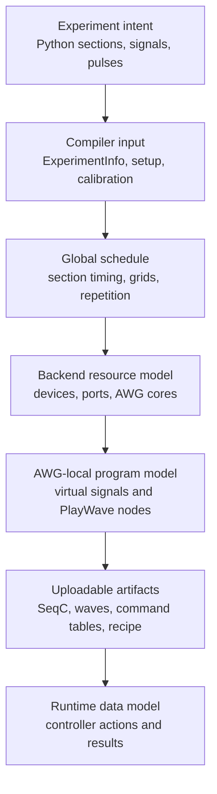
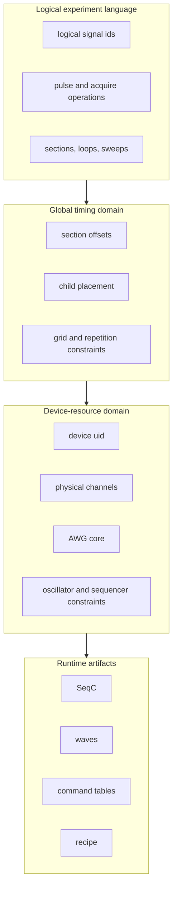
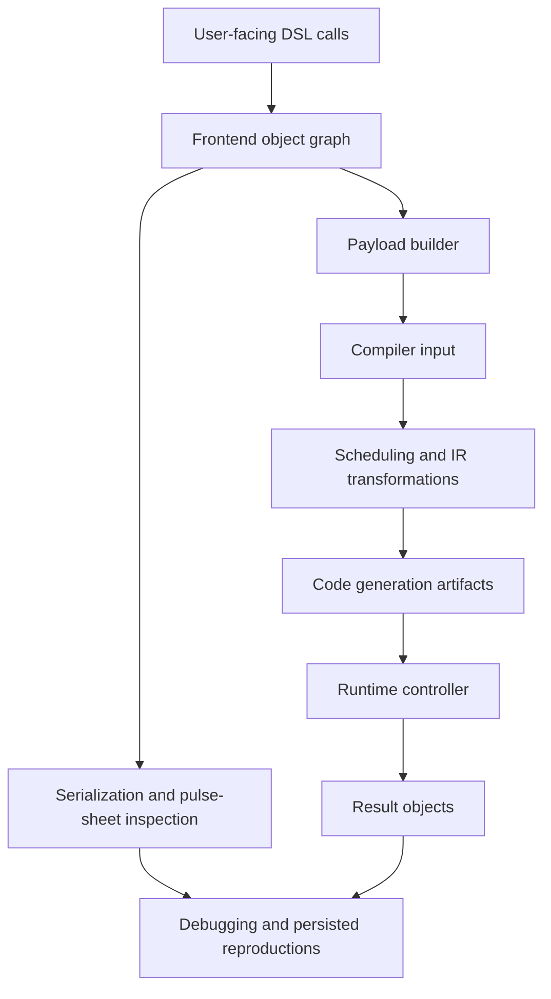
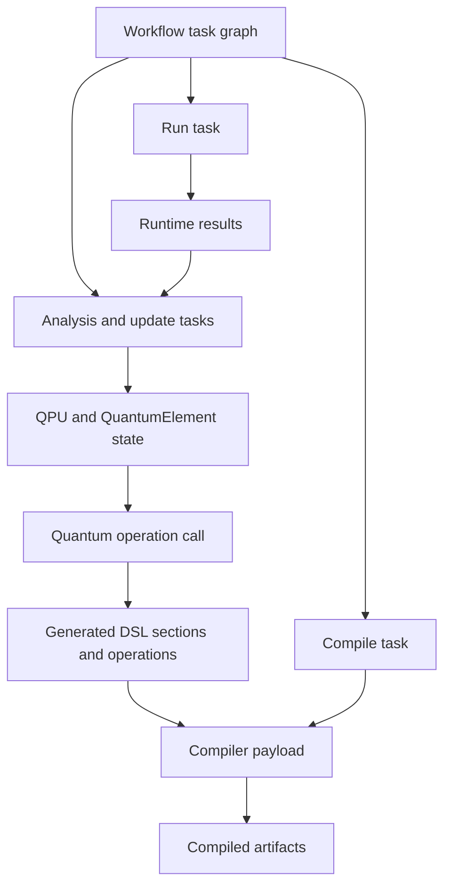
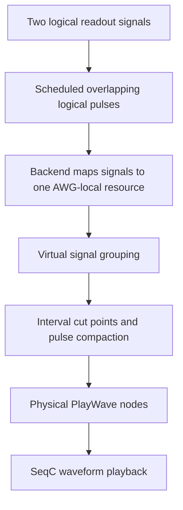

# Mental Model: From Experiment Intent to Device Programs

LabOne Q is easiest to read as a **representation-changing compiler stack with a runtime attached**. The Python frontend lets an experiment author describe sections, loops, pulse operations, acquisitions, calibration, and logical signals. The compiler then changes that description into timed and device-specific artifacts. The runtime consumes those artifacts, configures instruments, starts sequencers, collects results, and maps acquired data back to handles.

This guide is organized around the semantic claims made at each boundary. A Python experiment tree claims that a nested experiment was described. A compiler payload claims that setup, calibration, parameters, and experiment structure were normalized for compilation. A schedule claims that global timing constraints were solved. Backend and code-generation structures claim that logical signals have been related to physical resources. Runtime artifacts claim that the experiment can be uploaded, executed, and read back by controller code.

| Layer | Main objects | Semantic claim | Detailed chapter |
| --- | --- | --- | --- |
| Experiment intent | `Experiment`, sections, operations, logical signals | The user-facing Python object graph describes a nested pulse-level experiment. | [User-facing interfaces](02a-user-facing-interfaces.md) and [Python DSL and compiler payload](03-python-dsl-and-payload.md) |
| Compiler input | `ExperimentInfo`, setup descriptors, calibration descriptors, parameter store | The experiment has been normalized into a serializable compiler input with explicit setup and calibration metadata. | [Python DSL and compiler payload](03-python-dsl-and-payload.md) |
| Global schedule | Rust DSL operations and `ScheduledNode` structures | The experiment has a consistent timing solution across sections, loops, grids, and participating signals. | [Global scheduling](04-global-scheduling.md) and [implementation mechanics](04a-global-scheduling-implementation.md) |
| Backend resource model | devices, physical channels, AWG cores, signal mappings, device traits | Logical signals have been related to physical resources and hardware constraints. | [Backend resource mapping](06-backend-resource-mapping.md) |
| AWG-local program model | per-AWG `IrNode` trees, virtual signals, `PlayWave` nodes, waveform signatures | The scheduled experiment has been split by sequencer core and logical pulses have been merged into physical waveform events. | [IR semantics](05-ir-semantics.md), [AWG-local lowering](07-awg-local-lowering.md), and [code generation artifacts](08-code-generation-artifacts.md) |
| Runtime data model | recipe entries, device transactions, result handles, acquired arrays | Uploadable artifacts have been interpreted by the controller and returned as structured result data. | [Runtime controller](09-runtime-controller.md), [device layer](12-device-layer.md), and [results](13-results-and-data.md) |

## Logical and physical boundaries

The central distinction in the guide is the boundary between **logical experiment language** and **physical resource execution**. The DSL lets an experiment be written as if each logical signal were an independent lane. Real devices do not always provide independent lanes. A single AWG program may control an output pair, multiple readout tones may share a generator, channel pairs may share oscillator constraints, and precompensation may be coupled by AWG core. These couplings are hardware facts rather than DSL facts, so they enter after the frontend has already described a logical experiment.

Two different lowerings therefore occur. **Structural lowering** turns the Python experiment tree into normalized compiler input and then into Rust-side experiment operations. **Physical lowering** maps scheduled logical operations onto device resources and produces waveform events for actual sequencer cores. Treating both as a single undifferentiated “IR” hides the most important maintainer boundary: scheduling solves global time, while code generation forms AWG-local physical waveform streams.

## Frontend state and compiler state

The Python frontend is ordinary Python code until LabOne Q records an experiment tree. Context managers, helper functions, setup objects, calibration objects, and sessions belong to this frontend domain. Serialization and pulse-sheet inspection are also frontend-adjacent because they preserve or visualize experiment intent and compiled artifacts without changing the compiler’s semantic stages.

The compiler-facing boundary begins when the frontend state is converted into a payload. From that point onward, maintainers should ask which representation owns the invariant being debugged. A malformed signal map is usually a frontend or payload-builder issue. A legal tree with impossible timing belongs to scheduling. A valid schedule that maps incorrectly to an AWG core belongs to backend resource mapping or AWG-local lowering. A valid compiled experiment that fails during upload belongs to runtime or device communication.

## Application layers above the DSL

The higher-level quantum-object and workflow packages sit above the DSL rather than beside the compiler. A `QPU` and its quantum elements hold calibrated state and signal-line mappings. Quantum operations use that state to emit ordinary DSL sections, pulses, reserves, delays, and acquisitions. Workflows then coordinate build, compile, run, analyze, and update tasks around the same `Session`, `CompiledExperiment`, and result objects discussed in the lower chapters.

This placement is important for maintainers. Quantum operations are structured emitters of DSL content, not a second compiler. Workflows are task graphs around compilation and execution, not an alternative runtime. The split higher-level chapters make those boundaries explicit in [quantum elements and QPU](17a-quantum-elements-and-qpu.md), [quantum operations](17b-quantum-operations.md), and [workflows and task graphs](17c-workflows.md).

## Representation changes in one example

Consider two logical readout signals addressed in one acquire loop. At the Python level, the operations are attached to two logical signal identifiers. During scheduling, their sections and pulse operations receive offsets and durations in the global experiment timeline. Scheduling can determine that the two pulses overlap and still remain a valid schedule, but it does not by itself decide how to synthesize a combined physical waveform.

Later, backend preprocessing and code-generator adaptation determine that the two logical signals belong to the same AWG-local virtual-signal group. The `handle_playwaves` pass then collects the logical `PlayPulse` slots for that group, computes interval boundaries, and emits one or more physical `PlayWave` operations. Each `PlayWave` carries a waveform signature containing the constituent pulse signatures with relative starts, channel or subchannel identifiers, oscillator information, markers, and amplitude/register metadata. The original logical pulse nodes are replaced because the sequencer will not execute them directly; it executes the merged play-wave event.

This example is the prototype for many resource couplings. The details differ for SHFQA subchannels, SHFSG oscillator constraints, HDAWG output-pair grouping, and command-table hardware-oscillator cases, but the semantic shape is the same: **logical lanes are scheduled globally, then physical waveform streams are formed locally per AWG resource**.

## Source lookup discipline

This chapter intentionally avoids a package-by-package map. Maintainers should first identify the semantic boundary involved in a change, then use the [source reference map](15-source-reference.md) and [repository and build map](02-repository-and-build-map.md) for concrete file locations. That separation keeps the early chapters focused on vocabulary and invariants while leaving dense source navigation to the appendix.
