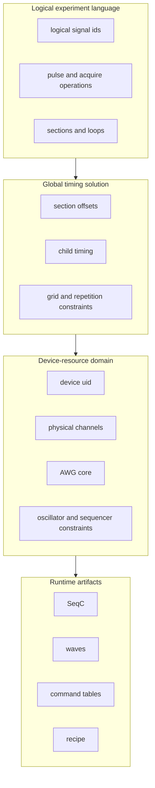

# Mental Model: From Experiment Intent to Device Programs

LabOne Q is easiest to understand as a compiler stack with a runtime attached. The Python frontend lets users describe experiments in terms of sections, loops, pulse operations, acquisitions, calibration, and logical signals. The compiler then turns that experiment into a collection of timed, device-specific artifacts. The runtime consumes those artifacts, configures instruments, starts sequencers, collects results, and maps acquired data back to user-visible handles.

The guide uses five semantic layers. The layers are not merely implementation packages; they represent different claims about the experiment.

| Layer | Main objects | Semantic claim |
| --- | --- | --- |
| Experiment intent | `Experiment`, sections, operations, logical signals | The user has described a nested pulse-level experiment in a convenient Python object graph. |
| Compiler input | `ExperimentInfo`, setup descriptors, calibration descriptors, parameter store | The experiment has been normalized into a serializable description with explicit setup and calibration metadata. |
| Global schedule | Rust DSL operations and `ScheduledNode` | The experiment has a consistent timing solution across sections, loops, grids, and participating signals. |
| Backend resource model | devices, physical channels, AWG cores, signal mappings, device traits | Logical signals have been related to physical resources and hardware constraints. |
| AWG-local program model | per-AWG `IrNode` trees, virtual signals, `PlayWave` nodes, waveform signatures | The scheduled experiment has been split by sequencer core and logical pulses have been merged into physical waveform events. |

## The central distinction

The DSL lets a user write as if each logical signal were an independent lane. Real devices do not always provide independent lanes. A single AWG program may control an output pair. A readout generator may carry multiple logical readout tones. An SHFSG channel pair may share an RF synthesizer. HDAWG precompensation can be coupled by AWG core. These couplings are hardware facts, not DSL facts, and the compiler must introduce them later.

This means the compiler has two different kinds of lowering. **Structural lowering** turns the Python experiment tree into a normalized compiler input and then into Rust-side experiment operations. **Physical lowering** maps scheduled logical operations onto device resources and produces waveform events for actual sequencer cores. Confusing these two operations leads to vague descriptions such as “the IR is scheduled and code-generated.” In reality, scheduling produces a timed global tree, while the multiplexing of logical signal operations onto physical waveform streams happens in code generation after backend resource mapping.

## Source landmarks

| Concern | Primary source locations |
| --- | --- |
| Python experiment object graph | `src/python/laboneq/dsl/experiment/experiment.py`, `section.py` |
| Payload construction | `src/python/laboneq/implementation/payload_builder/experiment_info_builder/experiment_info_builder.py` |
| Compiler workflow entry | `src/python/laboneq/compiler/workflow/compiler.py`, `realtime_compiler.py`, `compat.py` |
| Rust scheduler | `src/rust/laboneq-scheduler/src/scheduler.rs`, `scheduled_node.rs`, `schedule_info.rs`, `timing_resolver/timing_calculator.rs` |
| Shared IR container | `src/rust/laboneq-ir/src/node.rs`, `ir.rs`, `experiment.rs` |
| Backend preprocessing | `src/rust/laboneq-qccs-backend/src/preprocessor.rs` |
| Code-generator resource fanout and virtual signals | `src/rust/codegenerator/src/ir_adapter.rs`, `passes/fanout_awg.rs`, `virtual_signal.rs` |
| Pulse-to-waveform lowering | `src/rust/codegenerator/src/passes/handle_playwaves.rs` |
| Python runtime controller | `src/python/laboneq/controller/controller.py`, `near_time_runner.py`, `recipe_processor.py` |

## Representation changes in one example

Consider two logical readout signals addressed in one acquire loop. At the Python level, the operations are attached to two logical signal identifiers. During scheduling, their sections and pulse operations receive offsets and durations in the global experiment timeline. Scheduling can determine that the two pulses overlap and still remain a valid schedule, but it does not by itself decide how to synthesize a combined physical waveform.

Later, backend preprocessing and code-generator adaptation determine that the two logical signals belong to the same AWG-local virtual signal group. The `handle_playwaves` pass then collects the logical `PlayPulse` slots for that group, computes interval boundaries, and emits one or more physical `PlayWave` operations. Each `PlayWave` carries a waveform signature containing the constituent pulse signatures with relative starts, channel or subchannel identifiers, oscillator information, markers, and amplitude/register metadata. The original logical pulse nodes are replaced because the sequencer will not execute them directly; it executes the merged play-wave event.

This example is the prototype for many resource couplings. The details differ for SHFQA subchannels, SHFSG oscillator constraints, HDAWG output-pair grouping, and command-table hardware-oscillator cases, but the semantic shape is the same: **logical lanes are scheduled globally, then physical waveform streams are formed locally per AWG resource**.
