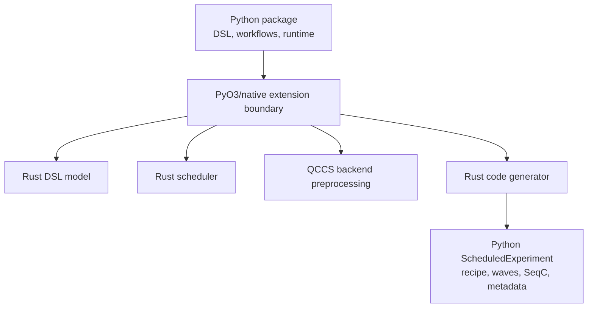

# Repository and Build Map

The LabOne Q repository is a hybrid Python/Rust project. The Python packages provide the public DSL, workflow integration, controller runtime, compatibility layers, and result models. The Rust crates implement the performance- and correctness-sensitive compiler core: DSL normalization, scheduling, backend preprocessing, shared IR containers, and code generation. The Rust components are exposed to Python through a compiled extension module rather than through a separate command-line compiler.

## Top-level organization

| Area | Role |
| --- | --- |
| `src/python/laboneq/dsl` | User-facing experiment construction, calibration objects, device setup descriptions, and result-facing abstractions. |
| `src/python/laboneq/implementation/payload_builder` | Conversion from Python experiment/setup objects into compiler input payloads. |
| `src/python/laboneq/compiler` | Python workflow wrappers, compatibility conversion, scheduler/codegen invocation, and Python-side packaging of compiler outputs. |
| `src/python/laboneq/controller` | Runtime orchestration, recipe processing, asynchronous near-time execution, device setup, uploads, execution, and result collection. |
| `src/python/laboneq/executor` | Near-time execution statement tree and interpreter framework for loops, callbacks, and real-time block submission. |
| `src/rust/laboneq-dsl` | Rust-side experiment operation model consumed by preprocessing and scheduling. |
| `src/rust/laboneq-scheduler` | Timing solver and scheduled-node representation. |
| `src/rust/laboneq-ir` | Shared IR containers used after scheduling and by code-generation passes. |
| `src/rust/laboneq-qccs-backend` | QCCS backend preprocessing and hardware-resource modeling. |
| `src/rust/codegenerator` | AWG fanout, virtual-signal grouping, playwave lowering, waveform signatures, SeqC/wave/recipe artifact generation. |
| `src/rust/laboneq-compiler-py` and `src/rust/laboneq-rust` | Python extension bindings and module registration. |

## Build-system role of the Rust extension

The compiled extension should be treated as part of the source tree, not as an opaque foreign binary. The repository includes Rust crates under `src/rust`, and the Python package exposes them as a native module. From a developer perspective, the extension is the boundary where Python workflow code hands a compiler job to Rust and receives scheduled/code-generated artifacts back.

The practical implication is that debugging often crosses languages. If an experiment fails before compilation, inspect the Python DSL and payload builder. If it fails during timing resolution, inspect `laboneq-scheduler`. If it compiles but produces unexpected physical waveforms, inspect `codegenerator`, especially AWG fanout, virtual-signal creation, and playwave handling. If execution fails after artifacts are generated, inspect the controller and device communication layers.

## Dependency roles

The Python dependency set mixes user-interface dependencies, scientific data dependencies, serialization dependencies, and Zurich Instruments communication packages. The compiler core itself is mostly the repository's Rust code. Communication with instruments is mediated by Zurich Instruments packages rather than direct socket programming in the DSL layer.

| Dependency family | Typical role |
| --- | --- |
| `numpy`, scientific Python utilities | Pulse arrays, numerical data, result structures, and user-facing calculations. |
| Serialization and schema utilities | Passing structured experiment/setup data between Python workflow code and Rust compiler components. |
| Zurich Instruments Python packages | Lower-level communication, device discovery/configuration, and toolkit-style device abstractions. |
| Rust crates in `src/rust` | Compiler data structures, scheduling, backend preprocessing, and code generation. |

## Suggested source-reading path

Start with `experiment.py` only long enough to understand the Python object graph. Move quickly to `experiment_info_builder.py`, because it shows which parts of the Python object graph are considered compiler input. Then read `compiler/workflow/compat.py` and `realtime_compiler.py` to see how Python data is converted and submitted to Rust. The scheduler can be read through `scheduled_node.rs`, `schedule_info.rs`, and `timing_calculator.rs`. The most important physical lowering code is not in the scheduler; it is in `codegenerator/src/virtual_signal.rs` and `codegenerator/src/passes/handle_playwaves.rs`.
