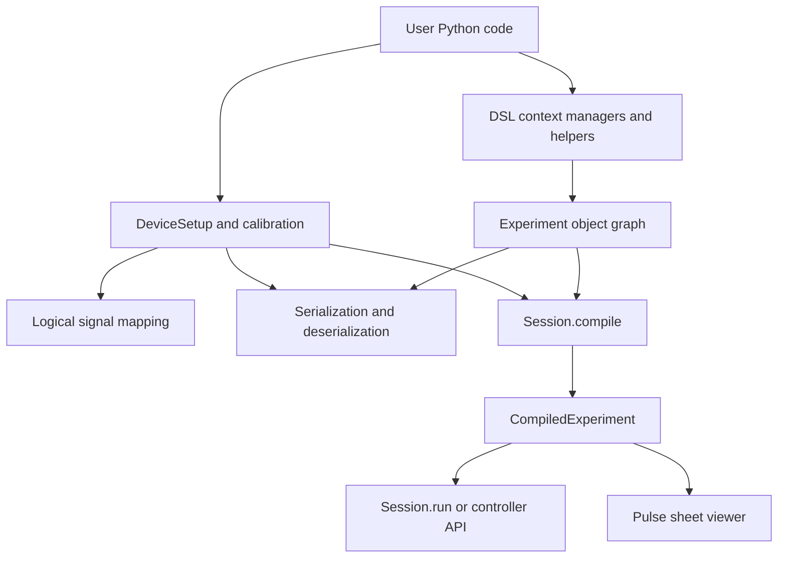
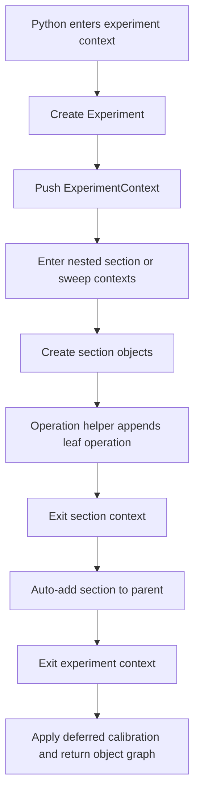
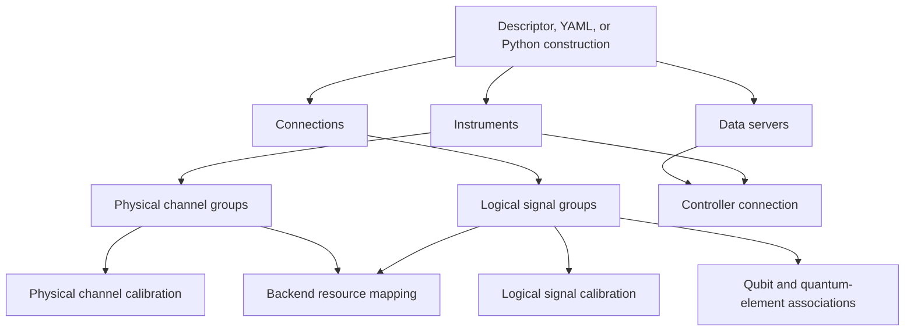
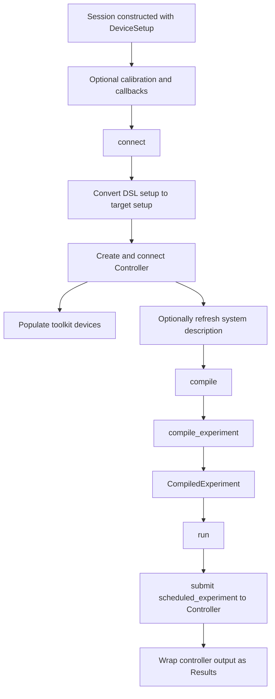
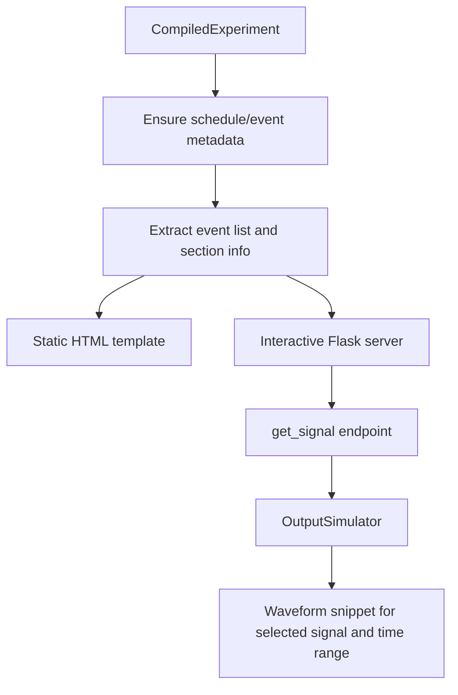

# User-Facing Interfaces and Frontend Internals

LabOne Q presents compilation and execution through a small set of high-level Python interfaces: the experiment DSL, the `DeviceSetup`, calibration and signal maps, the `Session` façade, serialization helpers, and the pulse sheet viewer. These objects are intentionally friendly to experiment authors, but they are also the first developer-facing boundary of the compiler. They decide how ordinary Python code becomes a stable object graph, how that graph is paired with setup metadata, and how a compiled schedule is handed to the runtime controller.

This chapter is not a user guide. It is a map of the **frontend surface area** that a maintainer should understand before reading the compilation pipeline. The next chapter, [Python DSL and compiler payload](03-python-dsl-and-payload.md), starts at the point where the already-built experiment and setup are converted into compiler input.



## Why this layer matters

The user-facing layer is deceptively important because it is the only place where LabOne Q can observe the author's Python program. After the DSL has finished executing, later stages see a data structure, not the original Python control flow. A `for` loop, helper function, or conditional in a notebook has already run and has either added sections and operations or not. From that point onward, compilation consumes object graphs, setup descriptions, calibration objects, and parameter metadata.

| Interface object | Primary role | Deeper machinery it feeds |
| --- | --- | --- |
| `Experiment` | Root object graph for sections, signals, operations, parameters, and experiment-level calibration. | Payload builder and compiler workflow. |
| `DeviceSetup` | Description of data servers, instruments, physical channels, logical signals, qubits, calibration, and optionally cached system description. | Setup conversion, backend resource mapping, controller connection. |
| Signal map | Mapping from experiment signal names to setup logical signal paths. | Payload construction, pulse simulation, output rendering, runtime metadata. |
| `Session` | Stateful façade holding setup, current experiment, current compiled experiment, connection state, callbacks, and last results. | Compiler entry point and runtime controller submission. |
| Serializer functions | Stable JSON/YAML boundary for experiments, setups, compiled experiments, results, quantum elements, workflow objects, and related public types. | Reproducibility, persistence, compatibility migration, offline inspection. |
| Pulse sheet viewer | Visual inspection boundary for compiled schedules and simulated output snippets. | Schedule event metadata, output simulation, static or interactive HTML rendering. |

The key maintainer rule is that this layer should preserve **experimental intent** without prematurely committing to physical waveform layout. A logical pulse may be easy to write in the DSL, but whether it becomes a separate waveform, a multiplexed component of a shared waveform, or an invalid resource use is decided only after setup-aware compilation.

## The DSL is ordinary Python with context-manager side effects

LabOne Q's DSL syntax looks declarative, but it is implemented as ordinary Python. The helpers exposed through `laboneq.dsl.experiment.builtins` create context managers and operation objects. When the Python interpreter executes a `with experiment(...):` block, it calls `__enter__`, runs the user's block body, and then calls `__exit__`. During that execution, DSL calls mutate an active object graph.

> The DSL is not parsed after the fact. The user's Python code **runs immediately**, and the side effect of running it is an `Experiment` tree.

The implementation is centered on a thread-local context stack. `ExperimentContextManager.__enter__` constructs an `Experiment`, wraps it in an `ExperimentContext`, and pushes that context. Section helpers such as `section`, `sweep`, `acquire_loop_rt`, `match`, `case`, `prng_setup`, and `prng_loop` create specialized section context managers. On entry they create concrete section objects; on successful exit they auto-add the section to the current parent context. Leaf helpers such as `play`, `delay`, `acquire`, `reserve`, `measure`, `call`, `set_node`, and `reset_oscillator_phase` find the active section and append operations to it.



This design explains several frontend behaviours that are otherwise easy to misread. User helper functions are just Python functions that add to the current context. Python loops expand the object graph by executing the loop body repeatedly. A conditional branch that is false adds nothing. Exceptions inside a context prevent normal auto-add behaviour. Decorator-style experiment definitions use the same context-manager machinery, with default names and UIDs derived from the function name.

## Experiment signals, signal maps, and calibration

The `Experiment` object owns symbolic experiment signals. These signals are local names in the experiment definition; they are not hardware channels. The bridge to hardware is the signal map, which associates experiment signals with setup logical-signal paths. The map may be supplied explicitly by the user or attached by helper methods on the active experiment.

Calibration appears at more than one layer. Experiment calibration describes how an experiment signal should behave for this experiment, while device setup calibration describes persistent properties of setup logical and physical channels. The `Session` exposes both through `experiment_calibration` and `device_calibration` properties, but they are not interchangeable. The compiler later combines them with setup structure and device constraints.

| Frontend concept | Where it lives | Typical contents | Why the compiler cares |
| --- | --- | --- | --- |
| Experiment signal | `Experiment.signals` | Signal UID, optional calibration, optional mapping information. | Names the lanes used by DSL operations. |
| Signal map | `Experiment.get_signal_map()` / `set_signal_map()` | Experiment signal to setup logical-signal path. | Connects DSL operations to setup roles. |
| Experiment calibration | `Experiment.get_calibration()` | Oscillators, amplitudes, ports, delays, ranges, or pulse-related settings scoped to the experiment. | Supplies per-run semantic constraints. |
| Device calibration | `DeviceSetup.get_calibration()` | Logical and physical channel calibration rooted in the setup. | Supplies setup defaults and hardware-facing calibration. |

A useful way to read the frontend is therefore to separate **names**, **routes**, and **calibration**. The signal name in a `play` operation identifies a lane in the experiment. The signal map tells LabOne Q where that lane lands in the setup. Calibration tells later stages how the lane and its associated hardware resources should be driven.

## DeviceSetup, logical signals, and system description

`DeviceSetup` is the other half of the compiler input boundary. It contains data servers, instruments, physical channel groups, logical signal groups, qubits, and an optional `system_description`. It can be created programmatically or loaded from descriptor-style dictionaries/YAML through generator helpers. Those constructors translate user-facing setup descriptions into concrete instrument, channel, and logical-signal objects.

The setup model deliberately distinguishes physical resources from logical experiment roles. Physical channels represent hardware ports or channel-like resources. Logical signals represent experimental roles such as a qubit drive or readout line. Logical signals can be grouped, routed, calibrated, and connected to physical channels. This abstraction is essential because the same physical resource may constrain multiple logical roles, and the backend must later reason about AWG cores, oscillator resources, output groups, and device traits.



The optional `system_description` deserves special attention. During `Session.connect()`, LabOne Q can query live hardware capabilities and update the cached description on the device setup. In emulation or offline compilation, this information may instead come from a previously cached description or an explicit system-description file. For developers, this means that the effective setup may contain both user-authored topology and hardware-derived capability metadata.

## Serialization and deserialization

LabOne Q serialization is not limited to the experiment DSL, although experiments are one of its most visible uses. The central serializer dispatch lives in `laboneq.serializers.core` and uses a registry of public serializers. Public object serialization typically produces a versioned envelope with a serializer identifier, a serializer version, and a `__data__` payload. Top-level public serialized dictionaries also record the LabOne Q creator/version metadata.

```json
{
  "__serializer__": "laboneq.serializers.implementations.ExperimentSerializer",
  "__version__": 4,
  "__data__": {
    "uid": "...",
    "name": "...",
    "signals": {},
    "version": "...",
    "epsilon": 0.0,
    "sections": []
  }
}
```

The experiment serializer records the root identity, signals, DSL version, epsilon, and recursive section structure. The device setup serializer records servers, instruments, physical channel groups, logical signal groups, qubits, and system description. The compiled experiment serializer nests serialized `device_setup`, serialized `experiment`, the compiler-facing experiment dictionary, and the scheduled experiment; it also checks the saved LabOne Q version before loading. Results serialization stores acquired results, near-time callback results, execution errors, timestamps, and optional experiment/setup metadata.

| Serializable family | Notable implementation detail | Developer implication |
| --- | --- | --- |
| `Experiment` | Versioned serializer with migration hooks for older section/calibration forms. | Serialized experiments are closer to the DSL object graph than to the compiler schedule. |
| `DeviceSetup` | Stores topology, logical and physical channel groups, qubits, and optional system description. | Setup persistence includes more than the visible instrument list. |
| `CompiledExperiment` | Embeds setup, experiment, compiler dictionary, and scheduled experiment with LabOne Q version checks. | Compiled artifacts are reproducibility objects but are more version-sensitive than DSL objects. |
| `Results` | Serializes complex data by splitting real and imaginary parts and stores runtime metadata. | Result files are user-facing data products, not just raw controller buffers. |
| Quantum elements and workflow objects | Registered as public serializers as well. | The persistence boundary extends beyond classic DSL/setup/session concepts. |

Deserialization uses the serializer identifier to find the implementation and then dispatches to version-specific `from_dict_v*` methods. This is why schema evolution appears as explicit migration code in serializer classes rather than as a single static JSON schema file. For maintainers, the practical schema is the combination of serializer envelope conventions, registered model converters, and versioned migration methods.

## Session as façade and state container

`Session` is the traditional entry point that ties frontend state to compilation and execution. It is stateful by design. It owns the device setup, the current experiment definition, the current compiled experiment, the last results, registered near-time callbacks, connection state, a toolkit-device adapter for connected instruments, logging configuration, and optionally resolved system-description data.



`Session.compile(experiment, compiler_settings=...)` stores the experiment and calls the standalone compilation entry point with the session's `device_setup`. The result is a `CompiledExperiment`, which includes the original experiment, setup, compiler dictionary, and scheduled experiment. `Session.run(...)` accepts either an `Experiment` or a `CompiledExperiment`. If given an uncompiled experiment, it compiles it first. It then submits `compiled_experiment.scheduled_experiment` to the controller, waits for completion, stops controller workers, and wraps acquired results, near-time callback results, execution errors, and pipeline timestamps into a `Results` object.

The `Session` still carries some compatibility glue. Before submission it constructs `LegacySessionData` from the experiment, experiment calibration, signal map, device setup, and device calibration and passes it to the controller. A comment in the implementation marks this as temporary support for legacy runtime-context endpoints. That is a useful signpost: some runtime paths still expect session-like context even though the lower controller layer increasingly operates on scheduled experiments and explicit handles.

## LocalController and AsyncLocalController

Recent source code exposes a cleaner controller-facing API in `LocalController` and `AsyncLocalController`. These classes do not replace all of `Session`'s frontend duties. Instead, they provide a more direct submission interface for compiled scheduled experiments. Their creation methods convert a `DeviceSetup` into target setup data, create and connect the lower-level controller, and then expose handle-based submission, waiting, status, result retrieval, cancellation, and cleanup operations.

| Aspect | `Session.run` | `LocalController` / `AsyncLocalController` |
| --- | --- | --- |
| Frontend state | Holds setup, experiment, compiled experiment, callbacks, connection state, and last results. | Holds a connected controller and submission registry. |
| Compilation | Can compile an `Experiment` automatically before running. | Expects a `ScheduledExperiment` or compiled artifact boundary from the caller. |
| Submission model | Synchronous façade around compile-if-needed, submit, wait, and result wrapping. | Explicit handle-based submit/wait/get/cancel lifecycle. |
| Compatibility | Injects `LegacySessionData` for older runtime-context paths. | Contains comments marking callback update paths as legacy Session support. |
| Intended shape | Notebook/user convenience plus backwards compatibility. | Cleaner local execution API and a better fit for async orchestration. |

Internally, the relationship is therefore not that `AsyncLocalController` is a new DSL. It is a lower and more explicit runtime boundary. `Session.run` is still the broader façade: it owns frontend state and can trigger compilation. The local controller APIs expose the execution side more directly once the experiment has already been compiled to the scheduled-experiment level.

## Pulse sheet viewer

The pulse sheet viewer is a visualization layer over a compiled experiment. `Session.show_pulse_sheet(...)` is a convenience wrapper that delegates to `laboneq.pulse_sheet_viewer.pulse_sheet_viewer.show_pulse_sheet`. The viewer expects schedule metadata; if a compiled experiment lacks the needed extras, helper code recompiles with settings that request output extras, a bounded event publication count, and no log report.

Static rendering fills an HTML template with schedule event data, section information, signal/section hierarchy, sampling rates, and a flag controlling interactivity. Interactive rendering starts a local Flask server and serves a pulse-sheet page plus endpoints that return signal snippets. Those snippets are generated through `OutputSimulator`, which resolves experiment signals through the experiment signal map to setup physical channels and simulates the relevant output interval.



For compiler developers, the pulse sheet viewer is useful because it sits just after scheduling and code-generation metadata production. It is not a source of truth for compilation semantics, but it exposes whether the compiled schedule contains the timing and signal metadata that a human can inspect.

## Boundary handed to the compiler chapters

After the user-facing layer has finished its work, the compiler should be able to ignore the mechanics of Python context managers, descriptor parsing, notebook helper functions, and visualization wrappers. It should receive an explicit experiment object graph, a setup object with logical and physical resources, signal mapping, calibration, parameters, and settings. The next chapter explains how that material is narrowed into the compiler payload.

The most useful mental model is therefore this: **the frontend executes Python and records intent; the compiler lowers recorded intent into schedules and device artifacts; the runtime executes scheduled artifacts and returns structured data**. Keeping those boundaries separate prevents two common mistakes: treating the DSL syntax as if it were the compiler IR, and treating device setup names as if they were already AWG-local waveform resources.
