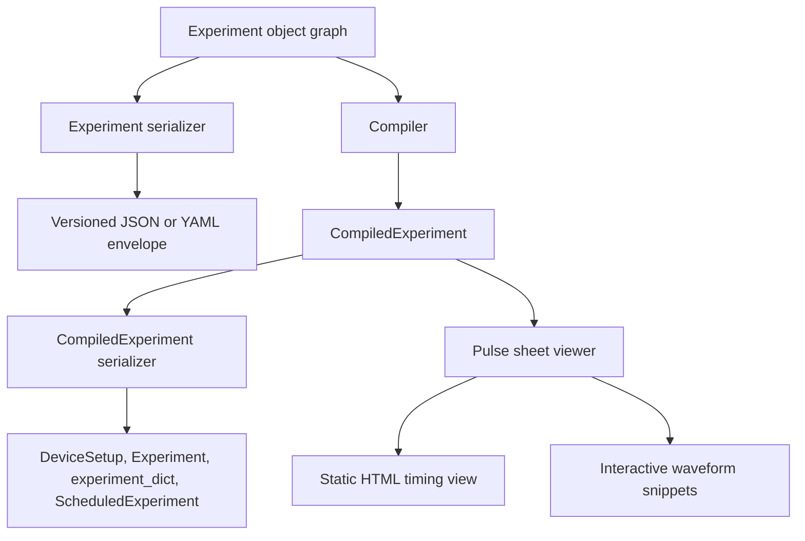
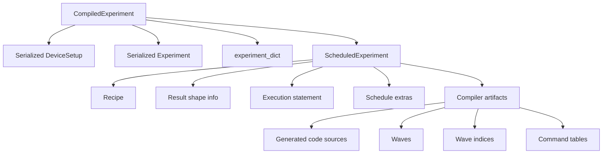

# Serialization and pulse-sheet inspection

The frontend chapter described how Python code creates an experiment object graph and how `Session` connects that graph to compilation and execution. This chapter covers two adjacent interfaces that often matter to developers: **serialization**, which persists frontend and compiled objects, and the **pulse sheet viewer**, which presents compiler-produced schedule metadata as a human-readable timing view.

Serialization is not merely a convenience feature. It is also a compatibility boundary. A serialized `Experiment` captures user intent before compilation, while a serialized `CompiledExperiment` captures the compiled setup, source experiment, compiler dictionary, and scheduled execution artifacts that are much closer to what the runtime consumes. The pulse sheet viewer then sits on the compiled side of the same boundary: it needs schedule extras, event lists, section metadata, waveform simulation, and signal mapping produced by compilation.



## Serializer registry and versioned envelope

LabOne Q serialization is registry-based. The central serializer dispatch looks up a public serializer for the object type, calls its `to_dict` method, and writes a JSON/YAML-compatible dictionary. Public serializers produce an envelope containing a serializer identifier, a schema version, and object data. The top-level conversion helper also adds creator metadata when the serialized object has a serializer envelope.

The common envelope shape is intentionally regular:

```json
{
  "__serializer__": "laboneq.serializers.implementations.ExperimentSerializer",
  "__version__": 4,
  "__creator__": ["laboneq", "<laboneq-version>"],
  "__data__": {
    "...": "object-specific payload"
  }
}
```

During deserialization, the registry resolves `__serializer__`, dispatches to the matching versioned loader, and lets that loader migrate or reject older structures. This is why object-specific serializer files contain methods such as `from_dict_v4`, `from_dict_v3`, and `from_dict_v2`: the serialized form is versioned at the serializer boundary, not inferred from the current Python class alone.

| Envelope field | Meaning | Developer consequence |
| --- | --- | --- |
| `__serializer__` | Fully qualified serializer identifier. | Selects the object-specific reconstruction logic. |
| `__version__` | Serializer schema version for that object type. | Enables versioned loaders and migrations. |
| `__creator__` | LabOne Q creator marker added by the generic dispatch layer. | Provides provenance for files written through public helpers. |
| `__laboneq_version__` | Present on compiled and scheduled experiment serializers. | Enforces same-version loading unless deserialization is forced. |
| `__data__` | Object-specific payload. | Contains the actual experiment, setup, result, or compiled artifact data. |

The schema should be read as a **software persistence schema**, not as a stable hardware interchange standard. Some parts are carefully modelled through current `attrs`/`cattrs` converters. Other compiled-artifact fields still fall back to legacy serialization because their original data structures were not fully specified as new serializer models.

## Current Experiment serialization structure

The current public `Experiment` serializer uses version 4. Its `__data__` payload is compact at the top level and recursively detailed inside sections and operations:

```json
{
  "__serializer__": "laboneq.serializers.implementations.ExperimentSerializer",
  "__version__": 4,
  "__data__": {
    "uid": "experiment_uid",
    "name": "experiment_name",
    "signals": [
      {"uid": "drive"},
      {"uid": "measure"}
    ],
    "version": "...",
    "epsilon": 1e-12,
    "sections": [
      {"...": "nested section model"}
    ]
  }
}
```

The serializer deliberately serializes the experiment as the DSL object graph: experiment metadata, signal declarations, numerical tolerance, and nested sections. Section models then contain child sections and operation records. Leaf operations carry signal names, pulse payloads, parameter references, acquisition metadata, oscillator phase information, markers, and operation-specific settings.

| Payload part | Representative fields | Notes |
| --- | --- | --- |
| Experiment root | `uid`, `name`, `signals`, `version`, `epsilon`, `sections` | The root does not contain a compiled schedule. |
| Section models | `uid`, `alignment`, `execution_type`, `length`, loop/match fields, child sections, operations | Specialized models exist for sweeps, acquire loops, matches, cases, PRNG sections, and ordinary sections. |
| Play operations | `signal`, `pulse`, `amplitude`, `phase`, `increment_oscillator_phase`, `set_oscillator_phase`, `length`, `pulse_parameters`, `marker` | The operation points at an experiment signal, not an AWG channel. |
| Acquire operations | `signal`, `handle`, `kernel`, `length`, pulse parameters and acquisition metadata | Kernels may be absent, a single pulse, or a list of pulses depending on the acquisition form. |
| Other operations | Delay, reserve, set-node, reset-oscillator-phase, call and callback-related payloads | These remain frontend operations until compiler lowering. |

The most important distinction is between **functional pulses** and **sampled pulses**. A functional pulse stores the function name, UID, optional amplitude, optional length, compression flag, and pulse-parameter dictionary. A sampled pulse stores its UID, compression flag, and explicit `samples` array. Therefore, a repeated Gaussian-like functional pulse is represented by its function and parameters, while an explicitly sampled waveform is represented by numerical sample data.

## Pulse, waveform, and complex-number encoding

In the `Experiment` serializer, sampled pulse data is stored through the array serialization model used by the cattrs converter. For NumPy arrays and array-like payloads, the serializer records enough information to reconstruct the array rather than converting every sample into an untyped JSON scalar by hand. Complex values are supported in pulse amplitudes and pulse parameters; the current common model represents complex scalar values as a two-element numeric pair containing real and imaginary components.

```json
{
  "function": "gaussian_square",
  "uid": "readout_pulse",
  "amplitude": [0.2, -0.05],
  "length": 2.0e-6,
  "can_compress": true,
  "pulse_parameters": {
    "sigma": 2.0e-7,
    "phase_offset": [0.0, 1.5707963267948966]
  }
}
```

For explicitly sampled pulses, the nested `samples` payload is the place where waveform sample arrays appear on the DSL side. In current serializer code, NumPy-array handling is centralized rather than implemented independently by every pulse or artifact serializer. Legacy compiled-artifact serialization can also encode NumPy arrays and complex numbers, but it may use older representations because some scheduled-experiment artifacts are still delegated to the old serializer path.

| Data kind | Current Experiment-side representation | Practical implication |
| --- | --- | --- |
| Functional pulse | Function name plus scalar parameters and optional `pulse_parameters`. | Compact and semantic; no sample vector is stored at the DSL level. |
| Sampled pulse | `samples`, `uid`, `can_compress`. | The explicit waveform data is serialized as array payload. |
| Complex scalar | Pair-like numeric representation under the current common converter. | Complex amplitude and parameter values survive JSON round-trip. |
| NumPy array | Centralized array serializer rather than ad hoc per-field lists. | Large sampled data is handled consistently across serializers. |
| Compiled waveform artifact | Scheduled-experiment artifact data, sometimes through legacy serializer fallback. | The compiled form may contain device-specific waveform collections, indices, and generated-code artifacts. |

A subtle but important consequence follows from this division. The `Experiment` JSON does not normally contain every hardware waveform that will later be uploaded to instruments. It contains DSL pulse definitions and pulse uses. Hardware waveforms are generated later during compilation, after timing, oscillator, multiplexing, output routing, and device constraints have been resolved.

## Deduplication, references, and repeated pulses

The current Experiment serializer uses cache contexts during serialization and deserialization. Pulse and section models are decorated with cache hooks, and `ExperimentSerializer.to_dict` serializes sections under a `create_caches()` context. This mechanism provides object-identity deduplication for repeated cached objects.

The practical rule is that repeated references to the **same Python pulse or section object** can be emitted through a reference-like cache mechanism instead of expanding the full object payload each time. This is not the same as semantic deduplication. Two separately constructed pulse objects with the same UID, shape, and parameters are not automatically guaranteed to collapse merely because they look equal; cache behaviour is tied to the serializer's object/reference tracking.

| Repetition pattern | Serialized behaviour to expect | Maintainer interpretation |
| --- | --- | --- |
| Same pulse object reused in several operations | Cache can serialize the first occurrence with payload and later occurrences as references. | Avoids blind copying for shared object identities. |
| Two equal but independently constructed pulse objects | They may serialize as distinct payloads unless object identity/cache logic unifies them. | Do not assume content-addressed deduplication. |
| Same section object reused | Section cache can apply the same reference mechanism. | Useful for graph-like reuse, but must preserve reconstructability. |
| Compiled hardware waveform reused | Handled separately in compiled artifacts and wave-index structures. | This is a compiler/codegen concern, not the DSL Experiment serializer alone. |

This distinction answers the common question of whether every repeated pulse is a copy of the full pulse data structure. In the current Experiment serializer, repeated **object references** are not intended to be blindly expanded, because pulse and section models participate in caching. However, this should not be read as a universal waveform interning scheme. By the compiled stage, waveform deduplication and indexing belong to generated artifacts such as wave collections, wave indices, command tables, recipe structures, and device-specific codegen output.

## Current CompiledExperiment serialization structure

`CompiledExperiment` serialization uses a different envelope and includes LabOne Q version checking. The current public serializer version is 2. Its payload contains four major fields:

```json
{
  "__serializer__": "laboneq.serializers.implementations.CompiledExperimentSerializer",
  "__version__": 2,
  "__laboneq_version__": "<laboneq-version>",
  "__data__": {
    "device_setup": {"...": "serialized DeviceSetup"},
    "experiment": {"...": "serialized Experiment"},
    "experiment_dict": {"...": "compiler-facing dictionary"},
    "scheduled_experiment": {"...": "serialized ScheduledExperiment"}
  }
}
```

The `device_setup` and `experiment` entries are themselves serialized through the registry. The deprecated-but-still-present `experiment_dict` records the compiler-facing dictionary form. The `scheduled_experiment` entry is serialized through the `ScheduledExperimentModel`, which contains the compiled runtime artifact boundary.

| `CompiledExperiment.__data__` entry | Contents | Why it matters |
| --- | --- | --- |
| `device_setup` | Serialized setup object. | Lets the compiled artifact retain the setup context used for compilation. |
| `experiment` | Serialized source experiment object. | Preserves the frontend intent alongside compiled output. |
| `experiment_dict` | Compiler-facing dictionary representation. | Backward-compatible bridge for code that still consumes the dictionary form. |
| `scheduled_experiment` | Recipe, real-time loop properties, result-shape metadata, artifacts, schedule, and execution statement. | Runtime- and inspection-facing compiled output. |

The scheduled-experiment model is where most compiled detail lives. It includes a `device_setup_fingerprint`, `recipe`, `rt_loop_properties`, `result_shape_info`, `artifacts`, `schedule`, and `execution`. The recipe model carries initialization data, realtime execution initialization, oscillator parameters, integrator allocations, acquisition lengths, total and maximum step execution time, and software-version metadata. Result-shape metadata maps handles to array shapes and axis information. The `execution` field is the statement tree consumed by the runtime execution machinery.

## Compiled artifacts, waves, and index maps

Compiled waveforms are not stored as the same objects as DSL sampled pulses. They are part of scheduled-experiment artifacts and generated code. The in-memory `CompiledExperiment` exposes compatibility properties such as `recipe`, `src`, `waves`, `wave_indices`, `command_tables`, `schedule`, and `result_properties` by forwarding to the `scheduled_experiment`. This mirrors the conceptual structure of the serialized form: generated program sources, wave collections, wave-index maps, command tables, recipe data, and schedule metadata are compiled artifacts rather than frontend DSL nodes.

The serializer model for scheduled experiments contains a polymorphic `CompilerArtifactModel`. Registered artifact subclasses can provide model-specific structure. Unregistered or legacy artifact classes fall back to the older serializer and receive an `_artifact_type` marker. This hybrid design is important for developers because it means compiled-artifact JSON is less uniform than the public `Experiment` payload: some compiled fields are strongly modelled, while others carry legacy representations.



The compiled representation may therefore include both waveform data and maps that explain where waveform data is used. A wave-index map is the natural place for references from generated code or recipe-like structures to named or indexed waveform entries. Command tables and source snippets may also refer to waveforms indirectly. This is qualitatively different from the Experiment serializer, where `play` operations contain logical pulse definitions and rely on later compilation to decide physical waveform realization.

## Schema evolution and deserialization hazards

Experiment and compiled-experiment deserialization are intentionally versioned. Current `Experiment` loading supports several older versions with targeted migrations. For example, older forms can be patched to add now-required sweep fields, migrate removed acquire-loop structures, or strip deprecated calibration constructs before current object reconstruction. `CompiledExperiment` deserialization checks the serialized LabOne Q version unless the caller opts into forced loading.

| Object | Current serializer version | Compatibility behaviour |
| --- | --- | --- |
| `Experiment` | Version 4 | Supports versioned loaders and migrations from older forms. |
| `CompiledExperiment` | Version 2 | Checks serialized LabOne Q version and falls back to classic deserialization for version 1. |
| `ScheduledExperiment` | Version 1 | Serializes modelled scheduled-experiment fields and uses legacy fallback for incompletely modelled artifacts. |
| `DeviceSetup`, results, quantum objects, workflow objects | Object-specific serializers where registered. | Follow registry dispatch and object-specific schema decisions. |

For maintainers, the hazard is that serialized files are often used as bug reports, regression fixtures, and notebook cache artifacts. Changing field names or migration behaviour can silently break old experiments. Conversely, accepting old compiled artifacts too freely can be dangerous because scheduled output is tightly coupled to LabOne Q version, backend behaviour, and generated-code assumptions.

## Pulse sheet viewer implementation

The pulse sheet viewer is an inspection tool for compiled experiments, not a separate compiler. Its public wrapper accepts an experiment or compiled experiment, ensures the information needed for rendering is present, and then produces either static HTML or an interactive local viewer.

The viewer depends on schedule extras such as event lists, section information, section-to-signal relationships, sampling rates, and truncation metadata. If a compiled experiment does not contain sufficient schedule information, the viewer can trigger a recompilation with specific compiler settings: it forces output extras, suppresses normal report logging, and raises the maximum number of published events used for viewer metadata. This behaviour is a useful example of a frontend tool influencing compilation settings for inspection rather than for hardware execution.

```mermaid
graph TD
    A[show_pulse_sheet] --> B{Compiled schedule has viewer metadata?}
    B -->|No| C[Recompile with output extras and high event limit]
    B -->|Yes| D[Use existing scheduled_experiment.schedule]
    C --> D
    D --> E[Generate HTML template data]
    E --> F[Static pulse sheet HTML]
    E --> G[Interactive Flask app]
    G --> H[/get_signal]
    H --> I[Resolve experiment signal to logical signal and physical channel]
    I --> J[OutputSimulator waveform snippet]
```

For static output, the viewer injects schedule metadata into an HTML template. For interactive output, it starts a small Flask application. The interactive endpoint resolves a requested experiment signal through the signal map and logical signal path, identifies the relevant logical-signal group, logical signal, and physical channel, and asks an `OutputSimulator` for the corresponding waveform snippet. That snippet is returned to the browser for inspection.

| Viewer component | Source-level role | Data dependency |
| --- | --- | --- |
| Schedule metadata fill-in | Checks whether required schedule extras exist and recompiles if needed. | `scheduled_experiment.schedule` plus compiler settings. |
| Static HTML renderer | Injects event lists, section info, signal relationships, sampling rates, and interaction flag into a template. | Compiler-produced schedule extras. |
| Interactive server | Serves waveform snippets through a local route. | Signal map, setup logical signals, physical channels, and output simulation. |
| Truncation warning | Warns if the published event list was truncated. | Event-list limit and schedule truncation flags. |

The viewer therefore exercises both sides of the interface boundary. It needs high-level names that users recognize, such as experiment signals and section UIDs, and low-level compiled data, such as generated waveform snippets and physical channel mapping. This is why it belongs near serialization in the guide: both features are diagnostic and persistence layers around the compiled artifact, rather than core scheduling algorithms.

## Reading serialized files as a developer

When inspecting a LabOne Q JSON file by hand, first identify the serializer envelope. If the file is an `Experiment`, expect a DSL object graph with signals, nested sections, operations, pulses, and parameters. If it is a `CompiledExperiment`, expect nested serialized setup and experiment payloads plus a scheduled experiment containing recipe, schedule, execution, result-shape, and artifact data. If waveform arrays appear in the file, distinguish DSL sampled pulses from compiled waveform artifacts before drawing conclusions about physical output.

| Question | Best place to look |
| --- | --- |
| Which experiment signals exist? | `Experiment.__data__.signals` and operation `signal` fields. |
| Which pulse definition was used by a `play` operation? | Nested `pulse` object under the operation, or a cache reference to a previously emitted pulse. |
| Are repeated pulses copied? | Check for cache references and distinguish object-identity reuse from semantic equality. |
| Where are compiled device waveforms? | `CompiledExperiment.__data__.scheduled_experiment.artifacts` and related wave/index structures. |
| Why does deserialization reject a compiled file? | Check `__laboneq_version__` and whether forced loading is appropriate. |
| Why does the pulse sheet require recompilation? | Check whether `scheduled_experiment.schedule` contains the viewer's schedule extras. |

The essential distinction is simple: **Experiment serialization preserves intent; CompiledExperiment serialization preserves compiled artifacts and enough context to interpret them**. Most confusion disappears once those two purposes are kept separate.
