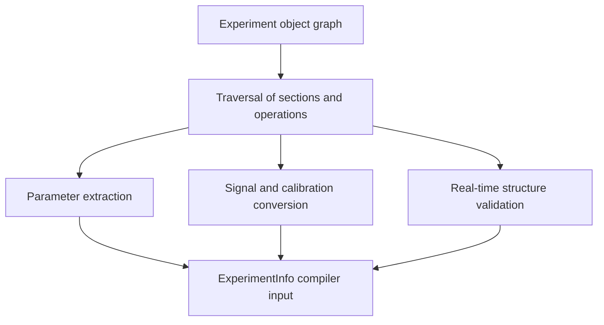

# Python DSL and Compiler Payload

The Python DSL is a construction API for an experiment object graph. It is intentionally more permissive and ergonomic than the compiler's later representations. Users build experiments with context managers for sections, sweeps, acquire loops, matches, and callbacks; operations such as play, delay, acquire, reserve, and call are attached to sections. Logical signals connect those operations to roles in a device setup.

This chapter stops at the compiler input boundary. It does not describe scheduling, AWG grouping, or waveform merging. Those semantics are introduced later.

## Experiment object graph

The core frontend sources are `src/python/laboneq/dsl/experiment/experiment.py` and `src/python/laboneq/dsl/experiment/section.py`. The `Experiment` class owns top-level metadata, signal declarations, calibration, and methods that create nested sections. Section subclasses distinguish ordinary sections, acquire loops, sweeps, PRNG loops, match/case constructs, and related real-time control constructs.

| DSL concept | Compiler-relevant meaning |
| --- | --- |
| Experiment | Root container for signals, calibration, sections, and operations. |
| Section | Nested region with alignment, length, repetition, execution type, and child operations or child sections. |
| Sweep/acquire loop | Loop metadata and parameter bindings that later become timing and near-time/real-time execution structure. |
| Play/acquire/delay/reserve operations | Leaf operations associated with a logical signal and optional pulse/acquisition metadata. |
| Calibration | Logical-signal-level configuration such as oscillator, mixer, amplitude, range, port delay, and device-related constraints. |
| Logical signal | Symbolic lane used by the DSL and setup; it is not yet an AWG-local waveform channel. |

The DSL records **experimental intent**. It can say that two logical readout signals receive overlapping pulses, but it does not yet decide whether those pulses are separate physical waveforms, subchannels of one waveform, or invalid because of oscillator constraints. That decision requires setup, backend, and device-trait information.

## Payload construction

`src/python/laboneq/implementation/payload_builder/experiment_info_builder/experiment_info_builder.py` converts the Python object graph into an `ExperimentInfo`-like compiler input. This conversion is a semantic narrowing step. The builder traverses sections, records operations in compiler-oriented structures, extracts parameters, validates real-time boundaries, converts calibration data, and attaches signal/setup information.

The important property of this payload is that it is still **not a schedule**. It preserves the experiment's nested structure and enough setup information for compilation, but offsets, resolved section lengths, grid adjustments, AWG-local partitions, and merged waveform intervals are still absent.

## Python-to-Rust compatibility bridge

The workflow files in `src/python/laboneq/compiler/workflow` adapt Python-side data into the forms consumed by the Rust compiler components. `compiler.py` and `realtime_compiler.py` orchestrate compilation from Python, while `compat.py` contains conversion logic for experiment information, setup data, calibration values, precompensation, and parameter stores.

| Boundary | Source files | Information crossing the boundary |
| --- | --- | --- |
| DSL to payload | `experiment_info_builder.py` | Sections, operations, signals, parameters, calibration. |
| Payload to Rust compiler | `compiler/workflow/compat.py`, `realtime_compiler.py` | Normalized experiment/setup/parameter data suitable for Rust preprocessing and scheduling. |
| Rust result to Python | `compiler/seqc/code_generator.py`, `data/scheduled_experiment.py` | Recipe, generated code, waveforms, command tables, result metadata, execution metadata. |

## Invariants handed to scheduling

By the time the scheduler receives the experiment, the compiler should have a normalized description of the experiment hierarchy, signal names, operation metadata, and relevant setup/calibration information. The scheduler can then reason about timing constraints without needing the original Python context-manager machinery.

The payload layer should not be read as a hidden hardware compiler. It does not perform the interval compaction that merges logical signals onto physical waveforms. Its purpose is to make the Python experiment explicit enough that later stages can reason about it deterministically.
