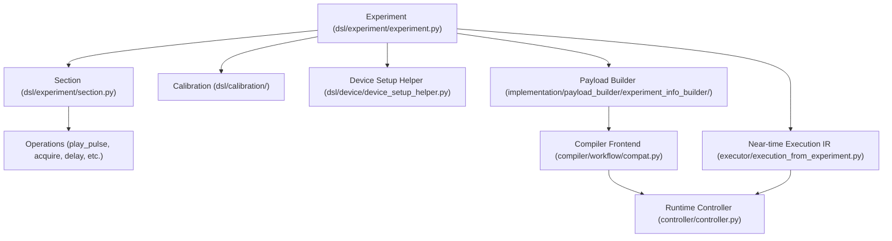

# Python DSL frontend

The Python Domain-Specific Language (DSL) frontend in the LabOne Q project (`zhinst/laboneq`) is the primary user-facing abstraction layer for defining quantum experiments. It provides a rich, expressive, and structured API to describe experiments, sections, operations, calibrations, parameters, sweeps, real-time loops, callbacks, and other constructs necessary for precise quantum control. This page documents the design, purpose, location, consumers, and invariants of the Python DSL frontend, focusing on the core abstractions such as `Experiment`, `Section`, operations, calibration, parameters, sweeps, real-time loops, callbacks, match/case constructs, pseudorandom number generation (PRNG), traversal mechanisms, syntactic sugar, and frontend invariants.

---

## How to read this page as a maintainer

This page is intended as a comprehensive orientation for developers maintaining or extending the LabOne Q Python DSL frontend. It assumes familiarity with Python and some knowledge of quantum control concepts. The page explains the rationale behind the DSL design, the key classes and modules, how the DSL fits into the overall LabOne Q architecture, and the invariants that must be preserved for correctness. Code and file path references link directly to the GitHub repository for quick inspection. The page also clarifies which components are user-facing and which are internal, helping maintain a clean separation of concerns.

---

## 1. Overview: What is the Python DSL frontend?

The Python DSL frontend is the high-level API that users and higher-level application libraries use to define quantum experiments in LabOne Q. It abstracts away low-level device details and provides a structured, composable, and type-safe way to describe sequences of quantum operations, measurement loops, parameter sweeps, and real-time control flow.

### Purpose and rationale

- **Expressiveness:** The DSL allows users to express complex quantum experiments declaratively, including nested loops, conditional branches, and real-time feedback.
- **Separation of concerns:** The DSL separates experiment definition from device setup and execution, enabling reuse and modularity.
- **Frontend invariants:** The DSL enforces structural and semantic invariants to ensure experiments are well-formed before compilation.
- **Interoperability:** The DSL produces data structures that are lowered into intermediate representations (IR) consumed by the compiler and runtime.

### Architectural context

The DSL frontend sits at the top of the LabOne Q stack (see [LabOne Q architecture notes](https://github.com/zhinst/laboneq/blob/main/README.md#architecture) and the README diagram). It is consumed by:

- The **payload builder** (`ExperimentInfoBuilder`) which lowers the DSL into a device-agnostic intermediate form.
- The **compiler** which transforms the intermediate form into scheduled IR and code generation artifacts.
- The **controller** which executes compiled experiments on hardware or emulators.
- Higher-level application libraries such as [`laboneq-applications`](https://github.com/zhinst/laboneq-applications) which build domain-specific experiments on top of the DSL.

---

## 2. Core abstractions and their locations

The Python DSL frontend is implemented primarily under:

- `src/python/laboneq/dsl/experiment/experiment.py` — main `Experiment` class.
- `src/python/laboneq/dsl/experiment/section.py` — `Section` class and subclasses.
- `src/python/laboneq/dsl/experiment/operation.py` — base operation classes.
- Other DSL modules under `src/python/laboneq/dsl/experiment/` for specific operations like `play_pulse.py`, `acquire.py`, `delay.py`, `reset_oscillator_phase.py`, `set_node.py`, and `call.py`.

### 2.1 Experiment

The `Experiment` class is the root container for a quantum experiment. It holds metadata and a tree of `Section` objects representing the experiment's structure.

- **Location:** [`experiment.py`](https://github.com/zhinst/laboneq/blob/main/src/python/laboneq/dsl/experiment/experiment.py)
- **Purpose:** Encapsulates the entire experiment definition, including sections, parameters, and calibration references.
- **Consumers:** Payload builder, compiler frontend, and runtime execution layers.
- **Invariants:** Exactly one root experiment per user-defined experiment; sections form a well-formed tree.

### 2.2 Section

`Section` objects represent hierarchical blocks of operations within an experiment. They are implemented as `attrs` classes with rich metadata and mutating DSL helpers.

- **Location:** [`section.py`](https://github.com/zhinst/laboneq/blob/main/src/python/laboneq/dsl/experiment/section.py)
- **Key attributes:**
  - `uid`: Unique identifier.
  - `name`: Human-readable name.
  - `alignment`: Section alignment enum.
  - `execution_type`: Optional, e.g., real-time or near-time.
  - `min_length`: Minimum duration.
  - `play_after`: Optional dependency on other sections.
  - `children`: List of child sections or operations.
  - `triggers`: Trigger conditions.
  - `on_system_grid`: Boolean flag for timing grid alignment.
  - `section_timing_mode`: Enum controlling timing semantics.
- **Mutating DSL helpers:** Methods like `play()`, `reserve()`, `acquire()`, `measure()`, `delay()`, `reset_oscillator_phase_()`, `set_node()`, and `call()` append operations to the section.
- **Consumers:** Payload builder, compiler passes, and runtime.
- **Invariants:** Sections must not nest real-time loops improperly; timing constraints must be respected.

### 2.3 Operations

Operations are the leaf-level actions within sections. They include:

- **PlayPulse:** Play a waveform pulse on a signal.
- **Acquire:** Acquire measurement data.
- **Delay:** Insert a delay.
- **ResetOscillatorPhase:** Reset oscillator phase.
- **SetNode:** Set a node value.
- **Call:** Invoke a near-time callback.

These are defined in respective modules under `dsl/experiment/` and are appended to sections via DSL helpers.

---

## 3. Calibration and setup mapping

Calibration data and device setup are logically separated from the experiment definition but are referenced by the DSL frontend.

- Calibration classes live under `dsl/calibration/` and include amplifier pump, mixer calibration, oscillator calibration, output routing, and precompensation.
- Device setup helpers in `dsl/device/device_setup_helper.py` map logical signals in the experiment to physical device channels.
- The payload builder (`implementation/payload_builder/experiment_info_builder/experiment_info_builder.py`) merges calibration and setup data with the DSL experiment to produce a normalized `ExperimentInfo` structure for compilation.

---

## 4. Parameters and sweeps

Parameters represent variables that can be swept or varied during experiment execution.

- Parameters are declared and managed within the DSL experiment and sections.
- Sweeps are represented by `Sweep` objects, which carry one or more parameters and support chunking for large parameter spaces.
- Sweeps are implemented as near-time loops, allowing efficient execution and compilation.
- The DSL supports linear sweeps and more complex parameter relationships.
- Parameter handling is integrated with the payload builder and compiler to ensure correct mapping and usage.

---

## 5. Real-time loops and callbacks

Real-time loops are critical for precise timing and control in quantum experiments.

- The `AcquireLoopRt` class represents the real-time averaging/acquisition boundary.
  - Attributes include `acquisition_type`, `averaging_mode`, `count`, `repetition_mode`, optional `repetition_time`, and `reset_oscillator_phase`.
  - Execution type is fixed to real-time.
- Real-time loops are not expanded in Python but trigger compiled real-time runs per near-time point.
- Near-time callbacks (`Call` operations) allow user-defined Python functions to be invoked during experiment execution.
- Callbacks are integrated into the near-time execution tree and runtime controller.

---

## 6. Match/Case constructs and PRNG

The DSL supports conditional execution and pseudo-random control flow.

- `Match` and `Case` classes represent real-time conditional branching.
- These constructs allow experiments to adapt dynamically based on measurement results or feedback.
- PRNG setup and loops (`PRNGSetup`, `PRNGLoop`) enable pseudo-randomized experiment sequences, useful for randomized benchmarking and error mitigation.
- These constructs are lowered into specialized IR nodes during compilation.

---

## 7. Traversal and syntactic sugar

The DSL provides traversal utilities and syntactic sugar to ease experiment definition.

- Sections and operations support tree traversal methods for inspection, validation, and transformation.
- Syntactic sugar includes context managers, helper functions, and decorators to simplify common patterns.
- The DSL enforces invariants such as no nested real-time loops inside near-time loops and unique section UIDs.
- These features improve usability while preserving correctness.

---

## 8. Frontend invariants

The DSL frontend maintains several critical invariants to ensure experiments are valid and compilable:

| Invariant | Description | Enforced by |
|-----------|-------------|-------------|
| Unique UIDs | Each section and operation has a unique identifier | DSL constructors and UID generators |
| Single real-time loop | At most one `AcquireLoopRt` per experiment | DSL validation and payload builder |
| No nested real-time loops | Real-time loops cannot be nested inside near-time loops | DSL validation |
| Timing constraints | Sections respect minimum length and alignment | DSL and scheduler passes |
| Calibration consistency | Calibration data matches device setup and signals | Payload builder and calibration mediator |
| Parameter consistency | Parameters are well-defined and used consistently | Payload builder and compiler |
| No conflicting signal assignments | Each physical channel is assigned to at most one logical signal | Payload builder validation |

Violations of these invariants raise exceptions early, preventing invalid experiments from reaching the compiler or runtime.

---

## 9. Practical developer orientation

### What exists?

- A rich Python DSL for experiment definition, including hierarchical sections, operations, parameters, loops, and control flow.
- Calibration and device setup abstractions integrated with the DSL.
- Utilities for parameter sweeps, chunking, and real-time boundaries.
- Support for near-time callbacks and match/case conditional execution.
- Traversal and validation mechanisms enforcing frontend invariants.

### Why does it exist?

- To provide users and application developers with a high-level, expressive, and safe API for defining quantum experiments.
- To separate experiment logic from device details and runtime concerns.
- To enable efficient compilation and execution on Zurich Instruments QCCS hardware.
- To support complex experiment workflows including feedback, dynamic control, and randomized sequences.

### Where does it live?

- Python package `laboneq.dsl.experiment` and related calibration and device setup modules under `src/python/laboneq/dsl/`.
- Payload building and lowering in `src/python/laboneq/implementation/payload_builder/experiment_info_builder/`.
- Near-time execution IR and runtime integration in `src/python/laboneq/executor/` and `src/python/laboneq/controller/`.

### Who consumes it?

- The LabOne Q compiler frontend (`src/python/laboneq/compiler/workflow/compat.py`) consumes the DSL to produce compiler inputs.
- The runtime controller consumes compiled experiments derived from the DSL.
- Application libraries such as `laboneq-applications` build on the DSL to define domain-specific experiments.
- End users write experiments directly using the DSL.

### What invariants does it carry?

- Structural correctness of the experiment tree.
- Timing and alignment constraints.
- Parameter and calibration consistency.
- Real-time and near-time execution boundaries.
- Unique identification of experiment components.

---

## 10. Code and file references

| Component | File path | Description |
|-----------|-----------|-------------|
| Experiment class | [`dsl/experiment/experiment.py`](https://github.com/zhinst/laboneq/blob/main/src/python/laboneq/dsl/experiment/experiment.py) | Root experiment container |
| Section class | [`dsl/experiment/section.py`](https://github.com/zhinst/laboneq/blob/main/src/python/laboneq/dsl/experiment/section.py) | Hierarchical sections and operations |
| Operations | [`dsl/experiment/play_pulse.py`](https://github.com/zhinst/laboneq/blob/main/src/python/laboneq/dsl/experiment/play_pulse.py), [`acquire.py`](https://github.com/zhinst/laboneq/blob/main/src/python/laboneq/dsl/experiment/acquire.py), [`delay.py`](https://github.com/zhinst/laboneq/blob/main/src/python/laboneq/dsl/experiment/delay.py), [`reset_oscillator_phase.py`](https://github.com/zhinst/laboneq/blob/main/src/python/laboneq/dsl/experiment/reset_oscillator_phase.py) | Leaf-level operations |
| Calibration | [`dsl/calibration/`](https://github.com/zhinst/laboneq/tree/main/src/python/laboneq/dsl/calibration) | Calibration abstractions |
| Device setup helper | [`dsl/device/device_setup_helper.py`](https://github.com/zhinst/laboneq/blob/main/src/python/laboneq/dsl/device/device_setup_helper.py) | Logical to physical signal mapping |
| Payload builder | [`implementation/payload_builder/experiment_info_builder/experiment_info_builder.py`](https://github.com/zhinst/laboneq/blob/main/src/python/laboneq/implementation/payload_builder/experiment_info_builder/experiment_info_builder.py) | Lowers DSL to compiler input |
| Near-time execution IR | [`executor/execution_from_experiment.py`](https://github.com/zhinst/laboneq/blob/main/src/python/laboneq/executor/execution_from_experiment.py) | Builds near-time execution tree |
| Controller runtime | [`controller/controller.py`](https://github.com/zhinst/laboneq/blob/main/src/python/laboneq/controller/controller.py) | Executes compiled experiments |

---

## 11. DSL frontend structure diagram

---

## 12. Summary

The Python DSL frontend in LabOne Q is a carefully designed, user-facing API that enables the definition of complex quantum experiments with precise timing, calibration, and control flow. It is implemented as a hierarchy of `Experiment`, `Section`, and operation classes, enriched with calibration and device setup references. The DSL supports parameter sweeps, real-time loops, conditional branching, and callbacks, all while enforcing strict invariants to guarantee correctness. It is consumed by the payload builder and compiler to produce executable experiments and by the runtime controller for execution. Understanding the DSL frontend is essential for maintaining LabOne Q's core experiment definition capabilities and for extending its functionality.

---

## References used on this page

1. LabOne Q repository, Python DSL Experiment: https://github.com/zhinst/laboneq/blob/main/src/python/laboneq/dsl/experiment/experiment.py  
2. LabOne Q repository, Python DSL Section: https://github.com/zhinst/laboneq/blob/main/src/python/laboneq/dsl/experiment/section.py  
3. LabOne Q repository, Payload Builder ExperimentInfoBuilder: https://github.com/zhinst/laboneq/blob/main/src/python/laboneq/implementation/payload_builder/experiment_info_builder/experiment_info_builder.py  
4. LabOne Q repository, Compiler workflow compatibility bridge: https://github.com/zhinst/laboneq/blob/main/src/python/laboneq/compiler/workflow/compat.py  
5. LabOne Q repository, Near-time execution IR: https://github.com/zhinst/laboneq/blob/main/src/python/laboneq/executor/execution_from_experiment.py  
6. LabOne Q repository, Controller runtime: https://github.com/zhinst/laboneq/blob/main/src/python/laboneq/controller/controller.py  
7. LabOne Q architecture notes and README diagram: https://github.com/zhinst/laboneq/blob/main/README.md  
8. LabOne Q official user manual: https://docs.zhinst.com/labone_q_user_manual/  
9. LabOne Q Core manual: https://docs.zhinst.com/labone_q_user_manual/core/index.html
