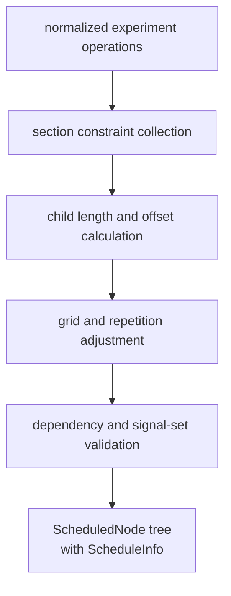
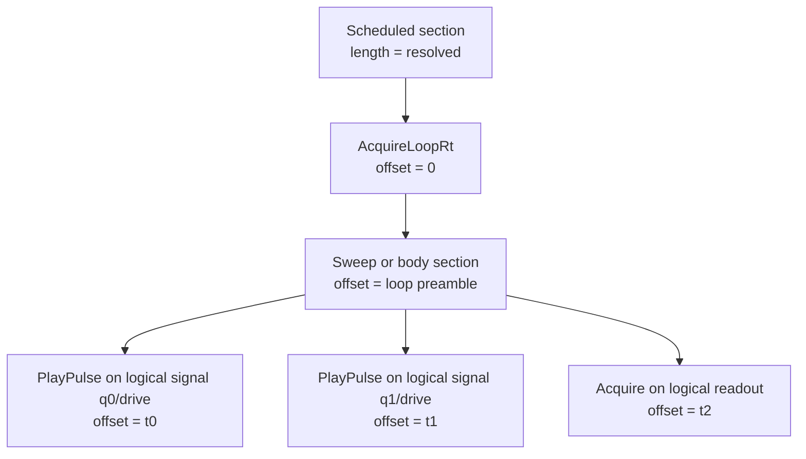

# Global Scheduling

In LabOne Q, **scheduling** means resolving the global timing of the experiment. It determines how sections, loops, pulses, acquisitions, delays, matches, and repetition constructs are placed in time with respect to one another. It produces timed nodes with offsets and lengths, and it records metadata such as timing grids, participating signals, alignment constraints, play-after constraints, and repetition behavior.

Scheduling does **not** mean mapping logical signals onto physical AWG outputs. It does not synthesize waveform arrays, and it does not decide how overlapping logical pulses on a shared physical resource are compacted into a `playWave`. That work belongs to backend and code-generation stages.

A precise contract is useful: the scheduler may move or size operations only in the **time domain** of the global experiment. It can insert delays, stretch sections, align children, apply grids, and compute repetition lengths. It cannot decide that `q0/drive` and `q1/drive` share the same waveform memory, because that fact is not a property of the section tree alone. The physical statement “these two logical leaves must be merged into one sequencer-level waveform interval” requires backend resource metadata and therefore appears later.

## Scheduler inputs and outputs

The relevant Rust sources are `src/rust/laboneq-scheduler/src/scheduler.rs`, `scheduled_node.rs`, `schedule_info.rs`, and `timing_resolver/timing_calculator.rs`. The scheduler consumes a normalized experiment operation tree and backend timing constraints. It outputs a tree of `ScheduledNode` objects and schedule metadata.

| Scheduler concept | Meaning |
| --- | --- |
| Operation kind | The semantic operation represented by a node: section, loop, play, acquire, delay, match, case, PRNG setup, and related constructs. |
| Child offset | Placement of a child operation relative to its parent section or loop. |
| Length | Resolved duration, often constrained by device grids, repetition, pulse lengths, and section policies. |
| Signal set | Signals participating in a section or operation, used to enforce timing and overlap constraints. |
| Timing grid | Sample/tinysample granularity used when resolving offsets and lengths. |
| Alignment | Section policy for arranging children within a section. |
| Play-after and dependency constraints | Ordering constraints that cannot be represented by simple source order alone. |

## Scheduled tree shape

A scheduled experiment remains tree-shaped. Sections contain children. Loops contain bodies. Leaf operations represent play, acquire, delay, frame changes, or related operations. The scheduler adds timing to this tree rather than replacing it with a flat event list. That choice is useful because later passes still need structural information about loops, match/case branches, triggers, cut points, and repetitions.

The diagram intentionally labels logical signals, not AWG channels. At this point the compiler has a timed global experiment, but it has not necessarily split the tree into physical sequencer programs.

For a source-grounded expansion of the four intermediate boxes in the scheduling diagram, see [Global Scheduling Implementation Mechanics](04a-global-scheduling-implementation.md). That companion chapter explains how constraint metadata is collected into `ScheduleInfo`, how left- and right-aligned child offsets are computed, how grids and repetition modes adjust lengths, and how dependency and signal-set validation is enforced.

## Scheduler contract and non-contract

| Question | Scheduler answer | Later-stage answer |
| --- | --- | --- |
| Where does a child operation start relative to its parent? | Yes; a child offset is part of the timing solution. | Later passes may convert to absolute samples for a specific AWG. |
| How long is a section or loop body? | Yes; section length and repetition behavior are scheduler-owned. | Code generation preserves the timing while translating control flow to SeqC. |
| Are operations aligned to the required time grid? | Yes; grid constraints are resolved during scheduling. | Device-specific waveform grids may introduce additional playwave cut points. |
| Which logical signals participate in a section? | Yes; signal sets guide timing and validation. | Backend mapping decides which physical resources those logical signals share. |
| Do two logical pulses become one physical waveform event? | No; this is outside the scheduler contract. | `VirtualSignal` and `handle_playwaves.rs` decide this per AWG core. |
| Which SeqC program contains the event? | No; scheduling is global. | AWG fanout and code generation assign events to sequencer programs. |

## Boundaries of scheduling

The scheduler must answer questions such as whether a section has a valid length, whether children fit within their parent, whether loop repetition timing is legal, and where operations lie on the relevant timing grid. It must not silently answer questions that require physical waveform grouping. If two logical pulses overlap, that overlap may be entirely legal at the schedule level. The later code generator must decide whether those pulses share a virtual signal group, whether their oscillators are compatible, and whether they can be represented by one physical waveform interval.

This distinction clarifies many source names. `ScheduledNode` is not simply a synonym for the later `IrNode`. It is a scheduler-owned representation that carries timing-solution semantics. The conversion to the shared IR, implemented in `src/rust/laboneq-scheduler/src/scheduled_to_ir.rs`, deliberately moves from the scheduler's richer timing metadata into a representation better suited for code-generation mutation.

## Debugging scheduling failures

Scheduling failures should be investigated with questions about timing, not resource multiplexing. Inspect section lengths, alignments, loop repetition settings, grid constraints, play-after dependencies, and signal participation. If an experiment schedules successfully but fails because multiple logical channels cannot share an oscillator or because generated waveforms do not match expectation, the problem is later than scheduling.
