# Global Scheduling Implementation Mechanics

This chapter expands the scheduling diagram from [Global Scheduling](04-global-scheduling.md). The purpose is to describe the **mechanism** behind the four intermediate boxes in that diagram: section constraint collection, child timing offset calculation, grid and repetition adjustment, and dependency and signal-set validation. The scheduling pass is still global and logical: it reasons about sections, loops, logical signals, timing grids, dependencies, and feedback latency, but it does not perform AWG-local waveform multiplexing or physical-channel merging.

The implementation is centered in `src/rust/laboneq-scheduler/src/timing_resolver/timing_calculator.rs`. The inputs consumed by that file are prepared earlier by `src/rust/laboneq-scheduler/src/lower_experiment/mod.rs`, `local_context.rs`, and `schedule_info.rs`. A useful way to read the source is that lowering builds a `ScheduledNode` tree with **constraint metadata**, and the timing resolver then mutates only scheduling fields: child offsets, resolved lengths, absolute starts, and warnings.

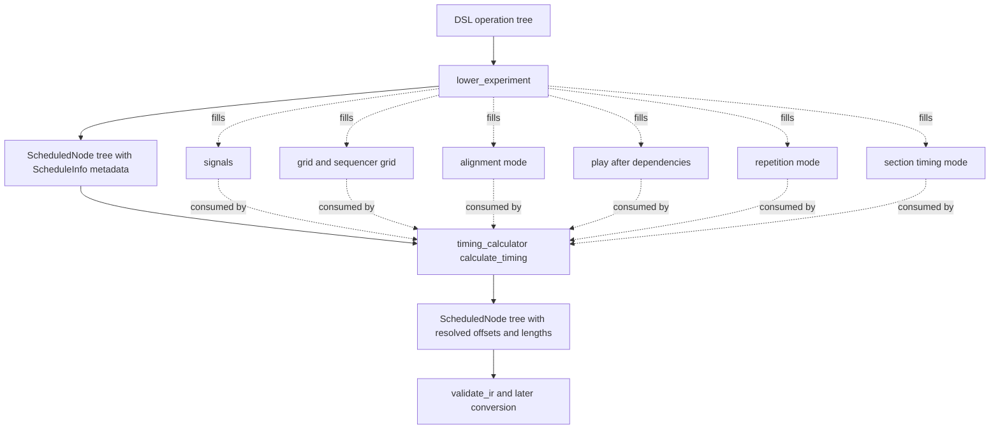

## Source map for the scheduling mechanisms

| Mechanism | Main implementation files | Central objects and functions |
| --- | --- | --- |
| Constraint collection | `lower_experiment/mod.rs`, `lower_experiment/local_context.rs`, `schedule_info.rs` | `lower_section`, `lower_play_pulse`, `lower_acquire`, `lower_delay`, `LocalContext::calculate_grids`, `ScheduleInfo` |
| Child timing offsets | `timing_resolver/timing_calculator.rs` | `calculate_timing`, `calculate_node_timing`, `schedule_section`, `arrange_left_aligned`, `arrange_right_aligned`, `update_absolute_start` |
| Grid and repetition adjustment | `timing_calculator.rs`, `utils.rs`, `resolve_repetition_mode.rs` | `checked_ceil_to_grid`, `checked_floor_to_grid`, `checked_round_to_grid`, `calculate_section_length`, `adjust_section_length`, `schedule_loop`, `schedule_compressed_loop`, `schedule_auto_repetition_mode_loop`, `schedule_constant_repetition_mode_loop` |
| Dependency and signal-set validation | `analysis/validate_ir.rs`, `timing_calculator.rs`, `lower_experiment/match_case.rs` | `validate_ir`, `validate_match_children`, `schedule_feedback_match`, `CalculatorContext::register_feedback_acquisition_event` |

The table is intentionally split by **compiler responsibility** rather than by file. Some mechanisms span lowering, solving, and validation because a constraint must first be represented, then applied, and finally checked for legality.

## The timing resolver as a depth-first tree solver

The top-level timing entry point is `calculate_timing(node, feedback_calculator)`. It creates a `CalculatorContext`, initializes the root absolute start to zero, and then calls `calculate_node_timing` recursively. The implementation promise in the source is important: the resolver does not add or remove nodes. It updates timing information and, where necessary, child offsets and node lengths.

> The scheduler is a **tree timing solver**, not a flattening event scheduler. It preserves the section/loop/match structure while resolving enough local and absolute timing information for later code-generation passes.

`CalculatorContext` carries the mutable global state needed during the depth-first traversal. Its most important fields are a map from acquisition handle to the latest acquisition event, the optional feedback-latency calculator, an active section stack for diagnostic context, and a `TimingResult` accumulator for warnings. This state is why scheduling is not just a local transform of each subtree: a later feedback `match` may need to know where the latest acquisition for a handle occurred.

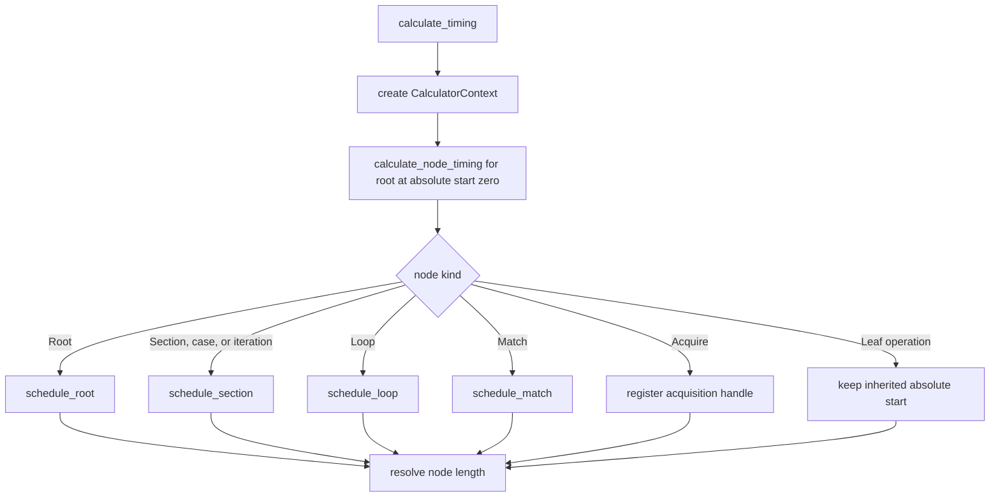

The traversal has two different timing notions. The `child.offset` field is relative to the parent node. The `node.schedule.absolute_start` field records the absolute start in the global experiment timeline. Whenever a right-aligned section or repetition adjustment shifts children after they were first visited, `update_absolute_start` propagates that delta recursively and re-registers acquisition positions for feedback handles.

## Section constraint collection

The first conceptual step, **section constraint collection**, is mostly not an algorithm inside the timing loop. It is the preparation of a `ScheduleInfo` record for each node during lowering. A section receives its alignment mode, explicit `play_after` dependencies, optional fixed length, `section_timing_mode`, participating signal set, timing grid, and sequencer grid. Leaf nodes receive signal-local lengths and grids. These fields are the constraints the timing calculator later consumes.

| `ScheduleInfo` field | How it constrains scheduling | Typical producer |
| --- | --- | --- |
| `signals` | Declares which logical signals a node occupies; sibling nodes sharing a signal must be serialized by the section arranger. | Collected while lowering children into a parent section. |
| `grid` | Defines the time grid on which the node or parent section may be placed or lengthened. | Derived from signal grids, sequencer grids, system grid, triggers, and escalation flags. |
| `sequencer_grid` | Represents the coarser grid implied by sequencer instruction timing. | Computed from device sampling rate and sample multiple. |
| `compressed_loop_grid` | Provides the loop-body grid used when a loop is represented in compressed form. | Propagated upward from children and loop metadata. |
| `length` / `length_param` | Stores either a resolved duration or a deferred near-time parameter-dependent duration. | Produced when lowering plays, acquires, delays, and fixed-length sections. |
| `alignment_mode` | Selects left-aligned or right-aligned child placement. | Copied from section DSL metadata. |
| `repetition_mode` | Selects fastest, constant, or auto loop timing semantics. | Derived from DSL repetition mode and normalized before solving. |
| `escalate_to_sequencer_grid` | Forces parent placement onto sequencer grid when a child requires sequencer-observable timing. | Used by acquisitions and other operations whose timing must align with sequencer behavior. |
| `play_after` | Requires a section to start only after named sibling sections have ended. | Copied from section DSL metadata and validated later. |
| `section_timing_mode` | Controls whether grid rounding is permitted or rejected. | Copied from section or loop context. |

The grid calculation is deliberately conservative. `LocalContext::calculate_grids` iterates over the participating signals, computes an LCM of signal grids and sequencer grids, and escalates to the sequencer grid when multiple signal grids occur or a child requests sequencer-grid escalation. If the DSL requested `on_system_grid`, the system grid also participates in the LCM. This produces a single parent grid that can safely host all participating children.

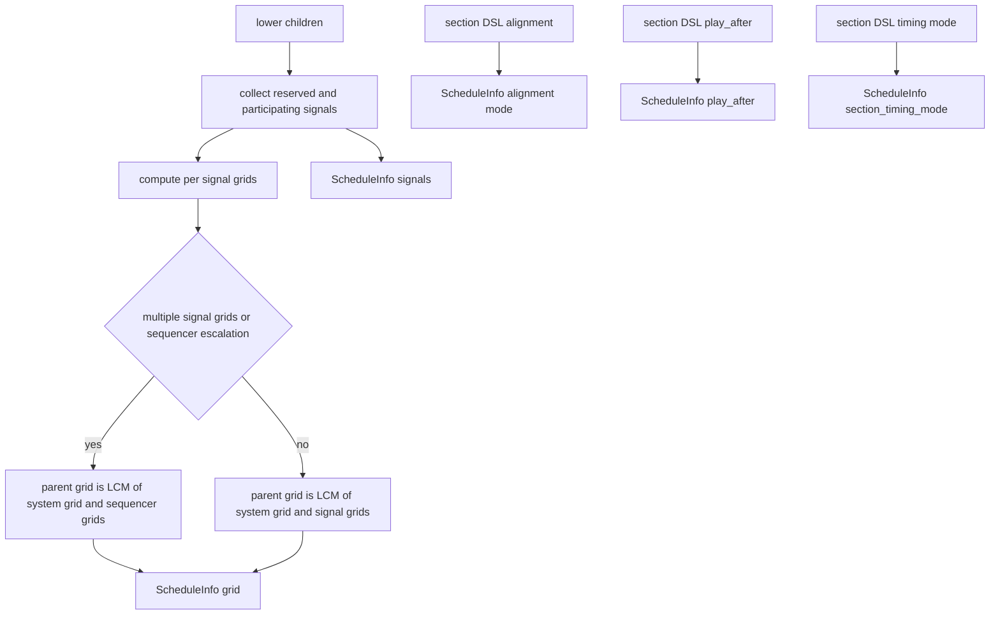

The signal set is not a physical resource set. It is a logical timing-occupation set. If two operations mention the same logical signal, the scheduler treats them as contending for that signal’s timeline in the same section. If two different logical signals later map to the same physical AWG output or sequencer, that relationship is handled after scheduling by backend and AWG-local lowering.

## Child timing offset calculation

Once metadata exists, `schedule_section` arranges child nodes according to the section alignment mode. The solver computes each child’s relative offset, calls `calculate_node_timing` for the child, and then uses the child’s resolved length to update constraints for subsequent siblings. This is where the schedule becomes concrete: source-order children are assigned numeric offsets.

For a **left-aligned** section, the algorithm scans children from left to right. It maintains a map from logical signal to the earliest next free time on that signal, plus a map from section UID to the end time of already placed sibling sections. A child’s candidate start is the maximum of all occupied signal times for the signals it uses and all `play_after` predecessor end times it references. That start is rounded up to the child’s grid, the child subtree is recursively scheduled at the resulting absolute time, and the parent then records the child offset.

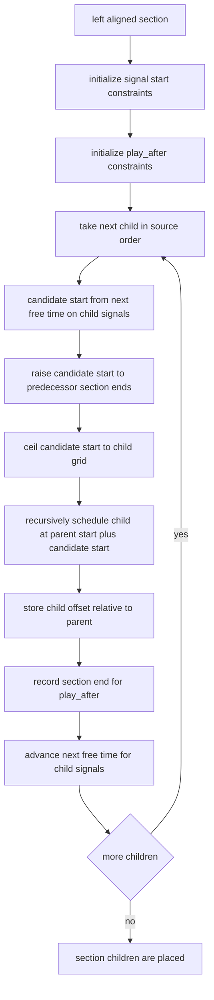

For a **right-aligned** section, the algorithm works backwards. It visits children in reverse order, computes each child’s own length first, and then places the child as far right as possible subject to signal-end constraints and play-after-derived predecessor/successor restrictions. The temporary offsets can be negative because they are initially expressed relative to a not-yet-final section start. After all children are visited, the minimum relative offset is rounded down to the section grid. Every child offset is then shifted so that the section starts at zero, and `update_absolute_start` fixes descendants’ absolute starts.

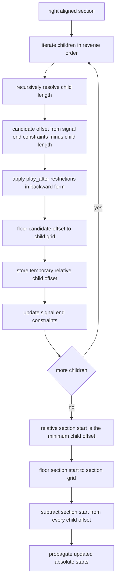

The backward pass is the reason right alignment has more restrictions elsewhere. Some constructs, especially feedback-handle matches, cannot be freely shifted in a right-aligned context without changing the causal relationship between the acquisition result and the later reaction.

## Section length resolution

After children are placed, `calculate_section_length` computes the parent section length as the maximum child end time, rounded up to the section grid. If the DSL or lowering stage supplied a fixed section length, the scheduler checks that all children fit within it. If the requested length is too short, scheduling fails with a section-length error. If the requested length is longer, `adjust_section_length` resolves the section to that length and shifts children when the section is right-aligned.

This mechanism is the semantic link between local child offsets and parent duration. A section length is not simply declared; it is the smallest grid-aligned interval that contains the arranged children, unless a fixed length explicitly stretches it.

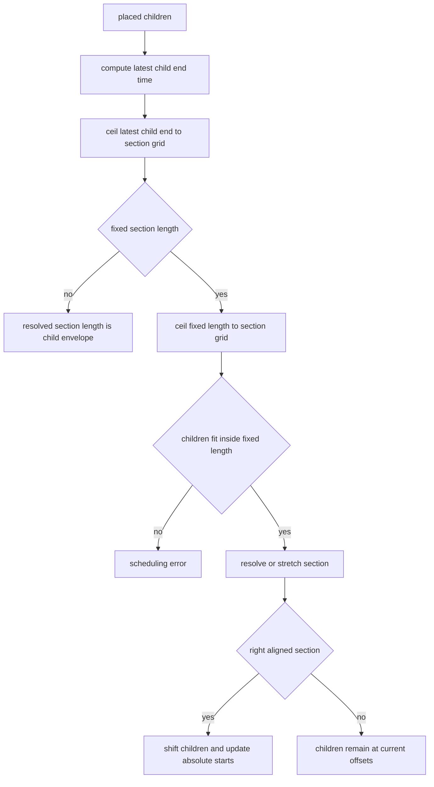

## Grid and repetition adjustment

The grid-adjustment rules are implemented with three primitive operations: ceil-to-grid, floor-to-grid, and round-to-grid. In relaxed timing mode, the scheduler may round placements and lengths as needed. In strict timing mode, the checked rounding helpers reject adjustments above a small tolerance relative to the grid. This is why strict timing failures are often not logical-ordering failures; they are failures to express a requested time on the required hardware-derived grid.

| Operation | Used when | Direction of movement | Why that direction is chosen |
| --- | --- | --- | --- |
| `checked_round_to_grid` | Leaf durations such as pulse, acquire, and delay lengths during lowering. | Nearest grid point. | The user requested a duration; the closest representable duration is selected or rejected. |
| `checked_ceil_to_grid` | Left-aligned child starts, section lengths, loop iteration lengths, constant repetition time. | Later or longer. | Scheduling may insert waiting time but must not make operations start before constraints or make containers too short. |
| `checked_floor_to_grid` | Right-aligned child starts and section starts. | Earlier. | A right-aligned packing pass works backwards from the right edge, so legal movement is toward earlier starts. |

Loop scheduling adds another layer of adjustment. In a generic fastest loop, iterations are visited sequentially and each child iteration is rounded to the loop grid before the next iteration starts. In a constant-repetition loop, every iteration is stretched to the requested repetition time, after first checking that the requested time can contain the iteration. In auto-repetition mode, all iterations are stretched to the longest rounded iteration length. In a compressed loop, only one iteration body exists in the tree; its length is adjusted once, and the loop length becomes that iteration length multiplied by the iteration count.

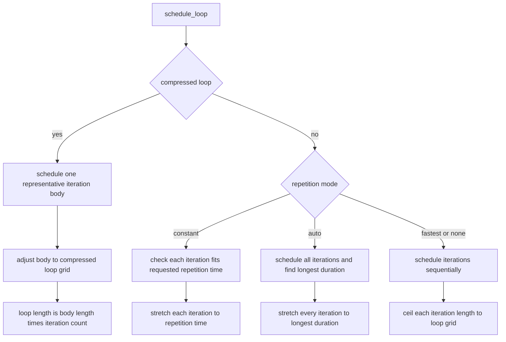

The loop mechanisms preserve the same tree semantics as section scheduling. They do not duplicate waveform events at scheduling time merely because a loop has many iterations. Compressed loops are especially important: the tree contains one representative iteration with a multiplied loop length, leaving later compiler stages to decide how that repetition is represented in generated artifacts.

## Preamble scheduling and observable phase resets

Loop iteration preambles have special scheduling rules. The scheduler places PPC sweep steps and oscillator-frequency sweep steps at time zero because they are treated as non-overlapping control updates before observable pulse or acquisition activity. Phase resets are different because their timing relative to later pulses affects observed phase. The implementation therefore aligns phase resets to the relevant grid and places them after the previous preamble steps.

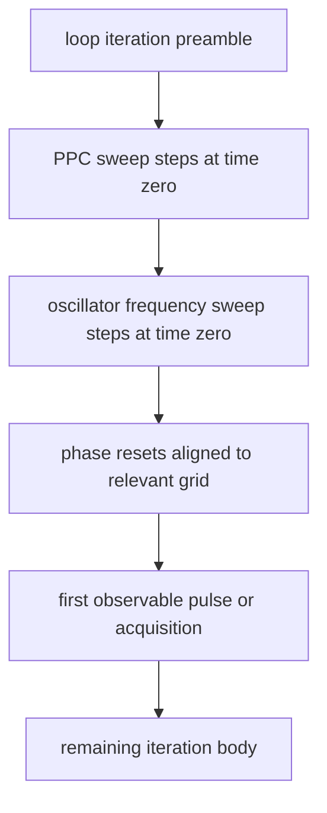

This is another example of the scheduler’s global-time semantics. It does not synthesize the waveforms for oscillator updates, but it does decide where the update operations belong in the logical timeline when their position is observable.

## Dependency and signal-set validation

There are two classes of dependency enforcement. The first class is **placement enforcement**, which happens while scheduling. Signal constraints and `play_after` constraints directly affect child offsets. A child cannot be placed before all previous activity on its own logical signals has ended, and a `play_after` dependency forces the child to start after the named predecessor section’s end.

The second class is **structural validation**, implemented by `analysis/validate_ir.rs`. It checks constraints that are better expressed as legality conditions than as offset equations. For example, a `play_after` reference must point to a section that was already seen at the same sibling level. A handle-based `match` cannot be inside auto repetition mode or directly under a right-aligned parent section. Acquisitions are disallowed inside certain match targets when the match target is not a sweep parameter.

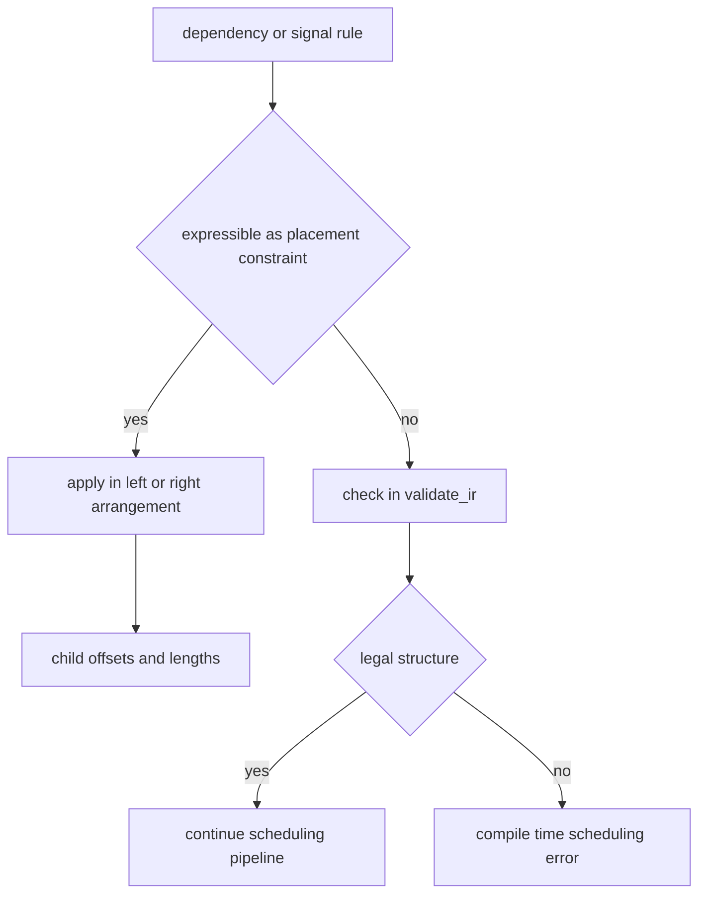

Signal-set validation is deliberately limited to logical timing occupation. When a section’s signal set is propagated upward, the scheduler uses it to know which signals impose serialization constraints and which grids must be combined. It does not interpret the signal set as a list of physical waveform lanes. That separation is essential: a section may be valid globally even if later physical resource lowering has to merge, reject, or split operations because of AWG-specific constraints.

## Feedback matches and causal dependency timing

Feedback-dependent `match` sections add a causal dependency that is neither ordinary signal serialization nor simple `play_after`. When the scheduler sees an acquisition, it records the latest acquisition for the acquisition handle in the calculator context. When it later schedules a `match` whose target is a handle, it asks the feedback-latency calculator for the earliest time at which the execute-table entry can be available. If that time is later than the match’s current start, the match is shifted later in relaxed timing mode or rejected in strict timing mode.

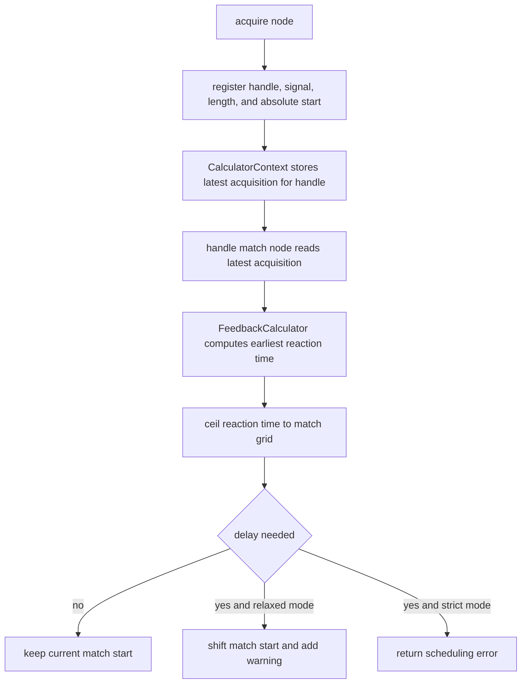

This mechanism explains why feedback scheduling must run with absolute-start knowledge and why acquisition events are re-registered when absolute starts move. The correctness condition is causal: a feedback reaction must not be scheduled before the controller and device path can make the acquisition result available to the later match operation.

## Intermediate states in the four-step diagram

The original diagram compresses several passes into four boxes. The following table describes what each box concretely means in terms of input state, output state, and invariants.

| Diagram box | Input state | Output state | Main invariant |
| --- | --- | --- | --- |
| Section constraints collection | Normalized DSL operation tree plus signal grid metadata. | `ScheduledNode` tree whose `ScheduleInfo` fields describe signals, grids, alignment, lengths, dependencies, repetition, and timing mode. | Every timing-relevant DSL property has a place in `ScheduleInfo`; physical AWG sharing is not represented here. |
| Child timing offset calculation | `ScheduledNode` tree with unresolved child offsets and partly unresolved lengths. | Relative child offsets and absolute starts for scheduled subtrees. | Siblings are serialized on shared logical signals, dependency constraints are obeyed, and right/left alignment semantics are preserved. |
| Grid and repetition adjustment | Placed children and loop iteration bodies. | Grid-aligned starts, grid-aligned section lengths, repetition-stretched loop bodies, and loop lengths. | No container is shorter than its contents; strict timing rejects unacceptable rounding. |
| Dependency and signal-set validation | Scheduled tree with constraint metadata and timing results. | Either a validated scheduled tree or a compile-time error/warning. | Dependencies refer to legal sibling structure, feedback matches are causally schedulable, and disallowed match/repetition/alignment combinations are rejected. |

A practical debugging sequence follows the same order. First check whether the constraint metadata is what the DSL intended. Then check where child offsets are assigned. Then inspect grid rounding and loop repetition stretching. Finally, distinguish between a timing validation failure and a later backend resource failure.

## Worked miniature example

Consider a left-aligned section with three children: a pulse on `q0/drive`, a second pulse on the same signal, and a readout acquisition on `q0/measure`. The scheduler does not know or care whether these logical signals later share an AWG core. It only knows their logical signal sets and grids.

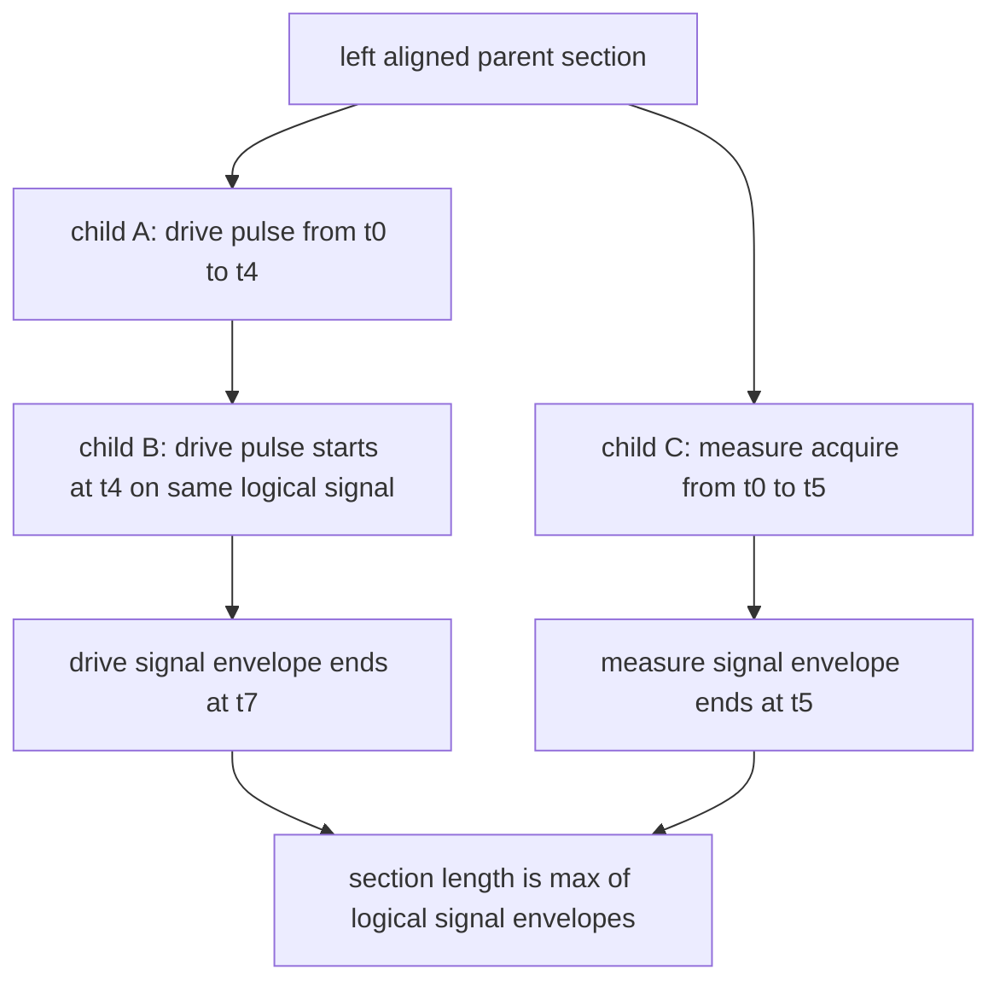

The two drive pulses serialize because they occupy the same logical signal. The acquisition may start at the same section offset as the first drive pulse because it occupies a different logical signal. If a later backend mapping says that two logical signals share a physical generator or sequencer, that is a later lowering problem; the global scheduler has already done its job by producing a consistent logical-time solution.

## Key takeaways

Global scheduling is best understood as a **constraint-driven recursive timing solve over the section tree**. Lowering collects timing constraints into `ScheduleInfo`. The timing calculator resolves child offsets and lengths with left/right alignment algorithms. Grid and repetition logic turns requested times into representable times or rejects them under strict timing. Validation enforces structural and causal restrictions that cannot be expressed as simple interval placement.

This concrete mechanism is also the boundary line to remember: after scheduling, the compiler knows when logical operations occur. It still does not know the final AWG-local waveform events. That later transition is handled by backend resource mapping and AWG-local lowering, where logical-signal multiplexing onto physical output resources becomes explicit.
