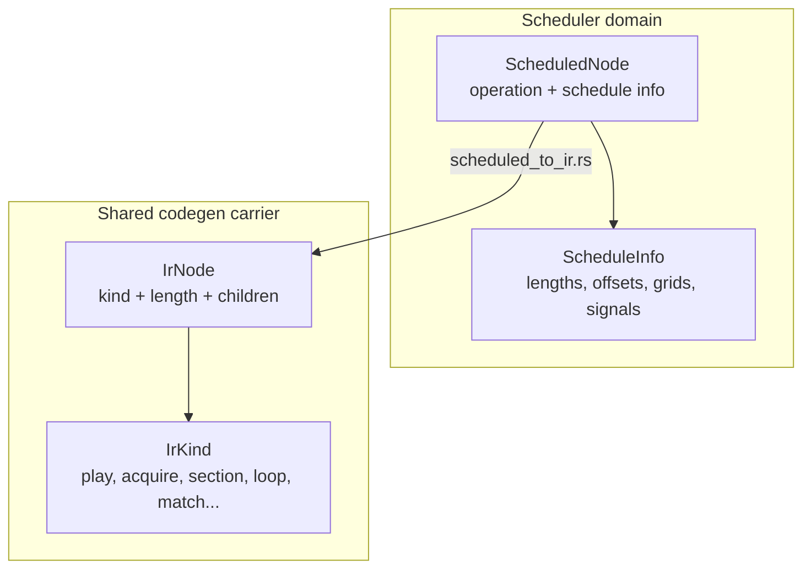
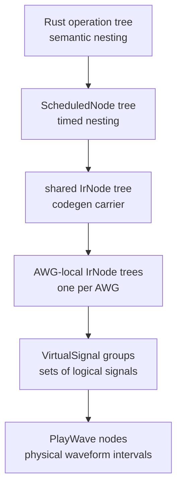

# IR Semantics: Operations, Scheduled Nodes, and IR Nodes

LabOne Q uses several tree-shaped representations that can look similar in a debugger. The names can be misleading if they are treated as one continuous “IR.” A clearer model is to assign each representation to the stage that owns its invariants.

## Representation matrix

| Representation | Primary source | Shape | Owned semantics | Not responsible for |
| --- | --- | --- | --- | --- |
| Rust DSL operation tree | `src/rust/laboneq-dsl/src/operation` | Nested operation tree | Normalized experiment operations derived from Python input. | Final timing, AWG fanout, waveform merging. |
| `ScheduledNode` | `src/rust/laboneq-scheduler/src/scheduled_node.rs` | Timed tree with scheduler metadata | Resolved global timing, child offsets, lengths, schedule constraints. | Physical waveform construction. |
| Shared `IrNode` | `src/rust/laboneq-ir/src/node.rs` | Generic mutable tree with `IrKind`, length, children | Transfer and transformation carrier for code-generation passes. | Constraint solving; it receives an already scheduled tree. |
| AWG-local `IrNode` | `src/rust/codegenerator/src/passes/fanout_awg.rs` and later passes | Per-AWG tree | Operations relevant to one sequencer/AWG core. | Global scheduling across all devices. |
| Playwave-lowered IR | `src/rust/codegenerator/src/passes/handle_playwaves.rs` | AWG-local tree with physical `PlayWave` nodes | Logical pulse slots compacted into waveform intervals and signatures. | Original logical `PlayPulse` nodes as executable sequencer operations. |

## Node versus `IrNode`

A scheduler node and an IR node are both tree nodes, but they encode different phases of knowledge. A `ScheduledNode` is part of the scheduler's solution: it carries timing metadata and remains tied to the schedule calculation. An `IrNode` is a more generic code-generation node. It has an `IrKind`, a length, and child offsets; it can be traversed and rewritten by later passes.

The conversion from `ScheduledNode` to `IrNode` is not a no-op rename. It is a move from the scheduler's constraint-solving domain to the code generator's transformation domain. After this conversion, passes can apply AWG delays, insert cut points, create virtual signals, rewrite frame changes, allocate amplitude registers, lower play pulses, optimize waveform signatures, and handle QA events.

| Transition | Preserved information | Information newly emphasized | Information intentionally left behind |
| --- | --- | --- | --- |
| Rust DSL operations to `ScheduledNode` | Experiment nesting, operation kinds, logical signals, loop/section structure. | Resolved lengths, offsets, grids, signal-set constraints, timing metadata. | Python construction conveniences and context-manager syntax. |
| `ScheduledNode` to shared `IrNode` | Timed tree shape, operation kinds, child offsets, lengths. | Generic mutable representation suitable for traversal and replacement. | Scheduler-only constraint-solving state and timing-calculation internals. |
| Shared `IrNode` to AWG-local `IrNode` | Timed operations and structural control constructs relevant to the AWG. | One sequencer/AWG resource as the compilation scope. | Operations belonging only to other AWG cores. |
| AWG-local `IrNode` to playwave-lowered IR | Control flow and timing windows. | Physical waveform events, relative pulse signatures, virtual-signal membership. | Standalone logical `PlayPulse` nodes as executable instructions. |

## Data shape across lowering

The most useful way to think about the IRs is not “tree versus DAG” in the abstract. LabOne Q primarily preserves nested trees because loops, sections, match/case constructs, and cut points must remain structured for sequencer code. The physical waveform data associated with nodes is not simply another child tree; it is formed by grouping and interval analysis over AWG-local pulse slots. A scheduled tree can therefore contain two logical pulses at overlapping times while still being semantically correct; only the AWG-local lowering stage determines whether those two leaves become one physical `PlayWave`, several `PlayWave`s separated by cut points, or an error because the shared resource cannot represent the requested oscillator/modulation combination.

## Shared IR contents

The shared IR crate under `src/rust/laboneq-ir` defines node containers and experiment packaging. `node.rs` defines the tree representation and mutation machinery. `ir.rs` defines operation variants and related structures. `experiment.rs` packages the scheduled experiment and parameters for downstream compilation. This crate is not the entire compiler; it supplies a common representation used after scheduling.

The `IrNode` abstraction supports transformations that would be awkward on scheduler-owned nodes. Code-generation passes can traverse the tree, replace nodes, attach metadata, and preserve structural constructs such as loops or match/case branches. This is why the code generator can replace logical `PlayPulse` nodes with `Nop` after emitting corresponding `PlayWave` nodes: the IR is a mutable transformation substrate.

## Consequences for documentation and debugging

When reading an error message or source file, first identify the representation. If the code touches `ScheduleInfo`, timing grids, or section length calculation, it is in the scheduler domain. If it traverses `IrNode`s and rewrites operation kinds, it is in the code-generation domain. If it mentions `VirtualSignal`, channel ids, AWG kinds, or waveform signatures, it is already past global scheduling and is working on physical lowering.
