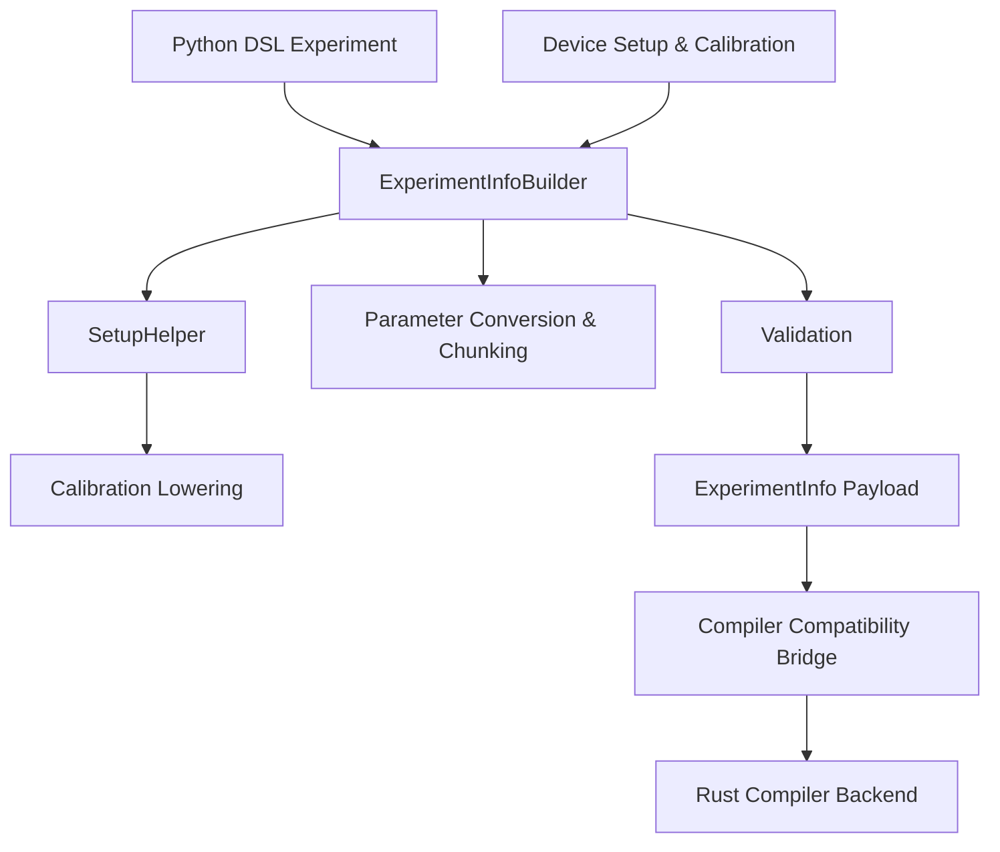

# Payload building and compiler inputs

This page provides a comprehensive developer-oriented overview of the payload building and compiler input preparation stages within the `zhinst/laboneq` codebase. It covers the key abstractions and components involved in transforming a user-defined quantum experiment, expressed in the Python DSL, into a structured, validated, and calibrated payload suitable for compilation by the Rust-backed compiler. The focus is on the roles and interactions of `ExperimentInfoBuilder`, `SetupHelper`, signal mapping, calibration lowering, parameter conversion, chunking, validation, and the handoff to the compiler compatibility bridge.

---

## Maintainer orientation

This page is intended for developers who maintain or extend the LabOne Q compiler frontend and payload builder. It assumes familiarity with the Python DSL for experiment definition (`laboneq.dsl.experiment`), the overall LabOne Q architecture, and the Rust compiler backend. The content explains the purpose and design of the payload-building layer, its location in the source tree, and how it fits into the compilation workflow. Code references include file paths and GitHub source links for direct inspection.

The page is structured to first introduce the main abstractions, then detail the signal and calibration processing, parameter handling, chunking logic, validation invariants, and finally the handoff to the Rust compiler bridge. Tables summarize key data structures and their consumers. Mermaid diagrams illustrate the data flow and component interactions.

---

## Overview: Purpose and context

LabOne Q separates experiment definition, device setup, compilation, and execution into distinct layers. The user defines experiments in a high-level Python DSL (`laboneq.dsl.experiment`), which is independent of the physical hardware setup. To compile and execute these experiments on Zurich Instruments QCCS hardware, the DSL must be lowered into a concrete, validated, and calibrated payload format that the compiler backend can consume.

The **payload building** stage is responsible for this lowering. It merges the abstract experiment with device setup and calibration data, resolves logical signals to physical hardware channels, converts calibration parameters into compiler-compatible structures, and prepares parameter metadata for sweep and near-time execution. This payload is encapsulated in the `ExperimentInfo` data structure.

The **compiler input** is then constructed from `ExperimentInfo` by the compatibility bridge, which serializes the payload into Cap'n Proto format and invokes the Rust compiler extension. This bridge also performs backend-specific preprocessing, validation, and IR construction.

The key components involved in this stage are:

- `ExperimentInfoBuilder`: orchestrates the payload building from DSL experiment and setup.
- `SetupHelper`: assists in mapping logical signals to physical signals and device calibration.
- Calibration lowering: converts calibration data into compiler input structures.
- Parameter conversion: extracts sweep and driven parameters for compilation.
- Chunking and validation: detects experiment chunking and enforces constraints.
- Compiler compatibility bridge: serializes and hands off the payload to Rust.

---

## Location in the codebase

The payload building and compiler input preparation code primarily resides in the following Python packages:

| Component | Source directory | Key files | Description |
|-----------|------------------|-----------|-------------|
| ExperimentInfoBuilder | `src/python/laboneq/implementation/payload_builder/experiment_info_builder` | [`experiment_info_builder.py`](https://github.com/zhinst/laboneq/blob/main/src/python/laboneq/implementation/payload_builder/experiment_info_builder/experiment_info_builder.py) | Main builder class that lowers the DSL experiment and setup into `ExperimentInfo`. |
| SetupHelper | `src/python/laboneq/data/setup_description` | [`setup_helper.py`](https://github.com/zhinst/laboneq/blob/main/src/python/laboneq/data/setup_description/setup_helper.py) | Utilities for resolving logical to physical signals and calibration merging. |
| Payload builder utilities | `src/python/laboneq/implementation/payload_builder` | [`payload_builder.py`](https://github.com/zhinst/laboneq/blob/main/src/python/laboneq/implementation/payload_builder/payload_builder.py) | Helper functions for payload construction and calibration lowering. |
| Compiler compatibility bridge | `src/python/laboneq/compiler/workflow` | [`compat.py`](https://github.com/zhinst/laboneq/blob/main/src/python/laboneq/compiler/workflow/compat.py) | Converts `ExperimentInfo` to Rust-backed compiler input, serializes Cap'n Proto. |

These components are invoked by the top-level compiler workflow in [`src/python/laboneq/compiler/workflow/compiler.py`](https://github.com/zhinst/laboneq/blob/main/src/python/laboneq/compiler/workflow/compiler.py), which manages chunking, device-class resolution, and compilation orchestration.

---

## Key abstractions and data flow

### ExperimentInfoBuilder and ExperimentInfo

The `ExperimentInfoBuilder` class is the central orchestrator that lowers a user-defined Python DSL experiment and device setup into an `ExperimentInfo` payload. This payload is a comprehensive, normalized representation of the experiment, including:

- Resolved signals with logical and physical channel mappings.
- Merged calibration data from setup and experiment levels.
- Parameter metadata for sweeps and driven parameters.
- Chunking information for large experiments.
- Acquire loop metadata and validation flags.

`ExperimentInfo` is defined in [`src/python/laboneq/data/compilation_job.py`](https://github.com/zhinst/laboneq/blob/main/src/python/laboneq/data/compilation_job.py) and serves as the main input to the compiler compatibility bridge.

The builder performs several critical tasks:

- **Signal mapping:** Using `SetupHelper`, it resolves logical signals in the experiment to physical signals on devices, ensuring unique channel assignments and detecting conflicts.
- **Calibration lowering:** It merges baseline device calibration with experiment-specific overrides, converting these into compiler-compatible structures such as oscillators, LO frequencies, voltage offsets, mixer calibrations, precompensation filters, amplifier pump data, automute settings, and output routing.
- **Parameter extraction:** It converts sweep parameters and driven parameters into `ParameterInfo` objects, which describe parameter ranges, chunking, and dependencies.
- **Chunking detection:** It analyzes the experiment sections and loops to detect chunking requests and sets chunking metadata accordingly.
- **Validation:** It enforces invariants such as the presence of at most one real-time acquire loop, no nested near-time sections under real-time loops, and consistent calibration data.

The output `ExperimentInfo` is then passed to the compiler compatibility bridge for serialization and Rust-side compilation.

### SetupHelper: Signal and calibration mapping

`SetupHelper` is a utility class located in [`src/python/laboneq/data/setup_description/setup_helper.py`](https://github.com/zhinst/laboneq/blob/main/src/python/laboneq/data/setup_description/setup_helper.py). It provides methods to:

- Map logical signals defined in the experiment DSL to physical signals on devices.
- Collect and merge calibration data from device setup and experiment overrides.
- Classify signals by type (integration, RF, IQ).
- Collect channel-to-port mappings and device-specific calibration parameters.

This helper is essential for ensuring that the experiment's logical signal references correspond to valid hardware channels with appropriate calibration applied.

### Calibration lowering

Calibration data in LabOne Q is hierarchical: baseline device calibration is stored in the setup, while experiment-level calibration overrides can be specified per signal or device. The payload builder merges these sources, resolving conflicts and applying overrides.

Calibration lowering converts these merged calibration data into the compiler's expected input structures, including:

- **Oscillators:** Initial oscillator frequencies and phase reset information.
- **Local Oscillators (LO):** LO frequencies per signal.
- **Voltage offsets:** DC offsets applied to output channels.
- **Ranges:** Voltage ranges and scaling factors.
- **Mixer calibration:** IQ mixer imbalance corrections.
- **Precompensation:** FIR, exponential, high-pass, and bounce compensation filters.
- **Amplifier pump:** Parameters for amplifier pump signals.
- **Automute:** Settings for automatic muting of signals.
- **Output routing:** SHFSG and SHFQC output-router configurations.

These calibration structures are defined in the Rust compiler input types and serialized via Cap'n Proto.

### Parameter conversion and chunking

Parameters in LabOne Q experiments can be:

- **Sweep parameters:** Parameters that vary over a sweep or loop, defining ranges and chunking.
- **Driven parameters:** Parameters that depend on other parameters, e.g., linear combinations or functions.

`ExperimentInfoBuilder` extracts these parameters from the DSL experiment and converts them into `ParameterInfo` objects. This includes metadata such as parameter names, types, ranges, chunk counts, and dependencies.

Chunking is a mechanism to split large experiments into smaller chunks for compilation and execution efficiency. The builder detects chunking requests from sweep parameters and sections, setting chunk counts and flags in the payload. It validates chunking constraints, such as ensuring chunking is only applied at allowed levels and that chunk counts are consistent.

### Validation invariants

The payload building stage enforces several important invariants to ensure the experiment is well-formed and compatible with the compiler and hardware:

- At most one real-time acquire loop (`AcquireLoopRt`) is allowed per experiment.
- Near-time sections cannot be nested under real-time loops.
- Signal mappings must be unique and conflict-free.
- Calibration data must be consistent and complete for all used signals.
- Chunking parameters must be valid divisors of sweep lengths.
- Section timing modes and alignment constraints must be respected.

Violations of these invariants raise exceptions early, preventing invalid payloads from reaching the compiler.

### Handoff to compiler compatibility bridge

After building and validating the `ExperimentInfo` payload, the compiler workflow calls the compatibility bridge function `build_rs_experiment()` in [`src/python/laboneq/compiler/workflow/compat.py`](https://github.com/zhinst/laboneq/blob/main/src/python/laboneq/compiler/workflow/compat.py).

This bridge performs the following:

- Converts `ExperimentInfo` into Rust DSL and device setup builder objects.
- Adds instruments with normalized and defaulted options.
- Adds calibrated signals with oscillator, LO frequency, voltage offset, amplifier pump, port mode, automute, delays, ranges, mixer calibration, precompensation, and output routing.
- Serializes the combined DSL experiment and setup into Cap'n Proto bytes.
- Calls the Rust extension's `build_experiment_capnp()` function to construct the Rust `Experiment` object.
- Runs backend-specific preprocessing, validation, and IR construction.

This handoff is the boundary between Python-side payload building and Rust-side compilation.

---

## Detailed component descriptions

### ExperimentInfoBuilder

The `ExperimentInfoBuilder` class is implemented in [`experiment_info_builder.py`](https://github.com/zhinst/laboneq/blob/main/src/python/laboneq/implementation/payload_builder/experiment_info_builder/experiment_info_builder.py). It exposes a primary method `build()` that accepts:

- A DSL `Experiment` object.
- A `Setup` object describing the device setup and calibration.
- Optional calibration overrides.
- Parameter metadata.

The builder proceeds through these steps:

1. **Signal resolution:** Calls `SetupHelper` to map logical signals to physical signals and collect calibration data.
2. **Calibration merging:** Uses `AttributeOverrider` to merge baseline and experiment-level calibration.
3. **Parameter extraction:** Converts sweep and driven parameters into `ParameterInfo` objects.
4. **Chunking detection:** Walks the experiment sections to detect chunking requests and sets chunking metadata.
5. **Validation:** Checks for nested near-time sections under real-time loops, multiple acquire loops, and signal conflicts.
6. **Payload assembly:** Constructs the `ExperimentInfo` dataclass with all resolved signals, calibration, parameters, chunking, and metadata.

The builder ensures that the resulting `ExperimentInfo` is a normalized, validated, and complete representation of the experiment ready for compilation.

### SetupHelper

`SetupHelper` is a utility class that assists in signal and calibration mapping. It is located in [`setup_helper.py`](https://github.com/zhinst/laboneq/blob/main/src/python/laboneq/data/setup_description/setup_helper.py).

Its responsibilities include:

- **Logical to physical signal mapping:** Resolves logical signals referenced in the experiment DSL to physical signals on devices, ensuring uniqueness and correctness.
- **Calibration collection:** Merges calibration data from device setup and experiment overrides, including oscillator frequencies, mixer calibrations, voltage offsets, and precompensation filters.
- **Signal classification:** Classifies signals as integration, RF, IQ, or other types for compiler consumption.
- **Port mapping:** Collects channel-to-port mappings for output routing.

`SetupHelper` is a critical dependency of `ExperimentInfoBuilder` and is used extensively during payload construction.

### Calibration lowering

Calibration lowering converts hierarchical calibration data into compiler input structures. The process involves:

- Extracting oscillator frequency references and phase reset flags.
- Converting LO frequency settings per signal.
- Applying voltage offset and range calibrations.
- Translating mixer calibration parameters into the compiler's expected format.
- Encoding precompensation filters such as FIR, exponential, high-pass, and bounce compensation.
- Incorporating amplifier pump parameters and automute settings.
- Mapping output routing for SHFSG and SHFQC devices.

These calibration structures are defined in the Rust compiler input types and are serialized via Cap'n Proto for consumption by the Rust compiler backend.

### Parameter conversion and chunking

Parameters are converted into `ParameterInfo` objects that describe:

- Parameter names and types.
- Sweep ranges and linearity.
- Chunk counts and automatic chunking flags.
- Dependencies for driven parameters.

Chunking is detected by analyzing sweep loops and section metadata. The builder sets chunk counts and validates that chunking is consistent with sweep lengths and hardware constraints.

### Validation invariants

The payload builder enforces several invariants:

| Invariant | Description | Enforcement location |
|-----------|-------------|---------------------|
| Single real-time acquire loop | Only one `AcquireLoopRt` allowed per experiment | `ExperimentInfoBuilder` validation step |
| No nested near-time under real-time | Near-time sections cannot be nested inside real-time loops | `ExperimentInfoBuilder` validation step |
| Unique signal mapping | Logical signals must map uniquely to physical channels without conflict | `SetupHelper` and builder checks |
| Complete calibration | Calibration data must be present for all used signals | Calibration lowering and builder |
| Valid chunking | Chunk counts must divide sweep lengths and be consistent | Chunking detection and validation |
| Section timing constraints | Section timing modes and alignment must be respected | Validation routines |

Violations raise exceptions early to prevent invalid payloads.

### Compiler compatibility bridge

The compatibility bridge is implemented in [`compat.py`](https://github.com/zhinst/laboneq/blob/main/src/python/laboneq/compiler/workflow/compat.py). Its main function `build_rs_experiment()` accepts an `ExperimentInfo` payload and performs:

- Construction of a Rust `DeviceSetupBuilder`.
- Addition of instruments with normalized options.
- Addition of calibrated signals with all calibration parameters.
- Serialization of the combined DSL experiment and setup into Cap'n Proto bytes.
- Invocation of the Rust extension's `build_experiment_capnp()` to build the Rust `Experiment`.
- Backend-specific preprocessing and validation.

This bridge is the final step in preparing the compiler input and is called by the Python compiler workflow.

---

## Data flow and component interaction

The following Mermaid diagram illustrates the data flow from the Python DSL experiment to the Rust compiler input via the payload builder and compatibility bridge.

---

## Summary table of key classes and files

| Class / Module | Location | Role | Consumers |
|----------------|----------|------|-----------|
| `ExperimentInfoBuilder` | `src/python/laboneq/implementation/payload_builder/experiment_info_builder/experiment_info_builder.py` | Builds normalized experiment payload from DSL and setup | Compiler workflow, compatibility bridge |
| `SetupHelper` | `src/python/laboneq/data/setup_description/setup_helper.py` | Resolves logical to physical signals, merges calibration | `ExperimentInfoBuilder` |
| Calibration lowering functions | `src/python/laboneq/implementation/payload_builder/payload_builder.py` | Converts calibration data to compiler input structures | `ExperimentInfoBuilder` |
| Parameter conversion | `experiment_info_builder.py` (within builder) | Extracts sweep and driven parameters, handles chunking | `ExperimentInfoBuilder` |
| Validation routines | `experiment_info_builder.py` | Enforces experiment invariants and constraints | `ExperimentInfoBuilder` |
| Compatibility bridge (`build_rs_experiment`) | `src/python/laboneq/compiler/workflow/compat.py` | Converts `ExperimentInfo` to Rust experiment, serializes Cap'n Proto | Compiler workflow, Rust extension |

---

## Practical developer orientation

### Component summary and why

The payload building layer exists to bridge the gap between the user-facing Python DSL and the low-level Rust compiler IR. It ensures that experiments are expressed in a hardware-agnostic manner but compiled with full knowledge of device setup, calibration, and parameterization. This separation allows users to focus on experiment logic while the system handles hardware details and calibration transparently.

### Source references

Payload building code is located in the `implementation/payload_builder` Python package, with `ExperimentInfoBuilder` as the main class. Signal and calibration mapping utilities live in `data/setup_description`. The compiler compatibility bridge is in `compiler/workflow`.

### Integration points

- The **compiler workflow** (`compiler.py`) calls `ExperimentInfoBuilder` to build the payload.
- The **compatibility bridge** (`compat.py`) consumes `ExperimentInfo` to produce Rust compiler input.
- The **Rust compiler backend** consumes the serialized Cap'n Proto payload.
- The **controller and runtime** indirectly consume the compiled experiment produced downstream.

### Invariants

- Unique and conflict-free signal mappings.
- Complete and consistent calibration data.
- Valid parameter and chunking metadata.
- Single real-time acquire loop per experiment.
- No nested near-time sections under real-time loops.
- Correct timing and alignment constraints.

These invariants ensure that the compiler receives a well-formed, hardware-calibrated, and parameterized experiment representation.

---

## References to source code and documentation

- [`ExperimentInfoBuilder` source](https://github.com/zhinst/laboneq/blob/main/src/python/laboneq/implementation/payload_builder/experiment_info_builder/experiment_info_builder.py)
- [`SetupHelper` source](https://github.com/zhinst/laboneq/blob/main/src/python/laboneq/data/setup_description/setup_helper.py)
- [`build_rs_experiment` in `compat.py`](https://github.com/zhinst/laboneq/blob/main/src/python/laboneq/compiler/workflow/compat.py)
- Compiler workflow orchestration: [`compiler.py`](https://github.com/zhinst/laboneq/blob/main/src/python/laboneq/compiler/workflow/compiler.py)
- LabOne Q user manual: [LabOne Q user manual](https://docs.zhinst.com/labone_q_user_manual/)
- LabOne Q Core manual: [LabOne Q Core manual](https://docs.zhinst.com/labone_q_user_manual/core/index.html)

---

## Summary

The payload building and compiler input preparation stage is a critical component of the LabOne Q compilation pipeline. It transforms a high-level, hardware-agnostic Python DSL experiment into a fully resolved, calibrated, validated, and parameterized payload (`ExperimentInfo`) that the Rust compiler backend can consume. This stage ensures that device setup and calibration are correctly merged, signals are uniquely mapped, parameters and chunking are properly handled, and all invariants are enforced before handoff. The compatibility bridge then serializes this payload and invokes the Rust compiler extension, completing the transition from Python DSL to compiled experiment.

---

## References used on this page

1. LabOne Q repository, `ExperimentInfoBuilder` source: https://github.com/zhinst/laboneq/blob/main/src/python/laboneq/implementation/payload_builder/experiment_info_builder/experiment_info_builder.py  
2. LabOne Q repository, `SetupHelper` source: https://github.com/zhinst/laboneq/blob/main/src/python/laboneq/data/setup_description/setup_helper.py  
3. LabOne Q repository, compiler compatibility bridge: https://github.com/zhinst/laboneq/blob/main/src/python/laboneq/compiler/workflow/compat.py  
4. LabOne Q repository, compiler workflow: https://github.com/zhinst/laboneq/blob/main/src/python/laboneq/compiler/workflow/compiler.py  
5. LabOne Q user manual: https://docs.zhinst.com/labone_q_user_manual/  
6. LabOne Q Core manual: https://docs.zhinst.com/labone_q_user_manual/core/index.html
