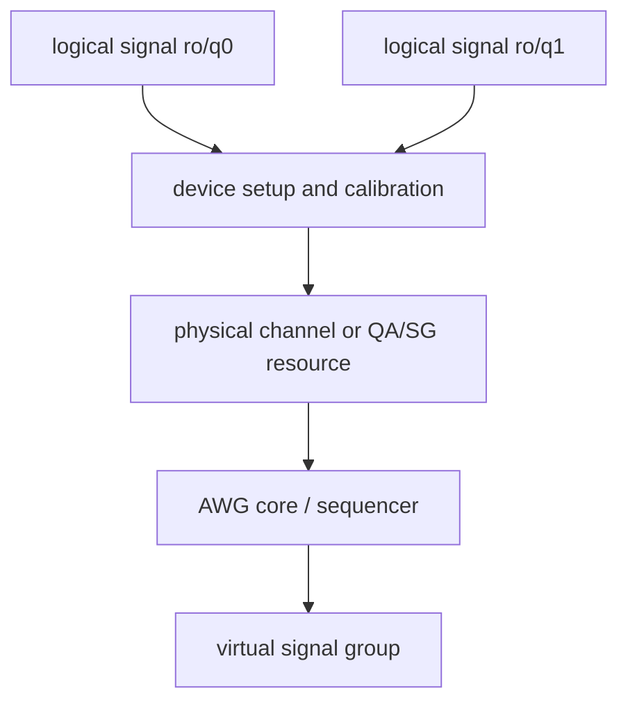

# Backend Resource Mapping

Backend resource mapping is the stage where the compiler relates logical signals to physical hardware resources. The DSL presents logical signals as convenient experimental lanes. The backend must account for instruments, physical ports, AWG cores, channel grouping, oscillator sharing, precompensation constraints, and device-specific capabilities.

The primary source for QCCS backend preprocessing is `src/rust/laboneq-qccs-backend/src/preprocessor.rs`. The code-generator adapter in `src/rust/codegenerator/src/ir_adapter.rs` then imports the backend's mapping information into the code-generation domain.

## Logical and physical concepts

| Concept | Description | Example consequence |
| --- | --- | --- |
| Logical signal | User/setup-level signal identifier. | Two qubit readout signals may be distinct logical lanes. |
| Physical channel | Instrument output/input channel or port. | Logical lanes may share a generator channel or channel pair. |
| AWG core | Sequencer resource that owns a program and waveform memory. | HDAWG output pairs and grouped outputs can be controlled by one sequencer. |
| Device trait | Hardware capability and constraint model. | Oscillator switching, waveform granularity, QA handling, and command-table support differ by device. |
| Signal mapping | Association from logical signal to device, channels, oscillator, and AWG-local metadata. | Code generation can decide which logical pulses must be considered together. |

## Hardware coupling examples

Official documentation makes clear that physical resources are not always one-to-one with logical signals. The HDAWG AWG Sequencer documentation describes channel grouping in groups of 2, 4, or 8 wave outputs, which changes how sequencer tabs and signal generation are organized.[1] LabOne Q calibration documentation notes pair-wise constraints such as HDAWG high-pass precompensation on `rf_signal` lines mapped to the same AWG core and shared local oscillators for SHFSG/SHFQC channel pairs.[2] SHFSG documentation further notes that SHFSG8+ channels can share synthesizer resources by channel pair in RF mode.[3]

These constraints explain why physical lowering cannot be represented as a simple lookup table from logical signal to output. The mapping determines which operations must be inspected together, which oscillator combinations are legal, which waveform grid applies, and which AWG program will eventually contain the event.

## Backend preprocessing responsibilities

The QCCS preprocessor validates setup consistency, derives device and signal metadata, partitions signals into AWG-relevant groupings, and prepares the information later used by code generation. It is also the natural place for rules that depend on device topology rather than user-facing DSL structure.

| Responsibility | Result for later stages |
| --- | --- |
| Device and port validation | Invalid setup/signal combinations are rejected before code generation. |
| AWG core identification | Later passes can fan out the scheduled tree per sequencer resource. |
| Channel and subchannel metadata | Virtual-signal creation can assign physical or multiplexing channel ids. |
| Oscillator and modulation metadata | Playwave lowering can detect unsupported overlapping oscillator usage. |
| Device traits | Waveform interval calculation and code generation can use the right grids and capabilities. |

## Transition to code generation

`src/rust/codegenerator/src/ir_adapter.rs` is the bridge between scheduled experiment data and code-generation resource metadata. It attaches backend-derived physical information to the IR so that later passes can create per-AWG views. Without this metadata, the code generator would see only timed logical operations and would not know which operations share a sequencer, physical output group, oscillator resource, or waveform stream.

## References

[1]: https://docs.zhinst.com/hdawg_user_manual/functional_description/specific/awg.html "Zurich Instruments HDAWG User Manual: AWG Sequencer"
[2]: https://docs.zhinst.com/labone_q_user_manual/core/functionality_and_concepts/02_logical_signals/concepts/02_calibration_properties.html "LabOne Q User Manual: Calibration Properties"
[3]: https://docs.zhinst.com/shfsg_user_manual/functional_description/output.html "Zurich Instruments SHFSG User Manual: Output"
