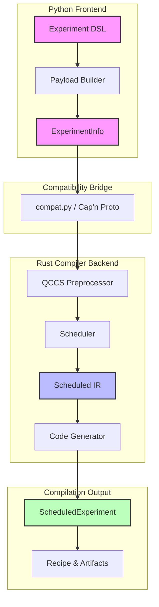
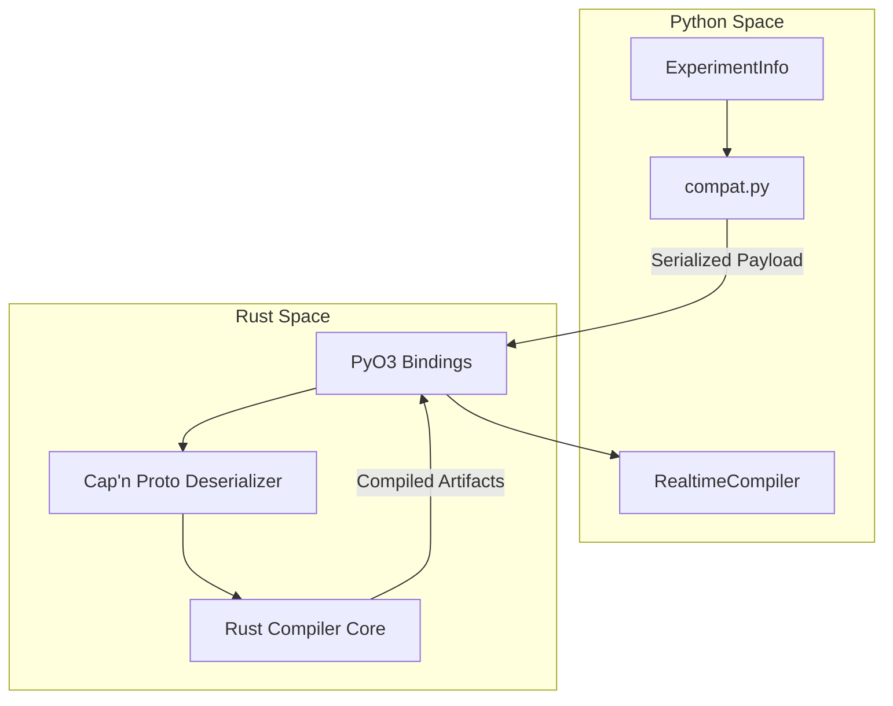

# Compiler workflow overview

This page provides a comprehensive overview of the compiler workflow in the LabOne Q project (`zhinst/laboneq`). It explains the orchestration of experiment compilation from the Python DSL frontend through the Rust-backed real-time compiler, including preprocessing, scheduling, code generation, and the generation of metadata for runtime execution and result handling. The document also clarifies the Python/Rust boundaries, compatibility layers, and the role of the realtime compiler. This overview is intended for developers maintaining or extending the compiler pipeline, offering practical orientation on major components, source boundaries, integration points, and correctness constraints.

---

## Maintainer orientation

This page is structured to guide maintainers through the high-level compilation workflow, starting from the user-facing Python DSL and ending with the compiled artifacts and metadata consumed by the runtime controller. Each section describes a major phase or component in the compiler pipeline, referencing relevant source files and modules. The discussion includes design rationale and the invariants that must be preserved for correctness and compatibility.

The page assumes familiarity with the overall LabOne Q architecture as described in the [README](https://github.com/zhinst/laboneq/blob/main/README.md) and the Python DSL frontend (`src/python/laboneq/dsl/experiment/experiment.py`). For detailed IR semantics and scheduling internals, see the companion pages in this guide.

---

## 1. Introduction to the compiler workflow

The LabOne Q compiler transforms a high-level quantum experiment description, written in the Python DSL, into a fully scheduled, device-specific, real-time executable program. This process involves multiple stages:





- **Preprocessing and payload building**: The Python DSL experiment and device setup are lowered into an intermediate `ExperimentInfo` structure.
- **Python/Rust boundary crossing**: The `ExperimentInfo` is converted into a Rust-backed experiment representation via a compatibility bridge.
- **Scheduling**: The Rust scheduler computes timing, resolves loops and conditions, and produces a timed intermediate representation (IR).
- **Code generation**: Device-specific code generators produce source code, waveforms, and command tables for the hardware.
- **Recipe and metadata generation**: The compiler produces a `ScheduledExperiment` object bundling the compiled recipe, artifacts, and result-shape metadata for runtime consumption.

This pipeline is orchestrated primarily in Python, leveraging Rust extensions for performance-critical compilation and scheduling tasks.

---

## 2. Entry point: `compile_experiment`

The main entry point for compilation is the function `compile_experiment` located in [`src/python/laboneq/core/utilities/compile_experiment.py`](https://github.com/zhinst/laboneq/blob/main/src/python/laboneq/core/utilities/compile_experiment.py) and orchestrated further in [`src/python/laboneq/compiler/workflow/compiler.py`](https://github.com/zhinst/laboneq/blob/main/src/python/laboneq/compiler/workflow/compiler.py).

### Purpose

`compile_experiment` accepts a fully constructed Python DSL `Experiment` object along with device setup and calibration information. It performs validation, builds the compilation payload, and triggers the compilation pipeline to produce a `ScheduledExperiment`.

### Component summary here

- Validation of experiment and setup consistency.
- Construction of `ExperimentInfo` via `ExperimentInfoBuilder` ([source](https://github.com/zhinst/laboneq/blob/main/src/python/laboneq/implementation/payload_builder/experiment_info_builder/experiment_info_builder.py)).
- Invocation of the compiler workflow (`Compiler.run()`).
- Handling of chunking for large parameter sweeps.
- Management of compiler settings and device-class resolution.

### Design rationale

This function provides a stable, user-facing API to compile experiments, abstracting away the complexity of the underlying Rust compiler and scheduler. It ensures that the experiment is valid and that the device setup is consistent before compilation.

### Source references

- Python: `src/python/laboneq/core/utilities/compile_experiment.py`
- Compiler orchestration: `src/python/laboneq/compiler/workflow/compiler.py`

### Integration points

- The LabOne Q session and controller layers invoke this function to compile experiments before execution.
- Application-level experiment libraries and user scripts call this function to prepare experiments.

### Invariants

- The experiment must have a valid device setup fingerprint.
- Only one real-time acquisition loop is allowed.
- Near-time and real-time sections are properly nested.
- Chunking parameters are consistent with sweep lengths.

---

## 3. Python/Rust boundary and compatibility bridge

The LabOne Q compiler uses Rust extensions for performance and safety. The Python/Rust boundary is bridged by a compatibility layer that converts Python data structures into Rust IR and back.





### Compatibility bridge: `build_rs_experiment`

Located in [`src/python/laboneq/compiler/workflow/compat.py`](https://github.com/zhinst/laboneq/blob/main/src/python/laboneq/compiler/workflow/compat.py), this module provides functions to convert the Python `ExperimentInfo` and device setup into a Rust `Experiment` object.

#### Component summary here

- Builders for Rust `DeviceSetupBuilder` and `Experiment`.
- Conversion of Python calibration and setup fields into Rust equivalents.
- Serialization of the experiment and setup into Cap'n Proto format.
- Invocation of Rust extension functions such as `build_experiment_capnp()`.

### Design rationale

Rust code requires strongly typed, ownership-safe data structures. The compatibility bridge ensures that Python objects are normalized, defaulted, and converted into Rust-native types, preserving calibration, device setup, and experiment semantics.

### Source references

- Python compatibility bridge: `src/python/laboneq/compiler/workflow/compat.py`
- Rust compiler Python bridge: `src/rust/laboneq-compiler-py/src/lib.rs`

#### Integration points

- The Python compiler workflow calls this bridge to hand off the experiment to Rust.
- Rust code uses the deserialized Cap'n Proto data to build the internal IR.

#### Invariants

- Calibration and setup fields must be complete and consistent.
- Device options are normalized with defaults.
- Parameter references are interned for efficient Rust usage.

---

## 4. Preprocessing and scheduling in Rust

Once the experiment is converted into Rust IR, the compiler backend performs preprocessing and scheduling.

### Preprocessing: QCCS backend

The QCCS backend preprocessing is implemented in [`src/rust/laboneq-qccs-backend/src/preprocessor.rs`](https://github.com/zhinst/laboneq/blob/main/src/rust/laboneq-qccs-backend/src/preprocessor.rs).

#### Responsibilities

- Validate supported device combinations (e.g., HDAWG, UHFQA, SHF signals).
- Inject synthetic signals for system triggers when needed.
- Compute lead delays and assign stable AWG keys.
- Apply SHFQC reassignment and splitting rules.
- Prepare backend-specific metadata for scheduling.

### Scheduling

The scheduler is implemented in [`src/rust/laboneq-scheduler/src/scheduler.rs`](https://github.com/zhinst/laboneq/blob/main/src/rust/laboneq-scheduler/src/scheduler.rs).

#### Responsibilities

- Validate sampling-rate commensurability across signals.
- Enforce timing constraints and reject invalid real-time sections.
- Clone and isolate the real-time subtree.
- Resolve near-time match/case constructs.
- Apply chunking for large parameter sweeps.
- Determine acquisition types and repetition modes.
- Lower the DSL tree into scheduled IR nodes.
- Perform loop unrolling and parameter resolution.
- Calculate precise timing offsets and durations.
- Validate the final IR.

### Lowering semantics

Lowering from scheduled nodes to timed IR nodes is handled in [`src/rust/laboneq-scheduler/src/lower_experiment/mod.rs`](https://github.com/zhinst/laboneq/blob/main/src/rust/laboneq-scheduler/src/lower_experiment/mod.rs).

- Structural nodes (sections, loops) become `IrKind` variants.
- Signal-level operations (play, acquire, delay) become timed leaf nodes.
- Special handling for precompensation, oscillator resets, and PRNG setup.
- Grid alignment uses least-common-multiple escalation for timing consistency.

### Component summary here

- Rust IR crate (`laboneq-ir`) defining `IrNode` and `IrKind` ([source](https://github.com/zhinst/laboneq/blob/main/src/rust/laboneq-ir/src/lib.rs)).
- Scheduler crate (`laboneq-scheduler`) implementing passes and lowering.
- Backend-specific preprocessing for QCCS devices.

### Design rationale

Scheduling is a complex, timing-critical process that benefits from Rust's performance and safety guarantees. The scheduler ensures that the compiled experiment respects hardware constraints and timing requirements.

### Source references

- Rust IR: `src/rust/laboneq-ir/`
- Scheduler: `src/rust/laboneq-scheduler/`
- QCCS backend: `src/rust/laboneq-qccs-backend/`

### Integration points

- The Rust compiler bridge invokes the scheduler after preprocessing.
- The code generator consumes the scheduled IR.

### Invariants

- Timing grids and offsets are consistent and precise.
- Only valid device combinations are accepted.
- The IR is fully lowered and validated before code generation.

---

## 5. Python realtime compiler orchestration

The Python `RealtimeCompiler` class in [`src/python/laboneq/compiler/workflow/realtime_compiler.py`](https://github.com/zhinst/laboneq/blob/main/src/python/laboneq/compiler/workflow/realtime_compiler.py) orchestrates the scheduling and code generation phases.

### Responsibilities

- Select device-specific compiler hooks and code generator classes.
- Call the Python `Scheduler` wrapper, which invokes Rust scheduling.
- Manage chunking and parameter usage reporting.
- Prepare pulse-sheet schedules for visualization.
- Package the final compilation output into `ScheduledExperiment`.

### Scheduler wrapper

The Python scheduler wrapper in [`src/python/laboneq/compiler/scheduler/scheduler.py`](https://github.com/zhinst/laboneq/blob/main/src/python/laboneq/compiler/scheduler/scheduler.py) calls the Rust scheduling function `schedule_experiment()`, passing the Rust experiment IR and near-time parameters.

### Component summary here

- Python `RealtimeCompiler` class wrapping Rust scheduling and code generation.
- Scheduler wrapper that manages parameter dictionaries and chunking.
- Pulse sheet schedule preparation for the pulse sheet viewer.

### Design rationale

The Python realtime compiler provides a convenient interface for the rest of the Python codebase to invoke the Rust compiler backend, abstracting away details of parameter handling and chunking.

### Source references

- Python realtime compiler: `src/python/laboneq/compiler/workflow/realtime_compiler.py`
- Scheduler wrapper: `src/python/laboneq/compiler/scheduler/scheduler.py`

### Integration points

- The main compiler workflow calls `RealtimeCompiler` to perform compilation.
- The controller uses the compiled output for runtime execution.

### Invariants

- Near-time parameters are correctly separated from chunking info.
- Scheduler-reported used parameters are marked for runtime bookkeeping.
- Pulse sheet schedules are consistent with compiled IR.

---

## 6. Code generation

After scheduling, the compiler generates device-specific code and artifacts.

### Code generator interface

The Python code generator interface is defined in [`src/python/laboneq/compiler/common/iface_code_generator.py`](https://github.com/zhinst/laboneq/blob/main/src/python/laboneq/compiler/common/iface_code_generator.py).

### SeqC code generator

The SeqC code generator, used for QCCS devices, is implemented in [`src/python/laboneq/compiler/seqc/code_generator.py`](https://github.com/zhinst/laboneq/blob/main/src/python/laboneq/compiler/seqc/code_generator.py).

- Calls Rust code generator exposed via PyO3 (`laboneq._rust.codegenerator.generate_code()`).
- Converts Rust output into Python data structures for linking and recipe generation.
- Produces SeqC source code, ELF binaries, waveform pools, command tables, integration weights, and pulse maps.
- Handles device-specific waveform naming and scaling (e.g., SHFQA complex samples scaled to <1.0 magnitude).

### Component summary here

- Python wrapper classes for code generation.
- Rust code generator extension (`src/rust/codegenerator/`).
- Data structures for waveforms, command tables, and integration kernels.

### Design rationale

Code generation translates the scheduled IR into executable programs tailored to each device's hardware capabilities and constraints.

### Source references

- Python code generator wrapper: `src/python/laboneq/compiler/seqc/code_generator.py`
- Rust code generator crate: `src/rust/codegenerator/`

### Integration points

- The realtime compiler calls the code generator after scheduling.
- The controller consumes generated artifacts for device upload and execution.

### Invariants

- Generated code matches the scheduled IR timing and semantics.
- Waveform and integration weights conform to device requirements.
- Pulse maps and command tables maintain provenance for runtime replacement.

---

## 7. Recipe and result-shape metadata generation

The final compilation output is packaged into a `ScheduledExperiment` object, defined in [`src/python/laboneq/data/scheduled_experiment.py`](https://github.com/zhinst/laboneq/blob/main/src/python/laboneq/data/scheduled_experiment.py).

### Contents of `ScheduledExperiment`

- Setup fingerprint for runtime validation.
- `Recipe` object describing the compiled experiment steps.
- Backend-specific artifacts (waveforms, command tables, etc.).
- Optional pulse-sheet schedule for visualization.
- Near-time execution tree for software control loops.
- Real-time loop properties and timing metadata.
- Result-shape metadata describing acquisition handles, axes, chunking, and mappings.

### Recipe processing

The `recipe_processor.pre_process_compiled()` function in [`src/python/laboneq/controller/recipe_processor.py`](https://github.com/zhinst/laboneq/blob/main/src/python/laboneq/controller/recipe_processor.py) repackages the `ScheduledExperiment` into `RecipeData` for runtime use.

- Validates the scheduled experiment against device capabilities.
- Computes AWG configurations and device-specific recipe settings.
- Constructs an `AttributeValueTracker` for oscillator frequencies and device attributes.
- Estimates execution and result-transfer wait times.
- Provides helpers for waveform and command-table preparation.

### Component summary here

- Data classes for compiled experiment representation.
- Metadata for result shapes and acquisition handles.
- Recipe processing utilities for runtime preparation.

### Design rationale

This metadata enables the runtime controller to execute the compiled experiment correctly, manage device configurations, and interpret measurement results.

### Source references

- `ScheduledExperiment`: `src/python/laboneq/data/scheduled_experiment.py`
- Recipe processor: `src/python/laboneq/controller/recipe_processor.py`

### Integration points

- The controller uses this data to orchestrate experiment execution.
- Result builders and acquisition handlers use result-shape metadata.

### Invariants

- Setup fingerprint matches the connected hardware.
- Recipe and artifacts are consistent and complete.
- Result metadata accurately reflects acquisition timing and chunking.

---

## 8. Summary pipeline diagram

The following Mermaid diagram summarizes the compiler workflow pipeline, illustrating the major components and data flows between Python and Rust layers.

```mermaid
flowchart TD
    subgraph Python DSL Frontend
        DSL[Python DSL Experiment]
        ExpInfoBuilder[ExperimentInfoBuilder]
    end

    subgraph Python Compiler Workflow
        Compiler[Compiler.run()]
        CompatBridge[Compatibility Bridge (build_rs_experiment)]
        RealtimeCompiler[RealtimeCompiler]
        SchedulerWrapper[Scheduler Wrapper]
        CodeGenWrapper[Code Generator Wrapper]
        RecipeProcessor[Recipe Processor]
    end

    subgraph Rust Compiler Backend
        RustExp[Rust Experiment IR]
        Preprocessor[QCCS Backend Preprocessor]
        Scheduler[Scheduler & Lowering]
        CodeGenerator[Code Generator]
    end

    subgraph Runtime Controller
        ScheduledExp[ScheduledExperiment]
        RecipeData[RecipeData]
    end

    DSL --> ExpInfoBuilder
    ExpInfoBuilder --> Compiler
    Compiler --> CompatBridge
    CompatBridge --> RustExp
    RustExp --> Preprocessor
    Preprocessor --> Scheduler
    Scheduler --> RealtimeCompiler
    RealtimeCompiler --> SchedulerWrapper
    SchedulerWrapper --> Scheduler
    Scheduler --> CodeGenerator
    CodeGenerator --> CodeGenWrapper
    CodeGenWrapper --> RecipeProcessor
    RecipeProcessor --> ScheduledExp
    ScheduledExp --> RecipeData
    RecipeData --> Runtime Controller
```

---

## 9. Practical developer orientation

| Component | Location | Purpose | Consumers | Key Invariants |
|-----------|----------|---------|-----------|----------------|
| Python DSL Experiment | `src/python/laboneq/dsl/experiment/experiment.py` | User-facing experiment description | Payload builder, users | Valid DSL tree, proper nesting |
| ExperimentInfoBuilder | `src/python/laboneq/implementation/payload_builder/experiment_info_builder/experiment_info_builder.py` | Lower DSL + setup to `ExperimentInfo` | Compiler workflow | Consistent signal mapping, calibration merging |
| Compiler Workflow | `src/python/laboneq/compiler/workflow/compiler.py` | Orchestrate compilation | Session, controller | Valid chunking, device class resolution |
| Compatibility Bridge | `src/python/laboneq/compiler/workflow/compat.py` | Convert Python to Rust IR | Rust compiler | Complete calibration, normalized options |
| Rust IR | `src/rust/laboneq-ir/` | Timed IR tree | Scheduler, code generator | Precise timing, ownership safety |
| QCCS Backend Preprocessor | `src/rust/laboneq-qccs-backend/` | Device-specific setup processing | Scheduler | Valid device combos, stable AWG keys |
| Scheduler | `src/rust/laboneq-scheduler/` | Timing, loop unrolling, validation | Code generator | Timing grids, parameter resolution |
| Python Realtime Compiler | `src/python/laboneq/compiler/workflow/realtime_compiler.py` | Wrap Rust scheduling and codegen | Compiler workflow | Parameter bookkeeping, chunking |
| Code Generator | `src/python/laboneq/compiler/seqc/code_generator.py` | Generate device code/artifacts | Controller | Device compliance, waveform scaling |
| ScheduledExperiment | `src/python/laboneq/data/scheduled_experiment.py` | Compiled experiment package | Controller | Setup fingerprint, result metadata |
| Recipe Processor | `src/python/laboneq/controller/recipe_processor.py` | Prepare runtime recipe data | Controller | Device validation, AWG config |

---

## 10. Conclusion

The LabOne Q compiler workflow is a carefully layered pipeline bridging a high-level Python DSL and low-level device-specific code. It leverages Rust for performance-critical scheduling and IR management, while Python orchestrates the overall process and integrates with runtime components. Understanding this workflow is essential for maintainers who extend device support, improve scheduling algorithms, or enhance runtime execution.

---

## References used on this page

1. LabOne Q repository, README: https://github.com/zhinst/laboneq/blob/main/README.md  
2. Python DSL Experiment: https://github.com/zhinst/laboneq/blob/main/src/python/laboneq/dsl/experiment/experiment.py  
3. ExperimentInfoBuilder: https://github.com/zhinst/laboneq/blob/main/src/python/laboneq/implementation/payload_builder/experiment_info_builder/experiment_info_builder.py  
4. Compiler workflow: https://github.com/zhinst/laboneq/blob/main/src/python/laboneq/compiler/workflow/compiler.py  
5. Compiler compatibility bridge: https://github.com/zhinst/laboneq/blob/main/src/python/laboneq/compiler/workflow/compat.py  
6. Realtime compiler: https://github.com/zhinst/laboneq/blob/main/src/python/laboneq/compiler/workflow/realtime_compiler.py  
7. Python scheduler wrapper: https://github.com/zhinst/laboneq/blob/main/src/python/laboneq/compiler/scheduler/scheduler.py  
8. Python code generator wrapper: https://github.com/zhinst/laboneq/blob/main/src/python/laboneq/compiler/seqc/code_generator.py  
9. ScheduledExperiment model: https://github.com/zhinst/laboneq/blob/main/src/python/laboneq/data/scheduled_experiment.py  
10. Recipe processor: https://github.com/zhinst/laboneq/blob/main/src/python/laboneq/controller/recipe_processor.py  
11. Rust compiler Python bridge: https://github.com/zhinst/laboneq/blob/main/src/rust/laboneq-compiler-py/src/lib.rs  
12. Rust IR crate: https://github.com/zhinst/laboneq/blob/main/src/rust/laboneq-ir/src/lib.rs  
13. Rust scheduler: https://github.com/zhinst/laboneq/blob/main/src/rust/laboneq-scheduler/src/scheduler.rs  
14. Rust lowering pass: https://github.com/zhinst/laboneq/blob/main/src/rust/laboneq-scheduler/src/lower_experiment/mod.rs  
15. Rust QCCS backend preprocessor: https://github.com/zhinst/laboneq/blob/main/src/rust/laboneq-qccs-backend/src/preprocessor.rs  
16. Rust code generator crate: https://github.com/zhinst/laboneq/blob/main/src/rust/codegenerator/  
17. LabOne Q Core manual: https://docs.zhinst.com/labone_q_user_manual/core/index.html
