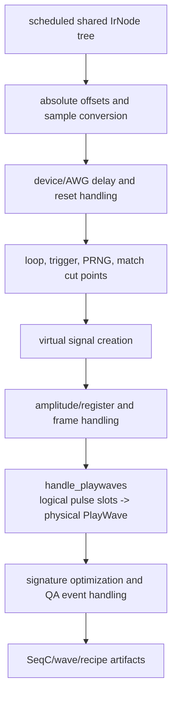
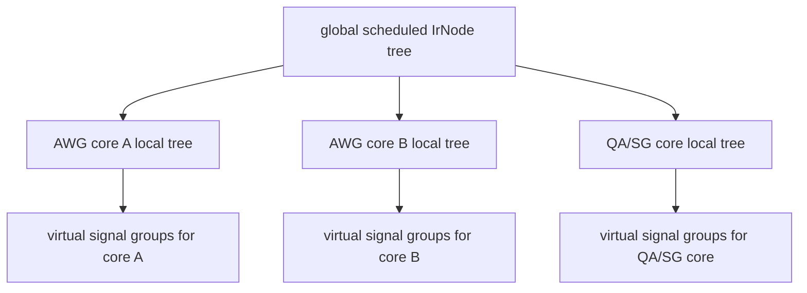
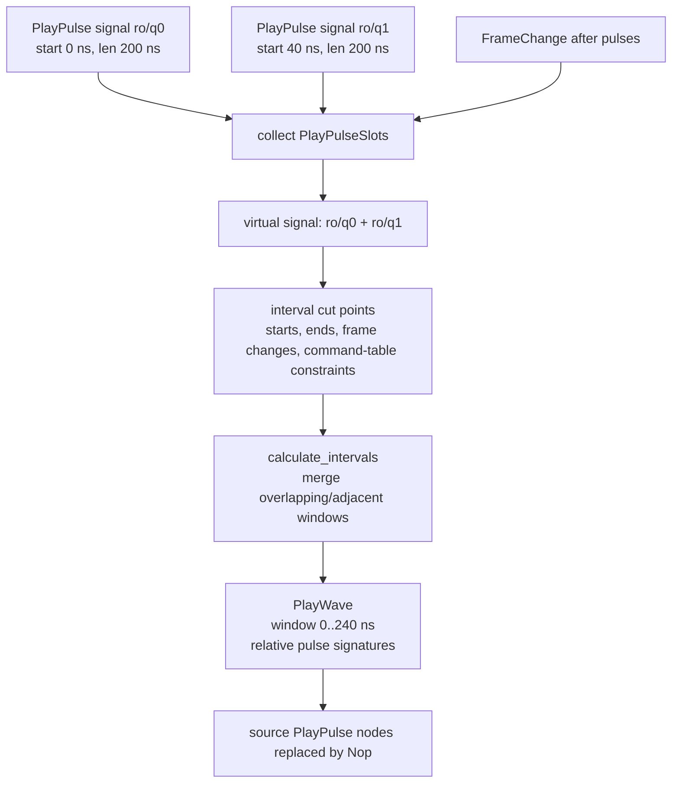

# AWG-Local Lowering and Multiplexed Waveform Construction

This chapter describes the lowering stage that was easy to miss in the earlier version of the guide: the transformation from scheduled logical pulse operations to AWG-local physical waveform events. It is implemented primarily in the Rust code generator, especially `src/rust/codegenerator/src/passes/fanout_awg.rs`, `src/rust/codegenerator/src/virtual_signal.rs`, `src/rust/codegenerator/src/generate_awg_events.rs`, and `src/rust/codegenerator/src/passes/handle_playwaves.rs`.

The key point is that this stage is **not scheduling** in the strict LabOne Q sense. Scheduling has already produced legal global timing. AWG-local lowering asks a different question: for one sequencer/AWG resource, which logical signal operations must be merged into physical waveform commands, and where are the waveform interval boundaries?

## Pass order after scheduling

`generate_awg_events.rs` shows that code generation performs a sequence of transformations after receiving a scheduled IR. The exact pass list evolves, but the semantic order is stable: establish absolute/sample timing, apply device and AWG delays, handle acquisitions and resets, introduce cut points, create virtual signals, rewrite frame and match constructs, allocate resources, lower playwaves, optimize signatures, and handle QA events.

## Fanout to AWG-local trees

`fanout_awg.rs` partitions the scheduled/codegen IR by AWG core. The result is no longer a single global experiment tree in the same sense. Each AWG-local tree contains the structural constructs and operations relevant to one sequencer resource. This fanout is what makes later physical waveform lowering tractable: interval overlap and waveform compaction can be performed in the scope that actually shares waveform memory and sequencer commands.

## Virtual signals

`virtual_signal.rs` defines the code-generator concept that captures logical-signal multiplexing. A `VirtualSignal` is an AWG-local grouping of output logical signals that must be handled together for a physical waveform/event stream. It records the logical signals, a per-signal channel id inside the merged waveform signature, and optional SHFQA subchannel metadata.

A virtual signal is multiplexed when more than one logical signal belongs to the physical grouping. For HDAWG `DOUBLE` and `SINGLE` AWG kinds, channel ids are derived from actual output channels, reflecting the shared sequencer/output-pair model. For multiplexed IQ/RF cases, channel ids are assigned by the order of signals within the group. For SHFQA, subchannel information is preserved explicitly.

| Case | Why signals are grouped | Effect in code generation |
| --- | --- | --- |
| Multiplexed readout | Several logical readout tones share a QA/readout waveform resource. | Pulse signatures carry per-channel or subchannel metadata inside merged waveform intervals. |
| IQ/RF logical subcarriers | Multiple logical drives may share one physical IQ waveform stream with different modulation. | Pulse slots are analyzed together and oscillator compatibility is validated. |
| HDAWG output pair | One sequencer may control a pair or group of outputs depending on grouping mode. | Per-output logical operations can become one AWG-local program and coordinated waveform stream. |
| Device oscillator sharing | Physical channel pairs can share oscillator/synthesizer resources. | Overlapping oscillator usage may be accepted, switched, or rejected depending on device traits. |

## Playwave handling

`handle_playwaves.rs` performs the semantic lowering from logical pulse slots to physical `PlayWave` nodes. The pass first traverses the AWG-local IR and collects `PlayPulse` and `FrameChange` nodes into `PlayPulseSlot` records. It groups slots by logical signal and then processes them by virtual signal, so all logical signals sharing the relevant physical resource are considered together.

The pass includes several important substeps. `assign_pulse_slots()` traverses the AWG-local IR and records pulse slots, including match/case state. `create_waveform_slots()` filters slots for the current virtual signal and builds absolute pulse intervals. `analyze_oscillator_switches()` checks oscillator switching and rejects overlapping hardware-oscillator combinations that the device cannot represent. `interval_calculator::calculate_intervals()` receives pulse intervals, cut points, command-table intervals, sample-grid constraints, minimum waveform constraints, waveform-size hints, and device traits. Its output is a set of compacted waveform intervals.

| Source-level step | Function or type | Semantic effect |
| --- | --- | --- |
| Collect logical pulse leaves | `assign_pulse_slots()` and `PlayPulseSlot` | Traverses the AWG-local tree and records each `PlayPulse` or `FrameChange` with node access, signal metadata, and optional match/case state. |
| Group by logical signal | `plays_by_signal: HashMap<SignalUid, Vec<_>>` inside `handle_plays()` | Preserves the original logical-lane identity before virtual-signal grouping is applied. |
| Group by physical waveform stream | `for signal in virtual_signals.iter()` | Reassembles the pulse slots for all logical signals that share one AWG-local virtual signal. |
| Convert pulses to interval candidates | `create_waveform_slots()` and `WaveformSlot` | Produces absolute start/end intervals and pulse signatures for the current virtual signal. |
| Validate oscillator switching | `analyze_oscillator_switches()` and `find_hw_oscillator()` | Detects unsupported overlapping hardware-oscillator usage and optionally adds cut points for legal switching boundaries. |
| Compact intervals | `interval_calculator::calculate_intervals()` | Merges overlapping or adjacent waveform windows while respecting sample grids, command-table ranges, device minimum waveform length, and waveform-size hints. |
| Emit physical waveform operations | `WaveformSignature::Pulses` and `ir::NodeKind::PlayWave` | Creates one sequencer-level play-wave node containing all relative pulse signatures for the compacted physical interval. |
| Retire source logical operations | `ir::NodeKind::Nop { length: 0 }` | Replaces merged source `PlayPulse` nodes so the sequencer program executes the physical `PlayWave`, not duplicate logical leaves. |

Each compacted interval becomes a `PlayWave` node. The `PlayWave` carries a `WaveformSignature::Pulses` value. That signature contains individual pulse signatures with relative starts, lengths, pulse definitions, amplitude and phase information, oscillator frequency/phase, phase-increment data, channel or subchannel metadata, markers, and amplitude-register allocation. Once the physical `PlayWave` exists, the original logical `PlayPulse` nodes are replaced with `Nop` because the sequencer should execute the merged waveform event, not the independent logical pulses.

## Device-specific grouping consequences

HDAWG, SHFSG, and SHFQC do not expose identical physical grouping behavior. For an HDAWG, the decisive fact is that sequencer ownership can be tied to output pairs or larger channel groups; logical output lanes in such a group must be represented in one AWG-local program when the grouping mode requires it. For SHFSG and SHFQC signal-generator resources, logical IQ/RF signals may share a physical IQ waveform stream while using oscillator, modulation, or subchannel metadata to distinguish their experimental roles. For SHFQA-style readout, multiple logical readout tones can share the measurement/readout resource and appear as subchannels or multiplexed pulse signatures rather than as independent waveform programs.

The lowering code therefore treats multiplexing as a property of the AWG-local virtual signal, not as a property of the user's section tree. A section can remain logically clean and readable while the backend and code generator later introduce the physical coupling required by the target device.

## Interval compaction example

Suppose two logical readout pulses share one physical resource. Pulse A starts at sample 0 and lasts 128 samples. Pulse B starts at sample 32 and lasts 128 samples. The scheduler has already decided both are legal at those offsets. The playwave-lowering pass sees them in the same virtual signal group, computes interval cut points at 0, 32, 128, and 160 plus any additional frame-change or command-table cut points, and can emit a compacted physical waveform interval covering 0 through 160 samples. The waveform signature records that pulse A starts at relative offset 0 and pulse B starts at relative offset 32. The physical waveform generator receives one coherent waveform/event window rather than two independent logical instructions.

That is the missing lowering: **logical overlap is converted into physical waveform composition inside an AWG-local virtual-signal group**.

## Failure modes in this stage

Errors in this stage usually involve physical compatibility, not schedule legality. Examples include unsupported mixtures of software-modulated and hardware-modulated signals on one multiplexed resource, multiple overlapping hardware oscillators on a device that cannot switch them in the required way, waveform intervals that violate grid or minimum-size constraints, and HDAWG output grouping assumptions that conflict with signal mapping.

When debugging such errors, start with the virtual-signal grouping and the AWG kind. Then inspect the collected pulse slots, oscillator metadata, interval cut points, and generated waveform signatures. A successful global schedule only proves the experiment has a consistent time layout; it does not prove every logical pulse can be lowered onto the same physical waveform resource.
