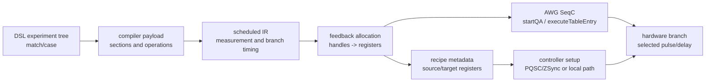
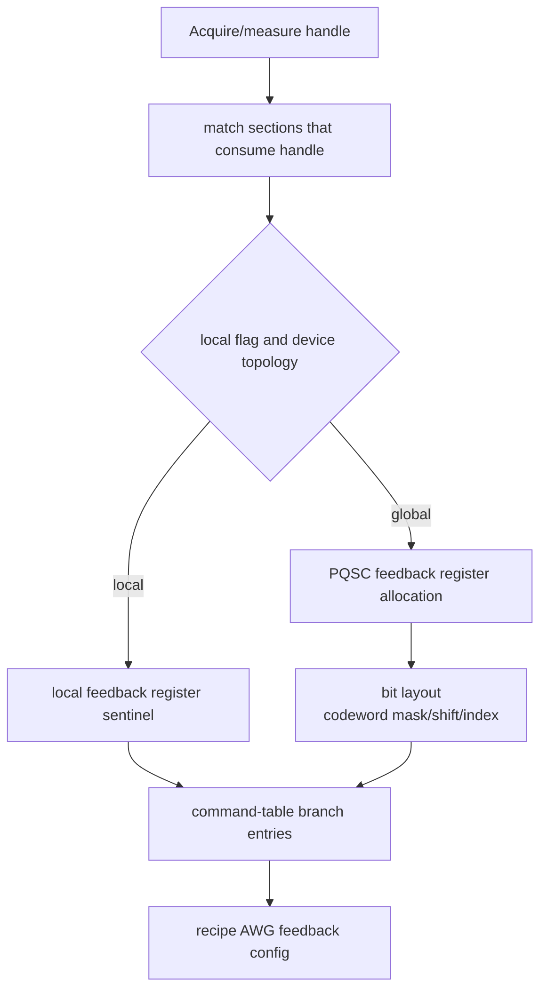
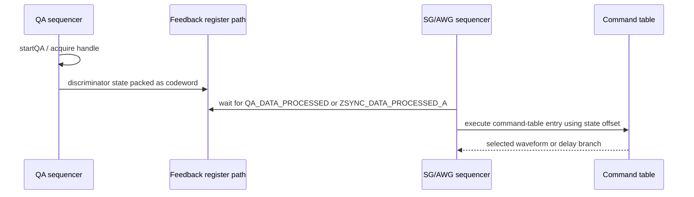
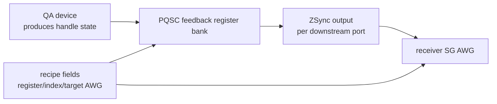

# Feedback representation and hardware lowering

Feedback is the part of the compilation pipeline where LabOne Q deliberately stops treating a program as a static pulse schedule. A measurement result becomes a **codeword**, the codeword is transported through a local or system-level feedback path, and a later `match/case` branch selects a pulse or delay without returning to Python. This chapter connects the user-facing `match` abstraction to the code generator, recipe metadata, and controller-side device configuration.

The chapter belongs between [Backend resource mapping](06-backend-resource-mapping.md) and [AWG-local lowering and multiplexing](07-awg-local-lowering.md). Feedback routing needs physical resource identity, device type, and AWG ownership from backend preprocessing, but the final branch implementation is emitted as AWG-local SeqC, command-table, and recipe configuration artifacts.



## Program representation

At the DSL layer, feedback branching is represented by a `Match` section containing `Case` children. The `Match` section can branch on a measurement `handle`, a `user_register`, a `prng_sample`, or a sweep parameter. For measurement-handle feedback, the `local` flag expresses the desired transport path: `True` means SHFQC-internal feedback, `False` means PQSC/ZSync feedback, and `None` leaves the decision to later compiler and setup logic. The `Case` section carries the integer `state` that the branch matches and, for feedback cases other than sweep-parameter matches, is restricted to pulse and delay content.

```python
with exp.acquire_loop_rt(count=1024):
    with exp.section(uid="measure"):
        exp.measure(
            measure_signal="q0/measure",
            acquire_signal="q0/acquire",
            handle="q0_state",
        )

    with exp.match(uid="conditional_reset", handle="q0_state", local=True):
        with exp.case(uid="already_ground", state=0):
            exp.delay(signal="q0/drive", time=64e-9)
        with exp.case(uid="excited", state=1):
            exp.play(signal="q0/drive", pulse=x180)
```

| Branch source | Representation | Typical purpose | Hardware implications |
| --- | --- | --- | --- |
| Measurement handle | `Match(handle=..., local=...)` | Discrimination feedback, active reset, conditional gates. | Requires feedback-register allocation and either local SHFQC or global PQSC/ZSync transport. |
| User register | `Match(user_register=...)` | Branching on a sequencer-side value written by generated code. | Lowered through sequencer register tests rather than measurement-handle routing. |
| PRNG sample | `Match(prng_sample=...)` | Randomized benchmarking or stochastic branch selection. | Uses PRNG state already available in sequencer logic. |
| Sweep parameter | `Match(sweep_parameter=...)` | Compile-time or parameterized branching. | Treated differently from measurement feedback and can contain broader section structure. |

The important distinction is that `match/case` remains a **program construct** until scheduling and code generation know the timing and target AWG. The DSL does not expose feedback-register indices, ZSync ports, command-table offsets, or recipe bit masks. Those are derived after signal mapping and AWG fanout.

## Compiler strategy

Handle-based feedback lowering has three related tasks. First, the compiler must recognize which acquisition handle feeds a later `match`. Second, it must decide whether the consuming branch is local to an SHFQC-style QA/SG pairing or needs system-level feedback through a leader device. Third, it must allocate the feedback-register layout and branch code in a way that every receiver AWG can select the correct state.



The Rust code generator performs the central feedback allocation. `handle_feedback_registers.rs` builds the mapping from match handles to local or global feedback registers, assigns global handles to PQSC feedback-register indices, and constructs a layout describing where each handle's discriminated state is packed. The per-AWG generator then passes this allocation into sampled-event handling so SeqC emission can connect the right branch site to the right feedback source.

The generated feedback configuration is asymmetric. The **source** side is the QA/acquisition side that produces the state. The **target** side is the SG/AWG side that consumes the state. A local SHFQC path can use the sentinel value that later becomes `"local"` in the recipe, while a global path needs a concrete feedback-register id and a selected index inside the register bank.

## Hardware strategies and target instruments

LabOne Q's current implementation contains several feedback-relevant hardware paths. The code path for modern handle feedback is clearest for SHF devices and PQSC/ZSync topologies; HDAWG/UHFQA support appears as the older DIO/codeword/QCCS configuration path and should be treated separately from the SHF feedback-register route when debugging.

| Strategy | Producer | Receiver | Transport and controller setup | Current caveats |
| --- | --- | --- | --- | --- |
| Local SHFQC feedback | SHFQC QA | SHFQC SG channel on the same instrument | The recipe uses `source_feedback_register = "local"`; the SG branch waits on locally processed QA data. | Local and global feedback paths cannot be mixed within the same generated feedback context. |
| Global PQSC/ZSync feedback | SHFQA or SHFQC QA participating in a QCCS setup | SHFSG or SHFQC SG channel reached through ZSync | The leader device enables the downstream ZSync output register bank and selects a source feedback register and index for each target AWG. Receiver SG channels switch their AWG trigger source to ZSync. | Controller processing currently raises an exception for global feedback over QHub, so QHub should not be documented as an implemented global-feedback route. |
| HDAWG/UHFQA codeword context | UHFQA in legacy desktop/QCCS arrangements | HDAWG sequencer | HDAWG configuration selects DIO/QCCS or DIO codeword modes, including mandatory `DIO_CODEWORD` for HDAWG+UHFQA desktop systems. | This is not the same register-bank lowering path as SHF handle feedback; use device-specific documentation and generated artifacts to distinguish the two. |
| User-register and PRNG matches | Sequencer-local values | Same sequencer program | Lowered as sequencer-side branching rather than routed measurement feedback. | These constructs share `match/case` syntax but do not allocate measurement feedback registers. |

The placement decision is therefore not just a matter of signal names. A measurement may produce the codeword on one device, while the conditional pulse may be emitted by a different AWG. The compiler and controller cooperate to **place** the state in a feedback register and **route** it to the AWG that owns the conditional branch.

## Emitted code and artifacts

Feedback lowering produces several artifacts rather than a single instruction. On the acquisition side, sampled-event handling emits feedback-processing configuration around the QA operation. On the branch side, it emits command-table entries for the case states and an `executeTableEntry`-style operation that waits for processed data. The generated call distinguishes local and global data sources: local branches use the QA processed-data source, whereas global branches wait on the ZSync processed-data source.



The command-table branch is built from the `case` states. The sampled-event handler checks that the states cover the required command-table entries, reuses an existing command-table offset when the same state set and waveforms are encountered, or allocates a new offset and records it in the feedback configuration. It also accounts for the fixed `executeTableEntry` latency that was added during match scheduling, so the emitted branch instruction lines up with the scheduled `match` start.

| Artifact | Key fields or code shape | Role in feedback execution |
| --- | --- | --- |
| SeqC QA code | `startQA` plus feedback-processing setup. | Starts acquisition and prepares the discriminated result for feedback transport. |
| SeqC SG/AWG code | Command-table execution keyed by `QA_DATA_PROCESSED` or `ZSYNC_DATA_PROCESSED_A`. | Waits for the correct processed-data event and selects the case branch. |
| Command table | Entries at `command_table_match_offset + state`. | Encodes the pulse or waveform selected by each `case` state. |
| Recipe AWG fields | `source_feedback_register`, `target_feedback_register`, `codeword_bitmask`, `codeword_bitshift`, `feedback_register_index_select`, `command_table_match_offset`. | Carries compiler choices into controller configuration. |
| Controller `AwgConfig` | `fb_reg_source_index`, `fb_reg_target_index`, register selector mask and shift. | Translates recipe metadata into concrete node writes for feedback routing. |

The Python recipe generator serializes the code-generator feedback configuration into each AWG initialization record. A global register id remains numeric; the local sentinel becomes the string `"local"`. The controller then copies these fields into per-device `AwgConfig` objects and marks the device as having feedback when any AWG has a feedback source.

## Feedback placement and routing

Global feedback routing is completed during device configuration, not during static code generation. The controller uses the recipe's source feedback register, selected source index, and target AWG index to program the leader device's ZSync output register-bank selectors. For each downstream receiver, it enables the ZSync output, selects the requested feedback register, and programs the index that the receiver AWG should observe. The SHFSG/SHFQC-SG receiver then switches the AWG trigger path to ZSync for global-feedback AWGs.



Several legality checks protect this route. Global feedback over QHub is rejected in controller recipe processing. Mixed local and global paths in the same feedback context are rejected by sampled-event handling. The SHFSG trigger configuration disables runtime gap checks when feedback is present because those checks can report false gaps in feedback experiments, and it enables the ZSync-triggered AWG path for receivers whose feedback source is not local. The HDAWG driver, meanwhile, configures DIO modes according to its follower/leader role and the UHFQA desktop setup assumptions.

## Timing and routing constraints

Feedback is strongly constrained by the fact that the branch instruction must be placed after the discriminator result can arrive but early enough to meet the scheduled case content. The scheduler and code generator therefore treat `match` as a timing-sensitive construct, not just as a syntactic conditional.

| Constraint | Enforcement point | Practical debugging implication |
| --- | --- | --- |
| Branch timing must include feedback latency. | Match scheduling and sampled-event closeout account for the command-table execution latency. | Inspect the scheduled `match` start and emitted SeqC timing comments when a branch appears shifted. |
| A feedback branch must have compatible case states. | Command-table closeout checks state coverage and command-table entry consistency. | Different pulses for the same handle/state set may force distinct offsets or produce errors if inconsistent. |
| A receiver must know the register and bit slice to read. | Feedback-register allocation and recipe fields provide register id, index select, mask, and shift. | Compare the generated recipe AWG fields with controller `AwgConfig` if routing looks wrong. |
| Local and global paths cannot be mixed in one feedback context. | Sampled-event handling tracks whether ZSync feedback is active and rejects mixed paths. | Make `local` choices explicit when debugging multi-device feedback. |
| QHub global feedback is not implemented in the controller path. | Recipe processing raises an exception when a global feedback source is used with QHub. | Prefer PQSC-based topology for global feedback tests until QHub support is implemented. |

## Maintainer source map

| Concern | Primary source anchors |
| --- | --- |
| DSL feedback representation | `src/python/laboneq/dsl/experiment/section.py` (`Match`, `Case`); `src/python/laboneq/dsl/experiment/builtins.py` (`match`, `case`) |
| Experiment-object convenience API | `src/python/laboneq/dsl/experiment/experiment.py` (`Experiment.match`) |
| Payload conversion | `src/python/laboneq/implementation/legacy_adapters/converters_experiment_description.py` (`convert_Match`, `convert_Case`) |
| Feedback-register allocation | `src/rust/codegenerator/src/handle_feedback_registers.rs`; `src/rust/codegenerator/src/sampled_event_handler/feedback_register_layout.rs` |
| SeqC and command-table lowering | `src/rust/codegenerator/src/sampled_event_handler/handler.rs` (`close_event_list_for_handle`, user-register and PRNG match closeout, feedback configuration emission) |
| Code-generator result metadata | `src/rust/codegenerator/src/generator.rs`; `src/rust/codegenerator/src/result.rs` |
| Recipe schema and serialization | `src/python/laboneq/data/recipe.py`; `src/python/laboneq/compiler/seqc/recipe_generator.py` |
| Controller route derivation | `src/python/laboneq/controller/recipe_processor.py` (`AwgConfig`, feedback source/index fields) |
| Leader-device global routing | `src/python/laboneq/controller/devices/device_leader_base.py` (`configure_feedback`) |
| SHF receiver setup | `src/python/laboneq/controller/devices/device_shfsg.py` (`configure_trigger`) |
| HDAWG DIO/codeword setup | `src/python/laboneq/controller/devices/device_hdawg.py` (`DIOMode`, DIO configuration) |

## Reading path

For the surrounding compiler context, read [Backend resource mapping](06-backend-resource-mapping.md) before this chapter and [AWG-local lowering and multiplexing](07-awg-local-lowering.md) after it. For the runtime half of the story, continue with [Runtime controller](09-runtime-controller.md) and [Device communication layer](12-device-layer.md). For user-level abstractions that may generate feedback-oriented experiments, see [Quantum operations](17b-quantum-operations.md) and [Workflows](17c-workflows.md).
