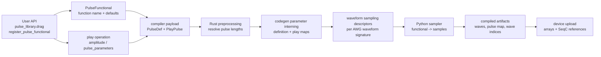
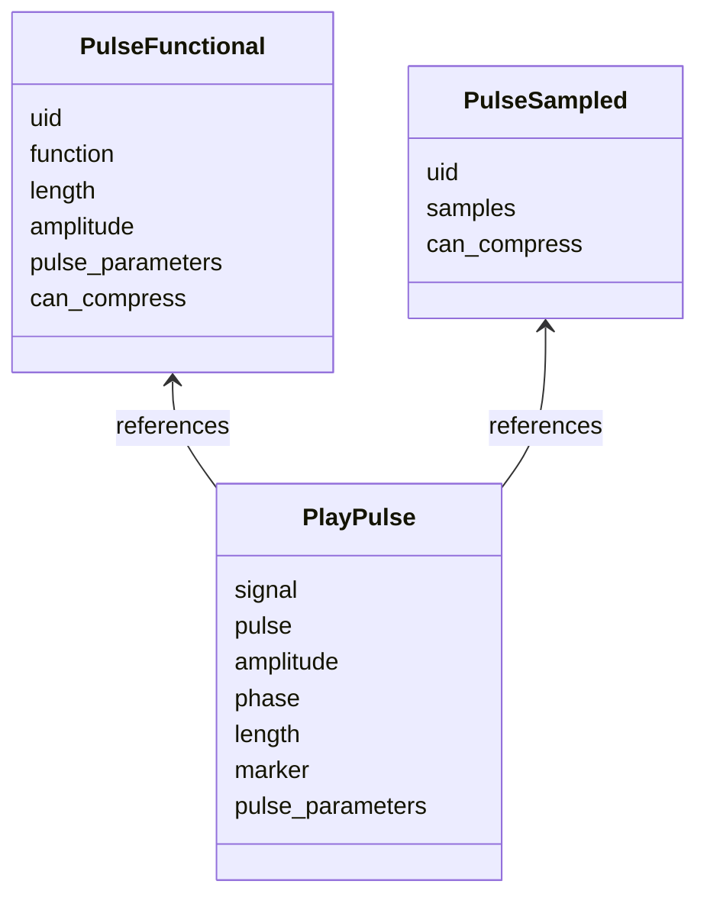
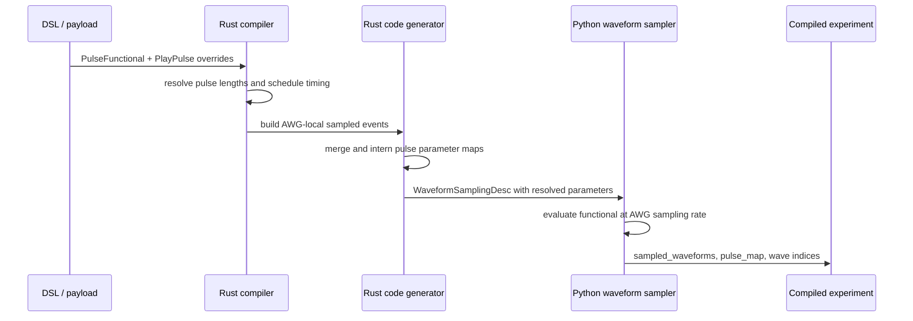
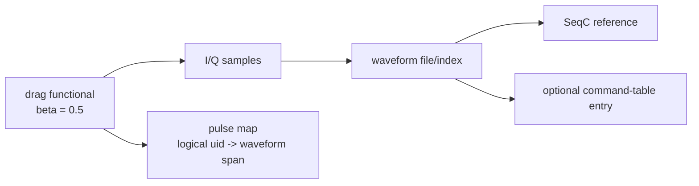

# Pulse functionals and swept pulse parameters

Pulse functionals are the point where LabOne Q lets an experiment describe a waveform by **recipe** rather than by samples. A pulse object can say “sample the registered `drag` functional with these default parameters”, while a later `play()` call can override common pulse attributes such as amplitude or functional-specific attributes such as `beta`. When those attributes are sweep parameters, the compiler must preserve the symbolic parameter long enough to generate the right loop structure, but it must eventually produce concrete waveform arrays and AWG references because the instruments do not execute arbitrary Python pulse functions.

The user manual demonstrates the two most important user-facing patterns: sweeping a shared play attribute through `Experiment.play(..., amplitude=amplitude_sweep)`, and sweeping a functional-specific parameter through `Experiment.play(..., pulse_parameters={"beta": beta_sweep})`.[^manual-pulse-library] This chapter follows those two cases vertically from the DSL object model through payload conversion, Rust preprocessing, pulse-parameter interning, Python waveform sampling, and the final compiled artifacts.



The chapter belongs next to [Feedback representation and hardware lowering](07a-feedback-compilation.md) because both topics are cross-cutting special cases. They begin as convenient DSL constructs, survive through intermediate representations, and are only fully resolved when backend and AWG-local information is available. Pulse functionals differ from feedback in one essential respect: the final hardware-facing result is not a branch route or register allocation, but a set of sampled arrays, waveform indices, and sequence references consumed by [AWG-local lowering and multiplexing](07-awg-local-lowering.md).

## User-facing pulse forms and sweep idioms

A LabOne Q pulse definition is either a **functional pulse** or a **sampled pulse**. A functional pulse records a registered function name, a nominal length, an amplitude, and a dictionary of functional-specific default parameters. A sampled pulse records an array-like sample payload directly. The built-in pulse-library factories such as `const`, `gaussian`, and `drag` construct these objects for common shapes, and `register_pulse_functional()` extends the same registry for user-defined shapes.

The documented sweep idioms intentionally separate common play parameters from functional-specific pulse parameters. Amplitude is a property of the `play()` operation, so a Rabi-style amplitude sweep is expressed as a normal play argument. The DRAG `beta` parameter belongs to the pulse functional, so it is supplied through the `pulse_parameters` mapping at the play site.[^manual-pulse-library]

```python
# Definition-level defaults. The pulse object is still symbolic: it names the
# "drag" functional and carries default values for its shape parameters.
x90 = pulse_library.drag(
    uid="drag_pulse",
    length=400e-9,
    amplitude=1.0,
    beta=0.3,
)

amplitude_sweep = LinearSweepParameter(uid="amplitude", start=0.1, stop=1.0, count=5)
beta_sweep = LinearSweepParameter(uid="beta", start=0.0, stop=1.0, count=5)

with exp.acquire_loop_rt(count=2**5):
    with exp.sweep(uid="amp_sweep", parameter=amplitude_sweep):
        exp.play(signal="drive", pulse=x90, amplitude=amplitude_sweep)

    with exp.sweep(uid="beta_sweep", parameter=beta_sweep):
        exp.play(signal="drive", pulse=x90, pulse_parameters={"beta": beta_sweep})
```

| User-facing construct | Stored on | Typical use | Consequence during compilation |
| --- | --- | --- | --- |
| `pulse_library.drag(..., beta=0.3)` | `PulseFunctional.pulse_parameters` | Define a reusable pulse with default shape parameters. | The default survives into the compiler payload and participates in waveform-signature construction. |
| `exp.play(..., amplitude=amplitude_sweep)` | `PlayPulse.amplitude` | Sweep a common play attribute shared by all pulse types. | The play operation remains parameterized until the sweep is expanded or represented in generated code and waveform descriptors. |
| `exp.play(..., pulse_parameters={"beta": beta_sweep})` | `PlayPulse.pulse_parameters` | Override a functional-specific shape parameter at one use site. | The override is merged with the definition defaults when building the sampling descriptor; the play-site value wins. |
| `pulse_library.sampled_pulse_complex(samples=...)` | `PulseSampled.samples` | Use an already sampled envelope. | Sampling is not repeated from a functional; length and waveform signatures are derived from the sample array and target signal context. |

For custom functionals, the callable is a **host-side sampler**, not an instrument program. The sampler is registered under a name, and later compilation invokes that registered sampler with the normalized time axis, pulse length, amplitude, target sampling rate, and resolved pulse parameters. This makes custom pulse functionals expressive, but it also means they should be deterministic and independent of mutable external state if reproducible builds are required.

## Representation before scheduling

The DSL object model deliberately keeps pulse definition and pulse use separate. `PulseFunctional` carries `uid`, `function`, `amplitude`, `length`, `pulse_parameters`, and the compression hint `can_compress`. `PulseSampled` carries `uid`, `samples`, and the same compression hint. A `play()` operation then records its own amplitude, phase, length, oscillator-phase controls, marker information, and optional `pulse_parameters` overrides.

The legacy adapter that builds the compiler-facing experiment description preserves this separation. It converts `PlayPulse.pulse_parameters` into the play operation and converts `PulseFunctional.pulse_parameters` into the pulse definition. This is the key representation choice: LabOne Q does **not** sample functionals while the user is constructing the experiment or while the Python DSL object is converted into the compiler payload. At that point the program is still symbolic enough to carry sweep parameters and late-bound calibration context.



| Layer | Pulse information retained | Not yet decided |
| --- | --- | --- |
| DSL construction | Pulse functional name, default parameter map, sampled payloads, and play-time overrides. | Target AWG sampling rate, exact waveform signature, and deduplicated waveform index. |
| Compiler payload conversion | Data-model pulse definitions and play operations with symbolic parameter references. | Concrete numeric samples for swept functional parameters. |
| Rust preprocessing | Pulse lengths and schedule-relevant timing information. | Final sampled arrays and Python functional evaluation. |
| AWG code generation | Per-AWG waveform signatures and parameter maps. | Instrument upload arrays until the Python waveform sampler materializes them. |

This split explains why a pulse can be inspected or plotted earlier for convenience while still being resampled during compilation. Visualization helpers can call the sampler directly for an illustrative array, but the compiler path uses backend-derived sampling descriptors so the final arrays match the scheduled AWG context.

## Resolution and sampling timeline

Pulse sampling occurs late because it depends on information that is not fully available in the user-facing DSL. The compiler must first know the mapped signal, device type, AWG sampling rate, modulation context, waveform length in samples, and the resolved value of every sweep parameter that affects the waveform signature. Rust preprocessing participates early by resolving pulse and acquisition lengths. For a functional pulse, the nominal length can come from the pulse definition or from a play-time length override. For a sampled pulse, the sample count and signal sampling rate determine the effective length.

Once scheduling and resource mapping have built AWG-local waveform signatures, the code generator passes `WaveformSamplingDesc` and `PulseSamplingDesc` objects across the Rust/Python boundary. Each pulse sampling descriptor contains the pulse definition, start and length in samples, amplitude, phase, optional oscillator frequency, channel identity, markers, and merged pulse-parameter information. The Python `waveform_sampler.sample_waveform()` path then materializes the waveform arrays and records which logical pulse instances contributed to each sampled waveform.



The most important operational consequence is that a functional-specific sweep such as `beta_sweep` is resolved before the sampler is called for a concrete waveform variant. The sampler receives a numeric `beta` value for each waveform signature that has to be materialized. If several sweep points produce distinct parameter maps, they can produce several distinct sampled waveforms even when the pulse `uid` is the same.

## Parameter precedence and waveform identity

LabOne Q treats pulse parameters as a layered map. The pulse definition provides defaults, and the play site can override those defaults for a particular use. In the code-generation utilities, definition-level and play-level pulse-parameter maps are kept as separate components and then deduplicated by stable identifiers. Their merged view is what the sampler uses for functional evaluation, with play-time values taking precedence over definition defaults.

```mermaid
graph TD
    Defaults[PulseFunctional defaults\n{"beta": 0.3, "sigma": ...}] --> Merge[merged pulse parameters]
    Overrides[PlayPulse overrides\n{"beta": beta_sweep}] --> Merge
    Sweep[Sweep value for this point\nbeta = 0.5] --> Merge
    Merge --> Signature[waveform signature\nshape + timing + channel + params]
    Signature --> Samples[sampled array]
```

| Parameter category | Example | Precedence and identity effect |
| --- | --- | --- |
| Definition-level shape parameter | `pulse_library.drag(beta=0.3)` | Forms the reusable default for all plays of the pulse. It contributes to the waveform signature unless overridden. |
| Play-time shape override | `pulse_parameters={"beta": beta_sweep}` | Overrides the same key in the definition map for that play. Distinct resolved values can produce distinct waveform signatures. |
| Common play amplitude | `amplitude=amplitude_sweep` | Multiplies the pulse envelope at the play site and is represented separately from functional-specific shape parameters. |
| Play-time length override | `length=...` | Changes scheduling length and sampling duration, so it affects both timing and waveform identity. |
| Post-compile pulse replacement | replacement pulse parameter map | Used by replacement workflows after compilation; replacement parameters are another override layer and must remain compatible with the compiled signature constraints. |

This layered representation avoids conflating a pulse definition with one of its uses. A single `drag_pulse` object can therefore appear in many locations with different amplitudes, phases, markers, or functional-specific parameters. The compiler output, however, is organized around **sampled waveform signatures**, not around the original pulse object alone.

## Hardware-facing artifacts

A compiled experiment contains sampled waveform arrays and the program fragments that refer to them. The functional name and Python callable are compile-time inputs; they are not shipped to an SHFSG, HDAWG, SHFQA, or UHFQA as executable code. The instruments receive arrays, waveform indices, command tables where applicable, and SeqC that plays or references those arrays.

The artifact shape is easiest to understand as a two-level mapping. At the code-generation level, each AWG result contains sampled waveforms, wave indices, SeqC, optional command-table JSON, and integration kernels. At the scheduled-experiment level, LabOne Q also records a pulse map so tooling can relate logical pulse instances back to waveform names and sample intervals. This is why simulation and pulse-sheet inspection can still point back to user-level pulse names even after functionals have been lowered to arrays.

| Artifact | Contents relevant to pulse functionals | Practical interpretation |
| --- | --- | --- |
| `sampled_waveforms` | Waveform signature, contributing signals, and sampled I/Q or marker arrays. | Concrete output of functional evaluation and sampled-pulse assembly. |
| `wave_indices` | Mapping from generated waveform names to instrument waveform indices. | The handle used by SeqC and command tables to refer to uploaded arrays. |
| SeqC program | `playWave`-style references, oscillator/phase operations, loop structure, and command-table calls where needed. | The sequencer program plays waveform indices, not pulse functionals. |
| Command table | Waveform references and parameterized playback entries for devices and modes that use table entries. | Swept or branched playback may select among precompiled waveform references. |
| Pulse map | Logical pulse instance to sampled waveform intervals. | Maintains traceability for inspection, simulation, and debugging. |
| Integration kernels | Sampled kernel arrays when a pulse functional or sampled pulse is used as an acquisition kernel. | Readout integration weights follow a similar lowering path to play pulses. |



## Constraints and debugging consequences

Pulse functionals sit at the boundary between symbolic programming and fixed-rate hardware playback, so several constraints follow naturally. A functional pulse must name a registered sampler; otherwise the compiler cannot turn it into samples. A pulse definition is either functional or sampled, not both. The sampler must return an array compatible with the requested duration and signal type. For RF output paths, the implementation treats real and complex components according to the target signal configuration; device-specific restrictions can drop or reject components that do not fit the signal path.

The waveform sampler also enforces hardware-oriented size and marker constraints. Waveform lengths must satisfy the device sample multiple used by AWG-local lowering. Marker arrays must align with the sampled waveform. Amplitude and modulation steps can clip or warn when a generated waveform exceeds the valid output range. These checks occur after the symbolic DSL layer because only the target sampling rate, channel context, and final parameter values reveal the concrete waveform shape.

| Constraint | Source of the constraint | Debugging symptom |
| --- | --- | --- |
| Registered functional name required | The pulse object stores a function name, and the sampler looks up the callable by that name. | Unknown-pulse or missing-functional errors during sampling or visualization. |
| Functional output must match requested sample count | The sampler constructs a target time grid for the scheduled length and sampling rate. | Shape mismatch, invalid waveform, or downstream array assembly failure. |
| Device sample multiple must be respected | AWG waveform memory and sequencer playback granularity. | Compile-time waveform length error in AWG-local sampling. |
| Swept shape parameters create waveform variants | Distinct merged parameter maps produce distinct waveform signatures. | More uploaded waves than expected when sweeping `beta`, `sigma`, width, or other shape parameters. |
| Play amplitude is not the same layer as `pulse_parameters` | Amplitude is a common play parameter; `beta` and similar entries are functional-specific. | A sweep appears to affect only scaling, or fails to affect the intended shape, if it is attached to the wrong argument. |
| Sampled pulses bypass functional evaluation | `PulseSampled` already carries samples. | Changing functional registration has no effect on sampled-pulse objects. |
| Integration kernels are sampled into readout artifacts | Acquire kernels use pulse-like definitions but target integration units. | Kernel shape and length problems appear in integration-weight artifacts rather than drive waveform artifacts. |

A useful debugging sequence is therefore to inspect the pulse object first, then the play operation overrides, then the compiled waveform inventory. If the compiled experiment contains many waveform names for one pulse `uid`, the cause is usually not duplication in the DSL object; it is usually a set of distinct resolved sweep values, amplitudes, lengths, channels, or modulation contexts that make separate waveform signatures necessary.

## Source anchors

| Layer | Source anchor | Role in the vertical path |
| --- | --- | --- |
| Official user contract | [Pulse Library and Sampled Pulses tutorial](https://docs.zhinst.com/labone_q_user_manual/core/functionality_and_concepts/03_sections_pulses/tutorials/01_pulse_library.html#define-a-new-pulse-type-and-sweep-it) | Documents built-in pulse sweeps, custom pulse types, and the `pulse_parameters` sweep idiom. |
| Pulse-library registry | `src/python/laboneq/dsl/experiment/pulse_library.py` | Defines built-in factories and registration of custom pulse functional samplers. |
| Pulse object model | `src/python/laboneq/dsl/experiment/pulse.py` | Defines `PulseFunctional`, `PulseSampled`, evaluation helpers, and sampled-pulse generation helpers. |
| Play-operation model | `src/python/laboneq/dsl/experiment/play_pulse.py` | Carries play-time amplitude, length, marker, phase, and `pulse_parameters` overrides. |
| Payload conversion | `src/python/laboneq/implementation/legacy_adapters/converters_experiment_description.py` | Preserves `PulseFunctional.pulse_parameters` and `PlayPulse.pulse_parameters` as distinct compiler-payload fields. |
| Rust length preprocessing | `src/rust/laboneq-compiler-py/src/experiment_processor/resolve_pulses.rs` | Resolves pulse and acquire lengths before final sampling. |
| Pulse-parameter interning | `src/rust/codegenerator-utils/src/pulse_parameters.rs` | Deduplicates and merges definition-level and play-level pulse-parameter maps. |
| Sampling descriptor schema | `src/python/laboneq/_rust/codegenerator/__init__.pyi` | Exposes `PulseSamplingDesc`, `WaveformSamplingDesc`, and `PulseParameters` across the Rust/Python boundary. |
| Numeric pulse sampling | `src/python/laboneq/core/utilities/pulse_sampler.py` | Evaluates functionals into arrays and applies amplitude, phase, modulation, marker, and validation logic. |
| Waveform assembly | `src/python/laboneq/compiler/seqc/waveform_sampler.py` | Builds sampled waveforms and pulse maps from scheduled pulse parts. |
| Compiled artifact model | `src/python/laboneq/data/scheduled_experiment.py` | Stores waveform artifacts and logical pulse-to-waveform traceability. |

## References

[^manual-pulse-library]: Zurich Instruments, ["Pulse Library and Sampled Pulses"](https://docs.zhinst.com/labone_q_user_manual/core/functionality_and_concepts/03_sections_pulses/tutorials/01_pulse_library.html#define-a-new-pulse-type-and-sweep-it), LabOne Q User Manual.
