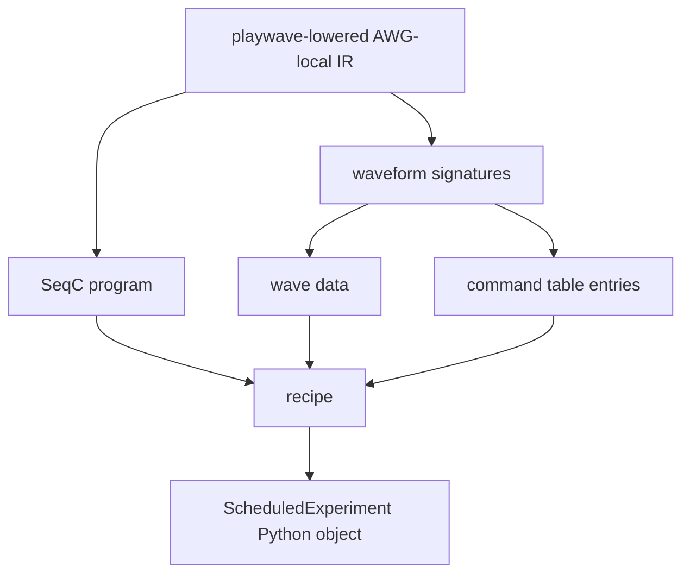

# Code Generation Artifacts

After AWG-local lowering, the compiler has enough information to produce executable artifacts. The artifacts are not a single monolithic output. They include SeqC programs, waveform data, command-table entries, oscillator and amplitude metadata, acquisition metadata, and a recipe that tells the runtime how to configure and execute the experiment.

The Python wrapper in `src/python/laboneq/compiler/seqc/code_generator.py` repackages Rust code-generation outputs into Python-side structures. `src/python/laboneq/data/scheduled_experiment.py` defines the controller-facing compiled experiment bundle.

## Artifact classes

| Artifact | Meaning | Produced after |
| --- | --- | --- |
| SeqC source | Sequencer program for an AWG core. | AWG-local IR has been transformed into legal sequencer control flow. |
| Waveforms | Sample arrays or waveform descriptors referenced by SeqC/play-wave commands. | Playwave lowering has generated waveform signatures and pulse composition windows. |
| Command tables | Device-supported indexed command parameters such as oscillator/amplitude variants. | Signature optimization and device-specific codegen decide reusable entries. |
| Recipe | Runtime configuration and execution plan linking devices, AWGs, code, waves, acquisitions, and result handles. | Compiler has all device and artifact metadata. |
| Result metadata | Mapping from acquire handles and result shapes to runtime collection. | Acquisition and loop structures have been analyzed. |

## Relationship to earlier IRs

Generated artifacts should not be used to infer the original DSL structure directly. They are already downstream of multiple semantic transformations: global scheduling, backend resource mapping, AWG fanout, virtual-signal grouping, playwave lowering, and signature optimization. A single waveform artifact may represent multiple logical pulses. Conversely, one logical operation may contribute metadata to several generated structures, especially when match/case branches, command tables, oscillator settings, or acquisition paths are involved.

## Recipe as runtime contract

The recipe is the runtime contract. It identifies which device receives which program and wave data, how AWG cores are configured, which acquisitions are expected, how result handles map back to user-visible data, and which execution-time settings must be applied before the run. The controller does not recompile the experiment; it consumes the recipe and associated artifacts.

`src/python/laboneq/controller/recipe_processor.py` preprocesses the recipe into runtime-friendly data structures such as AWG configurations, device settings, waveform upload data, and estimated execution metadata. This layer is close to devices and therefore should be kept separate from compiler semantics in the guide.

## Debugging artifact mismatches

If a waveform or SeqC program looks surprising, trace backwards through AWG-local lowering, not back to the Python DSL alone. The relevant intermediate questions are whether the operation belongs to the expected AWG core, whether its logical signal belongs to the expected virtual signal group, whether interval compaction merged it with neighboring pulses, and whether signature optimization reused or transformed command-table entries.
