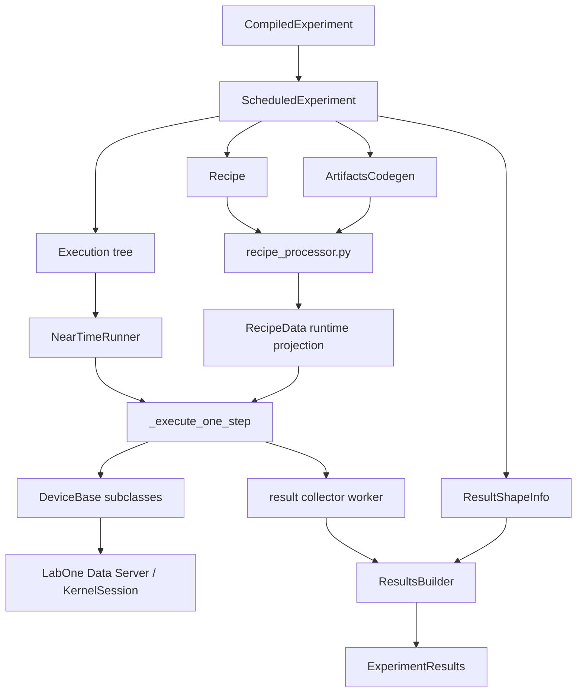
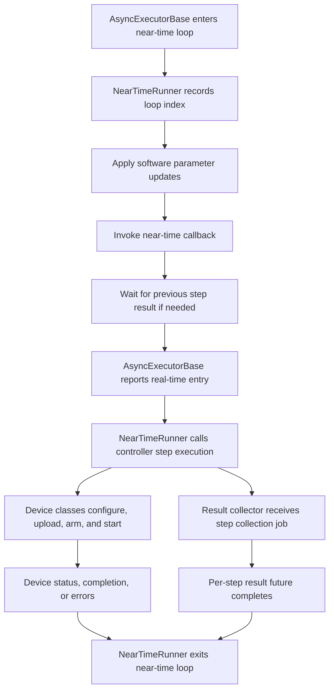
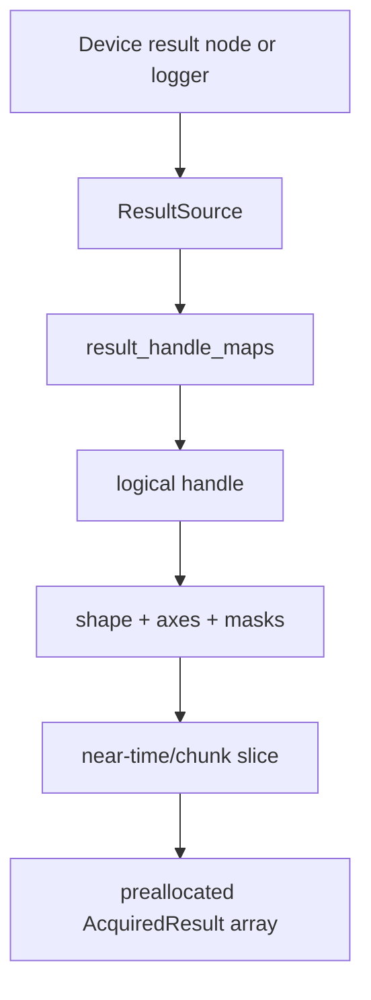

# Runtime controller, recipe interpretation, and instrument operation

The runtime controller executes a compiled experiment. It is not a second compiler, and it does not rediscover the semantics of the Python DSL, scheduled IR, or AWG-local playwave lowering. Its input is a `ScheduledExperiment` bundle whose real-time behavior has already been reduced to a recipe, generated artifacts, an execution tree, real-time loop metadata, and result-shape metadata. The controller then performs **runtime adaptation**: it validates and preprocesses the recipe, configures instruments, uploads artifacts, interprets near-time structure, starts real-time hardware programs, waits for device completion, collects acquisition data, and assembles user-facing result objects.[1][2][3]

The important conceptual boundary is that the compiler has already produced the hardware programs and static waveform content. The controller may still perform narrow just-in-time substitutions for near-time pulse or phase-increment replacement, and it may select the program/artifact subset for the current near-time step, but it does not run global scheduling, overlap compaction, logical-to-physical signal multiplexing, or SeqC synthesis again.[2][4]

## Compiled execution bundle

The user-visible `CompiledExperiment` wraps an internal `ScheduledExperiment`. The scheduled bundle is the actual runtime contract. It is small enough to name explicitly because each field has a different runtime role.[1][5]

| Field | Runtime role |
| --- | --- |
| `device_setup_fingerprint` | A compatibility check that the compiled experiment still matches the setup against which it was compiled. |
| `recipe` | Declarative controller instructions: device initialization, real-time execution initialization, oscillator parameters, integration allocation, acquisition lengths, timing estimates, and recipe-version metadata. |
| `artifacts` | Backend-specific generated content. For the QCCS code-generation path this includes SeqC source or ELF content, waveform samples, waveform-index maps, command tables, pulse-to-waveform maps, phase-increment maps, and integration weights. |
| `schedule` | Optional scheduled-event data useful for inspection and debugging. It is not the runtime execution engine. |
| `execution` | A statement tree interpreted by the Python executor. It describes near-time loops, parameter sets, callbacks, and real-time block entries. |
| `rt_loop_properties` | The real-time loop UID, acquisition type, averaging mode, shot count, and chunk count. |
| `result_shape_info` | The map from physical result sources to logical result handles, including result shapes, axes, masks, and chunk axes. |

The `artifacts` member is deliberately separate from the recipe. The recipe says which devices, AWGs, oscillator settings, integration units, and execution initializations are involved; the artifacts hold the generated payloads that can be uploaded. In the QCCS codegen path, `ArtifactsCodegen` carries the SeqC program list in `src`, waveforms in `waves`, upload identifiers in `wave_indices`, command-table data in `command_tables`, pulse-to-waveform maps in `pulse_map`, phase-increment command-table maps in `parameter_phase_increment_map`, and integration-kernel references in `integration_weights`.[5]

## Recipe structure and interpretation contract

The recipe should be read as a **declarative runtime instruction graph**, not as an imperative program. It names initialized devices, per-device and per-AWG execution configuration, oscillator parameters, integrator allocations, acquisition lengths, and timing limits. The controller first normalizes this into a `RecipeData` projection before device classes consume it.[2]

| Recipe area | Controller interpretation |
| --- | --- |
| `initializations` | Static device and channel setup: outputs, inputs, oscillator references, mixer or modulation settings, precompensation, ranges, trigger configuration, and per-AWG program references. |
| `realtime_execution_init` | Per-near-time-step real-time initialization. This links a near-time step key to the program references and artifact selections that must be active for the following hardware execution. |
| `oscillator_params` | Frequency and phase parameters that may be applied at runtime, including near-time sweep-dependent changes. |
| `integrator_allocations` | Mapping from acquisition handles and integration units to physical readout resources. |
| `acquire_lengths` | Readout lengths used by result collection and device-specific acquisition setup. |
| `total_execution_time` and `max_step_execution_time` | Runtime estimates used for wait limits, watchdog behavior, and diagnostic messages; they do not reschedule the experiment. |
| `versions` | Compatibility metadata for recipe interpretation. |

`recipe_processor.py` is the semantic adapter between this compiled recipe and the controller. It builds per-device recipe records such as AWG configurations, QA-channel data, SG-channel data, HDAWG data, and real-time execution metadata. It also indexes AWGs by SeqC program name, maps near-time step keys to active program references, extracts ELF or SeqC artifacts, validates recipe consistency, and calculates execution-time estimates used during waits and timeouts.[2]

> **Invariant.** A valid recipe refers to already-generated artifacts. If the runtime needs a waveform, command table, integration weight, or program, the artifact must already be present in the scheduled experiment. The controller may choose and upload artifacts, but it does not synthesize the original compiler output from the DSL.

## Execution-tree semantics

The runtime semantics of near-time control come from the executor statement tree. The executor walks statements such as loops, parameter assignments, callbacks, and real-time entries. In the normal controller path, `NearTimeRunner` uses `LoopingMode.NEAR_TIME_ONLY`: Python executes near-time control flow, while each real-time block is represented by a notification to the controller rather than by interpreting the real-time block body in Python.[3][6]

The `NearTimeRunner` keeps the current near-time loop indices as an `NtStepKey`, tracks software sweep parameters in a `SweepParamsTracker`, accumulates user node writes in a `NodeCollector`, and invokes registered near-time callbacks. Before a new callback is allowed to inspect partial results, the runner waits for the previous step's result future to complete, preserving the existing partial-result semantics under the asynchronous implementation.[6]

Callbacks receive a `RuntimeContextImpl`. Through that context they can inspect current results, abort execution, replace a pulse, or replace a phase increment. These replacement requests do not rebuild the whole experiment; they register a narrow runtime mutation that is processed before the relevant real-time step is uploaded or executed.[4][7]

## Controller lifecycle

The controller owns an event loop and asynchronous workers for experiment submission and result collection. `submit_compiled` validates the scheduled experiment, creates a controller submission, allocates a `ResultsBuilder` from `result_shape_info`, and queues the experiment. The asynchronous execution path preprocesses the recipe, initializes devices, applies oscillator setup, clears stale near-time replacements, and then runs the near-time executor over the execution tree.[1][2][6]

The most important single method is the per-real-time-step execution path. Conceptually it performs the following ordered actions, although many device-specific sub-operations are dispatched concurrently across devices and cores.

| Stage | Runtime action |
| --- | --- |
| Step preparation | Resolve the current `NtStepKey`, apply near-time sweep parameters, collect pending user node sets, and select the active program references for this step. |
| Trigger and synchronization setup | Prepare trigger nodes, synchronization settings, feedback configuration, and device-specific ready/done conditions. |
| Runtime replacement processing | Apply pending pulse or phase-increment replacements if callbacks requested them and if the experiment is not chunked. |
| Artifact upload | Upload SeqC/ELF programs, waveforms, integration weights, command tables, and replacements required by the selected program references. |
| Arming and readiness | Configure device execution state, prepare result subscriptions, and wait for channels, sequencers, and pipeline resources to report ready. |
| Start | Start the trigger path or software-triggered execution sequence. |
| Completion wait | Wait on explicit device conditions, result-loggers, sequencer state, pipeliner state, and timeout estimates. |
| Step teardown | Collect warnings and errors, update pipeline timestamps, release per-step state, and let the result worker fill buffers. |

A runtime failure after successful compilation is therefore usually localized to recipe preprocessing, device setup, artifact upload, triggering, synchronization, execution-state waits, or result retrieval. It should not be attributed to `ScheduledNode`, `IrNode`, or playwave interval compaction unless the compiled artifact itself is inconsistent with the recipe.

## Instrument API boundary and concurrency model

The controller reaches Zurich Instruments hardware through asynchronous LabOne Data Server communication. The device layer hides those dependencies behind `InstrumentConnection`, which wraps control and readout `KernelSession` instances created with `zhinst.comms_schemas.labone.KernelSession`. The control connection is used for node writes and device-state operations, while the readout connection is used for streaming result subscriptions unless a caller explicitly asks to use the control connection.[8]

| Runtime primitive | Implementation semantics |
| --- | --- |
| Batched node writes | Device methods collect node actions in `NodeCollector`. `InstrumentConnection.set_parallel` issues independent `set` or `set_with_expression` calls and gathers them asynchronously, respecting barriers in the collector. |
| Concurrent device calls | Controller and device helpers use `asyncio.gather` through the `_gather` wrapper, so independent node writes, gets, subscriptions, and per-device operations can proceed concurrently. |
| Ready and done waits | `ResponseWaiterAsync` subscribes to state nodes before commands are issued, then waits for expected value sequences with optional timeouts. This avoids missing short-lived state transitions. |
| State checks | `ConditionsCheckerAsync` reads state nodes concurrently and reports mismatches against expected values. |
| Result streams | `AsyncSubscriber` maintains `DataQueue` subscriptions and returns canonical vectors plus metadata properties for result nodes. |
| Type adaptation | `_resolve_type` adapts NumPy integer arrays, enum values, floating scalars, and complex SHF waveform vectors before upload. |

This is **near-realtime orchestration**, not hard realtime control from Python. The hard-timed waveform playback and acquisition are executed by instrument sequencers, trigger systems, result loggers, and pipeliner resources. Python performs orchestration immediately around those hardware operations: it prepares nodes, uploads data, arms devices, starts execution, and waits for hardware-observed states.[8][9]

## Work-ahead, pipelining, and just-in-time mutation

The controller contains several forms of runtime work-ahead, but they are bounded by the compiled artifact model. Chunked experiments can use AWG pipelining: `AwgPipeliner` enables pipeliner mode, resets the queue, commits staged jobs, waits for available slots, enables execution, and observes the pipeliner status transition from execution back to idle. Its queue model is visible in nodes such as `pipeliner/mode`, `pipeliner/reset`, `pipeliner/commit`, `pipeliner/availableslots`, `pipeliner/enable`, and `pipeliner/status`.[9]

The just-in-time mutation path is deliberately narrower than compilation. `NearTimeReplacements` stores pulse and phase-increment replacements requested by callbacks. Before a step runs, `process_replacements` computes only the needed waveform or command-table deltas for the active program references in the current near-time step. Pulse replacements are clipped to hardware amplitude bounds, converted to the appropriate upload representation, and queued as waveform replacements on the target device. Phase-increment replacements are translated to command-table replacements. The code rejects these near-time artifact replacements for chunked experiments, which is an important limit on the amount of runtime dynamism available.[4]

| Runtime adaptation | Recomputed at runtime | Not recomputed at runtime |
| --- | --- | --- |
| Near-time sweep parameters | Current software parameter values and dependent node settings. | The global timing schedule of the experiment. |
| Oscillator parameters | Runtime oscillator values and device nodes selected by recipe semantics. | Logical oscillator compatibility analysis performed during compilation. |
| Pulse replacement | Waveform deltas for affected active program references. | Full AWG-local interval compaction or SeqC control-flow synthesis. |
| Phase-increment replacement | Command-table entries for affected active program references. | Command-table structure unrelated to the replacement target. |
| Chunked/pipelined execution | Queue slots, commits, ready states, timestamps, and per-job waits. | The chunk partitioning and generated program set. |

The practical mental model is that the controller can **select, upload, patch, queue, and wait**. It does not **schedule, lower, multiplex, or regenerate** the experiment except for the explicitly supported replacement deltas.

## Result acquisition and buffering

Result handling is concurrent with the experiment lifecycle, but it is still structural rather than analytical. A separate result-collection worker receives per-step collection jobs. The `ResultsBuilder` is allocated before execution from `ResultShapeInfo`, and it pre-fills every declared handle array with complex `NaN` values. Each result handle therefore has a complete target shape, axes, optional match/case mask, and optional chunked axis before the first data point arrives.[5][10]

When data arrives, the builder uses the `ResultSource` to find the logical handles that should receive it. It computes a multidimensional slice from the current near-time step and optional chunk index, filters interleaved data according to the handle map, reshapes the flat device data into the declared target slice, and writes it into the preallocated result buffer. In RAW acquisition mode, if multiple logical signals share one physical source and the physical readout returns more samples than a particular logical handle requested, the builder truncates the excess samples at the end while assuming the acquisition events were aligned at the beginning.[10]

This means the controller does more than merely append raw vectors to a list. It performs **handle routing, multidimensional placement, chunk reconstruction, RAW truncation for shared sources, timestamp recording, and execution-error recording**. At the same time, it does not perform arbitrary scientific post-processing. Numerical analysis, fitting, discrimination interpretation beyond hardware-provided result types, and user-defined adaptive algorithms live above this structural result assembly layer, except when the user explicitly runs such logic in near-time callbacks.[6][10]

| Data responsibility | Controller behavior |
| --- | --- |
| Acquisition fetch | Device classes subscribe to or read result nodes and return vectors plus metadata. |
| Source-to-handle routing | `ResultSource` keys map physical device/AWG/integrator sources to one or more logical handles. |
| Shape reconstruction | `ResultsBuilder` reshapes flat device data into declared handle arrays using near-time indices, masks, and chunk metadata. |
| Partial-result visibility | Near-time callbacks can inspect results, and the runner waits for the previous step's result future before executing callbacks that might depend on them. |
| Error and timestamp metadata | Execution errors and pipeline job timestamps are stored in the result object. |
| Scientific analysis | Deferred to user code, analysis tools, or explicit callback logic rather than performed automatically by the controller. |

## Source reference map

| Topic | Primary source files |
| --- | --- |
| Public compiled-experiment wrapper | `src/python/laboneq/core/types/compiled_experiment.py` |
| Scheduled bundle, artifacts, result metadata | `src/python/laboneq/data/scheduled_experiment.py` |
| Recipe dataclasses | `src/python/laboneq/data/recipe.py` |
| Recipe preprocessing and runtime projection | `src/python/laboneq/controller/recipe_processor.py` |
| Main controller lifecycle | `src/python/laboneq/controller/controller.py` |
| Near-time executor bridge | `src/python/laboneq/controller/near_time_runner.py` |
| Execution statement interpreter | `src/python/laboneq/executor/executor.py` |
| Async LabOne communication | `src/python/laboneq/controller/devices/async_support.py` |
| AWG pipeliner | `src/python/laboneq/controller/devices/awg_pipeliner.py` |
| Near-time artifact replacement | `src/python/laboneq/controller/near_time_replacement.py` |
| Result assembly | `src/python/laboneq/controller/results.py` |

## References

[1]: https://github.com/zhinst/laboneq/blob/main/src/python/laboneq/controller/controller.py "LabOne Q controller.py"
[2]: https://github.com/zhinst/laboneq/blob/main/src/python/laboneq/controller/recipe_processor.py "LabOne Q recipe_processor.py"
[3]: https://github.com/zhinst/laboneq/blob/main/src/python/laboneq/executor/executor.py "LabOne Q executor.py"
[4]: https://github.com/zhinst/laboneq/blob/main/src/python/laboneq/controller/near_time_replacement.py "LabOne Q near_time_replacement.py"
[5]: https://github.com/zhinst/laboneq/blob/main/src/python/laboneq/data/scheduled_experiment.py "LabOne Q scheduled_experiment.py"
[6]: https://github.com/zhinst/laboneq/blob/main/src/python/laboneq/controller/near_time_runner.py "LabOne Q near_time_runner.py"
[7]: https://github.com/zhinst/laboneq/blob/main/src/python/laboneq/controller/runtime_context_impl.py "LabOne Q runtime_context_impl.py"
[8]: https://github.com/zhinst/laboneq/blob/main/src/python/laboneq/controller/devices/async_support.py "LabOne Q async_support.py"
[9]: https://github.com/zhinst/laboneq/blob/main/src/python/laboneq/controller/devices/awg_pipeliner.py "LabOne Q awg_pipeliner.py"
[10]: https://github.com/zhinst/laboneq/blob/main/src/python/laboneq/controller/results.py "LabOne Q results.py"
