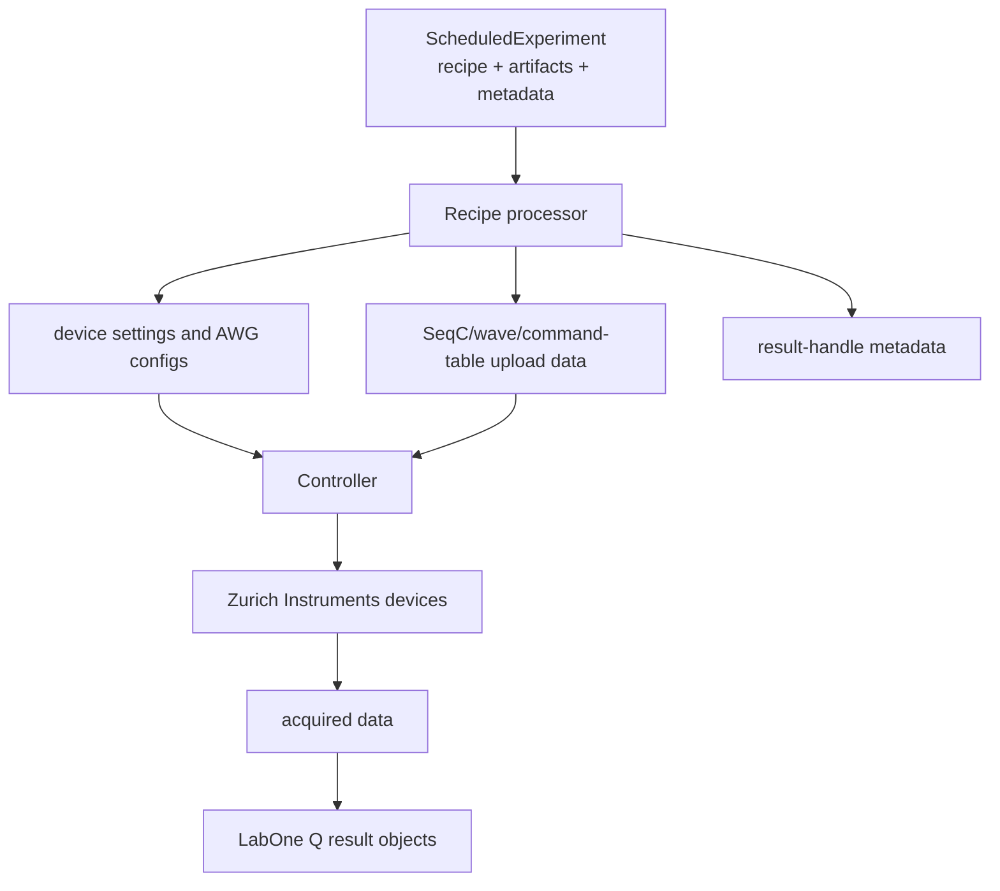

# Runtime Controller

The runtime controller executes a compiled experiment. It does not reinterpret the DSL and should not be described as another compiler pass. Its job is to take the `ScheduledExperiment` bundle, preprocess the recipe, configure instruments, upload generated artifacts, start sequencers, collect data, and return results through LabOne Q's result abstractions.

The main runtime sources are `src/python/laboneq/controller/controller.py`, `near_time_runner.py`, `recipe_processor.py`, and the executor modules under `src/python/laboneq/executor`.

## Runtime structure

## Near-time and real-time split

LabOne Q experiments can contain near-time structure that is executed by Python orchestration and real-time blocks that are compiled for hardware execution. The executor modules build a statement tree from the experiment and interpret near-time loops, callbacks, and real-time block submissions. The near-time runner turns interpreter notifications into controller actions.

| Runtime domain | Responsibility |
| --- | --- |
| Near-time executor | Python-side loops, parameter updates, callbacks, and orchestration around real-time compiled blocks. |
| Controller | Device setup, uploads, execution coordination, acquisition collection, and result assembly. |
| Device communication layer | Low-level interaction with Zurich Instruments APIs/toolkit/comms packages. |
| Compiled real-time block | Already-generated AWG programs and waveforms executed by devices. |

## Recipe processing

`recipe_processor.py` is the runtime's staging area. It interprets the compiled recipe into structures that device classes can consume: AWG configurations, initialization settings, waveform preparation data, command tables, acquisition descriptors, and execution-time estimates. The recipe processor should be understood as runtime adaptation, not compiler lowering. By the time this code runs, logical pulse overlap has already been resolved into generated artifacts.

## Result collection

Result collection maps acquired device data back to LabOne Q handles and shapes. This is why acquisition metadata must survive compilation and recipe generation. The controller can collect raw or processed acquisition data, associate it with handles, and return it in user-facing result objects.

## Failure localization

A runtime failure after successful compilation should be debugged through recipe processing, device configuration, uploads, trigger/synchronization setup, and acquisition handling. It is usually not a sign that `ScheduledNode` semantics or playwave interval compaction are wrong, unless the runtime artifact itself is inconsistent.
