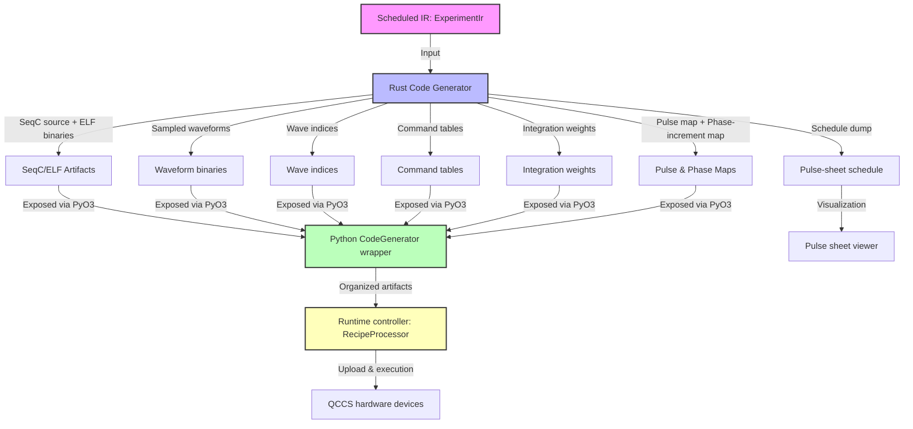

# Code generation artifacts

This page documents the code generation artifacts produced by the LabOne Q compiler pipeline in the `zhinst/laboneq` repository. These artifacts form the bridge between the scheduled intermediate representation (IR) of an experiment and the concrete programs and data uploaded to Zurich Instruments QCCS hardware devices. Understanding these artifacts is essential for developers working on the compiler, code generator, runtime controller, or device integration layers.

We cover the following key artifact categories:

- SeqC/ELF programs
- Sampled waveform binaries and wave indices
- Command tables
- Integration weights and kernels
- Pulse maps and phase-increment maps
- Schedule dumps and pulse-sheet schedules
- Code generation wrapper and Python/Rust boundary
- Artifact validation and invariants

This guide explains what each artifact represents, why it exists, where it is produced and stored in the codebase, who consumes it, and the key invariants and constraints it carries.

---

## How to read this page as a maintainer

This page is intended as a detailed developer orientation to the code generation artifacts in LabOne Q. It assumes familiarity with the overall LabOne Q architecture and compilation workflow, as documented in earlier guide pages such as:

- [06-compiler-overview.md](06-compiler-overview.md) for the compiler workflow
- [07-ir-models.md](07-ir-models.md) for the IR semantics
- [08-rust-compiler-core.md](08-rust-compiler-core.md) for the Rust compiler internals
- [09-scheduling-and-timing.md](09-scheduling-and-timing.md) for scheduling and timing semantics

Readers should understand that the compiler pipeline transforms a Python DSL experiment into a Rust-backed scheduled IR (`ExperimentIr`), which is then passed to a device-specific code generator producing low-level artifacts. These artifacts are then consumed by the runtime controller for device upload and execution.

This page focuses on the artifact layer, bridging the IR and runtime, and references source files primarily under:

- `src/python/laboneq/compiler/seqc/` (Python code generator wrapper)
- `src/rust/laboneq-codegenerator/` (Rust code generator core)
- `src/python/laboneq/_rust/codegenerator/` (Python bindings to Rust code generator)
- `src/python/laboneq/compiler/workflow/realtime_compiler.py` (orchestration)
- `src/python/laboneq/controller/recipe_processor.py` (runtime artifact processing)

---

## 1. Overview of code generation artifacts

The LabOne Q compiler produces a rich set of artifacts that represent the compiled experiment in forms suitable for execution on QCCS hardware. These artifacts include:

| Artifact category | Description | Location in codebase | Consumers |
|-------------------|-------------|---------------------|-----------|
| SeqC/ELF programs | Device-specific sequencer source code and compiled ELF binaries | Rust code generator, Python wrapper: `src/rust/laboneq-codegenerator`, `src/python/laboneq/_rust/codegenerator` | Runtime controller, device upload |
| Sampled waveform binaries | Digitally sampled waveforms for AWG playback, stored as `.wave` files or in-memory arrays | Python code generator wrapper: `src/python/laboneq/compiler/seqc/waveform_sampler.py` | Runtime controller, device upload |
| Wave indices | Indexing tables mapping pulses to waveform segments | Python code generator wrapper | Runtime controller |
| Command tables | Hardware sequencer command tables for branching, looping, and control | Python code generator wrapper | Runtime controller |
| Integration weights/kernels | Complex-valued integration kernels for qubit readout | Python code generator wrapper | Runtime controller, result processing |
| Pulse map | Mapping from pulses to waveform indices and parameters | Python code generator wrapper | Runtime controller |
| Phase-increment map | Parameter-to-phase-increment mappings for dynamic phase control | Python code generator wrapper | Runtime controller |
| Schedule dump | Pulse-sheet schedule for visualization and debugging | Rust IR and Python wrapper: `src/rust/laboneq-ir/src/pulse_sheet_schedule.rs`, `src/python/laboneq/compiler/workflow/realtime_compiler.py` | Pulse sheet viewer, diagnostics |
| Artifact validation | Checks for consistency, compatibility, and device constraints | Rust scheduler and code generator, Python wrapper | Compiler pipeline, runtime |

These artifacts are produced after scheduling and lowering passes have generated a timed IR tree (`ExperimentIr`) representing the experiment's real-time operations. The code generator translates this IR into device-specific programs and data.

---

## 2. SeqC and ELF program generation

### What is SeqC?

SeqC is the Zurich Instruments sequencer programming language used to program AWG devices such as HDAWG, UHFQA, SHFQA, and SHFSG. It supports sample-precise waveform playback, branching, looping, and conditional execution.

The LabOne Q compiler generates SeqC source code for each AWG device in the experiment, which is then compiled into ELF binaries for upload.

### Why SeqC/ELF?

SeqC programs are the fundamental executable units on QCCS AWG devices. The compiler must produce valid SeqC source and compiled ELF binaries that implement the scheduled pulse sequences, timing, and control flow.

### Where is SeqC/ELF generated?

- The Rust code generator crate (`src/rust/laboneq-codegenerator/`) implements the core logic to translate the scheduled IR (`ExperimentIr`) into SeqC source code and ELF binaries.
- The Python wrapper `src/python/laboneq/_rust/codegenerator/__init__.py` exposes the Rust code generator via PyO3 bindings.
- The Python `CodeGenerator` class in `src/python/laboneq/compiler/seqc/code_generator.py` calls the Rust code generator and repackages the output.

### What does the SeqC generation produce?

The Rust code generator returns a `SeqCGenOutput` structure containing:

- `seqc_programs`: a mapping from AWG keys to SeqC source code strings.
- `elf_binaries`: compiled ELF binaries for each AWG.
- `waveforms`: sampled waveform data arrays.
- `wave_indices`: indexing tables for waveform segments.
- `command_tables`: sequencer command tables for control flow.
- `integration_weights`: complex integration kernels for readout.
- `pulse_map`: mapping from pulses to waveform indices and parameters.
- `phase_increment_map`: parameter-to-phase-increment mappings.
- Additional metadata such as signal delays, feedback register configurations, and measurement definitions.

### Who consumes SeqC/ELF?

The runtime controller (`src/python/laboneq/controller/recipe_processor.py`) consumes these artifacts to upload the ELF binaries and waveforms to the devices via the LabOne data server API. The controller manages device-specific upload, arming, and execution.

### Key invariants and constraints

- SeqC programs must be valid and compilable by the Zurich Instruments compiler toolchain.
- ELF binaries must correspond exactly to the SeqC source.
- Waveforms must be sampled at device-specific rates and scaled to device constraints (e.g., SHFQA complex samples scaled below 1.0).
- Command tables must be consistent with the sequencer program's control flow.
- Integration weights must match acquisition kernel lengths and device capabilities.

---

## 3. Sampled waveform binaries and wave indices

### What are waveform binaries?

Waveform binaries are arrays of sampled values representing the analog waveforms to be played by AWG channels. These are generated by sampling pulse definitions at the device sampling rate and compressing where possible.

### Why waveform binaries?

AWG devices require digital samples to output analog signals. The compiler must convert abstract pulse shapes into sampled waveforms that fit device memory and timing constraints.

### Where are waveform binaries produced?

- Sampling and compression are implemented in Python in `src/python/laboneq/compiler/seqc/waveform_sampler.py`.
- The Rust code generator produces sampled waveform data as part of the `SeqCGenOutput`.
- The Python wrapper materializes `.wave` assets from these arrays, using naming conventions that differ for single-channel and IQ signals.

### Wave indices

Wave indices are tables mapping pulses to offsets and lengths within the waveform binary arrays. They enable the sequencer to reference waveform segments efficiently.

### Consumers

The runtime controller uses waveform binaries and wave indices to upload waveforms to the device memory and configure playback.

### Invariants

- Waveform samples must be scaled appropriately (e.g., SHFQA complex samples scaled by `1 - 1e-10`).
- Waveform arrays must be contiguous and indexed correctly.
- Wave indices must align with pulse boundaries and durations.

---

## 4. Command tables

### What are command tables?

Command tables are hardware sequencer data structures that encode branching, looping, and control flow instructions for the AWG sequencer.

### Why command tables?

Complex pulse sequences require conditional execution and looping. Command tables enable efficient hardware-level control flow without CPU intervention.

### Location

Command tables are generated by the Rust code generator and exposed via the Python wrapper.

### Consumers

The runtime controller uploads command tables to devices and configures sequencers accordingly.

### Invariants

- Command tables must be consistent with the SeqC program's control flow.
- They must respect device-specific command table formats and size limits.

---

## 5. Integration weights and kernels

### What are integration weights?

Integration weights are complex-valued kernels used to integrate acquired signals for qubit readout and measurement.

### Why integration weights?

QCCS devices perform real-time integration of measurement signals using these kernels to extract qubit state information.

### Location

Integration weights are generated by the Rust code generator and exposed in the Python wrapper.

### Consumers

The runtime controller configures acquisition units with integration weights. Result processing uses these weights to interpret measurement data.

### Invariants

- Integration weights must match acquisition kernel lengths.
- They must be normalized and compatible with device hardware.

---

## 6. Pulse map and phase-increment map

### Pulse map

The pulse map links pulses in the experiment to waveform indices and parameters, enabling waveform replacement and dynamic control.

### Phase-increment map

The phase-increment map associates parameters with phase increments in command tables, supporting dynamic phase control during execution.

### Location

Both maps are produced by the Rust code generator and exposed via the Python wrapper.

### Consumers

The runtime controller uses these maps for waveform replacement and phase updates during near-time execution.

### Invariants

- Maps must be consistent with the scheduled IR and waveform indices.
- Phase increments must be compatible with device phase resolution.

---

## 7. Schedule dump and pulse-sheet schedule

### What is the schedule dump?

The schedule dump is a detailed representation of the scheduled experiment's pulse events, triggers, and timing constraints.

### Pulse-sheet schedule

A `PulseSheetSchedule` is a structured dump of scheduled events used for visualization and debugging.

### Location

- The schedule dump is produced by the Rust IR crate (`src/rust/laboneq-ir/src/pulse_sheet_schedule.rs`).
- The Python `RealtimeCompiler` prepares the schedule for consumption (`src/python/laboneq/compiler/workflow/realtime_compiler.py`).

### Consumers

- The pulse sheet viewer (`laboneq.pulse_sheet_viewer`) uses the schedule dump to render timing diagrams.
- Developers use it for debugging and validation.

### Invariants

- The schedule must reflect the final timed IR after scheduling and lowering.
- It must be consistent with the generated SeqC programs and artifacts.

---

## 8. Code generation wrapper and Python/Rust boundary

### Overview

The LabOne Q code generator is implemented in Rust for performance and safety but exposed to Python via PyO3 bindings.

### Python wrapper

- `src/python/laboneq/_rust/codegenerator/__init__.py` exposes Rust code generator APIs.
- `src/python/laboneq/compiler/seqc/code_generator.py` provides a Python `CodeGenerator` class that calls into Rust and repackages outputs.

### Workflow

1. The Python compiler workflow calls `CodeGenerator.generate_code()` with the scheduled IR.
2. The Rust code generator compiles the IR into SeqC source, ELF binaries, waveforms, command tables, and other artifacts.
3. The Python wrapper converts Rust data structures into Python-native types and organizes artifacts for runtime consumption.

### Invariants

- The Python wrapper ensures consistent naming conventions and scaling.
- It validates compatibility between Rust-generated artifacts and Python runtime expectations.

---

## 9. Artifact validation

### Purpose

Validation ensures that generated artifacts are consistent, compatible with device constraints, and free of errors before runtime upload.

### Where validation occurs

- Rust scheduler and code generator perform IR and artifact validation during compilation.
- Python wrapper performs additional checks and compatibility enforcement.
- Runtime controller validates artifacts against the current device setup fingerprint.

### Key validation checks

| Check | Description |
|-------|-------------|
| Timing consistency | Artifacts respect timing constraints and sample counts |
| Device compatibility | Artifacts conform to device-specific limits and formats |
| Waveform scaling | Samples are within allowed amplitude ranges |
| Command table integrity | Control flow tables are well-formed |
| Integration kernel correctness | Kernels match acquisition parameters |
| Pulse map consistency | Pulse-to-waveform mappings are valid |

### Consequences

Validation failures raise exceptions that abort compilation or runtime upload, preventing hardware errors.

---

## 10. Summary diagram: artifact generation and consumption flow

---

## 11. Detailed artifact descriptions and code references

| Artifact | Description | Code references | Notes |
|----------|-------------|-----------------|-------|
| **SeqC programs** | Source code in the SeqC language for each AWG device | Rust: `src/rust/laboneq-codegenerator/src/lib.rs` Python wrapper: `src/python/laboneq/_rust/codegenerator/__init__.py` Python caller: `src/python/laboneq/compiler/seqc/code_generator.py` | SeqC programs implement the scheduled pulse sequences and control flow |
| **ELF binaries** | Compiled SeqC programs in ELF format for device upload | Same as SeqC programs | ELF binaries are uploaded to devices for execution |
| **Sampled waveforms** | Digitally sampled waveform arrays for AWG playback | Python: `src/python/laboneq/compiler/seqc/waveform_sampler.py` | Waveforms are compressed and scaled per device requirements |
| **Wave indices** | Tables mapping pulses to waveform offsets and lengths | Python: `src/python/laboneq/compiler/seqc/waveform_sampler.py` | Enable efficient waveform referencing in sequencer programs |
| **Command tables** | Hardware sequencer command tables for control flow | Rust & Python code generator | Control branching, looping, and triggers in sequencer |
| **Integration weights** | Complex kernels for signal integration during acquisition | Rust & Python code generator | Used for qubit readout and measurement |
| **Pulse map** | Mapping from pulses to waveform indices and parameters | Rust & Python code generator | Supports waveform replacement and dynamic control |
| **Phase-increment map** | Parameter-to-phase-increment mappings | Rust & Python code generator | Supports dynamic phase control in sequencer |
| **Schedule dump** | Detailed pulse event schedule for visualization | Rust IR: `src/rust/laboneq-ir/src/pulse_sheet_schedule.rs` Python: `src/python/laboneq/compiler/workflow/realtime_compiler.py` | Used by pulse sheet viewer and debugging tools |
| **Artifact validation** | Checks for consistency and device compatibility | Rust scheduler: `src/rust/laboneq-scheduler/src/analysis/validate_ir.rs` Rust code generator Python wrapper | Prevents runtime errors and hardware faults |

---

## 12. Practical developer orientation

### Where to find the code generator

- Rust code generator core: `src/rust/laboneq-codegenerator/`
- Python bindings: `src/python/laboneq/_rust/codegenerator/`
- Python wrapper and orchestration: `src/python/laboneq/compiler/seqc/code_generator.py`

### How to add or modify artifacts

- Extend the Rust code generator to produce new artifact types or modify existing ones.
- Update the PyO3 bindings to expose new Rust APIs.
- Modify the Python `CodeGenerator` wrapper to repackage and validate new artifacts.
- Adjust the runtime controller (`src/python/laboneq/controller/recipe_processor.py`) to consume new artifacts.

### Artifact lifecycle

1. The compiler workflow produces a scheduled IR (`ExperimentIr`).
2. The Rust code generator compiles the IR into SeqC, waveforms, command tables, etc.
3. The Python wrapper organizes and validates artifacts.
4. The runtime controller uploads artifacts to devices and manages execution.
5. Pulse sheet schedules are optionally dumped for visualization.

### Key invariants to maintain

- Timing and sample counts must be consistent across IR, waveforms, and SeqC.
- Waveform scaling must respect device amplitude limits.
- Command tables must match sequencer programs.
- Integration weights must align with acquisition parameters.
- Pulse and phase maps must be consistent with scheduled IR.

---

## 13. Summary

The code generation artifacts in LabOne Q form a complex but well-structured layer bridging the scheduled IR and hardware execution. They include SeqC source and ELF binaries, sampled waveforms, command tables, integration kernels, and metadata maps. These artifacts are produced primarily by the Rust code generator, exposed via Python bindings, and consumed by the runtime controller for device upload and execution.

Maintainers working on the compiler or runtime should understand the artifact formats, generation points, and validation constraints to ensure reliable experiment execution on QCCS hardware.

---

## References used on this page

1. LabOne Q repository, `src/python/laboneq/compiler/seqc/code_generator.py`: Python code generator wrapper calling Rust code generator.  
   https://github.com/zhinst/laboneq/blob/main/src/python/laboneq/compiler/seqc/code_generator.py

2. LabOne Q repository, Rust code generator crate: `src/rust/laboneq-codegenerator/src/lib.rs`: Core Rust code generator producing SeqC, waveforms, command tables, and other artifacts.  
   https://github.com/zhinst/laboneq/blob/main/src/rust/laboneq-codegenerator/src/lib.rs

3. LabOne Q repository, Python Rust bindings: `src/python/laboneq/_rust/codegenerator/__init__.py`: PyO3 bindings exposing Rust code generator to Python.  
   https://github.com/zhinst/laboneq/blob/main/src/python/laboneq/_rust/codegenerator/__init__.py

4. LabOne Q repository, waveform sampler: `src/python/laboneq/compiler/seqc/waveform_sampler.py`: Sampling and compressing waveforms for devices.  
   https://github.com/zhinst/laboneq/blob/main/src/python/laboneq/compiler/seqc/waveform_sampler.py

5. LabOne Q repository, pulse sheet schedule: `src/rust/laboneq-ir/src/pulse_sheet_schedule.rs`: Rust IR for pulse-sheet schedule dumps.  
   https://github.com/zhinst/laboneq/blob/main/src/rust/laboneq-ir/src/pulse_sheet_schedule.rs

6. LabOne Q repository, realtime compiler: `src/python/laboneq/compiler/workflow/realtime_compiler.py`: Orchestration of scheduling and code generation, including schedule dump preparation.  
   https://github.com/zhinst/laboneq/blob/main/src/python/laboneq/compiler/workflow/realtime_compiler.py

7. LabOne Q repository, scheduler IR validation: `src/rust/laboneq-scheduler/src/analysis/validate_ir.rs`: Validation of IR and artifacts.  
   https://github.com/zhinst/laboneq/blob/main/src/rust/laboneq-scheduler/src/analysis/validate_ir.rs

8. LabOne Q repository, runtime recipe processor: `src/python/laboneq/controller/recipe_processor.py`: Runtime consumption and validation of code generation artifacts.  
   https://github.com/zhinst/laboneq/blob/main/src/python/laboneq/controller/recipe_processor.py
