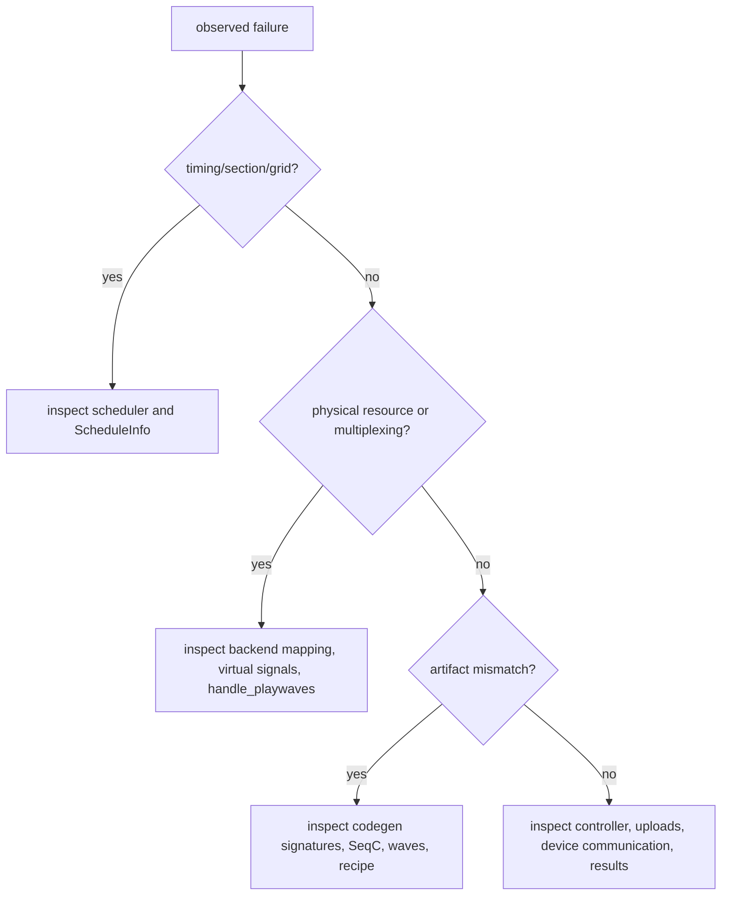

# Extension and Maintenance Guide

This chapter summarizes practical change points for maintainers. It assumes the conceptual pipeline from the earlier chapters: DSL and payload construction, global scheduling, backend resource mapping, AWG-local lowering, artifact generation, and runtime execution.

## Change-point map

| Desired change | Primary files | Risk area |
| --- | --- | --- |
| Add or adjust DSL syntax | `src/python/laboneq/dsl/experiment/experiment.py`, `section.py` | Payload builder must preserve enough information for Rust compilation. |
| Change compiler input conversion | `experiment_info_builder.py`, `compiler/workflow/compat.py` | Rust-side structures and compatibility shims may need synchronized updates. |
| Change timing rules | `laboneq-scheduler/src/timing_resolver/timing_calculator.rs`, `schedule_info.rs` | Section lengths, grids, and repetition behavior can affect all devices. |
| Change node conversion | `laboneq-scheduler/src/scheduled_to_ir.rs`, `laboneq-ir/src/node.rs` | Later codegen passes may rely on specific tree shapes and child offsets. |
| Add hardware resource constraints | `laboneq-qccs-backend/src/preprocessor.rs`, codegen device traits | Resource grouping and validation may change virtual-signal formation. |
| Change multiplexed waveform behavior | `codegenerator/src/virtual_signal.rs`, `passes/handle_playwaves.rs` | Overlap handling, oscillator validation, and waveform signatures are tightly coupled. |
| Change generated artifacts | `codegenerator/src/generator.rs`, `generate_awg_events.rs`, Python `seqc/code_generator.py` | Runtime recipe processing and device upload code must remain compatible. |
| Change runtime execution | `controller.py`, `near_time_runner.py`, `recipe_processor.py` | Compiled artifact contract should not be reinterpreted at runtime. |

## Safe debugging order

First identify the semantic stage. If an issue concerns section length, alignment, repetition, or grid placement, inspect the scheduler. If it concerns whether several logical pulses should become one waveform event, inspect virtual-signal creation and `handle_playwaves`. If it concerns the presence or shape of SeqC, waves, or command tables, inspect code-generation artifacts. If it concerns upload, execution, or acquisition return values, inspect the controller and recipe processor.

## Documentation-maintenance rule

Future documentation should keep the stage boundaries sharp. A chapter about scheduling should not casually claim that scheduling merges channels into physical waveforms. A chapter about runtime should not restate DSL construction. A chapter about IRs should name which IR owns which invariants. This discipline is essential because the code base uses multiple tree containers with similar names but different semantics.
