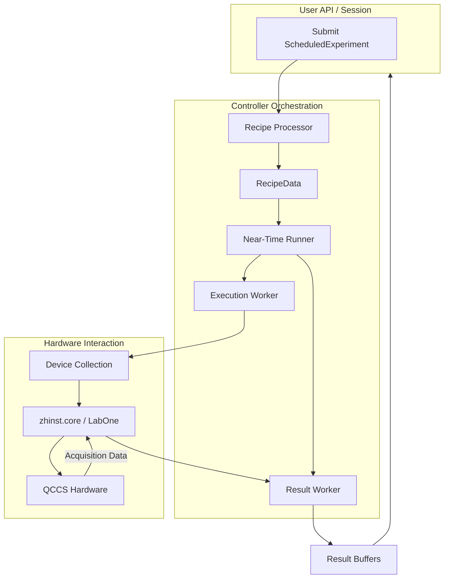
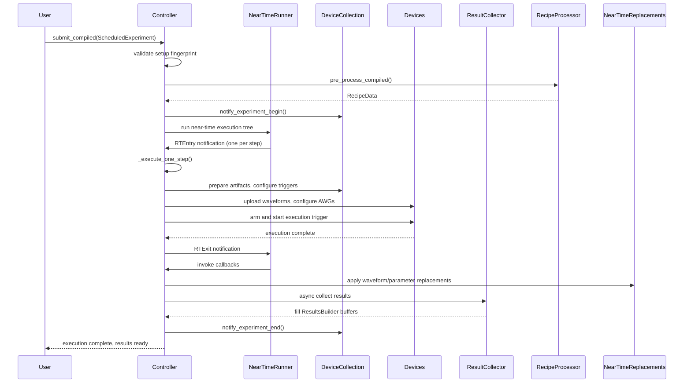
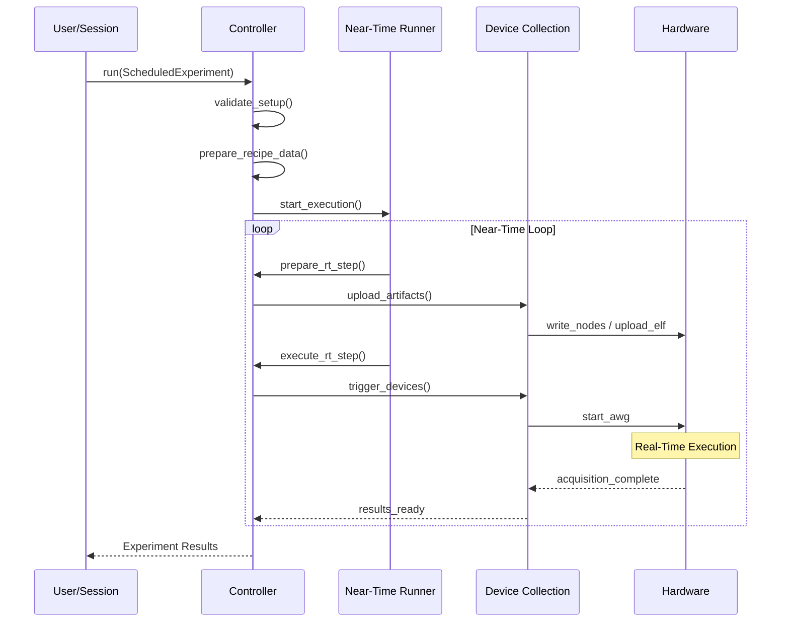

# Runtime and controller execution

This chapter provides a comprehensive developer-oriented overview of the runtime and controller execution components in the LabOne Q (`zhinst/laboneq`) codebase. It focuses on the abstractions and mechanisms that enable the execution of compiled quantum experiments on Zurich Instruments QCCS hardware and compatible third-party devices. The key concepts covered include the `ScheduledExperiment` data model, the `Controller` runtime orchestration, the `RecipeData` intermediate representation, near-time execution semantics, asynchronous workers, real-time step execution, result collection, callback handling, and waveform/parameter replacement flows.

This page is intended for developers maintaining or extending the LabOne Q runtime and controller layers. It explains what abstractions exist, why they exist, where they live in the source tree, who consumes them, and what invariants they maintain. The discussion is grounded in the inspected source code and official documentation, with explicit references to relevant files and modules.

---

## How to read this page as a maintainer

This page assumes familiarity with the LabOne Q overall architecture and the compilation pipeline described in earlier chapters, especially the Python DSL frontend, compiler IR, and scheduling passes. It builds on the understanding of the `ScheduledExperiment` as the compilation product handed off to the runtime, and the role of the `Controller` as the orchestrator of experiment execution.

The page is structured to first introduce the key data models (`ScheduledExperiment`, `RecipeData`), then describe the runtime execution flow, including near-time and real-time boundaries, asynchronous execution workers, and result collection. It concludes with a detailed Mermaid sequence diagram illustrating the runtime-controller interaction during experiment execution.

Source code references are provided as clickable links to the GitHub repository for quick navigation. The main Python packages involved are under `src/python/laboneq/controller` and `src/python/laboneq/data`, with supporting code in `src/python/laboneq/executor` and `src/python/laboneq/compiler/workflow/neartime_execution.py`.

---

## 1. ScheduledExperiment: The compiled experiment execution model

The `ScheduledExperiment` class is the central data model representing a compiled experiment ready for execution by the controller. It encapsulates all necessary information to run the experiment on hardware, including the device setup fingerprint, the compiled recipe, backend-specific artifacts, near-time execution trees, real-time loop properties, and result metadata.

### What is `ScheduledExperiment`?

`ScheduledExperiment` is a Python dataclass defined in [`src/python/laboneq/data/scheduled_experiment.py`](https://github.com/zhinst/laboneq/blob/main/src/python/laboneq/data/scheduled_experiment.py). It bundles together:

- **Setup fingerprint**: A hash or identifier representing the device setup state at compilation time, used to validate runtime compatibility.
- **Recipe**: The compiled sequence of instructions and waveform data for the experiment.
- **Artifacts**: Backend-specific code generation outputs such as SeqC source, ELF binaries, waveform pools, command tables, and pulse-to-waveform mappings.
- **Near-time execution tree**: A Python-side IR representing the near-time control flow, including parameter sweeps and callbacks.
- **Real-time loop properties**: Metadata describing the real-time acquisition loop, including acquisition type, repetition mode, and timing.
- **Result shape info**: Metadata describing the shape and mapping of results collected during execution.

### Why does `ScheduledExperiment` exist?

The compilation pipeline produces a `ScheduledExperiment` as the handoff artifact from the compiler to the runtime controller. This separation allows:

- Validation that the compiled experiment matches the current device setup.
- Decoupling of compilation from execution, enabling caching and reuse.
- Support for near-time software control loops and real-time hardware execution.
- Encapsulation of all necessary data for device-specific execution and result handling.

### Where does `ScheduledExperiment` live?

- Source: [`src/python/laboneq/data/scheduled_experiment.py`](https://github.com/zhinst/laboneq/blob/main/src/python/laboneq/data/scheduled_experiment.py)
- It is consumed primarily by the `Controller` class in [`src/python/laboneq/controller/controller.py`](https://github.com/zhinst/laboneq/blob/main/src/python/laboneq/controller/controller.py).

### Who consumes `ScheduledExperiment`?

- The `Controller` runtime uses it to validate, prepare, and execute the experiment.
- Device classes (`DeviceZI` subclasses) use the embedded recipe and artifacts to configure hardware.
- Near-time execution components interpret the near-time execution tree for software-controlled loops and callbacks.

### Invariants and constraints

- The setup fingerprint must match the current device setup to ensure compatibility.
- The recipe and artifacts must be consistent and complete for all devices involved.
- The near-time execution tree must be well-formed and correspond to the compiled real-time boundaries.
- Result shape metadata must accurately describe the expected data layout for acquisition results.

---

## 2. Controller: Orchestrating experiment execution

The `Controller` class is the runtime orchestrator responsible for managing experiment execution on hardware. It handles validation, preparation, near-time and real-time execution, asynchronous result collection, and callback invocation.

### What is the `Controller`?

`Controller` is a Python class defined in [`src/python/laboneq/controller/controller.py`](https://github.com/zhinst/laboneq/blob/main/src/python/laboneq/controller/controller.py). It manages:

- The current device collection and LabOne session.
- Validation of compiled experiments against the device setup.
- Construction of runtime `RecipeData` from the `ScheduledExperiment`.
- Asynchronous execution of near-time loops and real-time steps.
- Result collection and buffering.
- Invocation of user-registered callbacks.
- Management of waveform and parameter replacements.

### Why does the `Controller` exist?

The controller abstracts the complexity of running compiled experiments on heterogeneous hardware setups. It provides:

- A unified interface to submit compiled experiments and receive results.
- Coordination of asynchronous workers for execution and result collection.
- Integration with device-specific implementations for setup, upload, and triggering.
- Support for near-time software control loops that drive real-time hardware execution.
- Facilities for waveform and parameter replacement to enable dynamic experiment modification.

### Where does the `Controller` live?

- Source: [`src/python/laboneq/controller/controller.py`](https://github.com/zhinst/laboneq/blob/main/src/python/laboneq/controller/controller.py)
- It is used by higher-level session and API layers to run experiments.

### Who consumes the `Controller`?

- The LabOne Q session and API layers submit compiled experiments to the controller.
- Device classes implement hooks called by the controller for hardware interaction.
- Near-time runners and callback handlers interact with the controller for execution flow.

### Invariants and constraints

- The controller must ensure that the compiled experiment matches the current device setup fingerprint.
- It must maintain thread-safe asynchronous execution and result collection.
- It must correctly propagate parameter updates and replacements to the hardware recipe.
- It must guarantee that real-time execution steps are triggered in the correct order with proper synchronization.

---

## 3. RecipeData: The runtime intermediate representation

`RecipeData` is an internal runtime representation derived from the `ScheduledExperiment` that organizes the compiled recipe and device-specific execution data for efficient runtime use.

### What is `RecipeData`?

`RecipeData` is constructed by the `recipe_processor.pre_process_compiled()` function in [`src/python/laboneq/controller/recipe_processor.py`](https://github.com/zhinst/laboneq/blob/main/src/python/laboneq/controller/recipe_processor.py). It includes:

- `RtExecutionInfo`: Real-time execution metadata.
- Device-specific recipe data (`DeviceRecipeData`), including AWG configurations, channel properties, and artifact upload helpers.
- An `AttributeValueTracker` to track oscillator frequencies and device attributes during execution.
- Estimated wait times for execution and result transfer.
- Helpers for waveform and command-table preparation used by device classes.

### Why does `RecipeData` exist?

`RecipeData` serves as a bridge between the compiled recipe and the concrete device operations required at runtime. It enables:

- Device-specific validation and preparation of compiled artifacts.
- Efficient management of waveform and command-table uploads.
- Tracking of dynamic attribute changes during execution.
- Estimation of timing for synchronization and result collection.
- Encapsulation of runtime state needed by the controller and devices.

### Where does `RecipeData` live?

- Source: [`src/python/laboneq/controller/recipe_processor.py`](https://github.com/zhinst/laboneq/blob/main/src/python/laboneq/controller/recipe_processor.py)
- It is used internally by the `Controller` during execution.

### Who consumes `RecipeData`?

- The `Controller` uses it to prepare and run experiment steps.
- Device classes consume it to upload waveforms, configure AWGs, and manage triggers.
- The near-time runner uses it to propagate parameter changes and replacements.

### Invariants and constraints

- `RecipeData` must be consistent with the `ScheduledExperiment` it derives from.
- Device-specific data must be validated against the current hardware configuration.
- Attribute tracking must correctly reflect dynamic changes during execution.
- Timing estimates must be accurate to ensure proper synchronization.

---

## 4. Near-time execution and async workers

LabOne Q distinguishes between near-time (software-controlled) execution and real-time (hardware-timed) execution. Near-time execution manages parameter sweeps, callbacks, and preparation of real-time steps, while real-time execution runs the compiled hardware recipe.

### Near-time execution tree

Near-time execution is represented by a Python-side IR defined in [`src/python/laboneq/executor/executor.py`](https://github.com/zhinst/laboneq/blob/main/src/python/laboneq/executor/executor.py) and built from the DSL by [`execution_from_experiment.py`](https://github.com/zhinst/laboneq/blob/main/src/python/laboneq/executor/execution_from_experiment.py). The IR includes statements such as:

- `Sequence`: A sequence of statements.
- `ForLoop`: Near-time loops over sweep parameters.
- `ExecRT`: Real-time boundary execution.
- `ExecNeartimeCall`: Callback invocation.
- `SetSoftwareParam`: Parameter setting.
- `ExecSet`: Node writes.

The near-time IR is interpreted by the `NearTimeRunner` class in [`src/python/laboneq/controller/near_time_runner.py`](https://github.com/zhinst/laboneq/blob/main/src/python/laboneq/controller/near_time_runner.py), which drives the execution of near-time loops and triggers real-time steps.

### Asynchronous workers

The `Controller` manages asynchronous workers for:

- **Execution**: Running the near-time execution tree and triggering real-time steps.
- **Result collection**: Asynchronously collecting acquisition results from devices and filling result buffers.

This design decouples execution and result handling, improving responsiveness and throughput.

### Why near-time execution and async workers?

- Near-time execution allows flexible software control of parameter sweeps and callbacks without blocking real-time hardware.
- Async workers enable concurrent execution and result collection, essential for high-throughput quantum experiments.
- This separation supports dynamic waveform and parameter replacement during runtime.

### Where do these components live?

- Near-time IR and executor: [`src/python/laboneq/executor/`](https://github.com/zhinst/laboneq/tree/main/src/python/laboneq/executor)
- Near-time runner: [`src/python/laboneq/controller/near_time_runner.py`](https://github.com/zhinst/laboneq/blob/main/src/python/laboneq/controller/near_time_runner.py)
- Controller async workers: [`src/python/laboneq/controller/controller.py`](https://github.com/zhinst/laboneq/blob/main/src/python/laboneq/controller/controller.py)

### Who consumes these?

- The `Controller` uses the near-time runner to execute software loops.
- Device classes provide hooks for asynchronous result reading.
- User code can register callbacks invoked during near-time execution.

### Invariants and constraints

- Near-time loops must not nest real-time loops.
- Async workers must be thread-safe and properly synchronized.
- Callbacks must be invoked in the correct near-time step context.
- Result buffers must be preallocated and correctly indexed.

---

## 5. Real-time step execution and result collection

Each real-time step corresponds to one execution of the compiled hardware recipe with fixed parameter values. The controller manages the lifecycle of these steps.

### Real-time step execution

The controller method `_execute_one_step()` performs the following:

- Configures triggers and feedback registers.
- Propagates updated sweep parameters through the recipe attribute tracker.
- Applies waveform and phase-increment replacements.
- Prepares artifacts for upload.
- Waits for device channels to be ready.
- Arms and starts the execution trigger.
- Waits for device completion.
- Tears down the step and prepares for the next.

This method is called once per near-time step during near-time execution.

### Result collection

Result collection is handled asynchronously by a dedicated worker. It reads acquisition data from devices, fills the preallocated `ResultsBuilder` buffers, and signals completion to the controller.

### Why this design?

- Separating step execution and result collection allows pipelining of experiment runs.
- It supports dynamic parameter and waveform replacement between steps.
- It enables efficient use of hardware and software resources.

### Where does this logic live?

- Step execution: [`src/python/laboneq/controller/controller.py`](https://github.com/zhinst/laboneq/blob/main/src/python/laboneq/controller/controller.py), method `_execute_one_step()`.
- Result collection: [`src/python/laboneq/controller/results.py`](https://github.com/zhinst/laboneq/blob/main/src/python/laboneq/controller/results.py).

### Who consumes this?

- The controller runtime orchestrates step execution and result collection.
- Device classes implement hooks for ready/done waiting and data reading.
- User code consumes the final results after execution.

### Invariants and constraints

- Step execution must be atomic and synchronized with hardware triggers.
- Result buffers must match the expected acquisition shape.
- Device readiness and completion must be correctly detected.
- Replacement state must be cleared between steps.

---

## 6. Callbacks and replacements

LabOne Q supports user-defined callbacks and waveform/parameter replacements during experiment execution.

### Callbacks

Callbacks are user-provided Python functions invoked during near-time execution steps. They can:

- Access current parameter values.
- Modify experiment state.
- Trigger side effects such as logging or adaptive control.

Callbacks are represented in the near-time IR as `ExecNeartimeCall` statements and invoked via the `RuntimeContextImpl` in [`src/python/laboneq/controller/runtime_context_impl.py`](https://github.com/zhinst/laboneq/blob/main/src/python/laboneq/controller/runtime_context_impl.py).

### Replacements

Replacements allow dynamic modification of:

- Waveforms: Substituting sampled waveforms in the compiled recipe.
- Phase increments: Adjusting phase-increment command-table entries.
- Parameters: Updating software parameters during near-time execution.

The controller tracks pending replacements in a `NearTimeReplacements` object ([`src/python/laboneq/controller/near_time_replacement.py`](https://github.com/zhinst/laboneq/blob/main/src/python/laboneq/controller/near_time_replacement.py)) and applies them before each real-time step.

### Why callbacks and replacements?

- They enable adaptive experiments and feedback control.
- They allow dynamic tuning without recompilation.
- They support complex experiment logic beyond static pulse sequences.

### Where do these live?

- Callbacks: Near-time IR and runtime context in `executor` and `controller/runtime_context_impl.py`.
- Replacements: `NearTimeReplacements` in `controller/near_time_replacement.py`.
- Controller applies replacements in `controller/controller.py`.

### Who consumes these?

- User code registers callbacks and replacements.
- The controller invokes callbacks and applies replacements during execution.
- Device classes may react to replacement changes.

### Invariants and constraints

- Callbacks must be side-effect safe and non-blocking.
- Replacements must be consistent with the compiled recipe.
- Replacement state must be cleared or updated correctly between steps.

---

## 7. Summary table of key runtime/controller components

| Component               | Location (source path)                                         | Purpose                                                                                   | Consumers                         | Key invariants/constraints                                      |
|-------------------------|---------------------------------------------------------------|-------------------------------------------------------------------------------------------|----------------------------------|----------------------------------------------------------------|
| `ScheduledExperiment`   | `src/python/laboneq/data/scheduled_experiment.py`             | Bundles compiled experiment data for runtime execution                                   | Controller, devices              | Setup fingerprint match, recipe/artifacts consistency          |
| `Controller`            | `src/python/laboneq/controller/controller.py`                 | Orchestrates experiment execution, manages async workers, result collection              | Session, devices, near-time runner| Thread-safe async execution, setup validation                   |
| `RecipeData`            | `src/python/laboneq/controller/recipe_processor.py`           | Runtime IR organizing recipe and device-specific data                                   | Controller, devices              | Consistency with `ScheduledExperiment`, device validation      |
| Near-time IR & executor | `src/python/laboneq/executor/`                                | Represents near-time control flow, parameter sweeps, callbacks                           | NearTimeRunner, Controller       | No nested real-time loops, correct callback invocation          |
| `NearTimeRunner`        | `src/python/laboneq/controller/near_time_runner.py`           | Executes near-time IR asynchronously, triggers real-time steps                           | Controller                      | Correct step synchronization, loop index tracking              |
| Async workers           | `src/python/laboneq/controller/controller.py`                 | Concurrent execution and result collection                                              | Controller                      | Thread-safe, proper synchronization                            |
| Callbacks               | `src/python/laboneq/controller/runtime_context_impl.py`       | User-defined functions invoked during near-time execution                               | NearTimeRunner, Controller       | Side-effect safe, non-blocking                                 |
| Replacements            | `src/python/laboneq/controller/near_time_replacement.py`      | Tracks and applies dynamic waveform/parameter replacements                              | Controller                      | Consistency with recipe, cleared between steps                 |

---

## 8. Runtime and controller execution sequence diagram

The following Mermaid sequence diagram illustrates the high-level interaction between the main runtime components during experiment execution. It shows the submission of a compiled experiment, near-time execution loops, real-time step execution, callback invocation, replacement application, and result collection.

---

## 9. Practical developer orientation

### What exists?

- A rich data model (`ScheduledExperiment`) encapsulating compiled experiment data.
- A runtime controller (`Controller`) managing execution lifecycle and async workers.
- A runtime intermediate representation (`RecipeData`) bridging compilation and hardware.
- A near-time execution IR and runner for software-controlled loops and callbacks.
- Facilities for asynchronous result collection and dynamic waveform/parameter replacement.

### Why does it exist?

- To provide a robust, flexible, and efficient runtime environment for executing complex quantum experiments.
- To separate concerns between compilation, near-time control, real-time execution, and result handling.
- To support adaptive experiments with dynamic control and feedback.
- To abstract hardware-specific details behind device classes and runtime hooks.

### Where does it live?

- Python packages under `src/python/laboneq/controller`, `src/python/laboneq/data`, and `src/python/laboneq/executor`.
- The controller is the main runtime entry point for experiment execution.
- Device classes under `controller/devices` implement hardware-specific logic.

### Who consumes it?

- The LabOne Q session and API layers submit compiled experiments to the controller.
- Device classes consume recipe and artifact data to configure hardware.
- User code registers callbacks and replacements for adaptive control.
- Near-time runners and async workers manage execution flow and results.

### What invariants does it carry?

- Setup fingerprint consistency between compilation and execution.
- Correct synchronization between near-time loops and real-time hardware steps.
- Thread-safe asynchronous execution and result collection.
- Accurate mapping between compiled recipe and runtime device configuration.
- Proper clearing and application of dynamic replacements between steps.

---

## References used on this page

1. LabOne Q repository: https://github.com/zhinst/laboneq  
2. `ScheduledExperiment` source: https://github.com/zhinst/laboneq/blob/main/src/python/laboneq/data/scheduled_experiment.py  
3. `Controller` source: https://github.com/zhinst/laboneq/blob/main/src/python/laboneq/controller/controller.py  
4. `RecipeData` and recipe processor: https://github.com/zhinst/laboneq/blob/main/src/python/laboneq/controller/recipe_processor.py  
5. Near-time execution IR and executor: https://github.com/zhinst/laboneq/blob/main/src/python/laboneq/executor/executor.py  
6. Near-time runner: https://github.com/zhinst/laboneq/blob/main/src/python/laboneq/controller/near_time_runner.py  
7. Callbacks and runtime context: https://github.com/zhinst/laboneq/blob/main/src/python/laboneq/controller/runtime_context_impl.py  
8. Replacements: https://github.com/zhinst/laboneq/blob/main/src/python/laboneq/controller/near_time_replacement.py  
9. Result collection: https://github.com/zhinst/laboneq/blob/main/src/python/laboneq/controller/results.py  
10. LabOne Q user manual, runtime architecture overview: https://docs.zhinst.com/labone_q_user_manual/core/index.html  
11. LabOne Q README and architecture diagram: https://github.com/zhinst/laboneq/blob/main/README.md

## Runtime execution sequence

