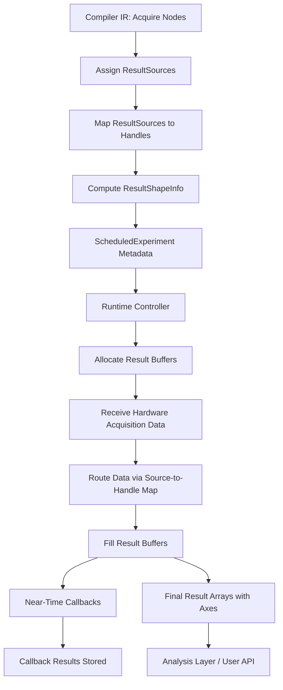

# Results, handles, and data shapes

This page provides a comprehensive developer-oriented overview of the result data abstractions, handle shapes, axes, chunking, and acquisition behaviors in the LabOne Q compiler and runtime system. It explains the purpose and structure of `ResultShapeInfo`, the mapping between hardware result sources and result handles, the semantics of axes and chunking in result data, and the distinctions between raw, integrated, spectroscopy, and discrimination acquisition types. It also covers the role of result builders and callback results in the runtime controller. The explanations are grounded in the LabOne Q source code and architecture as of the current main branch [1][2][3].

---

## Maintainer orientation

This page is intended for developers who maintain or extend the LabOne Q compiler, runtime, or controller components. It assumes familiarity with the overall LabOne Q architecture, the Python DSL frontend, the Rust compiler IR, and the runtime controller execution model. The page focuses on the data shapes and metadata that describe experiment results, how they are constructed, and how they relate to hardware acquisition types and compiler outputs.

Key source locations to consult for implementation details include:

- Python `ResultShapeInfo` and related classes in `src/python/laboneq/data/experiment_results/` and `src/python/laboneq/controller/results.py`.
- Compiler output and result handle mappings in `src/python/laboneq/compiler/seqc/recipe_generator.py` and `src/python/laboneq/_rust/codegenerator/__init__.pyi`.
- Runtime controller result collection and callback handling in `src/python/laboneq/controller/controller.py` and `src/python/laboneq/controller/near_time_runner.py`.
- Rust IR and acquisition node definitions in `src/rust/laboneq-ir/src/ir.rs` and `src/rust/laboneq-ir/src/node.rs`.

This page explains the invariants and design rationales behind these abstractions to aid in debugging, extending acquisition types, or integrating new hardware backends.

---

## 1. Overview of ResultShapeInfo and result handles

### `ResultShapeInfo` data model

`ResultShapeInfo` is a central metadata abstraction that describes the shape, axes, and handle mappings of experiment results produced by the compiler and runtime. It captures how raw hardware acquisition data and integrated results are organized into multi-dimensional arrays, how chunking of sweep parameters affects result shapes, and how hardware result sources map to logical result handles exposed to the user.

This abstraction exists to provide a consistent, device-agnostic description of result data shapes that can be used by the runtime controller to allocate buffers, by analysis tools to interpret data arrays, and by the compiler to generate appropriate acquisition and integration instructions.

### Source references

In the Python codebase, `ResultShapeInfo` and related classes reside primarily in:

- `src/python/laboneq/data/experiment_results/` — data classes describing result metadata.
- `src/python/laboneq/controller/results.py` — runtime result buffer management and handle mapping.
- `src/python/laboneq/compiler/seqc/recipe_generator.py` — generation of result handle metadata during code generation.
- `src/python/laboneq/_rust/codegenerator/__init__.pyi` — Rust-side result handle and source definitions exposed to Python.

### Result-processing integration

- The **runtime controller** uses it to allocate result buffers and interpret incoming acquisition data.
- The **compiler** produces it as part of the compilation output, describing the expected result layout.
- The **analysis layer** and **user-facing APIs** consume it to interpret raw and integrated data arrays.
- The **near-time callback system** uses it to correlate callback results with experiment steps.

### Invariants carried by `ResultShapeInfo`

- Each acquisition handle corresponds to a unique hardware acquisition source or integrated result.
- The shape of each handle's data array is fully described by its axes, which include sweep parameters and acquisition-specific dimensions.
- Chunking of sweep parameters is reflected in the shape metadata, allowing partial result retrieval and incremental processing.
- The mapping from hardware result sources to handles is stable and deterministic, enabling consistent data interpretation across runs.

---

## 2. Result handles and axes: structure and semantics

### Result handles

A **result handle** is an identifier for a particular acquisition or integrated data stream produced by the hardware during experiment execution. Handles abstract over the hardware-specific result sources (e.g., AWG channels, integration units) and provide a logical indexing scheme for result data.

Handles are represented as integer indices or keys in the compiler and runtime. The compiler generates a mapping from hardware **ResultSource** objects (which identify the physical acquisition channel, integration kernel, or discrimination unit) to these handles.

### Axes and data shapes

Each result handle corresponds to a multi-dimensional data array. The dimensions (axes) of this array are described by:

- **Sweep axes**: Correspond to near-time sweep parameters that index repeated experiment runs.
- **Acquisition axes**: Correspond to hardware acquisition dimensions such as integration length, kernel count, or discrimination states.
- **Chunking axes**: Represent subdivision of sweep parameters into chunks for incremental compilation and execution.

The axes are named and typed, and their sizes are known at compile time or runtime. This allows the runtime to allocate appropriately shaped buffers and the analysis layer to interpret the data.

### Chunking and partial results

LabOne Q supports **chunking** of sweep parameters to enable compilation and execution of large experiments in smaller pieces. Chunking affects result shapes by adding an outer chunk axis or subdividing existing sweep axes.

The `ResultShapeInfo` tracks the chunking axis index and size, allowing the runtime and analysis to reconstruct the full result shape by concatenating chunk results.

---

## 3. ResultSource maps and acquisition types

### ResultSource: mapping hardware to logical handles

The compiler and runtime maintain a mapping from **ResultSource** objects to result handles. A `ResultSource` identifies a hardware acquisition or integration unit, including:

- The signal or channel being acquired.
- The integration kernel or weight applied.
- The acquisition length or repetition count.
- The acquisition type (raw, integrated, spectroscopy, discrimination).

This mapping is crucial for routing hardware data into the correct result buffers and for associating acquisition metadata with the data.

### Acquisition types and their behavior

LabOne Q supports several acquisition types, each with distinct data shapes and runtime semantics:

| Acquisition Type | Description | Data Shape Characteristics | Source of Metadata |
|------------------|-------------|----------------------------|--------------------|
| **Raw**          | Direct digitized data from the hardware acquisition channel. | Large arrays with time samples, often chunked. | Compiler IR acquisition nodes, hardware setup. |
| **Integrated**   | Data integrated with specified kernels over acquisition windows. | Smaller arrays indexed by kernel count and sweep parameters. | Integration kernel definitions, compiler output. |
| **Spectroscopy** | Frequency-domain or parameter-swept acquisition data. | Multi-dimensional arrays with frequency or parameter axes. | Compiler and runtime metadata. |
| **Discrimination** | Multi-state discrimination results from hardware classifiers. | Arrays with state indices and sweep axes. | Discrimination kernel and hardware config. |

The compiler IR (`IrKind::Acquire` nodes) and the Rust code generator produce detailed metadata for each acquisition type, including integration lengths, kernel weights, and handle assignments.

---

## 4. Result builder and callback results

### Result builders

The **result builder** is a runtime component responsible for:

- Allocating result buffers according to `ResultShapeInfo`.
- Receiving raw and integrated data from hardware acquisition callbacks.
- Organizing data into the correct handle and axis positions.
- Managing chunked result assembly and incremental updates.

In the Python runtime, this logic is implemented in `src/python/laboneq/controller/results.py`. The builder ensures that data from the hardware is correctly shaped and indexed for downstream consumption.

### Callback results

LabOne Q supports **near-time callbacks** that can process intermediate results during experiment execution. Callback results are associated with specific handles and steps in the near-time execution tree.

The runtime stores callback return values in the experiment results, indexed by the corresponding handle and step key. This mechanism enables real-time data analysis, adaptive experiment control, and dynamic feedback.

---

## 5. Detailed data shape and handle metadata

### ResultShapeInfo fields

`ResultShapeInfo` contains the following key fields:

| Field Name            | Description |
|-----------------------|-------------|
| `handle_shapes`       | A mapping from result handle indices to their data shapes (tuples of axis sizes). |
| `handle_axis_names`   | Names of axes for each handle, e.g., sweep parameters, kernel indices. |
| `handle_axis_values`  | Values along each axis, such as sweep parameter values or kernel labels. |
| `chunk_axis_index`    | The index of the chunking axis in the shape, if chunking is used. |
| `match_case_mask`     | Optional mask arrays for match/case conditional execution results. |
| `source_to_handle_map`| Mapping from hardware `ResultSource` objects to result handles. |

This structure allows the runtime and analysis layers to interpret raw data arrays in terms of experiment parameters and acquisition semantics.

### Example: handle shape for integrated acquisition

An integrated acquisition handle might have a shape like `(num_sweeps, num_kernels)`, where:

- `num_sweeps` corresponds to the number of sweep points in the near-time parameter space.
- `num_kernels` corresponds to the number of integration kernels applied.

The axes would be named `["sweep", "kernel"]`, and the axis values would list the sweep parameter values and kernel labels.

---

## 6. Raw, integrated, spectroscopy, and discrimination acquisition behavior

### Raw acquisition

Raw acquisition data is typically large and time-resolved. The compiler schedules acquisition nodes with specified lengths and assigns handles to raw data streams. The runtime collects raw data buffers from the hardware and stores them in arrays shaped by chunking and sweep parameters.

### Integrated acquisition

Integrated acquisitions apply kernels to raw data to produce scalar or vector results per acquisition window. The compiler generates integration weights and kernel definitions, and assigns handles to integrated results. The runtime collects integrated data and organizes it by kernel and sweep axes.

### Spectroscopy acquisition

Spectroscopy acquisitions involve frequency sweeps or parameter scans producing multi-dimensional data arrays. The compiler and runtime track frequency axes and parameter sweeps, producing result shapes with corresponding axes.

### Discrimination acquisition

Discrimination acquisitions produce classification results, such as qubit state assignments. The compiler configures discrimination kernels and assigns handles to discrimination results. The runtime collects classification outputs and arranges them by sweep and state axes.

---

## 7. ResultShapeInfo in the compilation and runtime pipeline

### Compilation pipeline

- The compiler backend (Rust) extracts acquisition nodes from the scheduled IR (`IrNode` with `IrKind::Acquire`).
- It assigns unique handles to each acquisition source and integration kernel.
- It computes the expected data shapes and axes based on sweep parameters, chunking, and acquisition type.
- The compiler outputs `ResultShapeInfo` as part of the `ScheduledExperiment` metadata.
- The Python `RealtimeCompiler` and `CodeGenerator` wrap and expose this metadata to the runtime.

### Runtime pipeline

- The controller receives the `ScheduledExperiment` with `ResultShapeInfo`.
- It allocates result buffers according to handle shapes and axes.
- During experiment execution, acquisition data is routed to the correct buffers using the source-to-handle map.
- Near-time callbacks receive partial results indexed by handles and step keys.
- After execution, the runtime exposes result arrays with full shape and axis metadata for analysis.

---

## 8. Mermaid diagram: Result data flow and shape mapping

---

## 9. Practical developer orientation

| Aspect | Description | Location(s) | Consumers | Notes |
|--------|-------------|-------------|-----------|-------|
| `ResultShapeInfo` | Metadata describing result handle shapes, axes, chunking, and source mappings. | `src/python/laboneq/data/experiment_results/` | Runtime controller, analysis, compiler output | Central to result data interpretation. |
| Result handles | Logical identifiers for acquisition/integration data streams. | Compiler Rust IR, Python codegen, runtime | Runtime buffer management, callbacks | Stable mapping from hardware sources. |
| Axes and chunking | Dimensions of result arrays, including sweep and chunk axes. | Compiler output, runtime buffer allocation | Runtime, analysis | Supports incremental execution and partial results. |
| Acquisition types | Raw, integrated, spectroscopy, discrimination data with distinct shapes. | Rust IR `IrKind::Acquire`, codegen | Runtime, hardware interface | Defines data layout and processing semantics. |
| Result builder | Runtime component managing buffer allocation and data routing. | `src/python/laboneq/controller/results.py` | Controller execution, callbacks | Ensures correct data shape and indexing. |
| Callback results | Near-time callback outputs linked to handles and steps. | `src/python/laboneq/controller/near_time_runner.py` | Runtime, user callbacks | Enables adaptive experiment control. |

---

## 10. Summary

The `ResultShapeInfo` abstraction and related handle and axis metadata form the backbone of LabOne Q's result data management. They provide a device-agnostic, consistent description of how hardware acquisition data maps into multi-dimensional arrays indexed by sweep parameters, kernels, and chunking. This metadata is produced by the compiler, consumed by the runtime controller for buffer allocation and data routing, and exposed to analysis layers and user APIs for interpretation.

Understanding these abstractions is essential for maintaining the compiler's code generation correctness, extending acquisition types, implementing new hardware backends, and ensuring that runtime result collection and callback mechanisms function correctly.

---

## References used on this page

[1] LabOne Q repository, main branch: https://github.com/zhinst/laboneq  
[2] `src/python/laboneq/data/experiment_results/` and `src/python/laboneq/controller/results.py` — Result data classes and runtime result management  
[3] `src/python/laboneq/compiler/seqc/recipe_generator.py` and `src/python/laboneq/_rust/codegenerator/__init__.pyi` — Compiler code generation and result handle metadata  
[4] `src/python/laboneq/controller/controller.py` and `src/python/laboneq/controller/near_time_runner.py` — Runtime controller execution and callback result handling  
[5] `src/rust/laboneq-ir/src/ir.rs` and `src/rust/laboneq-ir/src/node.rs` — Rust IR acquisition node definitions and result source mapping
