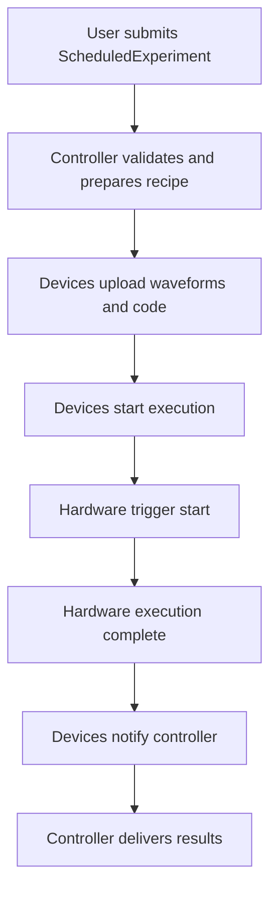

# Source reference map

This page provides a comprehensive source reference map for the `zhinst/laboneq` codebase, intended as a dense developer-oriented guide to the most important files, classes, and functions. It emphasizes concrete source locations, implementation roles, integration boundaries, and correctness constraints. Source links to the GitHub repository are included for direct inspection. This map complements the conceptual and architectural documentation by grounding the developer in the concrete code structure and key implementation artifacts.

---

## Maintainer orientation

This page is organized into several sections:

- **Module-to-responsibility tables**: High-level mapping of major Python and Rust modules to their primary responsibilities and consumers.
- **Key source files and classes**: Dense tables listing important files, classes, and functions, with explanations of their role and links to source.
- **Cross-cutting notes**: Explanations of key abstractions, invariants, and relationships between components.
- **Mermaid diagrams**: Visual summaries of layered architecture and compilation/runtime pipelines.

Maintainers should use this page as a quick lookup to understand where functionality lives, how components relate, and which parts of the codebase to modify or extend for specific tasks. The page is not a tutorial but a reference map to orient development and maintenance efforts.

### Canonical stage landmarks

The early conceptual chapters deliberately avoid long source inventories. When a maintainer has already identified the semantic boundary involved in a change, the following table provides the compact starting points for source inspection.

| Concern | Primary source locations |
| --- | --- |
| Python experiment object graph | `src/python/laboneq/dsl/experiment/experiment.py`, `section.py` |
| Payload construction | `src/python/laboneq/implementation/payload_builder/experiment_info_builder/experiment_info_builder.py` |
| Compiler workflow entry | `src/python/laboneq/compiler/workflow/compiler.py`, `realtime_compiler.py`, `compat.py` |
| Rust scheduler | `src/rust/laboneq-scheduler/src/scheduler.rs`, `scheduled_node.rs`, `schedule_info.rs`, `timing_resolver/timing_calculator.rs` |
| Shared IR container | `src/rust/laboneq-ir/src/node.rs`, `ir.rs`, `experiment.rs` |
| Backend preprocessing | `src/rust/laboneq-qccs-backend/src/preprocessor.rs` |
| Feedback representation and hardware lowering | `src/python/laboneq/dsl/experiment/section.py`, `src/rust/codegenerator/src/handle_feedback_registers.rs`, `src/rust/codegenerator/src/sampled_event_handler/handler.rs`, `src/python/laboneq/controller/recipe_processor.py`, `src/python/laboneq/controller/devices/device_leader_base.py` |
| Code-generator resource fanout and virtual signals | `src/rust/codegenerator/src/ir_adapter.rs`, `passes/fanout_awg.rs`, `virtual_signal.rs` |
| Pulse-to-waveform lowering | `src/rust/codegenerator/src/passes/handle_playwaves.rs` |
| Python runtime controller | `src/python/laboneq/controller/controller.py`, `near_time_runner.py`, `recipe_processor.py` |
| Quantum elements and QPU | `src/python/laboneq/dsl/quantum/quantum_element.py`, `qpu.py`, `qpu_topology.py` |
| Quantum operations | `src/python/laboneq/dsl/quantum/quantum_operations.py`, `_multimethod.py` |
| Workflow graph and execution | `src/python/laboneq/workflow/blocks/workflow_block.py`, `task_block.py`, `executor.py`, `reference.py`, `result.py` |

---

## Module-to-responsibility tables

### Python package modules and their responsibilities

| Module path | Primary responsibility | Key classes/functions | Consumers | Notes |
|-------------|------------------------|----------------------|-----------|-------|
| `laboneq.dsl.experiment` | User-facing Python DSL for experiment definition | `Experiment`, `Section`, `AcquireLoopRt`, `Sweep`, `Match`, `Case`, context-manager builtins | User scripts, payload builder | Defines the frontend experiment tree, DSL operation helpers, and context-manager construction semantics [src/python/laboneq/dsl/experiment/experiment.py](https://github.com/zhinst/laboneq/blob/main/src/python/laboneq/dsl/experiment/experiment.py) |
| `laboneq.dsl.device` | User-facing setup, logical-signal, and calibration model | `DeviceSetup`, instruments, logical signal groups, physical channels | Session, compiler workflow, controller setup conversion | Represents the experiment-to-hardware boundary before backend resource mapping [src/python/laboneq/dsl/device/device_setup.py](https://github.com/zhinst/laboneq/blob/main/src/python/laboneq/dsl/device/device_setup.py) |
| `laboneq.dsl.session` | Stateful user-facing compilation and execution façade | `Session.compile()`, `Session.run()`, `Session.submit()`, `show_pulse_sheet()` | User scripts, controller, pulse sheet viewer | Holds frontend state and bridges compiled experiments into runtime submission [src/python/laboneq/dsl/session.py](https://github.com/zhinst/laboneq/blob/main/src/python/laboneq/dsl/session.py) |
| `laboneq.serializers` | Versioned JSON/YAML persistence for public LabOne Q objects | `to_dict`, `from_dict`, public serializers | User persistence, offline workflows, compatibility migration | Serializes experiments, setups, compiled experiments, results, quantum elements, and workflow objects [src/python/laboneq/serializers/core.py](https://github.com/zhinst/laboneq/blob/main/src/python/laboneq/serializers/core.py) |
| `laboneq.dsl.quantum` | Higher-level quantum-object model over DSL experiments | `QPU`, `QuantumElement`, `QuantumOperations` | Application packages, workflows, experiment factories | Produces ordinary DSL experiments, signal maps, and calibration from quantum-object state [src/python/laboneq/dsl/quantum](https://github.com/zhinst/laboneq/tree/main/src/python/laboneq/dsl/quantum) |
| `laboneq.workflow` | Decorated task-graph execution for experimental procedures | `workflow`, `task`, compile/run tasks | Applications, calibration workflows, notebook orchestration | Coordinates build, compile, run, analyze, and update steps around lower-level LabOne Q APIs [src/python/laboneq/workflow](https://github.com/zhinst/laboneq/tree/main/src/python/laboneq/workflow) |
| `laboneq.implementation.payload_builder` | Converts DSL + setup into compiler input payloads | `ExperimentInfoBuilder` | Compiler workflow | Builds `ExperimentInfo` data structures for compiler input [src/python/laboneq/implementation/payload_builder/experiment_info_builder/experiment_info_builder.py](https://github.com/zhinst/laboneq/blob/main/src/python/laboneq/implementation/payload_builder/experiment_info_builder/experiment_info_builder.py) |
| `laboneq.compiler.workflow` | Orchestration of compilation pipeline | `Compiler`, `RealtimeCompiler`, compatibility bridge functions | User-facing compile API, controller | Coordinates Python-to-Rust handoff, scheduling, code generation [src/python/laboneq/compiler/workflow/compiler.py](https://github.com/zhinst/laboneq/blob/main/src/python/laboneq/compiler/workflow/compiler.py) |
| `laboneq.compiler.scheduler` | Scheduling and timing grid enforcement | `Scheduler` | Compiler workflow | Implements scheduling passes, timing validation, chunking [src/python/laboneq/compiler/scheduler/scheduler.py](https://github.com/zhinst/laboneq/blob/main/src/python/laboneq/compiler/scheduler/scheduler.py) |
| `laboneq.compiler.seqc` | SeqC code generation and linking | `CodeGenerator`, `SeqCLinker`, `RecipeGenerator` | Compiler workflow | Generates device-specific SeqC source, waveforms, command tables [src/python/laboneq/compiler/seqc/code_generator.py](https://github.com/zhinst/laboneq/blob/main/src/python/laboneq/compiler/seqc/code_generator.py) |
| `laboneq.controller` | Runtime experiment execution and device control | `Controller`, `NearTimeRunner`, `RecipeProcessor` | User runtime, session | Manages device connections, asynchronous execution, result collection [src/python/laboneq/controller/controller.py](https://github.com/zhinst/laboneq/blob/main/src/python/laboneq/controller/controller.py) |
| `laboneq.controller.devices` | Device abstractions and hardware communication | `DeviceZI`, `DeviceShfqa`, `DeviceHdawg`, etc. | Controller | Implements hardware-specific setup, upload, execution, and result reading |
| `laboneq.executor` | Near-time execution IR and interpreter | `ExecutionFactoryFromExperiment`, `Executor` | Controller, runtime | Builds and interprets near-time execution trees from DSL [src/python/laboneq/executor/execution_from_experiment.py](https://github.com/zhinst/laboneq/blob/main/src/python/laboneq/executor/execution_from_experiment.py) |
| `laboneq.data` | Data models for experiment info, setup, results | `ExperimentInfo`, `ScheduledExperiment`, `ResultShapeInfo` | Compiler, controller | Defines shared data structures for compilation and runtime |
| `laboneq._rust.compiler` | Rust compiler bridge exposed to Python | `build_experiment_capnp`, `schedule_experiment` | Compiler workflow | Converts Python experiment info to Rust IR, runs scheduling [src/python/laboneq/_rust/compiler/__init__.pyi](https://github.com/zhinst/laboneq/blob/main/src/python/laboneq/_rust/compiler/__init__.pyi) |
| `laboneq._rust.codegenerator` | Rust code generator bridge | `generate_code` | Compiler workflow | Generates SeqC and device artifacts from Rust IR [src/python/laboneq/_rust/codegenerator/__init__.pyi](https://github.com/zhinst/laboneq/blob/main/src/python/laboneq/_rust/codegenerator/__init__.pyi) |

### Rust crates and their responsibilities

| Crate path | Primary responsibility | Key structs/enums | Consumers | Notes |
|------------|------------------------|------------------|-----------|-------|
| `laboneq-ir` | Central Rust intermediate representation | `ExperimentIr`, `IrNode`, `IrKind`, `Section`, `PlayPulse`, `Acquire` | Rust compiler, code generator | Timed tree IR of scheduled experiment, with device setup and parameters [src/rust/laboneq-ir/src/lib.rs](https://github.com/zhinst/laboneq/blob/main/src/rust/laboneq-ir/src/lib.rs) |
| `laboneq-compiler-py` | PyO3 Rust compiler bridge | `build_experiment_capnp`, `schedule_experiment` | Python compiler workflow | Deserializes Cap'n Proto, runs backend preprocessing, scheduling, validation [src/rust/laboneq-compiler-py/src/lib.rs](https://github.com/zhinst/laboneq/blob/main/src/rust/laboneq-compiler-py/src/lib.rs) |
| `laboneq-scheduler` | Scheduling passes and lowering | `Scheduler`, `ScheduledNode`, lowering functions | Rust compiler bridge | Validates timing, resolves parameters, lowers DSL tree to timed IR [src/rust/laboneq-scheduler/src/scheduler.rs](https://github.com/zhinst/laboneq/blob/main/src/rust/laboneq-scheduler/src/scheduler.rs) |
| `laboneq-qccs-backend` | QCCS hardware-specific backend preprocessing | `QccsBackendPreprocessedData`, `BackendSignal` | Rust compiler bridge | Maps logical signals to AWG devices, validates device combos, computes delays [src/rust/laboneq-qccs-backend/src/preprocessor.rs](https://github.com/zhinst/laboneq/blob/main/src/rust/laboneq-qccs-backend/src/preprocessor.rs) |
| `laboneq-rust` | Rust extension root crate | `generate_code` | Python code generator wrapper | Exposes Rust code generation to Python [src/rust/laboneq-rust/src/lib.rs](https://github.com/zhinst/laboneq/blob/main/src/rust/laboneq-rust/src/lib.rs) |
| `laboneq-dsl` | Rust DSL operation tree definitions | `ExperimentNode`, `Operation` variants | Rust scheduler, compiler passes | Normalized Rust DSL tree consumed by scheduler and lowering [src/rust/laboneq-dsl/src/operation/variants.rs](https://github.com/zhinst/laboneq/blob/main/src/rust/laboneq-dsl/src/operation/variants.rs) |

---

## Key source files, classes, and functions

The following tables list important source files, classes, and functions, with explanations of their role, location, and source links.

### Python DSL frontend

| File | Key classes/functions | Description | Source link |
|-------|----------------------|-------------|-------------|
| `src/python/laboneq/dsl/experiment/experiment.py` | `Experiment` | Main user-facing container for experiment definition. Holds sections, parameters, and device-agnostic experiment structure. | [experiment.py](https://github.com/zhinst/laboneq/blob/main/src/python/laboneq/dsl/experiment/experiment.py) |
| `src/python/laboneq/dsl/experiment/builtins.py` | `experiment`, `section`, `sweep`, `play`, `acquire`, `measure`, `map_signal` | Public DSL helper layer that users import; helpers create context managers or append operations to the active context. | [builtins.py](https://github.com/zhinst/laboneq/blob/main/src/python/laboneq/dsl/experiment/builtins.py) |
| `src/python/laboneq/dsl/experiment/context.py` | `push_context`, `pop_context`, `peek_context`, `iter_contexts` | Thread-local context stack used by experiment and section managers during ordinary Python execution. | [context.py](https://github.com/zhinst/laboneq/blob/main/src/python/laboneq/dsl/experiment/context.py) |
| `src/python/laboneq/dsl/experiment/experiment_context.py` | `ExperimentContextManager`, `ExperimentContext` | Creates the active experiment object and applies deferred experiment calibration when the context exits successfully. | [experiment_context.py](https://github.com/zhinst/laboneq/blob/main/src/python/laboneq/dsl/experiment/experiment_context.py) |
| `src/python/laboneq/dsl/experiment/section_context.py` | Section context-manager classes | Creates section objects, pushes nested section contexts, and auto-attaches completed sections to their parent. | [section_context.py](https://github.com/zhinst/laboneq/blob/main/src/python/laboneq/dsl/experiment/section_context.py) |
| `src/python/laboneq/dsl/experiment/section.py` | `Section`, `AcquireLoopRt`, `Sweep`, `Match`, `Case` | Defines concrete DSL tree nodes representing experiment sections, real-time acquisition loops, parameter sweeps, and conditional branches. | [section.py](https://github.com/zhinst/laboneq/blob/main/src/python/laboneq/dsl/experiment/section.py) |

These modules implement the Python DSL that users interact with to define quantum experiments. The `Experiment` class is the root container, while `Section` and its subclasses represent nested blocks with timing, triggers, and operations. The DSL supports real-time loops (`AcquireLoopRt`), near-time sweeps (`Sweep`), and conditional control flow (`Match`, `Case`). These classes carry invariants such as unique identifiers (`uid`), timing alignment, and execution type constraints.

---

### Setup, serialization, and visualization frontend

| File | Key classes/functions | Description | Source link |
|-------|----------------------|-------------|-------------|
| `src/python/laboneq/dsl/device/device_setup.py` | `DeviceSetup`, calibration helpers, descriptor loaders | User-facing setup model for data servers, instruments, logical signal groups, physical channels, qubits, calibration, and optional system description. | [device_setup.py](https://github.com/zhinst/laboneq/blob/main/src/python/laboneq/dsl/device/device_setup.py) |
| `src/python/laboneq/serializers/core.py` | `to_dict`, `from_dict`, `save`, `load` | Central serializer dispatch for public JSON/YAML persistence using versioned serializer envelopes and registry lookup. | [core.py](https://github.com/zhinst/laboneq/blob/main/src/python/laboneq/serializers/core.py) |
| `src/python/laboneq/serializers/implementations/experiment.py` | `ExperimentSerializer` | Versioned serializer for DSL experiments, including signals, sections, DSL version, epsilon, and migration hooks. | [experiment.py](https://github.com/zhinst/laboneq/blob/main/src/python/laboneq/serializers/implementations/experiment.py) |
| `src/python/laboneq/serializers/implementations/device_setup.py` | `DeviceSetupSerializer` | Versioned serializer for setup topology, logical and physical channel groups, qubits, and system description. | [device_setup.py](https://github.com/zhinst/laboneq/blob/main/src/python/laboneq/serializers/implementations/device_setup.py) |
| `src/python/laboneq/serializers/implementations/compiled_experiment.py` | `CompiledExperimentSerializer`, `ScheduledExperimentSerializer` | Persists compiled artifacts with nested setup, experiment, compiler dictionary, scheduled experiment, and LabOne Q version checks. | [compiled_experiment.py](https://github.com/zhinst/laboneq/blob/main/src/python/laboneq/serializers/implementations/compiled_experiment.py) |
| `src/python/laboneq/serializers/implementations/_models/_experiment.py` | Experiment serializer models and unions | Defines current serialized Experiment fields, operation model variants, pulse model fields, enum handling, and object-cache hooks. | [_experiment.py](https://github.com/zhinst/laboneq/blob/main/src/python/laboneq/serializers/implementations/_models/_experiment.py) |
| `src/python/laboneq/serializers/implementations/_models/_compiled_experiment.py` | Compiled-experiment serializer models | Defines current serialized `CompiledExperiment`, `ScheduledExperiment`, waveform, recipe, schedule, pulse-map, and artifact fields. | [_compiled_experiment.py](https://github.com/zhinst/laboneq/blob/main/src/python/laboneq/serializers/implementations/_models/_compiled_experiment.py) |
| `src/python/laboneq/serializers/implementations/_models/_common.py` | numpy, scalar, complex, and attrs converters | Implements shared conversion rules for numpy arrays, scalar wrappers, complex values, sets, tuples, enums, and attrs classes. | [_common.py](https://github.com/zhinst/laboneq/blob/main/src/python/laboneq/serializers/implementations/_models/_common.py) |
| `src/python/laboneq/serializers/_cache.py` | serializer cache and `$ref` handling | Implements object-identity based deduplication for supported serializer models, including repeated object references. | [_cache.py](https://github.com/zhinst/laboneq/blob/main/src/python/laboneq/serializers/_cache.py) |
| `src/python/laboneq/serializers/_legacy/simple_serialization.py` | legacy/simple artifact serializer | Fallback serializer used for legacy-style compiled artifacts, dataclasses, arrays, complex numbers, and entity reconstruction. | [simple_serialization.py](https://github.com/zhinst/laboneq/blob/main/src/python/laboneq/serializers/_legacy/simple_serialization.py) |
| `src/python/laboneq/serializers/implementations/numpy_array.py` | `NumpyArraySerializer` | Standalone serializer for ndarray-valued objects and waveform-like array payloads. | [numpy_array.py](https://github.com/zhinst/laboneq/blob/main/src/python/laboneq/serializers/implementations/numpy_array.py) |
| `src/python/laboneq/pulse_sheet_viewer/pulse_sheet_viewer.py` | `show_pulse_sheet`, `OutputSimulator` integration | Renders static or interactive pulse sheets from compiled schedule metadata and simulated signal snippets. | [pulse_sheet_viewer.py](https://github.com/zhinst/laboneq/blob/main/src/python/laboneq/pulse_sheet_viewer/pulse_sheet_viewer.py) |

These modules form the user-facing boundary around compilation. They decide how setup descriptions, serialized artifacts, and compiled-schedule visualizations are represented before or after the core compiler pipeline.

---

### Payload building and compiler input

| File | Key classes/functions | Description | Source link |
|-------|----------------------|-------------|-------------|
| `src/python/laboneq/implementation/payload_builder/experiment_info_builder/experiment_info_builder.py` | `ExperimentInfoBuilder` | Converts the Python DSL experiment plus device setup into `ExperimentInfo` data structures for compiler input. Resolves signals, calibrations, parameters, and chunking metadata. | [experiment_info_builder.py](https://github.com/zhinst/laboneq/blob/main/src/python/laboneq/implementation/payload_builder/experiment_info_builder/experiment_info_builder.py) |
| `src/python/laboneq/data/compilation_job.py` | `ExperimentInfo` | Data container representing the payload passed to the compiler. Includes signal info, calibration, parameters, and experiment structure. | [compilation_job.py](https://github.com/zhinst/laboneq/blob/main/src/python/laboneq/data/compilation_job.py) |

`ExperimentInfoBuilder` is a critical bridge that lowers the user DSL into a normalized, validated, and fully resolved data structure suitable for compilation. It merges device setup calibration with experiment-level calibration, detects conflicts, classifies signals, and converts parameters into compiler-friendly forms. The resulting `ExperimentInfo` is the canonical input to the compiler.

---

### Compiler workflow and orchestration

| File | Key classes/functions | Description | Source link |
|-------|----------------------|-------------|-------------|
| `src/python/laboneq/compiler/workflow/compiler.py` | `Compiler` | Top-level compiler orchestration class. Runs compilation jobs, resolves device classes, manages chunking, and calls Rust bridge. | [compiler.py](https://github.com/zhinst/laboneq/blob/main/src/python/laboneq/compiler/workflow/compiler.py) |
| `src/python/laboneq/compiler/workflow/compat.py` | `build_rs_experiment()` | Compatibility bridge converting Python `ExperimentInfo` into Rust `Experiment` IR. Handles device setup building, calibration, and Cap'n Proto serialization. | [compat.py](https://github.com/zhinst/laboneq/blob/main/src/python/laboneq/compiler/workflow/compat.py) |
| `src/python/laboneq/compiler/workflow/realtime_compiler.py` | `RealtimeCompiler` | Python wrapper around Rust scheduling and code generation. Selects device-specific compiler hooks and code generators. | [realtime_compiler.py](https://github.com/zhinst/laboneq/blob/main/src/python/laboneq/compiler/workflow/realtime_compiler.py) |
| `src/python/laboneq/compiler/common/compiler_settings.py` | compiler settings dataclass and defaults | Defines Python-visible compiler settings, validation metadata, and documented default values. | [compiler_settings.py](https://github.com/zhinst/laboneq/blob/main/src/python/laboneq/compiler/common/compiler_settings.py) |
| `src/python/laboneq/compiler/common/resource_usage.py` | resource-limit error handling | Consumes `IGNORE_RESOURCE_LIMITATION_ERRORS` when reporting or suppressing resource-limit violations. | [resource_usage.py](https://github.com/zhinst/laboneq/blob/main/src/python/laboneq/compiler/common/resource_usage.py) |
| `src/python/laboneq/compiler/workflow/reporter.py` | compilation report hook | Consumes `LOG_REPORT` to emit post-compilation summaries and diagnostics. | [reporter.py](https://github.com/zhinst/laboneq/blob/main/src/python/laboneq/compiler/workflow/reporter.py) |

The compiler workflow modules coordinate the entire compilation process. The `Compiler` class manages job execution, device class resolution, and chunking retries. The compatibility bridge converts Python data structures to Rust IR and serializes them for the Rust compiler. The `RealtimeCompiler` wraps Rust scheduling and code generation, producing final compilation outputs.

---

### Scheduler and timing

| File | Key classes/functions | Description | Source link |
|-------|----------------------|-------------|-------------|
| `src/python/laboneq/compiler/scheduler/scheduler.py` | `Scheduler` | Implements scheduling passes, timing grid validation, chunking, and lowering from DSL to scheduled IR nodes. | [scheduler.py](https://github.com/zhinst/laboneq/blob/main/src/python/laboneq/compiler/scheduler/scheduler.py) |
| `src/rust/laboneq-scheduler/src/scheduler.rs` | `ScheduledExperiment` | Rust scheduler entry point. Validates timing, clones real-time subtree, resolves near-time matches, applies passes, and produces timed IR. | [scheduler.rs](https://github.com/zhinst/laboneq/blob/main/src/rust/laboneq-scheduler/src/scheduler.rs) |

The scheduler enforces timing constraints, validates signal sampling rates, and converts the normalized DSL tree into a timed, scheduled IR tree. It distinguishes between intermediate `ScheduledNode` objects and final timed `IrNode` objects. The scheduler also handles chunking for large parameter sweeps and repetition-mode resolution.

---

### Rust intermediate representation (IR)

| File | Key structs/enums | Description | Source link |
|-------|-------------------|-------------|-------------|
| `src/rust/laboneq-ir/src/ir.rs` | `IrKind`, `PlayPulse`, `Acquire`, `Section`, `Loop` | Defines the kinds of IR nodes representing real-time operations and structural elements. | [ir.rs](https://github.com/zhinst/laboneq/blob/main/src/rust/laboneq-ir/src/ir.rs) |
| `src/rust/laboneq-ir/src/node.rs` | `IrNode`, `NodeChild` | Timed tree node container storing IR kind, duration, and children with offsets. | [node.rs](https://github.com/zhinst/laboneq/blob/main/src/rust/laboneq-ir/src/node.rs) |
| `src/rust/laboneq-ir/src/experiment.rs` | `ExperimentIr` | Bundles root IR node with acquisition type, ID store, parameters, pulses, and device setup. | [experiment.rs](https://github.com/zhinst/laboneq/blob/main/src/rust/laboneq-ir/src/experiment.rs) |

The Rust IR crate provides the canonical representation of the scheduled experiment as a timed tree of `IrNode`s. Each node carries a kind (`IrKind`) such as pulse play, acquisition, loop, or section, with precise timing offsets in FPGA sample units. The `ExperimentIr` container preserves context needed for code generation and diagnostics.

---

### Rust DSL operation tree

| File | Key structs/enums | Description | Source link |
|-------|-------------------|-------------|-------------|
| `src/rust/laboneq-dsl/src/operation/variants.rs` | `ExperimentNode`, `Operation` variants | Defines normalized Rust DSL operation tree consumed by scheduler and lowering passes. | [variants.rs](https://github.com/zhinst/laboneq/blob/main/src/rust/laboneq-dsl/src/operation/variants.rs) |

The Rust DSL crate defines the normalized operation tree that the scheduler consumes. Operations include structural nodes (root, section, loops, matches), pulse-level nodes (play, acquire, delay), and near-time placeholders. This tree carries semantic fields such as timing mode, triggers, parameters, and repetition modes.

---

### Rust QCCS backend preprocessing

| File | Key structs/functions | Description | Source link |
|-------|----------------------|-------------|-------------|
| `src/rust/laboneq-qccs-backend/src/preprocessor.rs` | `QccsBackendPreprocessedData`, `BackendSignal` | Implements hardware-specific mapping and validation for QCCS devices before scheduling. | [preprocessor.rs](https://github.com/zhinst/laboneq/blob/main/src/rust/laboneq-qccs-backend/src/preprocessor.rs) |

The QCCS backend crate performs device-specific preprocessing such as validating device combinations, mapping logical signals to AWG devices, computing lead delays, and injecting synthetic signals. It enforces hardware constraints and prepares data for scheduling and code generation.

---

### Code generation and artifacts

| File | Key classes/functions | Description | Source link |
|-------|----------------------|-------------|-------------|
| `src/python/laboneq/compiler/seqc/code_generator.py` | `CodeGenerator` | Python wrapper for Rust SeqC code generator. Produces SeqC source, waveforms, command tables, and integration weights. | [code_generator.py](https://github.com/zhinst/laboneq/blob/main/src/python/laboneq/compiler/seqc/code_generator.py) |
| `src/rust/laboneq-rust/src/lib.rs` | `generate_code` | Rust code generation entry point exposed to Python. | [lib.rs](https://github.com/zhinst/laboneq/blob/main/src/rust/laboneq-rust/src/lib.rs) |
| `src/rust/codegenerator/src/handle_feedback_registers.rs` | feedback-register allocation helpers | Maps feedback-consuming handles to local/global registers and register-layout metadata for branch receivers. | [handle_feedback_registers.rs](https://github.com/zhinst/laboneq/blob/main/src/rust/codegenerator/src/handle_feedback_registers.rs) |
| `src/rust/codegenerator/src/sampled_event_handler/handler.rs` | sampled-event feedback lowering | Emits feedback-aware QA setup, command-table entries, and branch execution for handle, user-register, and PRNG matches. | [handler.rs](https://github.com/zhinst/laboneq/blob/main/src/rust/codegenerator/src/sampled_event_handler/handler.rs) |

After scheduling, the code generator produces device-specific source code and artifacts. For QCCS/SeqC, this includes per-AWG SeqC programs, sampled waveform pools, command tables, pulse maps, and integration weights. The Python wrapper repackages Rust outputs for runtime consumption.

---

### Runtime and controller execution

| File | Key classes/functions | Description | Source link |
|-------|----------------------|-------------|-------------|
| `src/python/laboneq/dsl/session.py` | `Session`, `compile()`, `run()`, `submit()` | Stateful frontend façade that stores setup, experiment, compiled experiment, callbacks, connection state, and last results while bridging into compilation and controller submission. | [session.py](https://github.com/zhinst/laboneq/blob/main/src/python/laboneq/dsl/session.py) |
| `src/python/laboneq/controller/controller.py` | `Controller` | Manages experiment execution, device connections, asynchronous workers, and result collection. | [controller.py](https://github.com/zhinst/laboneq/blob/main/src/python/laboneq/controller/controller.py) |
| `src/python/laboneq/controller/api/local_controller.py` | `LocalController` | Synchronous handle-based local execution API over scheduled experiments and the lower controller. | [local_controller.py](https://github.com/zhinst/laboneq/blob/main/src/python/laboneq/controller/api/local_controller.py) |
| `src/python/laboneq/controller/api/async_local_controller.py` | `AsyncLocalController` | Asynchronous handle-based local execution API that exposes explicit submit, wait, status, results, cancel, and cleanup operations. | [async_local_controller.py](https://github.com/zhinst/laboneq/blob/main/src/python/laboneq/controller/api/async_local_controller.py) |
| `src/python/laboneq/controller/near_time_runner.py` | `NearTimeRunner` | Executes near-time loops, manages sweep parameters, and invokes callbacks. | [near_time_runner.py](https://github.com/zhinst/laboneq/blob/main/src/python/laboneq/controller/near_time_runner.py) |
| `src/python/laboneq/controller/recipe_processor.py` | `RecipeData` builder | Processes scheduled experiment into runtime recipe data, device configs, waveform preparation helpers, and feedback source/target route indices. | [recipe_processor.py](https://github.com/zhinst/laboneq/blob/main/src/python/laboneq/controller/recipe_processor.py) |
| `src/python/laboneq/controller/devices/device_leader_base.py` | `configure_feedback` | Programs leader-device ZSync register-bank routing for global feedback receivers. | [device_leader_base.py](https://github.com/zhinst/laboneq/blob/main/src/python/laboneq/controller/devices/device_leader_base.py) |
| `src/python/laboneq/controller/devices/device_shfsg.py` | `configure_trigger` | Configures SHFSG/SHFQC-SG receiver trigger paths for local or global feedback. | [device_shfsg.py](https://github.com/zhinst/laboneq/blob/main/src/python/laboneq/controller/devices/device_shfsg.py) |
| `src/python/laboneq/data/scheduled_experiment.py` | `ScheduledExperiment` | Bundles compiled experiment artifacts, recipe, near-time execution tree, and result metadata. | [scheduled_experiment.py](https://github.com/zhinst/laboneq/blob/main/src/python/laboneq/data/scheduled_experiment.py) |

The controller package implements the runtime execution environment. The `Session` façade remains the broad user-facing entry point because it owns frontend state and can compile before execution. `LocalController` and `AsyncLocalController` expose a cleaner handle-based runtime boundary for scheduled experiments. The `Controller` class orchestrates device communication, experiment submission, and asynchronous execution. The `NearTimeRunner` manages near-time parameter sweeps and callbacks. `RecipeProcessor` converts compilation outputs into device-specific runtime recipes.

---

### Higher-level application layers

| File | Key classes/functions | Description | Source link |
|-------|----------------------|-------------|-------------|
| `src/python/laboneq/dsl/quantum/quantum_element.py` | `QuantumElement`, `QuantumParameters`, `AttrDict` | Defines parameter containers, signal-line mappings, calibration generation, experiment-signal generation, copy, and update semantics for quantum objects. | [quantum_element.py](https://github.com/zhinst/laboneq/blob/main/src/python/laboneq/dsl/quantum/quantum_element.py) |
| `src/python/laboneq/dsl/quantum/qpu.py` | `QPU`, `QuantumPlatform`, groups, update helpers | Groups quantum elements, operations, topology, update helpers, and session-facing platform state. | [qpu.py](https://github.com/zhinst/laboneq/blob/main/src/python/laboneq/dsl/quantum/qpu.py) |
| `src/python/laboneq/dsl/quantum/qpu_topology.py` | `QPUTopology`, topology edge state | Stores topology edges and edge parameter state separate from element-local parameters. | [qpu_topology.py](https://github.com/zhinst/laboneq/blob/main/src/python/laboneq/dsl/quantum/qpu_topology.py) |
| `src/python/laboneq/dsl/quantum/quantum_operations.py` | `QuantumOperations`, `Operation`, `quantum_operation`, `create_pulse` | Registers and wraps high-level operation methods, binds them to a QPU, dispatches overloads, handles broadcasting, creates operation sections, and emits ordinary DSL content. | [quantum_operations.py](https://github.com/zhinst/laboneq/blob/main/src/python/laboneq/dsl/quantum/quantum_operations.py) |
| `src/python/laboneq/dsl/quantum/_multimethod.py` | `MultiMethod` | Simplifies operation dispatch signatures so quantum-element types remain dispatch-relevant while scalar annotations collapse to `object`. | [_multimethod.py](https://github.com/zhinst/laboneq/blob/main/src/python/laboneq/dsl/quantum/_multimethod.py) |
| `src/python/laboneq/workflow/blocks/workflow_block.py` | `WorkflowBlock` | Builds and executes workflow block trees from decorated workflow functions. | [workflow_block.py](https://github.com/zhinst/laboneq/blob/main/src/python/laboneq/workflow/blocks/workflow_block.py) |
| `src/python/laboneq/workflow/blocks/task_block.py` | `TaskBlock` | Represents executable task calls, resolves inputs, stores task outputs, and records task results. | [task_block.py](https://github.com/zhinst/laboneq/blob/main/src/python/laboneq/workflow/blocks/task_block.py) |
| `src/python/laboneq/workflow/executor.py` | `ExecutorState` | Holds workflow execution state, reference storage, active contexts, options lookup, recorder hooks, and interruption control. | [executor.py](https://github.com/zhinst/laboneq/blob/main/src/python/laboneq/workflow/executor.py) |
| `src/python/laboneq/workflow/reference.py` | `Reference` | Represents workflow inputs, task outputs, attribute access, and indexing until execution resolves concrete values. | [reference.py](https://github.com/zhinst/laboneq/blob/main/src/python/laboneq/workflow/reference.py) |
| `src/python/laboneq/workflow/result.py` | `WorkflowResult`, `TaskResult` | Stores structured workflow and task execution records for debugging, persistence, and orchestration. | [result.py](https://github.com/zhinst/laboneq/blob/main/src/python/laboneq/workflow/result.py) |
| `src/python/laboneq/workflow/tasks/compile_experiment.py` | workflow compile task | Bridges workflow orchestration to `Session.compile` and returns normal compiled-experiment artifacts. | [compile_experiment.py](https://github.com/zhinst/laboneq/blob/main/src/python/laboneq/workflow/tasks/compile_experiment.py) |
| `src/python/laboneq/workflow/tasks/run_experiment.py` | workflow run task | Bridges workflow orchestration to `Session.run`, injected-result paths, and lower-level result collection semantics. | [run_experiment.py](https://github.com/zhinst/laboneq/blob/main/src/python/laboneq/workflow/tasks/run_experiment.py) |

Higher-level application layers sit above the compiler-facing DSL. Quantum elements and QPUs organize calibrated device state. Quantum operations emit ordinary DSL content from that state. Workflows organize larger experimental procedures around lower-level compile, run, analyze, and update tasks. The conceptual split is covered by [the higher-level overview](17-quantum-objects-and-workflows.md), [the quantum elements and QPU chapter](17a-quantum-elements-and-qpu.md), [the quantum operations chapter](17b-quantum-operations.md), and [the workflows chapter](17c-workflows.md).

---

### Device communication layer

| File | Key classes/functions | Description | Source link |
|-------|----------------------|-------------|-------------|
| `src/python/laboneq/controller/devices/device_*.py` | `DeviceZI`, `DeviceShfqa`, `DeviceHdawg`, etc. | Abstract device classes implementing hardware-specific setup, upload, execution, and result reading. | [device_*.py](https://github.com/zhinst/laboneq/tree/main/src/python/laboneq/controller/devices) |

Device classes encapsulate communication with Zurich Instruments hardware and other devices. They manage LabOne data server connections, node writes, upload/ready/done phases, emulation flags, and hardware-specific hooks. These classes consume runtime recipes and produce results.

---

### Near-time execution IR

| File | Key classes/functions | Description | Source link |
|-------|----------------------|-------------|-------------|
| `src/python/laboneq/executor/execution_from_experiment.py` | `ExecutionFactoryFromExperiment` | Builds near-time execution IR from DSL experiment. | [execution_from_experiment.py](https://github.com/zhinst/laboneq/blob/main/src/python/laboneq/executor/execution_from_experiment.py) |
| `src/python/laboneq/executor/executor.py` | `Executor` and statement classes | Defines near-time execution IR statements and interpreter. | [executor.py](https://github.com/zhinst/laboneq/blob/main/src/python/laboneq/executor/executor.py) |

The near-time execution IR is a separate Python-side representation of the experiment control flow for software loops and callbacks. It is interpreted by the runtime to drive parameter sweeps and near-time control.

---

## Summary Mermaid diagrams

### LabOne Q layered architecture overview

```mermaid
graph TD
  User[User Python Scripts]
  DSL[Python DSL (laboneq.dsl.experiment)]
  PayloadBuilder[Payload Builder (ExperimentInfoBuilder)]
  Compiler[Compiler Workflow (laboneq.compiler.workflow)]
  RustBridge[Rust Compiler Bridge (laboneq._rust.compiler)]
  Scheduler[Scheduler (Rust laboneq-scheduler)]
  IR[Intermediate Representation (laboneq-ir)]
  CodeGen[Code Generation (Rust laboneq-rust)]
  Controller[Controller Runtime (laboneq.controller)]
  Devices[Device Layer (laboneq.controller.devices)]
  Hardware[Zurich Instruments Hardware (QCCS)]

  User --> DSL
  DSL --> PayloadBuilder
  PayloadBuilder --> Compiler
  Compiler --> RustBridge
  RustBridge --> Scheduler
  Scheduler --> IR
  IR --> CodeGen
  CodeGen --> Controller
  Controller --> Devices
  Devices --> Hardware
```

### Compilation pipeline detail

```mermaid
graph TD
  DSL[Python DSL Experiment]
  Payload[ExperimentInfoBuilder]
  Compat[Compatibility Bridge (build_rs_experiment)]
  RustExp[Rust Experiment IR]
  Preproc[QCCS Backend Preprocessing]
  Scheduler[Scheduler Passes]
  Lowering[Lowering to IrNode]
  Validation[IR Validation]
  CodeGen[Code Generation]
  Output[Compiled Artifacts]

  DSL --> Payload
  Payload --> Compat
  Compat --> RustExp
  RustExp --> Preproc
  Preproc --> Scheduler
  Scheduler --> Lowering
  Lowering --> Validation
  Validation --> CodeGen
  CodeGen --> Output
```

### Runtime execution sequence



---

## Detailed source reference tables

### Python DSL experiment files

| File path | Description | Key classes/functions | Source link |
|-----------|-------------|----------------------|-------------|
| `src/python/laboneq/dsl/experiment/experiment.py` | Root experiment container and DSL entry point | `Experiment` | [experiment.py](https://github.com/zhinst/laboneq/blob/main/src/python/laboneq/dsl/experiment/experiment.py) |
| `src/python/laboneq/dsl/experiment/section.py` | Section and operation nodes | `Section`, `AcquireLoopRt`, `Sweep`, `Match`, `Case` | [section.py](https://github.com/zhinst/laboneq/blob/main/src/python/laboneq/dsl/experiment/section.py) |
| `src/python/laboneq/dsl/experiment/play_pulse.py` | Pulse play operation | `PlayPulse` | [play_pulse.py](https://github.com/zhinst/laboneq/blob/main/src/python/laboneq/dsl/experiment/play_pulse.py) |
| `src/python/laboneq/dsl/experiment/acquire.py` | Acquire operation | `Acquire` | [acquire.py](https://github.com/zhinst/laboneq/blob/main/src/python/laboneq/dsl/experiment/acquire.py) |
| `src/python/laboneq/dsl/experiment/delay.py` | Delay operation | `Delay` | [delay.py](https://github.com/zhinst/laboneq/blob/main/src/python/laboneq/dsl/experiment/delay.py) |
| `src/python/laboneq/dsl/experiment/reset_oscillator_phase.py` | Oscillator phase reset | `ResetOscillatorPhase` | [reset_oscillator_phase.py](https://github.com/zhinst/laboneq/blob/main/src/python/laboneq/dsl/experiment/reset_oscillator_phase.py) |

These files define the user-facing DSL operations and experiment structure. They carry invariants such as unique IDs, timing modes, and execution types.

---

### Payload builder and experiment info

| File path | Description | Key classes/functions | Source link |
|-----------|-------------|----------------------|-------------|
| `src/python/laboneq/implementation/payload_builder/experiment_info_builder/experiment_info_builder.py` | Builds `ExperimentInfo` from DSL and setup | `ExperimentInfoBuilder` | [experiment_info_builder.py](https://github.com/zhinst/laboneq/blob/main/src/python/laboneq/implementation/payload_builder/experiment_info_builder/experiment_info_builder.py) |
| `src/python/laboneq/data/compilation_job.py` | Experiment info data container | `ExperimentInfo` | [compilation_job.py](https://github.com/zhinst/laboneq/blob/main/src/python/laboneq/data/compilation_job.py) |
| `src/python/laboneq/dsl/device/device_setup_helper.py` | Setup helper for signal resolution | `SetupHelper` | [device_setup_helper.py](https://github.com/zhinst/laboneq/blob/main/src/python/laboneq/dsl/device/device_setup_helper.py) |

The payload builder resolves signals, merges calibration, detects conflicts, and converts parameters for the compiler. It ensures the experiment is valid and ready for compilation.

---

### Compiler workflow and compatibility bridge

| File path | Description | Key classes/functions | Source link |
|-----------|-------------|----------------------|-------------|
| `src/python/laboneq/compiler/workflow/compiler.py` | Compiler orchestration | `Compiler` | [compiler.py](https://github.com/zhinst/laboneq/blob/main/src/python/laboneq/compiler/workflow/compiler.py) |
| `src/python/laboneq/compiler/workflow/compat.py` | Python-to-Rust experiment conversion | `build_rs_experiment` | [compat.py](https://github.com/zhinst/laboneq/blob/main/src/python/laboneq/compiler/workflow/compat.py) |
| `src/python/laboneq/compiler/workflow/realtime_compiler.py` | Real-time compilation wrapper | `RealtimeCompiler` | [realtime_compiler.py](https://github.com/zhinst/laboneq/blob/main/src/python/laboneq/compiler/workflow/realtime_compiler.py) |

The compiler workflow modules manage the full compilation lifecycle, including device class resolution, chunking, and Rust bridge calls. The compatibility bridge builds Rust experiment IR from Python data.

---

### Scheduler and lowering

| File path | Description | Key classes/functions | Source link |
|-----------|-------------|----------------------|-------------|
| `src/python/laboneq/compiler/scheduler/scheduler.py` | Scheduler interface | `Scheduler` | [scheduler.py](https://github.com/zhinst/laboneq/blob/main/src/python/laboneq/compiler/scheduler/scheduler.py) |
| `src/rust/laboneq-scheduler/src/scheduler.rs` | Rust scheduler implementation | `ScheduledExperiment` | [scheduler.rs](https://github.com/zhinst/laboneq/blob/main/src/rust/laboneq-scheduler/src/scheduler.rs) |
| `src/rust/laboneq-scheduler/src/lower_experiment/mod.rs` | Lowering pass | `lower_to_ir_impl` | [mod.rs](https://github.com/zhinst/laboneq/blob/main/src/rust/laboneq-scheduler/src/lower_experiment/mod.rs) |

The scheduler validates timing, resolves parameters, and lowers the DSL tree into a timed IR tree. The lowering pass injects initial oscillator setup and converts high-level operations into timed IR nodes.

---

### Rust IR crate

| File path | Description | Key structs/enums | Source link |
|-----------|-------------|-------------------|-------------|
| `src/rust/laboneq-ir/src/lib.rs` | IR crate root | `ExperimentIr`, `IrNode`, `IrKind` | [lib.rs](https://github.com/zhinst/laboneq/blob/main/src/rust/laboneq-ir/src/lib.rs) |
| `src/rust/laboneq-ir/src/ir.rs` | IR node kinds and payloads | `PlayPulse`, `Acquire`, `Section`, `Loop` | [ir.rs](https://github.com/zhinst/laboneq/blob/main/src/rust/laboneq-ir/src/ir.rs) |
| `src/rust/laboneq-ir/src/node.rs` | IR node container | `IrNode`, `NodeChild` | [node.rs](https://github.com/zhinst/laboneq/blob/main/src/rust/laboneq-ir/src/node.rs) |

The IR crate defines the timed tree representation of the compiled experiment. Nodes carry operation kinds and timing offsets in FPGA sample units.

---

### Rust DSL operation variants

| File path | Description | Key structs/enums | Source link |
|-----------|-------------|-------------------|-------------|
| `src/rust/laboneq-dsl/src/operation/variants.rs` | Rust DSL operation definitions | `ExperimentNode`, `Operation` variants | [variants.rs](https://github.com/zhinst/laboneq/blob/main/src/rust/laboneq-dsl/src/operation/variants.rs) |

The Rust DSL crate defines the normalized operation tree consumed by the scheduler and lowering passes. Operations include structural nodes, pulse-level nodes, and near-time placeholders.

---

### Rust QCCS backend preprocessing lookup

| File path | Description | Key structs/functions | Source link |
|-----------|-------------|----------------------|-------------|
| `src/rust/laboneq-qccs-backend/src/preprocessor.rs` | QCCS backend preprocessing | `QccsBackendPreprocessedData`, `BackendSignal` | [preprocessor.rs](https://github.com/zhinst/laboneq/blob/main/src/rust/laboneq-qccs-backend/src/preprocessor.rs) |

This crate implements hardware-specific mapping and validation for QCCS devices before scheduling. It computes device lead delays, assigns AWG keys, and validates device combinations.

---

### Code generation

| File path | Description | Key classes/functions | Source link |
|-----------|-------------|----------------------|-------------|
| `src/python/laboneq/compiler/seqc/code_generator.py` | Python SeqC code generator wrapper | `CodeGenerator` | [code_generator.py](https://github.com/zhinst/laboneq/blob/main/src/python/laboneq/compiler/seqc/code_generator.py) |
| `src/rust/laboneq-rust/src/lib.rs` | Rust code generator entry point | `generate_code` | [lib.rs](https://github.com/zhinst/laboneq/blob/main/src/rust/laboneq-rust/src/lib.rs) |

The code generator produces SeqC source code, sampled waveforms, command tables, and integration weights for device execution.

---

### Runtime and controller

| File path | Description | Key classes/functions | Source link |
|-----------|-------------|----------------------|-------------|
| `src/python/laboneq/controller/controller.py` | Controller runtime | `Controller` | [controller.py](https://github.com/zhinst/laboneq/blob/main/src/python/laboneq/controller/controller.py) |
| `src/python/laboneq/controller/near_time_runner.py` | Near-time execution | `NearTimeRunner` | [near_time_runner.py](https://github.com/zhinst/laboneq/blob/main/src/python/laboneq/controller/near_time_runner.py) |
| `src/python/laboneq/controller/recipe_processor.py` | Recipe processing | `RecipeData` builder | [recipe_processor.py](https://github.com/zhinst/laboneq/blob/main/src/python/laboneq/controller/recipe_processor.py) |
| `src/python/laboneq/data/scheduled_experiment.py` | Scheduled experiment data | `ScheduledExperiment` | [scheduled_experiment.py](https://github.com/zhinst/laboneq/blob/main/src/python/laboneq/data/scheduled_experiment.py) |

The controller manages experiment execution, device communication, asynchronous workers, and result collection. It consumes compiled experiments and runtime recipes.

---

### Device layer

| File path | Description | Key classes/functions | Source link |
|-----------|-------------|----------------------|-------------|
| `src/python/laboneq/controller/devices/device_*.py` | Device abstractions | `DeviceZI`, `DeviceShfqa`, `DeviceHdawg`, etc. | [devices/](https://github.com/zhinst/laboneq/tree/main/src/python/laboneq/controller/devices) |

Device classes encapsulate hardware-specific communication, setup, upload, execution, and result reading. They use `zhinst.core`, `zhinst.comms`, and toolkit adapters.

---

### Near-time execution IR lookup

| File path | Description | Key classes/functions | Source link |
|-----------|-------------|----------------------|-------------|
| `src/python/laboneq/executor/execution_from_experiment.py` | Builds near-time execution IR | `ExecutionFactoryFromExperiment` | [execution_from_experiment.py](https://github.com/zhinst/laboneq/blob/main/src/python/laboneq/executor/execution_from_experiment.py) |
| `src/python/laboneq/executor/executor.py` | Near-time execution interpreter | `Executor` and statements | [executor.py](https://github.com/zhinst/laboneq/blob/main/src/python/laboneq/executor/executor.py) |

The near-time IR represents software loops, parameter sweeps, and callbacks. It is interpreted by the runtime to drive experiment control outside the real-time boundary.

---

## Summary

This source reference map reveals the layered architecture of LabOne Q:

- The **Python DSL** defines user experiments.
- The **payload builder** converts DSL and setup into compiler input.
- The **compiler workflow** orchestrates Python-to-Rust handoff, scheduling, and code generation.
- The **Rust IR** and **scheduler** implement timed experiment representation and validation.
- The **code generator** produces device-specific source and artifacts.
- The **controller runtime** executes compiled experiments on hardware.
- The **device layer** abstracts hardware communication.
- The **near-time execution IR** manages software control loops and callbacks.

Each layer is implemented in dedicated Python or Rust modules, with clear boundaries and data contracts. This map should assist maintainers in navigating the codebase, understanding component roles, and locating relevant source code for development or debugging.

---

## References used on this page

1. LabOne Q repository, https://github.com/zhinst/laboneq  
2. Python DSL Experiment, https://github.com/zhinst/laboneq/blob/main/src/python/laboneq/dsl/experiment/experiment.py  
3. Python DSL Section, https://github.com/zhinst/laboneq/blob/main/src/python/laboneq/dsl/experiment/section.py  
4. ExperimentInfoBuilder, https://github.com/zhinst/laboneq/blob/main/src/python/laboneq/implementation/payload_builder/experiment_info_builder/experiment_info_builder.py  
5. Compiler workflow, https://github.com/zhinst/laboneq/blob/main/src/python/laboneq/compiler/workflow/compiler.py  
6. Compiler compatibility bridge, https://github.com/zhinst/laboneq/blob/main/src/python/laboneq/compiler/workflow/compat.py  
7. Realtime compiler, https://github.com/zhinst/laboneq/blob/main/src/python/laboneq/compiler/workflow/realtime_compiler.py  
8. Python scheduler wrapper, https://github.com/zhinst/laboneq/blob/main/src/python/laboneq/compiler/scheduler/scheduler.py  
9. Rust scheduler, https://github.com/zhinst/laboneq/blob/main/src/rust/laboneq-scheduler/src/scheduler.rs  
10. Rust lowering pass, https://github.com/zhinst/laboneq/blob/main/src/rust/laboneq-scheduler/src/lower_experiment/mod.rs  
11. Rust IR crate root, https://github.com/zhinst/laboneq/blob/main/src/rust/laboneq-ir/src/lib.rs  
12. Rust IR definitions, https://github.com/zhinst/laboneq/blob/main/src/rust/laboneq-ir/src/ir.rs  
13. Rust IR node model, https://github.com/zhinst/laboneq/blob/main/src/rust/laboneq-ir/src/node.rs  
14. Rust DSL operation variants, https://github.com/zhinst/laboneq/blob/main/src/rust/laboneq-dsl/src/operation/variants.rs  
15. Rust QCCS backend preprocessing, https://github.com/zhinst/laboneq/blob/main/src/rust/laboneq-qccs-backend/src/preprocessor.rs  
16. Python SeqC code generator, https://github.com/zhinst/laboneq/blob/main/src/python/laboneq/compiler/seqc/code_generator.py  
17. Rust code generator root, https://github.com/zhinst/laboneq/blob/main/src/rust/laboneq-rust/src/lib.rs  
18. Controller runtime, https://github.com/zhinst/laboneq/blob/main/src/python/laboneq/controller/controller.py  
19. NearTimeRunner, https://github.com/zhinst/laboneq/blob/main/src/python/laboneq/controller/near_time_runner.py  
20. Recipe processor, https://github.com/zhinst/laboneq/blob/main/src/python/laboneq/controller/recipe_processor.py  
21. ScheduledExperiment model, https://github.com/zhinst/laboneq/blob/main/src/python/laboneq/data/scheduled_experiment.py  
22. Device abstractions, https://github.com/zhinst/laboneq/tree/main/src/python/laboneq/controller/devices  
23. Near-time execution IR, https://github.com/zhinst/laboneq/blob/main/src/python/laboneq/executor/execution_from_experiment.py  
24. Near-time execution interpreter, https://github.com/zhinst/laboneq/blob/main/src/python/laboneq/executor/executor.py  

---

*End of source reference map.*
