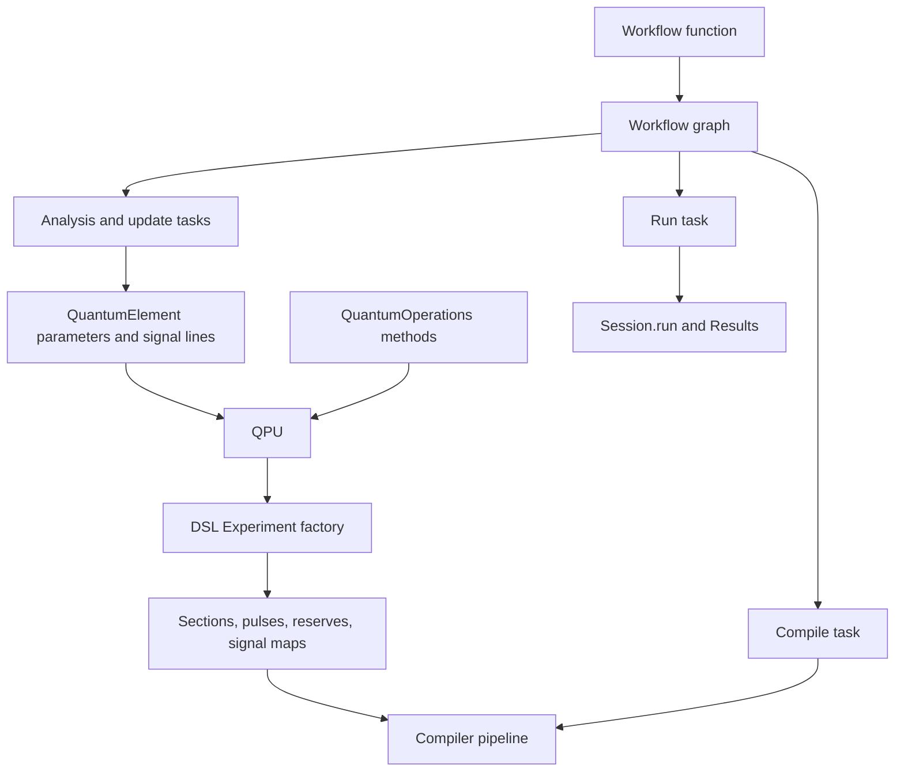
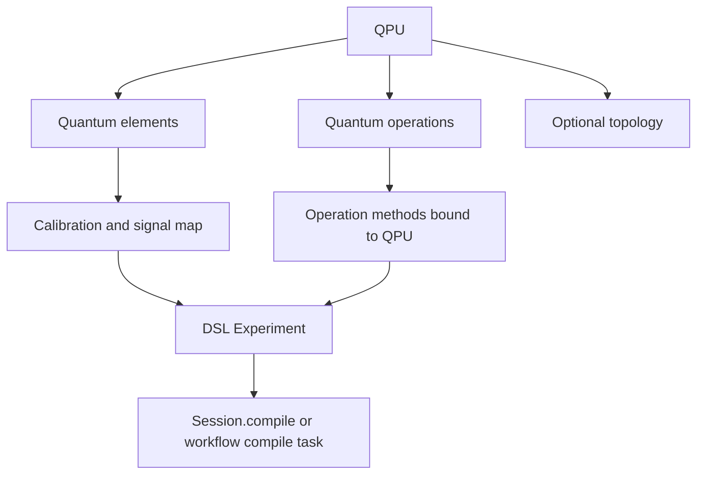
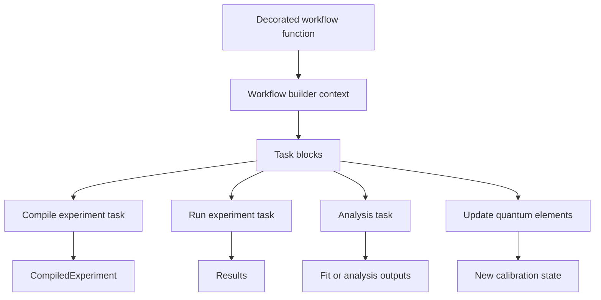

# Quantum objects and workflows

The preceding chapters follow LabOne Q downward from the Python DSL into scheduling, lowering, code generation, runtime execution, and result objects. This chapter adds the layer that sits above the DSL in many application packages: **quantum objects** and **workflows**. These abstractions do not replace the compiler. They organize calibration state, device topology, reusable operations, and experiment orchestration so that users can build larger experimental programs without writing every section and pulse call by hand.

At this level, LabOne Q becomes a two-step system. Quantum objects and operations generate ordinary DSL experiment content. Workflows then assemble tasks that compile, run, analyze, and update those objects. The lower compiler still sees the familiar experiment, setup, calibration, and signal-map structures described earlier; the higher layer supplies a disciplined way to create and reuse those structures.

## Quantum elements, parameters, and signal lines

A `QuantumElement` represents a named experimental object, such as a qubit or another calibrated entity, together with the signal lines and parameters needed to generate experiments for it. It is not a compiler IR node. It is a structured Python object that can emit calibration and signal-map information and can be copied or updated as calibration knowledge changes.

The element carries an identity, a parameter container, and a mapping from logical operation lines to experiment signals. Methods on the element generate calibration fragments and experiment signal maps, which bridge high-level names such as a qubit drive line to the lower-level signal identifiers consumed by a DSL experiment.

| Concept | Typical content | Connection to lower layers |
| --- | --- | --- |
| Quantum element UID | Stable name for the element. | Used by operations, topology, calibration updates, and workflow results. |
| Parameter container | Frequencies, pulse amplitudes, pulse lengths, thresholds, and similar calibrated values. | Read by quantum operations when they emit DSL operations. |
| Signal-line mapping | Logical line names such as drive, measure, acquire, or flux-like lines. | Produces experiment signal maps and calibration entries. |
| Calibration generation | Oscillators, signal calibrations, and line-specific settings. | Feeds `DeviceSetup`, experiment calibration, and compiler payload construction. |
| Copy/update methods | Controlled mutation of parameter state. | Lets workflow analysis update future experiments without mutating every past object. |

This layer makes a deliberate trade-off. A raw DSL experiment is explicit but verbose. A quantum element hides repetition, but it must remain transparent enough that maintainers can predict which experiment signals and calibrations will be produced.

## QPU as container and experiment factory

The `QPU` abstraction groups quantum elements with a quantum-operations object and, where available, topology information. It is not only a passive collection. It also provides helper methods that update elements and create DSL experiments with the operation set already attached.

When a QPU creates an experiment, the result is still an ordinary LabOne Q DSL `Experiment`. The difference is that the experiment is born with attached operations and signal-map/calibration context derived from the quantum elements. This is the main coupling point from the higher layer into the compiler-facing frontend layer.

| QPU responsibility | Internal mechanism | Compiler-facing result |
| --- | --- | --- |
| Element lookup and update | Maintains element collection and applies updates by UID. | Updated parameter state before experiment construction. |
| Operation binding | Attaches a `QuantumOperations` instance to the QPU. | Operation calls can resolve element parameters and signal lines. |
| Experiment creation | Creates a DSL experiment with operations attached. | Ordinary experiment object for the payload builder and compiler. |
| Calibration propagation | Collects element-generated calibration and maps. | Setup and experiment calibration visible to `Session` and compiler payload code. |

The important invariant is that a QPU does not give the scheduler a new kind of schedule. It gives the frontend a better-organized way to produce the same DSL-level objects.

## Quantum operations as structured DSL emitters

Quantum operations are Python methods registered on a `QuantumOperations` object. Their implementations can call ordinary DSL builtins, create sections, reserve signals, play pulses, acquire data, and compose smaller operations. When invoked under an active experiment context, a quantum operation executes as Python code and emits DSL content, just as a handwritten `with experiment.section(...):` block would.

The operation wrapper adds useful structure around that execution. It can bind the operation set to a QPU, resolve elements, broadcast an operation over multiple elements, create operation sections, and track whether an operation implementation is being called in the correct context. The wrapped method remains the place where the high-level operation lowers into pulses, delays, reserves, acquisitions, and nested sections.

| Operation-layer feature | Effect on generated experiment |
| --- | --- |
| Registered operation method | Provides a named high-level operation callable from experiment code. |
| QPU binding | Gives the operation access to elements, parameters, signal lines, and calibration context. |
| Broadcasting | Repeats the same operation pattern over element collections while preserving structure. |
| Section wrapping | Creates readable section boundaries around high-level operations. |
| Reserve and signal helpers | Ensures generated DSL operations refer to the correct experiment signals. |

This mechanism explains why quantum operations are best read as **macro-like structured emitters**, not as a second compiler. The Python interpreter executes the operation body; LabOne Q records the emitted DSL operations; the ordinary compiler later lowers those operations to scheduled hardware actions.

## Workflows as executable task graphs

The workflow package provides decorators that turn Python functions into executable workflow definitions. During workflow construction, decorated tasks are recorded as blocks in a graph rather than simply executed for their immediate side effects. During workflow execution, those blocks run with structured inputs and produce workflow results.

This resembles the DSL context-manager pattern, but the target graph is different. The experiment DSL records sections and operations for the hardware compiler. The workflow layer records tasks such as compile, run, analysis, calibration update, persistence, and plotting. A workflow can therefore coordinate several LabOne Q calls and analysis steps without changing how the compiler schedules a single experiment.

| Workflow object | Role | Relation to lower LabOne Q APIs |
| --- | --- | --- |
| Workflow definition | Captures the task graph produced by a decorated Python function. | Does not compile hardware by itself. |
| Task | Unit of workflow execution. | May call `Session.compile`, `Session.run`, analysis routines, or update helpers. |
| Workflow result | Structured record of task outputs. | Can contain compiled experiments, result objects, analysis outputs, and updated parameters. |
| Compile task | Wrapper around experiment compilation. | Returns a `CompiledExperiment` produced by the normal compiler pipeline. |
| Run task | Wrapper around execution and result collection. | Calls `Session.run` or accepts injected results depending on workflow configuration. |

The workflow layer is therefore an orchestration layer. It owns ordering, dependency tracking, and result packaging for a larger experimental procedure. It delegates compilation and execution to the same lower-level APIs described in the rest of this guide.

## Coupling to compilation, execution, and results

The strongest coupling between workflows and lower internals appears in the standard workflow tasks. A compile task accepts a session, experiment, optional compiler settings, and returns a compiled experiment. A run task accepts a session and compiled or uncompiled experiment, invokes the session execution path, and returns the LabOne Q results object. Higher-level analysis tasks can then read result handles and update quantum-object parameters.

| Higher-level action | Lower-level call path | Returned or mutated state |
| --- | --- | --- |
| Build experiment from QPU | QPU experiment factory and quantum operation emitters. | DSL `Experiment` with sections, operations, signal map, and calibration. |
| Compile in workflow | Workflow compile task to `Session.compile`. | `CompiledExperiment`, including scheduled experiment artifacts. |
| Run in workflow | Workflow run task to `Session.run` or result injection path. | LabOne Q result object with handles and acquired data. |
| Analyze data | Workflow analysis task reading result handles. | Fit outputs, derived parameters, diagnostics. |
| Update calibration | Quantum-element update methods or workflow update tasks. | New quantum-object parameter state for future experiments. |

This architecture is valuable because it separates three timescales. The compiler handles a single explicit experiment. The runtime handles one compiled experiment execution and result collection. Workflows handle the experimental campaign: build, compile, run, analyze, update, and repeat.

## Serialization and persistence at the higher layer

Quantum objects and workflows also interact with serialization, but their persistence semantics differ from experiment serialization. A serialized `Experiment` preserves a specific DSL object graph. A serialized `CompiledExperiment` preserves compiled artifacts. Higher-level objects preserve calibration state, task definitions, workflow outputs, or quantum-object parameter snapshots, depending on which object is serialized.

For maintainers, this difference matters when designing fixtures or debugging user reports. If the bug is in scheduling, a serialized `Experiment` or `CompiledExperiment` is usually the relevant artifact. If the bug is in calibration propagation or operation generation, a QPU or quantum-element state snapshot may be more informative. If the bug is in multi-step orchestration, workflow results and task inputs are needed.

| Debugging target | Most useful artifact |
| --- | --- |
| Operation emits the wrong pulse or signal | Quantum operation implementation plus quantum-element parameters. |
| Experiment compiles incorrectly | Serialized `Experiment` and `DeviceSetup`. |
| Compiled waveform or recipe looks wrong | Serialized `CompiledExperiment` and generated artifacts. |
| Workflow updates calibration incorrectly | Workflow result, analysis task outputs, and quantum-object update inputs. |
| Re-running a campaign step differs from the notebook | Workflow task graph plus persisted task inputs and outputs. |

The higher layer should therefore be documented as a producer and consumer of lower-layer artifacts, not as a replacement for those artifacts.

## Maintainer heuristics

When modifying quantum objects or workflows, first identify which boundary the change crosses. A parameter-container change affects operation generation and calibration. An operation-wrapper change affects the emitted DSL structure. A workflow-task change affects orchestration and result packaging. A compiler change should remain visible in the generated `Experiment`, payload, or compiled artifacts even when the experiment was produced through a QPU.

The safest mental model is to ask whether the change occurs before, during, or after experiment compilation.

| Timing | Examples | Regression strategy |
| --- | --- | --- |
| Before compilation | Quantum-element parameter updates, operation emission, signal-map generation. | Compare generated DSL experiments and serialized Experiment files. |
| During compilation | Compiler settings, scheduling, resource checks, code generation. | Compare compiled artifacts, schedule metadata, recipe, and waves. |
| During execution | Controller handoff, device transactions, result acquisition. | Inspect runtime controller logs and result objects. |
| After execution | Workflow analysis, calibration update, persistence. | Compare workflow results and updated quantum-object state. |

This chapter closes the guide's low-to-high loop. The compiler internals explain how explicit experiments become hardware actions. Quantum objects and workflows explain how larger applications generate those explicit experiments, run them repeatedly, and feed results back into calibration state.
