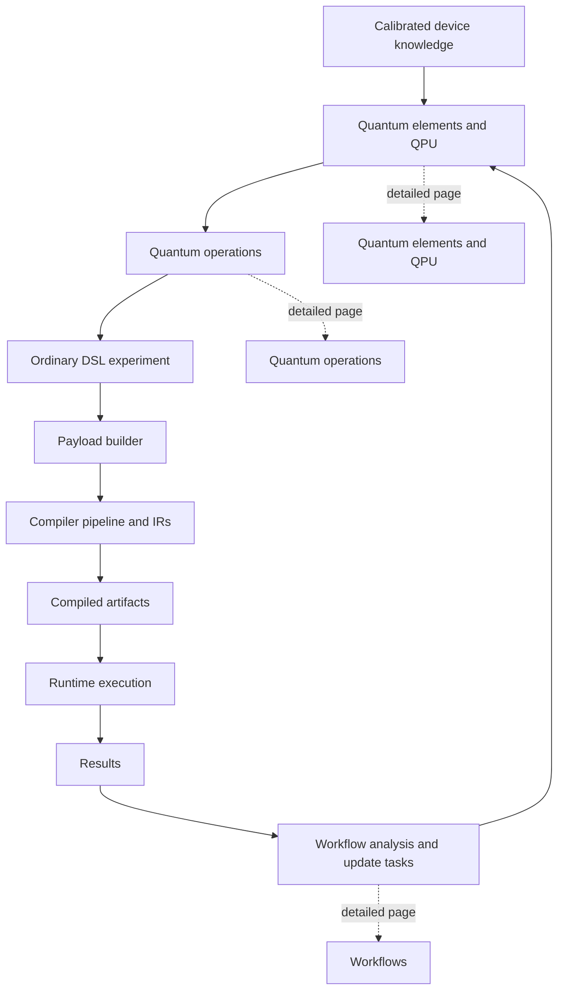
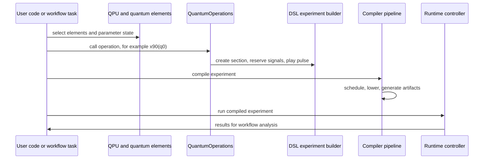
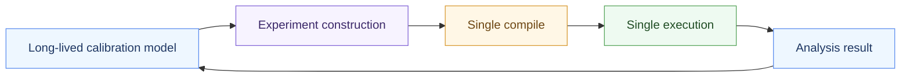

# Higher-level application layers: quantum objects, operations, and workflows

The preceding chapters follow LabOne Q downward from the Python DSL into scheduling, lowering, code generation, runtime execution, and result objects. This page re-enters the stack from above. **Quantum objects**, **quantum operations**, and **workflows** are the application-facing layers that help users describe calibrated devices, reuse experiment-building idioms, and orchestrate multi-step campaigns. They do not replace the compiler. They produce and consume the same DSL experiments, compiled artifacts, runtime calls, and results that the lower chapters describe.

This layer is easiest to understand as three cooperating abstractions. A `QuantumElement` stores the calibrated state and signal vocabulary of a device object such as a qubit or coupler. A `QPU` collects those elements, binds a compatible `QuantumOperations` instance, and carries topology. A workflow records and executes a task graph that can build, compile, run, analyze, and update experiments.

| Layer | Main abstraction | Produces or coordinates | Detailed page |
| --- | --- | --- | --- |
| Device knowledge | `QuantumElement`, `QuantumParameters`, `QPU`, `QPUTopology` | Signal names, parameter state, topology, and QPU-bound operation sets. | [Quantum elements and QPU](17a-quantum-elements-and-qpu.md) |
| Experiment macros | `QuantumOperations`, `Operation`, `@quantum_operation` | DSL sections, reserves, pulses, acquisitions, and nested operation calls. | [Quantum operations](17b-quantum-operations.md) |
| Campaign orchestration | `@workflow`, `@task`, workflow blocks, executor state, workflow results | Ordered compile/run/analysis/update procedures over ordinary LabOne Q APIs. | [Workflows](17c-workflows.md) |

## The central boundary

The application layer is **above the compiler frontend**. It helps construct a DSL `Experiment`, a `DeviceSetup`, calibration data, and task calls, but the compiler still receives explicit frontend objects. A quantum operation call therefore belongs to the same semantic side of the stack as a handwritten `with experiment.section(...):` block: Python executes the helper, LabOne Q records ordinary DSL content, and the compiler later schedules that content.

The important consequence is that debugging remains boundary-oriented. If a QPU experiment builds the wrong pulse, inspect the quantum operation implementation and element parameters. If the emitted DSL looks correct but compilation fails, inspect the compiler-input payload and IRs. If compilation succeeds but execution or data collection fails, inspect runtime handoff and result processing. The same artifacts used in the lower guide remain the useful artifacts here.

| Symptom | Most likely boundary | First artifact to inspect |
| --- | --- | --- |
| Operation emits the wrong signal or pulse parameter | Quantum element or quantum operation layer | Generated DSL experiment, operation source, and element parameter snapshot |
| High-level experiment compiles differently than expected | Frontend-to-compiler boundary | Payload builder input and scheduled experiment IR |
| Compiled waves or recipe look wrong | Backend and artifact layer | Generated waves, recipe, command tables, and artifact metadata |
| Workflow step updates calibration incorrectly | Workflow and analysis layer | Workflow result tree, task inputs, analysis outputs, and QPU update arguments |
| Re-running a notebook campaign differs from saved execution | Persistence and orchestration layer | Workflow result, serialized experiment or compiled experiment, and saved quantum-object state |

## Three timescales

The abstractions above the compiler also separate the timescale of a calibration campaign from the timescale of a single compile or run. Quantum elements persist calibrated knowledge across many experiments. Quantum operations instantiate that knowledge into a specific experiment. Workflows coordinate repeated execution and analysis, often feeding results back into the next QPU state.

This framing keeps the section intentionally high-level. The detailed pages that follow explain the main application-layer objects without duplicating the compiler pipeline chapters.

## Maintainer reading order

Start with [Quantum elements and QPU](17a-quantum-elements-and-qpu.md) when the change concerns parameter containers, signal names, topology, or QPU copying and updates. Read [Quantum operations](17b-quantum-operations.md) when the change concerns operation registration, dispatch, section wrapping, broadcasting, signal reservation, or operation composition. Read [Workflows](17c-workflows.md) when the change concerns task graph construction, task execution, options propagation, workflow results, or standard compile/run tasks.

The source-level map for these areas is kept in the appendix-oriented [source reference](15-source-reference.md), not in this overview. That separation is deliberate: the early pages should explain the mental model, while the appendix should serve as the file-level lookup table.
