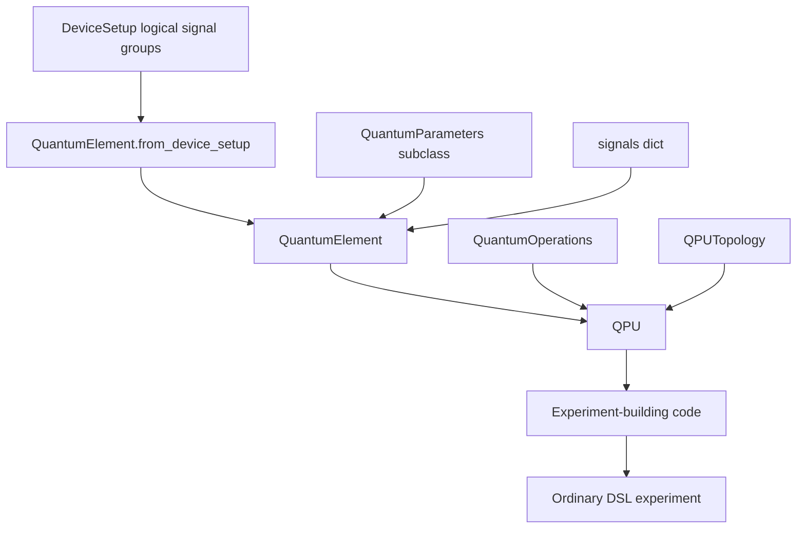
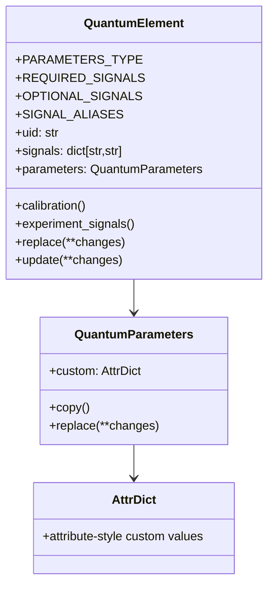
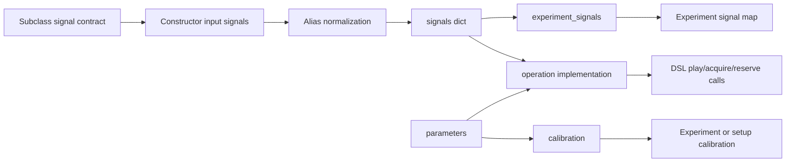
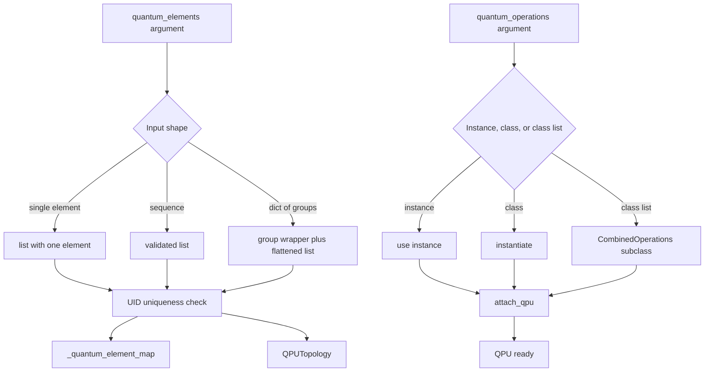
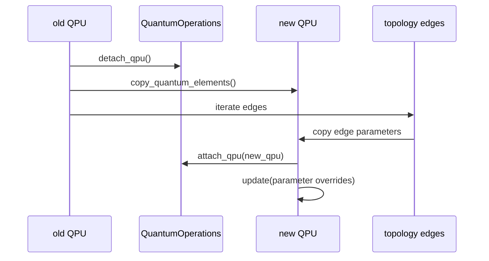
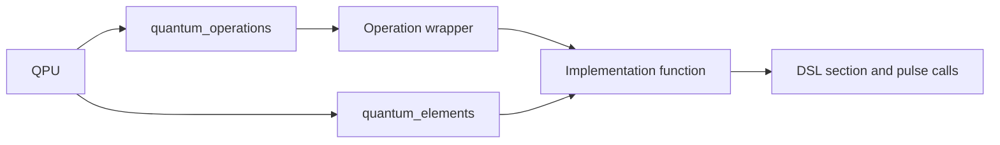

# Quantum elements and QPU

A `QuantumElement` is a named, calibrated object in the user-facing device model. Typical subclasses represent qubits, couplers, or other reusable experimental entities. The element carries three kinds of information: a stable UID, a mapping from operation-level signal names to logical signal paths, and a typed `QuantumParameters` instance that stores calibrated values. A `QPU` then groups elements, binds a compatible quantum-operation set, and stores topology information.



The distinction between the physical model and the control-hardware model is central. `QPU` describes the **logical quantum device** that experiment builders operate on. `DeviceSetup` describes the **instrument and logical-signal infrastructure** needed to compile and run the experiment. `QuantumPlatform` is the composition of both: it carries a `QPU` plus a `DeviceSetup` and can create a connected `Session`.

| Object | Persistent responsibility | Interaction with lower layers |
| --- | --- | --- |
| `QuantumParameters` | Stores typed and custom calibrated values. | Read by operations when producing pulses, delays, thresholds, and calibration fragments. |
| `QuantumElement` | Names an element and maps operation-level lines to logical signal paths. | Emits `ExperimentSignal` objects and calibration fragments for the DSL frontend. |
| `QPU` | Collects elements, validates UIDs, exposes lookup/update helpers, attaches operation set, and owns topology. | Supplies the objects used by experiment builders and workflows before compilation. |
| `QuantumPlatform` | Pairs the QPU with a `DeviceSetup`. | Provides the complete build/compile/run context for sessions and workflows. |

## Quantum element anatomy

The base `QuantumElement` is an `attrs` class with class-level contracts and instance-level state. Subclasses customize `PARAMETERS_TYPE`, `REQUIRED_SIGNALS`, `OPTIONAL_SIGNALS`, and `SIGNAL_ALIASES`. At construction time, the signal converter normalizes aliases and stores logical signal paths as strings. The parameter converter accepts either a dictionary, a parameter object, or `None`; dictionaries are converted into the subclass-specific `QuantumParameters` type.



Parameter updates are deliberately structured. `QuantumParameters.replace()` validates dotted parameter paths before applying nested changes. `QuantumElement.replace()` returns a new element with a new parameter instance, while `QuantumElement.update()` mutates the element by replacing its `parameters` attribute. This keeps parameter containers value-like even when a caller chooses in-place element updates.

| Mechanism | Behavior | Maintainer implication |
| --- | --- | --- |
| Dotted parameter paths | Keys such as `readout.pulse.length` traverse object attributes or dictionary entries. | New nested parameter fields must be reachable through the same validation path. |
| `replace()` | Returns a new object with changed parameters. | Use when a workflow needs immutable-style state transitions. |
| `update()` | Replaces the element's parameter object in place. | Use with care in shared calibration state; the old parameter instance is not modified. |
| `custom` | Stores user-defined serializable values with attribute-style access. | Avoid names that shadow existing dictionary attributes. |

## Signals, calibration, and experiment signals

The element's `signals` mapping is the bridge between operation names and DSL signal identifiers. Base `QuantumElement.experiment_signals()` creates `ExperimentSignal(uid=k, map_to=k)` for the stored signal paths. Subclasses normally override `calibration()` to build the calibration fragments needed for their signal lines and parameters.



Signal validation protects maintainers from silent mismatches. Required signals must be present, optional signals are accepted, and unknown signal names raise an error. This makes signal-name changes a compatibility-sensitive API decision, not only an implementation detail.

## Creating elements from setup information

`QuantumElement.from_logical_signal_group()` builds an element from a `LogicalSignalGroup` and removes the `/logical_signal_group/` prefix when present. `QuantumElement.from_device_setup()` repeats that process for selected logical signal groups, optionally supplying per-element parameter dictionaries or parameter objects.

```python
# Conceptual example; concrete subclasses define the actual signal contract.
qubits = TunableTransmonQubit.from_device_setup(
    device_setup,
    qubit_uids=["q0", "q1"],
    parameters={
        "q0": {"ge_drive_amplitude_pi": 0.42},
        "q1": {"ge_drive_amplitude_pi": 0.39},
    },
)
```

This construction path is useful when the hardware setup already names the logical signal groups. It does not by itself compile an experiment. It produces element objects that operation implementations can later read while building DSL content.

## QPU construction and lookup

A `QPU` accepts one element, a sequence of elements, or a dictionary of named groups. During initialization it validates that all values are `QuantumElement` instances, flattens grouped inputs into `quantum_elements`, rejects duplicate UIDs, creates a UID map, instantiates or combines the requested `QuantumOperations`, attaches that operation set to itself, and creates a `QPUTopology`.



Lookup is intentionally ergonomic because QPU-backed experiment code often selects elements repeatedly. A string returns one element by UID, a list of strings returns elements in the requested order, a slice returns elements by insertion order, and a `QuantumElement` subclass returns all elements of that type.

| Lookup form | Returned value | Example |
| --- | --- | --- |
| `qpu["q0"]` | One element with UID `q0`. | Select a target qubit for an operation. |
| `qpu[["q0", "q2"]]` | A list in the specified order. | Build a two-qubit calibration subset. |
| `qpu[:3]` | A slice of the stored element list. | Select the first three configured elements. |
| `qpu[Transmon]` | All elements that are instances of the class. | Filter a heterogeneous QPU by element type. |

## Grouped elements and topology

When the `quantum_elements` argument is a dictionary, `QPU` exposes a read-only `groups` wrapper that supports attribute access. Group names must not shadow existing attributes of the wrapper. The flattened `quantum_elements` list still contains all elements from all groups, so UID uniqueness remains global.

Topology is stored separately from element parameters. `QPU.update()` accepts either an element UID or a topology-edge key of the form `(tag, source_uid, target_uid)`. For element keys it validates and applies parameter changes to the element. For topology-edge keys it validates the edge and updates edge parameters through `QPUTopology`.

| Update key | Target | Validation |
| --- | --- | --- |
| `"q0"` | Quantum element parameters. | UID must exist, and every dotted parameter path must resolve on the parameter object or nested dictionary. |
| `("coupling", "q0", "q1")` | Topology-edge parameters. | Edge key must exist in `QPUTopology.edge_keys()`, and every parameter path must resolve on the edge parameter object. |

This separation matters when workflows update calibrated state. A qubit frequency update should target the element UID. A coupling calibration or edge-specific parameter update should target the topology edge. Both routes validate first and only then apply changes, so partially applied invalid updates are avoided.

## Copying and overriding QPU state

`QPU.override_quantum_elements()` creates a new QPU with copied quantum elements and copied topology edges, detaches the operation set from the old QPU, attaches it to the new QPU, and applies the requested updates. This behavior is useful for workflows that want a new calibration state for a subsequent experiment while preserving the structure of the previous QPU.



The detach/attach step is easy to overlook. A `QuantumOperations` instance is bound to one QPU at a time. Reusing the same operation instance across copied QPU states therefore changes which QPU it can see. Maintainers should be explicit about whether code wants to share one operation instance or copy the operation set.

| Change type | Prefer | Reason |
| --- | --- | --- |
| Temporary per-experiment parameter changes | `override_quantum_elements()` or element `replace()` | Keeps old state available for comparison and reproducibility. |
| Long-lived calibration update in a workflow state object | `QPU.update()` or element `update()` | Represents an intentional state transition after analysis. |
| New operation behavior for the same element set | New or copied `QuantumOperations` instance | Avoids accidental rebinding surprises. |
| New device topology | Explicit `QPUTopology` edge construction or update | Keeps coupling information distinct from element-local parameters. |

## Relationship to quantum operations

A QPU is the ownership boundary for operation execution. During QPU construction, the operation set is attached to the QPU. Operation implementations then receive the `QuantumOperations` instance as their first argument and use the element arguments, element parameters, and signal maps to emit DSL content. The detailed call wrapper is described in [Quantum operations](17b-quantum-operations.md).



This is not a hidden compiler pass. The QPU and element classes organize the inputs to experiment construction. The ordinary LabOne Q compiler only becomes involved after those inputs have produced a DSL experiment and the user, session, or workflow asks for compilation.

## Source anchors

The main implementation anchors are the base quantum object files rather than backend compiler modules. The appendix [source reference](15-source-reference.md) keeps the broader file map.

| Concern | Primary source anchor |
| --- | --- |
| `QuantumElement`, `QuantumParameters`, signal conversion, and parameter update mechanics | `src/python/laboneq/dsl/quantum/quantum_element.py` |
| `QPU`, `QuantumPlatform`, groups, lookup, updates, and operation attachment | `src/python/laboneq/dsl/quantum/qpu.py` |
| Operation binding and call behavior | `src/python/laboneq/dsl/quantum/quantum_operations.py` |
| Topology edge state and edge updates | `src/python/laboneq/dsl/quantum/qpu_topology.py` |

When changing this layer, keep the artifact boundary visible in tests. A useful regression usually compares the generated DSL experiment, calibration, signal map, or QPU parameter state before looking at compiled schedule internals.
