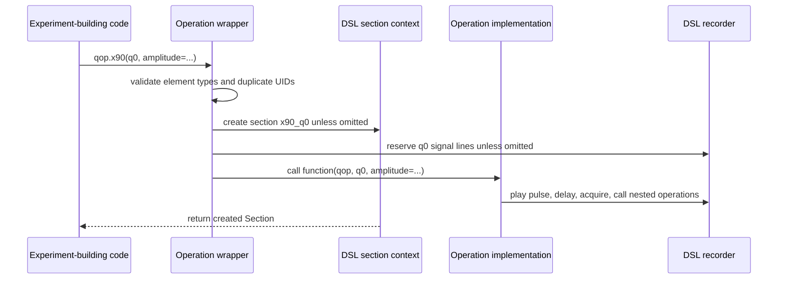
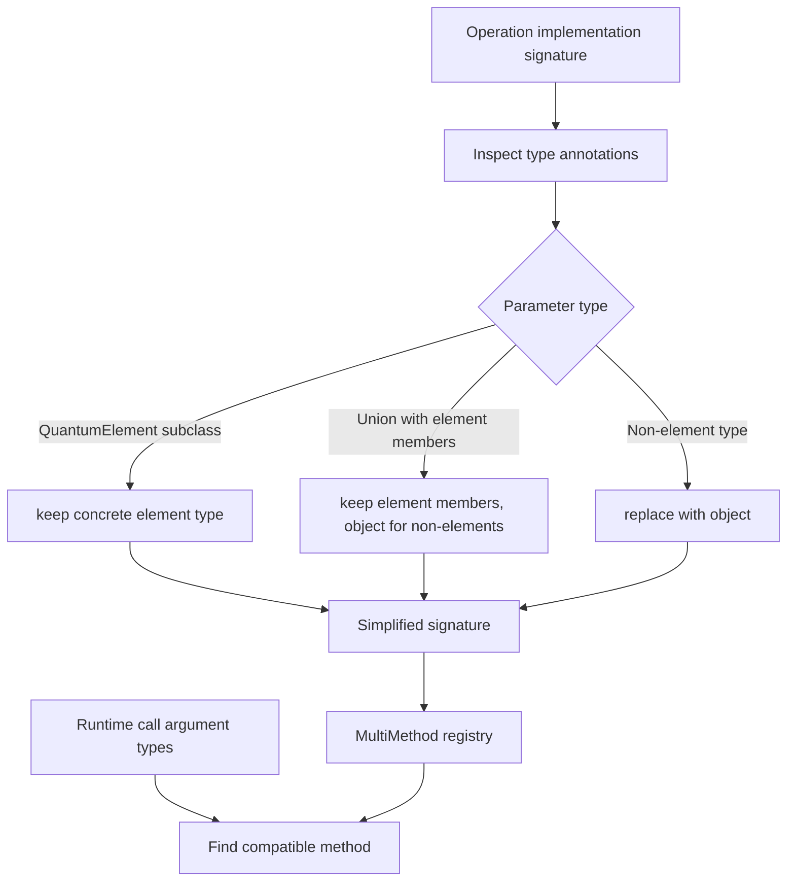
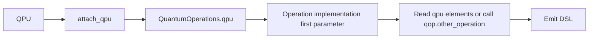
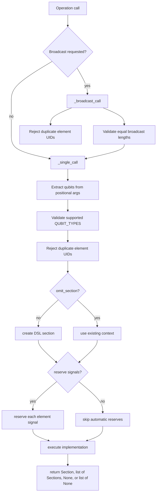
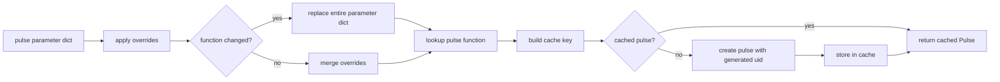

# Quantum operations

A quantum operation is a named, reusable Python emitter for ordinary LabOne Q DSL content. It is not a second compiler IR and it is not a hardware instruction by itself. When user code calls an operation such as `qop.x90(q0)`, Python enters an `Operation` wrapper, creates or reuses a DSL section context, optionally reserves the target element's signals, and then executes the registered implementation function. The implementation function emits the familiar DSL primitives: `play`, `delay`, `acquire`, nested sections, reserves, sweeps, or calls to other operations.



The abstraction is macro-like in the best sense. It gives operation implementations a common registration and sectioning model, while keeping the compiler-facing result explicit and inspectable. A maintainer should be able to replace an operation call with the equivalent handwritten DSL and obtain the same compiler inputs.

## Registration model

Operation methods are marked with `@quantum_operation`. During subclass creation, `QuantumOperations.__init_subclass__()` walks the class hierarchy, collects marked functions, removes them from the class namespace, and registers them into `BASE_OPS`. At instance construction time, `BASE_OPS` is copied into the instance `_ops` dictionary as `Operation` wrappers.

```mermaid
graph TD
    A[Subclass body] --> B[@quantum_operation method]
    B --> C[_QuantumOperationMarker]
    C --> D[__init_subclass__]
    D --> E[BASE_OPS: name to MultiMethod]
    E --> F[QuantumOperations.__init__]
    F --> G[_ops: name to Operation]
    G --> H[attribute access qop.x90]
```

The marker stores two user-visible policies. `broadcast` controls whether list or tuple arguments can expand one operation call into multiple sectioned calls. `neartime` marks the generated operation section as near-time and suppresses automatic signal reserves. The marker is copied with the registered function and checked when extending a multimethod-backed operation, so overloads for the same operation name must agree on these policies.

| Registration element | Implementation role | Maintainer concern |
| --- | --- | --- |
| `@quantum_operation` | Attaches `_QuantumOperationMarker` to a method. | Mark only functions intended to become operation calls. |
| `BASE_OPS` | Class-level registry populated at subclass creation. | Inherited operations and subclass operations are collected together. |
| `MultiMethod` | Stores one or more implementations keyed by simplified type signature. | Overloads must share compatible operation markers. |
| `_ops` | Instance-level registry of `Operation` wrappers. | Dynamic registration and replacement affect the instance, not the base class. |

## Dispatch and overloads

LabOne Q wraps operation implementations in a custom `MultiMethod`. The dispatch key is deliberately simplified. `QuantumElement` subclasses are preserved in the type signature, while non-quantum-element parameters are collapsed to `object`. Union annotations preserve quantum-element alternatives but also collapse non-element members to `object`. This makes overload dispatch about **which quantum element types participate**, not about arbitrary scalar operation parameters.



This design supports combining operation sets for different element classes without treating every scalar annotation as a dispatch dimension. It also imposes a consistency rule: all overloads registered under the same operation name must have the same signature length. If one implementation expects `(q, amplitude)` and another expects `(q, amplitude, phase)`, they cannot share a single multimethod name without an adapter layer.

| Dispatch case | Consequence |
| --- | --- |
| Two implementations differ by quantum-element subclass | The matching element type can select the implementation. |
| Two implementations differ only by scalar annotation such as `float` versus `int` | Both simplify to `object`, so this is not a useful overload boundary. |
| A union contains quantum-element subclasses | Compatible element types can still be matched. |
| A new overload has a different number of parameters | Registration raises an error before ambiguous dispatch is possible. |
| A registered overload has a different operation marker | Registration raises an error because broadcast and near-time policy must match. |

For maintainers, the safest pattern is to dispatch on element families and keep numerical options as ordinary operation parameters. If an operation needs meaningfully different scalar behavior, give that choice an explicit keyword or split it into distinct operation names rather than relying on scalar type annotations.

## QPU binding and operation ownership

A `QuantumOperations` instance may be attached to one `QPU`. `QPU.__init__()` accepts an operation instance, an operation class, or a list of operation classes. Classes are instantiated; lists are combined into a temporary subclass using multiple inheritance; the resulting operation set is attached to the QPU. The operation implementation receives the operation set as its first argument, which allows an operation to call sibling operations and inspect the bound QPU.



This one-owner rule prevents ambiguous access to QPU state. `QuantumOperations.copy()` creates a new operation set without copying the attached QPU. `detach_qpu()` clears the binding so the same operation object can be reattached, but code should do this deliberately because operation behavior may depend on the bound QPU.

## Calling an operation

An `Operation` wrapper has three public call styles. `op(...)` builds a section by default. `op.omit_section(...)` executes the implementation in the current section context and returns no section. `op.omit_reserves(...)` still creates a section but suppresses automatic signal reservations.



The wrapper's default section naming convention joins the operation name and the participating element UIDs, for example `x90_q0` or `cz_q0_q1`. The actual section UID is still generated by the DSL machinery. This naming makes generated experiments easier to inspect and gives downstream diagnostics a useful structural clue.

| Call form | Section behavior | Reserve behavior | Typical use |
| --- | --- | --- | --- |
| `qop.name(q, ...)` | Creates a new operation section. | Reserves all signal paths of participating elements. | Normal operation use in experiment code. |
| `qop.name.omit_section(q, ...)` | Emits into the current section. | Automatic reserves are suppressed. | Composite operations that should not add another visible section boundary. |
| `qop.name.omit_reserves(q, ...)` | Creates a new operation section. | Automatic reserves are suppressed. | Carefully managed overlap patterns or operations whose reserves are handled elsewhere. |
| `qop.name([q0, q1], ...)` | Creates one section per broadcast element if broadcasting is enabled. | Each single call applies the same reserve policy. | Parallel or repeated single-element patterns across a collection. |

## Example: a minimal custom operation

The implementation function takes the operation set as its first parameter and target elements as positional parameters. Non-element parameters may be positional or keyword parameters. The element's signal map and parameter object supply the calibrated values used to emit DSL primitives.

```python
from laboneq.dsl.quantum import QuantumOperations, quantum_operation
from laboneq.dsl.experiment import builtins

class MyQubitOps(QuantumOperations):
    QUBIT_TYPES = MyQubit

    @quantum_operation
    def x90(self, q, amplitude=None):
        amp = amplitude if amplitude is not None else q.parameters.x90.amplitude
        pulse = self.create_x90_pulse(q)
        builtins.play(q.signals["drive"], pulse=pulse, amplitude=amp)
```

The exact subclass and pulse helper names depend on the application package, but the control flow is stable. The wrapper creates the operation section and reserves `q.signals.values()`. The implementation reads `q.parameters`, emits `play`, and returns control to the DSL section context.

## Pulse construction helper

`create_pulse(parameters, overrides=None, name=None)` is a shared helper for operation implementations that store pulse descriptions as dictionaries. The dictionary must contain a `function` key naming a registered functional pulse or the special `sampled_pulse` function. Overrides extend or replace the stored parameter dictionary, and the helper caches created pulses either on the current experiment context or in a global cache when no experiment context is active.



The cache key accepts numbers, one-dimensional numeric arrays, lists of numbers, and sweep `Parameter` values. Non-numeric lists or unsupported arrays raise errors because the helper cannot form a stable cache key for them.

## Broadcasting semantics

Broadcasting is triggered when the operation marker permits it and any positional argument is a list or tuple. All positional and keyword list-or-tuple broadcast arguments must have the same length. The wrapper then calls `_single_call()` once per index, replacing each broadcast argument with its indexed value.

```python
# Conceptual shape. This produces two operation sections if x90 supports broadcast.
qop.x90([q0, q1], amplitude=[0.40, 0.41])

# Equivalent mental expansion.
qop.x90(q0, amplitude=0.40)
qop.x90(q1, amplitude=0.41)
```

Broadcasting has two important safeguards. First, an operation with `broadcast=False` raises an error instead of expanding. Second, duplicate element UIDs are rejected, which prevents accidental overlapping calls on the same element inside one broadcast expansion.

| Broadcast input | Result |
| --- | --- |
| One or more positional list/tuple arguments of equal length | One single operation call per index. |
| Keyword list/tuple arguments of the same length | Indexed alongside the positional broadcast arguments. |
| Mismatched lengths | `ValueError` before any indexed call is executed. |
| Duplicate element UIDs among participating elements | `ValueError` to avoid ambiguous same-element expansion. |
| `broadcast=False` marker | `ValueError` if broadcast syntax is attempted. |

## Near-time operations

A near-time operation is marked with `@quantum_operation(neartime=True)`. The wrapper creates a section whose execution type is near-time and suppresses automatic signal reservations. This is appropriate only for operations whose semantics belong to near-time orchestration rather than real-time signal occupation.

```mermaid
graph TD
    A[@quantum_operation neartime=True] --> B[Operation marker]
    B --> C[_single_call]
    C --> D[execution_type = NEAR_TIME]
    C --> E[reserve_signals = false]
    D --> F[near-time DSL section]
```

Because near-time sections and real-time signal reservations have different scheduler implications, maintainers should not use the flag as a general way to avoid reserve conflicts. If an operation emits real-time pulses, it normally needs ordinary real-time section and reserve behavior.

## Composition and section hygiene

Operations often build larger operations by calling smaller ones. The default behavior creates a section for every operation call, which is useful for readability but can over-structure a generated experiment. `omit_section()` exists for operation implementations that are pure composition and should inline their contents into the caller's section.

```python
class MyQubitOps(QuantumOperations):
    QUBIT_TYPES = MyQubit

    @quantum_operation
    def sx_then_measure(self, q):
        self.x90.omit_section(q)
        self.measure(q)
```

This pattern should be used carefully. Omitting the section also suppresses automatic reserves, so the outer operation must provide the sectioning and reserve behavior that makes overlaps intentional and safe. For many operations, visible nested sections are preferable because they make the generated experiment and diagnostics easier to inspect.

## Source anchors

The operation abstraction is concentrated in one source file. The surrounding quantum-object files explain the element and QPU state that operations consume.

| Concern | Primary source anchor |
| --- | --- |
| Decorator marker and pulse helper | `src/python/laboneq/dsl/quantum/quantum_operations.py` |
| `QuantumOperations` registry, QPU binding, and dynamic registration | `src/python/laboneq/dsl/quantum/quantum_operations.py` |
| Multimethod signature simplification and overload lookup | `src/python/laboneq/dsl/quantum/_multimethod.py` |
| `Operation` wrapper, section creation, reserve policy, broadcasting, and call return values | `src/python/laboneq/dsl/quantum/quantum_operations.py` |
| Element signals and parameters consumed by operation implementations | `src/python/laboneq/dsl/quantum/quantum_element.py` |
| QPU attachment and operation-set composition | `src/python/laboneq/dsl/quantum/qpu.py` |

The best regression tests for this layer compare the generated DSL experiment structure. They should check created sections, reserve behavior, signal names, pulse parameters, broadcast expansion, and relevant error paths before relying on backend compilation artifacts.
