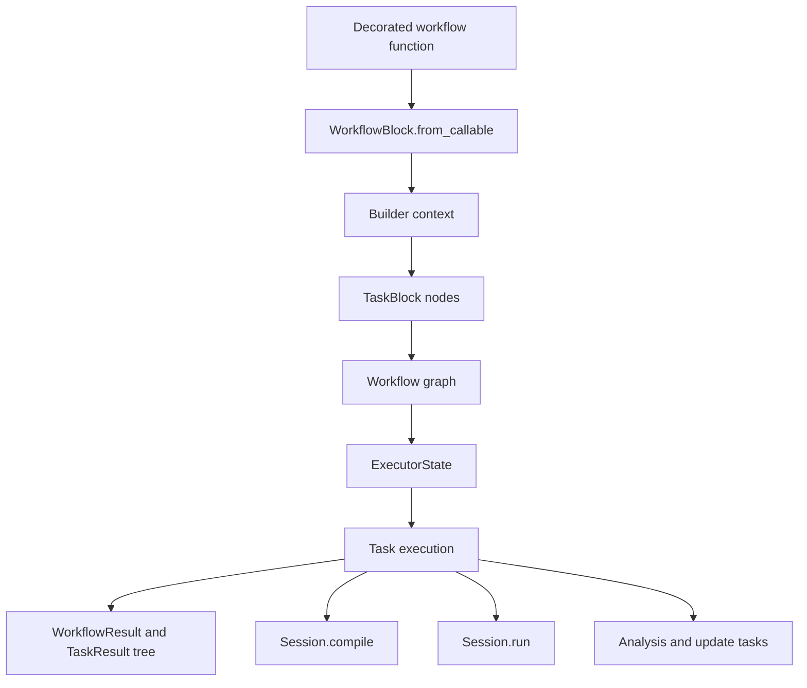
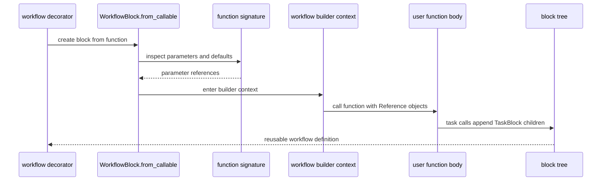
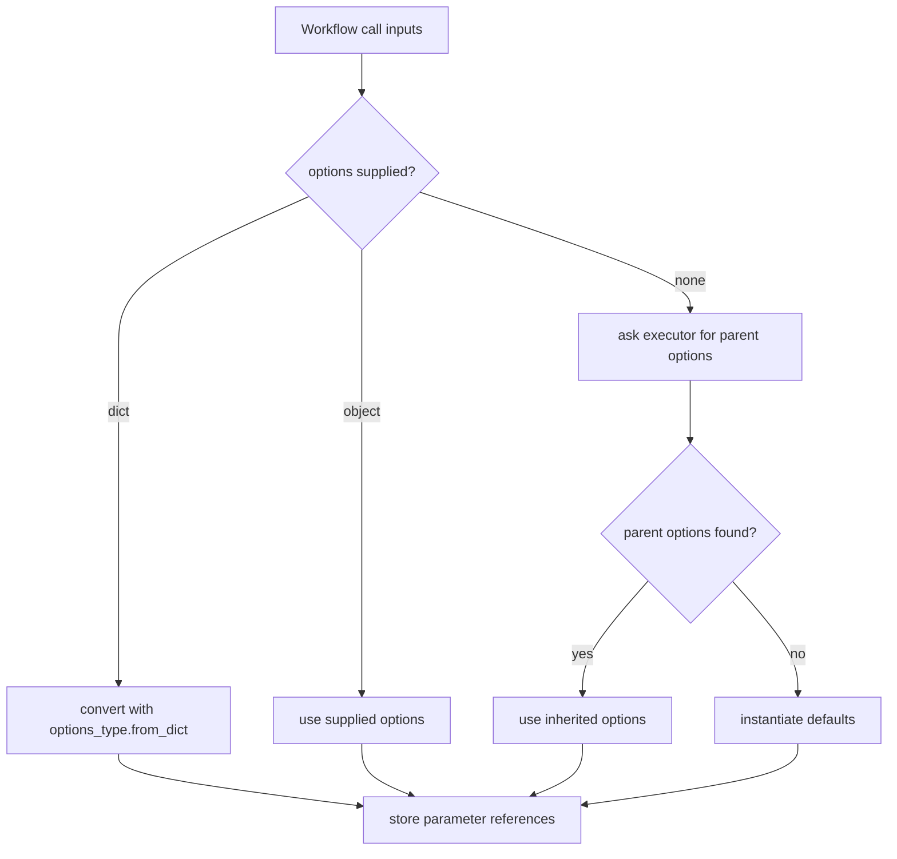
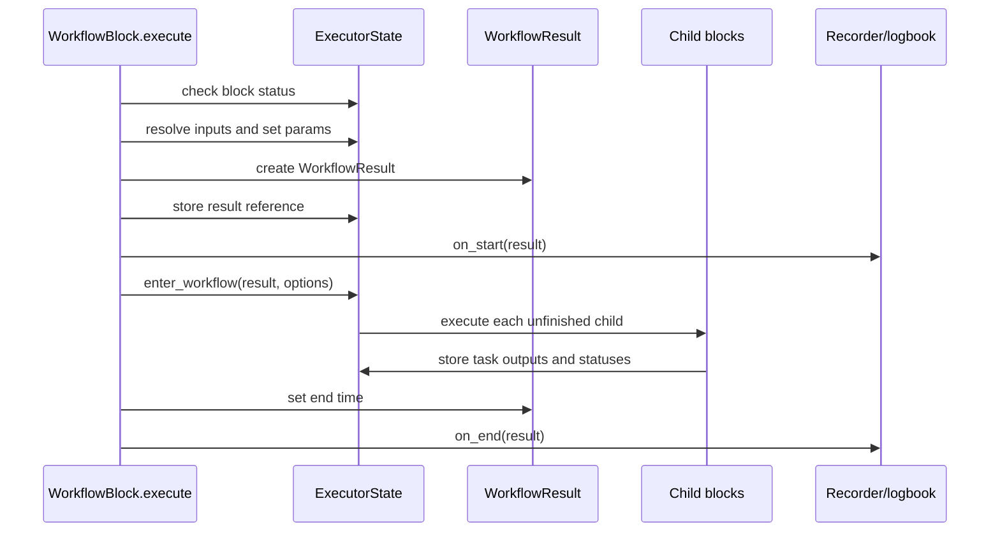
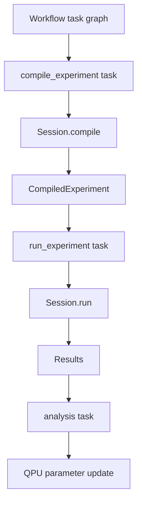
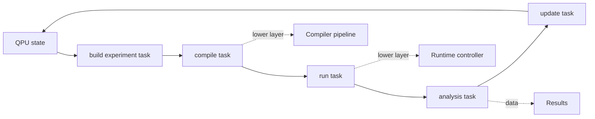

# Workflows

A workflow is an executable task graph for an experimental procedure. It can build an experiment, compile it, run it, analyze results, save artifacts, and update quantum-object state. It does not change how a single experiment is compiled. Instead, it coordinates the ordinary LabOne Q APIs described elsewhere in this guide.



The key split is between **graph construction** and **graph execution**. During construction, a decorated workflow function is called in a builder context so task calls create blocks and references rather than immediately running all side effects. During execution, the executor resolves references, applies options, runs blocks in order, and records task or workflow results.

## Workflow blocks

`WorkflowBlock` is the root representation of a workflow. It stores the workflow name, the options type, parameter references, a result reference, and a body of child blocks. `WorkflowBlock.from_callable()` inspects the original Python function signature, turns each parameter into a `Reference`, enters a builder context, and executes the function body so task calls populate the block tree.



This construction path is similar in spirit to the experiment DSL's context-manager recording, but it records a different graph. The experiment DSL records hardware-facing sections and operations. The workflow layer records software tasks and their dependencies.

| Workflow construction object | Role | Boundary |
| --- | --- | --- |
| `Reference` | Placeholder for a workflow input, task output, or chained access. | Resolves only when an executor has produced concrete values. |
| `WorkflowBlock` | Root or nested workflow node. | Owns workflow parameters, options, children, and result reference. |
| `TaskBlock` | Executable task node created by a decorated task call. | Runs Python task code during workflow execution. |
| `WorkflowGraph` | Adapter around the root workflow block. | Presents the constructed block tree for inspection. |

## Task wrappers and references

A decorated task has two modes. Outside a workflow-building context, it behaves like a normal Python function. Inside a workflow-building context, calling the task creates a `TaskBlock` and returns a `Reference` to that block's future result. This gives notebook-like code a sequential look while still recording a graph for structured execution.

```mermaid
graph LR
    A[@task function] --> B{Called inside builder context?}
    B -->|no| C[Run Python function immediately]
    B -->|yes| D[Create TaskBlock]
    D --> E[Return Reference]
    E --> F[Used as input to later blocks]
    F --> G[Resolved by ExecutorState at runtime]
```

A `Reference` can also record chained operations such as indexing or attribute access. At execution time, `ExecutorState.resolve_inputs()` replaces references with concrete values from executor storage. If a referenced result was never produced, resolution fails rather than silently substituting an unrelated value.

## Options propagation

Workflow and task options are built into the graph model. `WorkflowBlock.create_options()` walks child blocks and creates a nested options object where named tasks and nested workflows receive their default option instances. At runtime, `WorkflowBlock.set_params()` resolves options from explicit inputs, parent options, or defaults, then stores the resolved values in the executor.



The same named task executions inside one workflow block share a task option instance. This simplifies the options tree, but it also means two calls with the same task name in the same workflow block cannot carry separate default option definitions through naming alone.

## Executor state and result tree

`ExecutorState` owns runtime state. It tracks active workflow contexts, reference-to-value storage, block execution status, recorder and logbook interactions, options lookup, loop indices, and interruption settings. When a workflow executes, it creates a `WorkflowResult`, timestamps it, enters the workflow context, executes child blocks, records nested task and workflow results, and finally marks the workflow finished or records an error.



The result tree mirrors execution, not merely the static function body. `TaskResult` stores the task, resolved inputs, output, timestamps, and loop index. `WorkflowResult` stores workflow inputs, output, timestamps, index, and an ordered task view. This structure is the main artifact for debugging orchestration and calibration-update behavior.

| Runtime record | Contains | Maintainer use |
| --- | --- | --- |
| Block status | Not started, in progress, skipped, or finished state. | Supports controlled execution and `run_until` interruption. |
| Executor variable store | Concrete values keyed by `Reference`. | Explains how task outputs feed later tasks. |
| `TaskResult` | Wrapped task, inputs, output, timestamps, index. | Debug task behavior and saved artifacts. |
| `WorkflowResult` | Workflow inputs, output, nested task/workflow results, timestamps. | Reconstruct campaign execution and calibration update sequence. |

## Standard compile and run tasks

The standard compile task is intentionally thin: it accepts a `Session`, a DSL `Experiment`, and optional compiler settings, then calls `session.compile(experiment=..., compiler_settings=...)`. The standard run task calls `session.run(...)` and can optionally replace live results with injected serialized results for offline or emulated workflows, subject to validation.



These tasks illustrate the workflow boundary. Compilation and execution still live in the normal session/compiler/runtime layers. The workflow task only packages the call, options, result storage, and optional orchestration policy.

## Campaign feedback loop

Workflows become most valuable when they coordinate a repeated calibration or characterization loop. A task can build an experiment using a QPU, another task can compile it, a run task can acquire data, an analysis task can fit the data, and an update task can produce new quantum-element parameters for the next iteration.



This loop should remain transparent in artifacts. If a workflow-produced experiment compiles incorrectly, inspect the generated experiment and compiler inputs. If an update task produces wrong calibration state, inspect the task result and the update arguments before investigating scheduling or code generation.

## Debugging boundaries

A workflow problem can occur before, during, or after compilation. Distinguishing those boundaries avoids confusing orchestration bugs with compiler bugs.

| Failure shape | Likely layer | Useful artifact |
| --- | --- | --- |
| Task did not run, ran twice, or got wrong input | Workflow graph, references, executor state | Workflow graph tree, block status, task result inputs |
| Compile task raises compiler error | Compiler frontend or pipeline | Serialized experiment, setup, compiler settings, payload input |
| Run task fails after successful compile | Runtime controller or device layer | Compiled experiment, runtime logs, result metadata |
| Analysis reads missing handles or wrong shapes | Results and analysis task | `Results`, task result input/output, handle map |
| Calibration state update is wrong | Analysis/update workflow task or quantum object update path | Workflow result tree, fitted values, QPU update dictionary |

## Source anchors

Workflow internals are spread across small modules. The following anchors are the most useful starting points for maintainers.

| Concern | Primary source anchor |
| --- | --- |
| Workflow graph construction and workflow execution | `src/python/laboneq/workflow/blocks/workflow_block.py` |
| Task-block execution and visible versus hidden task results | `src/python/laboneq/workflow/blocks/task_block.py` |
| Executor runtime state, variable storage, active contexts, options lookup, and interruption | `src/python/laboneq/workflow/executor.py` |
| Task and workflow result containers | `src/python/laboneq/workflow/result.py` |
| Task decorator behavior inside and outside builder context | `src/python/laboneq/workflow/task_wrapper.py` |
| Placeholder and data-flow references | `src/python/laboneq/workflow/reference.py` |
| Standard compile and run tasks | `src/python/laboneq/workflow/tasks/compile_experiment.py`, `run_experiment.py` |

Tests for this layer should assert the constructed graph, reference resolution, task inputs and outputs, options propagation, `run_until` behavior, and the produced workflow result tree. Compiler artifacts remain relevant only once a workflow task has handed an explicit experiment to `Session.compile`.
