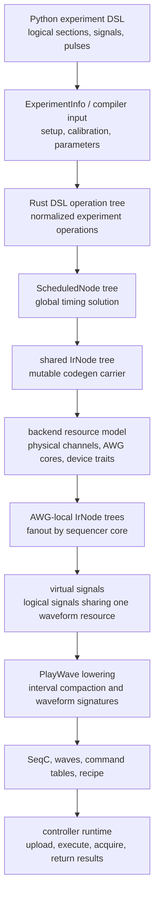

# LabOne Q Developer Guide

This guide is an **unofficial maintainer-oriented map** of the `zhinst/laboneq` code base. Its main purpose is to explain how a Python experiment description becomes scheduled, device-specific control artifacts for Zurich Instruments quantum-control hardware. The guide is organized as a lowering story rather than as a package-by-package tour: each chapter describes one semantic domain, the information added in that domain, and the invariants handed to the next domain.

The most important distinction is that LabOne Q does not compile a DSL program directly into a waveform file. It progressively changes representation. A logical pulse first belongs to a Python experiment tree. Later it belongs to a compiler-input description with setup and calibration metadata. Later still it becomes part of a globally timed schedule. Only after scheduling does the code generator partition the experiment by AWG core, group logical signals that share a physical resource, detect and compact overlapping pulse intervals, and replace logical pulse operations with physical `PlayWave` events.

## Reading order

The guide is now organized into five semantic bands rather than into a main text plus miscellaneous appendices. **Orientation** gives the reader the vocabulary, user-facing entry points, serialization boundary, repository map, and hardware ecosystem needed to read the source. **Compilation pipeline** follows the lowering path from Python payload to scheduled IR, AWG-local waveform construction, and uploadable artifacts. **Runtime and data semantics** covers how those artifacts are interpreted by the controller, how instruments are operated, and how acquired data is shaped. **Higher-level application layers** closes the loop by explaining quantum elements, QPUs, quantum operations, and workflows as application-facing producers and consumers of lower-level LabOne Q artifacts. **Maintenance reference** contains change-point and lookup material.

| Section | Chapter | Focus | Main boundary clarified |
| --- | --- | --- | --- |
| Orientation | [User-facing interfaces and frontend internals](02a-user-facing-interfaces.md) | DSL, `DeviceSetup`, `Session`, controller APIs, signal maps, and frontend state | Ordinary Python execution and frontend state versus compiler payloads and runtime submission. |
| Orientation | [Serialization and pulse-sheet inspection](02b-serialization-and-pulse-sheets.md) | Experiment and `CompiledExperiment` serialization, waveform encoding, deduplication, and pulse-sheet viewer internals | Persisted intent and compiled artifacts versus diagnostic visualization metadata. |
| Orientation | [Mental model](01-mental-model.md) | Vocabulary and semantic domains | Logical experiment language versus physical resources. |
| Orientation | [Repository and build map](02-repository-and-build-map.md) | Source-tree orientation | Python packages, Rust crates, generated extension modules, and dependency roles. |
| Orientation | [Ecosystem and hardware context](10-ecosystem-and-hardware.md) | Related repos and device constraints | LabOne Q relative to toolkit, comms, examples, and manuals. |
| Compilation pipeline | [Python DSL and compiler payload](03-python-dsl-and-payload.md) | DSL object graph and `ExperimentInfo` | User-facing construction versus compiler input serialization. |
| Compilation pipeline | [Global scheduling](04-global-scheduling.md) | Section timing, grids, offsets, repetition | Timing solution versus waveform/resource lowering. |
| Compilation pipeline | [Global scheduling implementation](04a-global-scheduling-implementation.md) | Timing-resolver mechanisms | Constraint collection, child placement, grid adjustment, and validation. |
| Compilation pipeline | [IR semantics](05-ir-semantics.md) | Rust operation tree, `ScheduledNode`, `IrNode` | Conceptual differences between similarly named node structures. |
| Compilation pipeline | [Backend resource mapping](06-backend-resource-mapping.md) | Setup-to-device mapping | Logical signals versus physical channels and AWG cores. |
| Compilation pipeline | [AWG-local lowering](07-awg-local-lowering.md) | Multiplexing and interval compaction | Logical `PlayPulse` events versus physical `PlayWave` events. |
| Compilation pipeline | [Code generation artifacts](08-code-generation-artifacts.md) | SeqC, waveforms, command tables, recipe | Intermediate events versus uploadable runtime artifacts. |
| Runtime and data semantics | [Runtime controller](09-runtime-controller.md) | Execution and result collection | Compiled experiment versus asynchronous device actions. |
| Runtime and data semantics | [Device communication layer](12-device-layer.md) | Instrument node operations and device abstractions | Controller intent versus LabOne data-server communication. |
| Runtime and data semantics | [Results, handles, and data shapes](13-results-and-data.md) | Acquired data semantics | Runtime buffers versus returned user-facing result arrays. |
| Higher-level application layers | [Overview](17-quantum-objects-and-workflows.md) | How QPU state, quantum operations, and workflows sit above the DSL and feed lower layers | Application abstractions versus ordinary DSL experiments, compiled experiments, and result objects. |
| Higher-level application layers | [Quantum elements and QPU](17a-quantum-elements-and-qpu.md) | Element parameters, signal lines, QPU lookup, topology, and calibration state updates | Logical device state versus compiler-facing setup and experiment objects. |
| Higher-level application layers | [Quantum operations](17b-quantum-operations.md) | Operation registration, dispatch, QPU binding, section wrapping, broadcasting, and examples | Macro-like DSL emitters versus compiler passes or hardware instructions. |
| Higher-level application layers | [Workflows](17c-workflows.md) | Workflow graph construction, task execution, options, result trees, and compile/run tasks | Campaign orchestration versus single-experiment compilation and runtime execution. |
| Maintenance reference | [Extension and maintenance guide](11-extension-and-maintenance.md) | Practical change points | Where to change the compiler safely. |
| Maintenance reference | [Source reference map](15-source-reference.md) | File-level lookup map | Conceptual stages versus implementation files. |
| Maintenance reference | [Glossary](16-glossary.md) | Terminology lookup | Stable vocabulary across chapters. |

## Key terminology

| Term | Meaning in this guide |
| --- | --- |
| **Logical signal** | A DSL/setup identifier such as a qubit drive or readout line. It describes an experimental role and calibration, not necessarily a unique physical waveform stream. |
| **Physical channel or port** | An instrument resource named by device setup connections and calibration. Several logical signals may share, couple through, or be constrained by one physical resource. |
| **AWG core** | The sequencer plus waveform-player resource that runs one program and controls one or more outputs, depending on device family and grouping mode. |
| **Scheduling** | The global timing pass that resolves section lengths, offsets, grids, alignment, loops, and repetition semantics. Scheduling is not the same as multiplexing logical signals onto physical waveform streams. |
| **Virtual signal** | A code-generator grouping of logical signals that must be handled together for one AWG-local waveform/event stream. This is the bridge between logical pulses and physical `playWave` operations. |
| **Playwave lowering** | The code-generation stage that collects logical pulse slots for a virtual signal, computes interval cut points, compacts intervals, creates waveform signatures, emits `PlayWave` nodes, and replaces source `PlayPulse` nodes with `Nop`. |

## Maintainer orientation

The guide intentionally separates **semantic representation** from **implementation container**. The word “node” appears in multiple source modules, but the nodes do not all mean the same thing. A scheduler node exists to solve global timing constraints. A shared IR node exists to carry a timed tree through code-generator mutations. An AWG-local IR node exists after fanout to one sequencer core. Treating all of these as “the IR” is precisely what makes the code base hard to read.

The compiler chapters therefore use a stricter vocabulary: a representation is named by the stage that owns its invariants. When a representation crosses from one stage to another, the chapter identifies the conversion source file and the semantic information that is preserved, transformed, or newly introduced.
