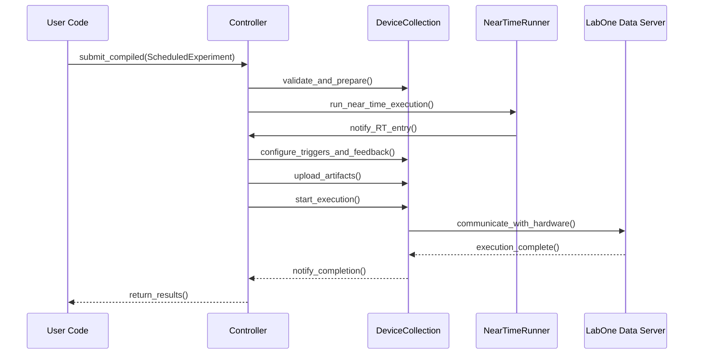

# References

This page consolidates the key references and source URLs used throughout the LabOne Q Developer Guide for the `zhinst/laboneq` project. It serves as a centralized index of official documentation, source code locations, and related repositories that underpin the explanations and technical details presented in the guide. The references are numbered for convenient citation and cross-referencing.

---

## Maintainer orientation

Maintainers and contributors can use this page as a starting point to locate authoritative sources and code artifacts relevant to various aspects of the LabOne Q codebase and ecosystem. Each reference entry includes a brief description of its purpose and scope, the location within the repository or external URL, and contextual notes on its role in the overall architecture.

When updating or extending the developer guide, maintainers should verify claims against these references or add new entries here to document additional sources. This practice ensures traceability and consistency in the guide's content.

---

## 1. Core LabOne Q Repository and Source Code

The primary source for understanding the LabOne Q codebase is the official GitHub repository:

| Reference | Description | Location / URL |
|-----------|-------------|----------------|
| [1] | LabOne Q main repository containing Python and Rust source code, build metadata, schemas, examples, and documentation assets. | https://github.com/zhinst/laboneq |
| [2] | The main README file provides an architectural overview, including a high-level diagram of LabOne Q components and their interactions with QCCS hardware. | https://github.com/zhinst/laboneq/blob/main/README.md |
| [3] | Python DSL frontend entry point: `Experiment` class defining the user-facing experiment container. | https://github.com/zhinst/laboneq/blob/main/src/python/laboneq/dsl/experiment/experiment.py |
| [4] | Python DSL `Section` class representing experiment sections and their operations. | https://github.com/zhinst/laboneq/blob/main/src/python/laboneq/dsl/experiment/section.py |
| [5] | `ExperimentInfoBuilder` responsible for lowering the Python DSL and device setup into compiler input structures. | https://github.com/zhinst/laboneq/blob/main/src/python/laboneq/implementation/payload_builder/experiment_info_builder/experiment_info_builder.py |
| [6] | Compiler workflow orchestration in Python, including compilation job handling and Rust compatibility bridge. | https://github.com/zhinst/laboneq/blob/main/src/python/laboneq/compiler/workflow/compiler.py |
| [7] | Compatibility bridge converting Python experiment info into Rust-backed compiler structures. | https://github.com/zhinst/laboneq/blob/main/src/python/laboneq/compiler/workflow/compat.py |
| [8] | Python real-time compiler wrapper coordinating scheduling and code generation. | https://github.com/zhinst/laboneq/blob/main/src/python/laboneq/compiler/workflow/realtime_compiler.py |
| [9] | Python scheduler wrapper invoking Rust scheduling logic. | https://github.com/zhinst/laboneq/blob/main/src/python/laboneq/compiler/scheduler/scheduler.py |
| [10] | Python code generator wrapper calling Rust code generation for SeqC output. | https://github.com/zhinst/laboneq/blob/main/src/python/laboneq/compiler/seqc/code_generator.py |
| [11] | Controller runtime model managing experiment execution and device communication. | https://github.com/zhinst/laboneq/blob/main/src/python/laboneq/controller/controller.py |
| [12] | Near-time execution runner handling asynchronous experiment steps. | https://github.com/zhinst/laboneq/blob/main/src/python/laboneq/controller/near_time_runner.py |
| [13] | Rust extension root crate exposing compiler and code generator bindings. | https://github.com/zhinst/laboneq/blob/main/src/rust/laboneq-rust/src/lib.rs |
| [14] | Rust compiler Python bridge implementing Cap'n Proto serialization and scheduling. | https://github.com/zhinst/laboneq/blob/main/src/rust/laboneq-compiler-py/src/lib.rs |
| [15] | Rust IR crate defining the intermediate representation of scheduled experiments. | https://github.com/zhinst/laboneq/tree/main/src/rust/laboneq-ir |
| [16] | Rust IR definitions and node model. | https://github.com/zhinst/laboneq/blob/main/src/rust/laboneq-ir/src/ir.rs |
| [17] | Rust scheduler implementation performing validation, scheduling, and lowering passes. | https://github.com/zhinst/laboneq/blob/main/src/rust/laboneq-scheduler/src/scheduler.rs |
| [18] | Rust lowering pass transforming DSL operations into timed IR nodes. | https://github.com/zhinst/laboneq/blob/main/src/rust/laboneq-scheduler/src/lower_experiment/mod.rs |
| [19] | QCCS backend preprocessing for hardware-specific setup and signal mapping. | https://github.com/zhinst/laboneq/blob/main/src/rust/laboneq-qccs-backend/src/preprocessor.rs |

---

## 2. Zurich Instruments Ecosystem and Dependencies

LabOne Q operates within the Zurich Instruments software ecosystem, relying on several key packages and hardware manuals:

| Reference | Description | Location / URL |
|-----------|-------------|----------------|
| [20] | Official LabOne Q user manual describing the DSL, session, compiler, controller, and hardware integration. | https://docs.zhinst.com/labone_q_user_manual/ |
| [21] | LabOne Q Core manual detailing building blocks such as `DeviceSetup`, `Session`, logical signals, and results. | https://docs.zhinst.com/labone_q_user_manual/core/index.html |
| [22] | PQSC device manual describing synchronization and central control hardware in QCCS. | https://docs.zhinst.com/pqsc_user_manual/functional_overview.html |
| [23] | SHFQC device manual describing combined quantum analyzer and signal generator capabilities. | https://docs.zhinst.com/shfqc_user_manual/functional_overview.html |
| [24] | SHFSG device manual describing microwave signal generator features and connectivity. | https://docs.zhinst.com/shfsg_user_manual/functional_overview.html |
| [25] | `zhinst-comms` Python package bundling the protocol stack for communication with LabOne data server. | https://pypi.org/project/zhinst-comms/ |
| [26] | `zhinst-core` native Python API for LabOne device communication. | https://pypi.org/project/zhinst-core/ |
| [27] | `zhinst-toolkit` high-level Python driver package built on `zhinst.core`. | https://github.com/zhinst/zhinst-toolkit |
| [28] | `zhinst-toolkit` PyPI page describing runtime dependency for LabOne Q controller communication. | https://pypi.org/project/zhinst-toolkit/ |
| [29] | LabOne API examples repository containing low-level instrument control examples in Python and MATLAB. | https://github.com/zhinst/labone-api-examples |
| [30] | LabOne Q Applications repository providing domain-level experiment libraries and calibration workflows. | https://github.com/zhinst/laboneq-applications |

---

## 3. Developer Guide Source and Inventory References

The following references document the internal structure and inventory of the LabOne Q codebase, useful for maintainers navigating the repository:

| Reference | Description | Location / URL |
|-----------|-------------|----------------|
| [31] | LabOne Q repository inventory listing Python packages, Rust crates, tests, and docs. | Internal analysis of https://github.com/zhinst/laboneq (commit 19ce5446) |
| [32] | Python package directory structure showing modular organization under `src/python/laboneq`. | Internal analysis |
| [33] | Rust crates directory structure listing multiple crates for IR, compiler, scheduler, code generation, and utilities. | Internal analysis |
| [34] | Python compiler source file inventory listing key classes and functions for compilation workflow. | Internal analysis |
| [35] | Rust public struct, enum, and function inventory detailing IR nodes, scheduler, and lowering passes. | Internal analysis |
| [36] | Runtime/frontend Python source inventory covering DSL, controller, executor, and implementation layers. | Internal analysis |
| [37] | Zurich Instruments `zhinst-toolkit` repository inventory showing source files and examples. | https://github.com/zhinst/zhinst-toolkit (commit 80090cd7) |

---

## 4. Architectural and Workflow Diagrams

The LabOne Q architecture and workflow are visually summarized in the repository and official documentation:

| Reference | Description | Location / URL |
|-----------|-------------|----------------|
| [38] | LabOne Q architecture diagram illustrating DSL, session, controller, compiler, toolkit, and hardware layers. | https://github.com/zhinst/laboneq/blob/main/docs/images/flowchart_QCCS.png |
| [39] | Pulse sheet viewer documentation describing visualization of compiled experiments and sample-precise simulation. | https://docs.zhinst.com/labone_q_user_manual/core/functionality_and_concepts/03_sections_pulses/concepts/02_pulse_sheet_viewer.html |

---

## 5. Selected Source Code Highlights

The following table highlights important source files and their roles in the LabOne Q codebase:

| File Path | Description | Reference |
|-----------|-------------|-----------|
| `src/python/laboneq/dsl/experiment/experiment.py` | Defines the `Experiment` class as the main user-facing DSL container. | [3] |
| `src/python/laboneq/dsl/experiment/section.py` | Implements `Section` and related DSL constructs for experiment structure. | [4] |
| `src/python/laboneq/implementation/payload_builder/experiment_info_builder/experiment_info_builder.py` | Builds `ExperimentInfo` payloads for compiler input from DSL and setup. | [5] |
| `src/python/laboneq/compiler/workflow/compiler.py` | Orchestrates compilation jobs, device class resolution, and Rust bridge calls. | [6] |
| `src/python/laboneq/compiler/workflow/compat.py` | Compatibility bridge converting Python experiment info to Rust experiment. | [7] |
| `src/python/laboneq/compiler/workflow/realtime_compiler.py` | Python wrapper for real-time compilation and scheduling. | [8] |
| `src/python/laboneq/compiler/scheduler/scheduler.py` | Python scheduler wrapper invoking Rust scheduling logic. | [9] |
| `src/python/laboneq/compiler/seqc/code_generator.py` | Python code generator wrapper calling Rust SeqC codegen. | [10] |
| `src/python/laboneq/controller/controller.py` | Main controller class managing device communication and experiment execution. | [11] |
| `src/python/laboneq/controller/near_time_runner.py` | Handles near-time asynchronous execution of experiment steps. | [12] |
| `src/rust/laboneq-ir/src/ir.rs` | Defines the Rust IR nodes and operation kinds for scheduled experiments. | [16] |
| `src/rust/laboneq-scheduler/src/scheduler.rs` | Implements the scheduler pass order and validation logic. | [17] |
| `src/rust/laboneq-scheduler/src/lower_experiment/mod.rs` | Contains lowering passes transforming DSL operations into timed IR nodes. | [18] |
| `src/rust/laboneq-qccs-backend/src/preprocessor.rs` | QCCS backend preprocessing for device setup and signal mapping. | [19] |

---

## 6. Related Repositories and Examples

LabOne Q is part of a broader ecosystem of repositories that provide examples, applications, and supporting tools:

| Repository | Description | URL |
|------------|-------------|-----|
| `zhinst/labone-api-examples` | Low-level LabOne API examples for various instruments in Python and MATLAB. | https://github.com/zhinst/labone-api-examples [29] |
| `zhinst/laboneq-applications` | Application-layer package with quantum elements, calibration experiments, and analyses built on LabOne Q. | https://github.com/zhinst/laboneq-applications [30] |
| `zhinst/zhinst-toolkit` | High-level Python driver package for Zurich Instruments devices, runtime dependency for LabOne Q. | https://github.com/zhinst/zhinst-toolkit [27] |

---

## 7. Summary Table of Key References

| Ref | Title / Description | URL / Path |
|------|---------------------|------------|
| [1] | LabOne Q GitHub repository | https://github.com/zhinst/laboneq |
| [2] | LabOne Q README and architecture overview | https://github.com/zhinst/laboneq/blob/main/README.md |
| [3] | Python DSL `Experiment` class | https://github.com/zhinst/laboneq/blob/main/src/python/laboneq/dsl/experiment/experiment.py |
| [4] | Python DSL `Section` class | https://github.com/zhinst/laboneq/blob/main/src/python/laboneq/dsl/experiment/section.py |
| [5] | `ExperimentInfoBuilder` payload builder | https://github.com/zhinst/laboneq/blob/main/src/python/laboneq/implementation/payload_builder/experiment_info_builder/experiment_info_builder.py |
| [6] | Compiler workflow orchestration | https://github.com/zhinst/laboneq/blob/main/src/python/laboneq/compiler/workflow/compiler.py |
| [7] | Compiler compatibility bridge | https://github.com/zhinst/laboneq/blob/main/src/python/laboneq/compiler/workflow/compat.py |
| [8] | Python real-time compiler wrapper | https://github.com/zhinst/laboneq/blob/main/src/python/laboneq/compiler/workflow/realtime_compiler.py |
| [9] | Python scheduler wrapper | https://github.com/zhinst/laboneq/blob/main/src/python/laboneq/compiler/scheduler/scheduler.py |
| [10] | Python code generator wrapper | https://github.com/zhinst/laboneq/blob/main/src/python/laboneq/compiler/seqc/code_generator.py |
| [11] | Controller runtime class | https://github.com/zhinst/laboneq/blob/main/src/python/laboneq/controller/controller.py |
| [12] | Near-time runner | https://github.com/zhinst/laboneq/blob/main/src/python/laboneq/controller/near_time_runner.py |
| [13] | Rust extension root crate | https://github.com/zhinst/laboneq/blob/main/src/rust/laboneq-rust/src/lib.rs |
| [14] | Rust compiler Python bridge | https://github.com/zhinst/laboneq/blob/main/src/rust/laboneq-compiler-py/src/lib.rs |
| [15] | Rust IR crate | https://github.com/zhinst/laboneq/tree/main/src/rust/laboneq-ir |
| [16] | Rust IR definitions | https://github.com/zhinst/laboneq/blob/main/src/rust/laboneq-ir/src/ir.rs |
| [17] | Rust scheduler | https://github.com/zhinst/laboneq/blob/main/src/rust/laboneq-scheduler/src/scheduler.rs |
| [18] | Rust lowering pass | https://github.com/zhinst/laboneq/blob/main/src/rust/laboneq-scheduler/src/lower_experiment/mod.rs |
| [19] | QCCS backend preprocessing | https://github.com/zhinst/laboneq/blob/main/src/rust/laboneq-qccs-backend/src/preprocessor.rs |
| [20] | LabOne Q user manual | https://docs.zhinst.com/labone_q_user_manual/ |
| [21] | LabOne Q Core manual | https://docs.zhinst.com/labone_q_user_manual/core/index.html |
| [22] | PQSC device manual | https://docs.zhinst.com/pqsc_user_manual/functional_overview.html |
| [23] | SHFQC device manual | https://docs.zhinst.com/shfqc_user_manual/functional_overview.html |
| [24] | SHFSG device manual | https://docs.zhinst.com/shfsg_user_manual/functional_overview.html |
| [25] | `zhinst-comms` PyPI | https://pypi.org/project/zhinst-comms/ |
| [26] | `zhinst-core` PyPI | https://pypi.org/project/zhinst-core/ |
| [27] | `zhinst-toolkit` GitHub | https://github.com/zhinst/zhinst-toolkit |
| [28] | `zhinst-toolkit` PyPI | https://pypi.org/project/zhinst-toolkit/ |
| [29] | LabOne API examples | https://github.com/zhinst/labone-api-examples |
| [30] | LabOne Q Applications | https://github.com/zhinst/laboneq-applications |
| [38] | LabOne Q architecture diagram | https://github.com/zhinst/laboneq/blob/main/docs/images/flowchart_QCCS.png |
| [39] | Pulse sheet viewer documentation | https://docs.zhinst.com/labone_q_user_manual/core/functionality_and_concepts/03_sections_pulses/concepts/02_pulse_sheet_viewer.html |

---

## 8. Ecosystem Layered Diagram (Mermaid)

The following Mermaid diagram illustrates the layered ecosystem of LabOne Q and its dependencies, useful for maintainers to understand the relationships between components:

```mermaid
graph TD
    UserSoftware[User Software (DSL, Applications)]
    LabOneQ[LabOne Q]
    LabOneQ --> DSL[Python DSL Frontend]
    LabOneQ --> Compiler[Compiler (Python + Rust)]
    LabOneQ --> Controller[Controller (Runtime)]
    LabOneQ --> Session[Session & Device Setup]
    LabOneQ --> Toolkit[zhinst-toolkit]
    Session --> LabOneDataServer[LabOne Data Server]
    LabOneDataServer --> QCCS[QCCS Hardware (PQSC, SHFQC, HDAWG, etc.)]
    Toolkit --> zhinstCore[zhinst-core]
    zhinstCore --> LabOneDataServer
    UserSoftware --> DSL
    UserSoftware --> Applications[LabOne Q Applications]
    Applications --> DSL
```

---

## 9. Compile Pipeline Diagram (Mermaid)

This diagram summarizes the compilation pipeline from Python DSL to scheduled IR and code generation:

```mermaid
flowchart TD
    DSL[Python DSL Experiment]
    PayloadBuilder[ExperimentInfoBuilder]
    CompatBridge[Python-Rust Compatibility Bridge]
    RustCompiler[laboneq-compiler-py Rust Extension]
    Scheduler[Scheduler (Rust)]
    Lowering[Lowering Passes (Rust)]
    IR[ExperimentIr (Timed IR)]
    CodeGen[Code Generator (Rust)]
    SeqCOutput[SeqC Source + Artifacts]
    
    DSL --> PayloadBuilder --> CompatBridge --> RustCompiler
    RustCompiler --> Scheduler --> Lowering --> IR --> CodeGen --> SeqCOutput
```

---

## 10. Runtime Execution Sequence Diagram (Mermaid)

This sequence diagram outlines the runtime execution flow managed by the Controller and NearTimeRunner:



---

## References used on this page

1. LabOne Q GitHub repository: https://github.com/zhinst/laboneq  
2. LabOne Q README and architecture overview: https://github.com/zhinst/laboneq/blob/main/README.md  
3. Python DSL `Experiment` class: https://github.com/zhinst/laboneq/blob/main/src/python/laboneq/dsl/experiment/experiment.py  
4. Python DSL `Section` class: https://github.com/zhinst/laboneq/blob/main/src/python/laboneq/dsl/experiment/section.py  
5. `ExperimentInfoBuilder` payload builder: https://github.com/zhinst/laboneq/blob/main/src/python/laboneq/implementation/payload_builder/experiment_info_builder/experiment_info_builder.py  
6. Compiler workflow orchestration: https://github.com/zhinst/laboneq/blob/main/src/python/laboneq/compiler/workflow/compiler.py  
7. Compiler compatibility bridge: https://github.com/zhinst/laboneq/blob/main/src/python/laboneq/compiler/workflow/compat.py  
8. Python real-time compiler wrapper: https://github.com/zhinst/laboneq/blob/main/src/python/laboneq/compiler/workflow/realtime_compiler.py  
9. Python scheduler wrapper: https://github.com/zhinst/laboneq/blob/main/src/python/laboneq/compiler/scheduler/scheduler.py  
10. Python code generator wrapper: https://github.com/zhinst/laboneq/blob/main/src/python/laboneq/compiler/seqc/code_generator.py  
11. Controller runtime class: https://github.com/zhinst/laboneq/blob/main/src/python/laboneq/controller/controller.py  
12. Near-time runner: https://github.com/zhinst/laboneq/blob/main/src/python/laboneq/controller/near_time_runner.py  
13. Rust extension root crate: https://github.com/zhinst/laboneq/blob/main/src/rust/laboneq-rust/src/lib.rs  
14. Rust compiler Python bridge: https://github.com/zhinst/laboneq/blob/main/src/rust/laboneq-compiler-py/src/lib.rs  
15. Rust IR crate: https://github.com/zhinst/laboneq/tree/main/src/rust/laboneq-ir  
16. Rust IR definitions: https://github.com/zhinst/laboneq/blob/main/src/rust/laboneq-ir/src/ir.rs  
17. Rust scheduler: https://github.com/zhinst/laboneq/blob/main/src/rust/laboneq-scheduler/src/scheduler.rs  
18. Rust lowering pass: https://github.com/zhinst/laboneq/blob/main/src/rust/laboneq-scheduler/src/lower_experiment/mod.rs  
19. QCCS backend preprocessing: https://github.com/zhinst/laboneq/blob/main/src/rust/laboneq-qccs-backend/src/preprocessor.rs  
20. LabOne Q user manual: https://docs.zhinst.com/labone_q_user_manual/  
21. LabOne Q Core manual: https://docs.zhinst.com/labone_q_user_manual/core/index.html  
22. PQSC device manual: https://docs.zhinst.com/pqsc_user_manual/functional_overview.html  
23. SHFQC device manual: https://docs.zhinst.com/shfqc_user_manual/functional_overview.html  
24. SHFSG device manual: https://docs.zhinst.com/shfsg_user_manual/functional_overview.html  
25. `zhinst-comms` PyPI: https://pypi.org/project/zhinst-comms/  
26. `zhinst-core` PyPI: https://pypi.org/project/zhinst-core/  
27. `zhinst-toolkit` GitHub: https://github.com/zhinst/zhinst-toolkit  
28. `zhinst-toolkit` PyPI: https://pypi.org/project/zhinst-toolkit/  
29. LabOne API examples: https://github.com/zhinst/labone-api-examples  
30. LabOne Q Applications: https://github.com/zhinst/laboneq-applications  
38. LabOne Q architecture diagram: https://github.com/zhinst/laboneq/blob/main/docs/images/flowchart_QCCS.png  
39. Pulse sheet viewer documentation: https://docs.zhinst.com/labone_q_user_manual/core/functionality_and_concepts/03_sections_pulses/concepts/02_pulse_sheet_viewer.html  

---

This consolidated reference page is intended to provide maintainers and developers with a comprehensive map of authoritative sources and code locations to support ongoing development, maintenance, and documentation of the LabOne Q project.
